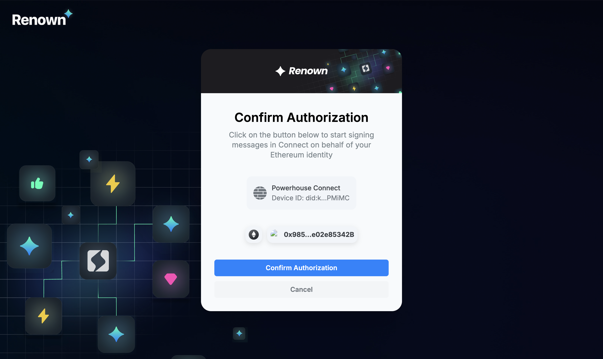
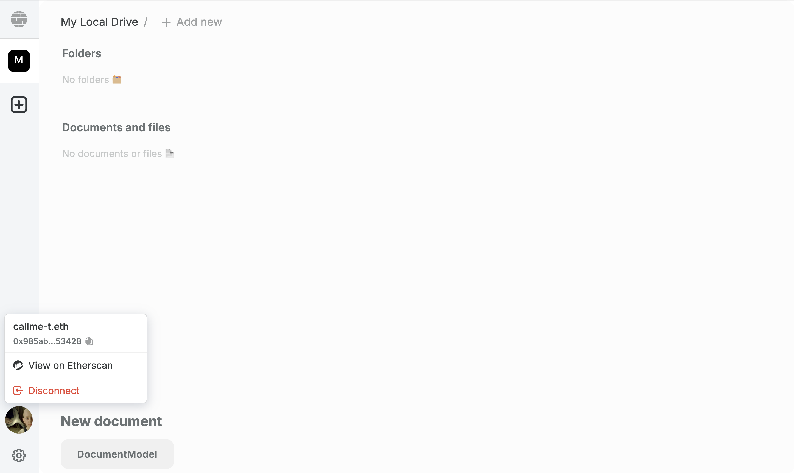

# Explore the Demo Package

:::info How Long Will This Tutorial Take?
We've designed this "Get Started" track to be as smooth as possible. The time it takes will vary based on your familiarity with modern web development tools.

- **For Experienced Developers** (familiar with TypeScript, React, and CLIs), you can expect to complete the entire four-part tutorial in approximately **1 to 1.5 hours**.
- **For Developers New to This Stack**, we recommend setting aside **3.5 to 4.5 hours**. This allows for time to understand not just the steps, but the core concepts behind them.

This is just a guideline. The goal is to learn comfortably and build a solid foundation with Powerhouse!

A more in theoretic and advanced version of this tutorial can also be found in [Mastery Track - Document Model Creation](../MasteryTrack/DocumentModelCreation/WhatIsADocumentModel).
:::


To give you a quick idea of how the Powerhouse ecosystem operates on document models and packages, why don\'t you try installing a package?   

Install the Powerhouse command-line tool `ph-cmd` and then use it to install a pre-built demo package with document models & editors.

## Step 1: Install the Powerhouse CLI

You will use the Powerhouse CLI to launch a local environment with a "**ToDoList Demo Package**". 
This is also the package that you'll recreate during the tutorials and get's you familiar with Powerhouse. 

```bash
pnpm install -g ph-cmd
```

Verify the installation:

```bash
ph-cmd --version
```                                                   

## Step 2: Install the Contributor Billing Package

Now, use the `ph` command to install the demo package into a global project.

```bash
# Install the package
ph install @powerhousedao/todo-demo-package.
```

This command downloads and sets up the todo-demo-package, making its features available in your Powerhouse environment.

You have now successfully installed `ph-cmd` and added your first package! 

## Step 3: Run the Connect App in Studio mode
To run the package locally in Connect Studio (our collaboration and contributor app), run the `ph connect` command. 

## Step 4: Log in with Renown

Renown is Powerhouse's decentralized identity and reputation system designed to address the challenge of trust within open organization's, where contributors often operate under pseudonyms. In traditional organizations, personal identity and reputation are key to establishing trust and accountability. Renown replicates this dynamic in the digital space, allowing contributors to earn experience and build reputation without revealing their real-world identities.

:::tip
When signing in with Renown, use an Ethereum or blockchain address that can function as your \'identity\', as this address will accrue more experience and history over time.
:::

### Login Flow 
"**Log in with Renown**" is a decentralized authentication flow that enables you to log into applications by signing a credential with your Ethereum wallet. Upon signing in, a Decentralized Identifier (DID) is created based on your Ethereum key. 


### Generate a DID to sign operations in Connect
This DID is then associated with a credential that authorizes a specific Connect instance to act on your behalf. That credential is stored securely on Ceramic, a decentralized data network. When you perform actions through the Powerhouse Connect interface, those operations are signed with the DID and transmitted to Switchboard, which serves as the verifier. 





### Modify a document
Switchboard checks the validity of the DID and credential, ensuring the operation request is legitimate. This flow is designed to offer a verifiable, cryptographically secure login system that replaces traditional password-based authentication with decentralized identity and signature-based trust.

## Step 5: Create an invoice & Explore the Document Operations History 


By leveraging this system, every operation or modification made to a document is cryptographically signed by the contributor\'s Renown identity. This ensures that each change is verifiable, traceable, and attributable to a specific pseudonymous user, providing a robust audit trail for all document activity. 

A key feature you get with Connect is the **Operations History**. Every change to a document is stored as an individual operation, creating an immutable and replayable history. This provides complete auditability and transparency, as you can inspect each revision, its details, and any associated signatures. For example, you can see a chronological list of all modifications, along with who made them and when. This ensures every action is traceable and verifiable.
Learn more about the [Operations History and other document tools you get for free](../MasteryTrack/BuildingUserExperiences/DocumentTools/OperationHistory).

## Step 6: Export a Document

Export the invoice document as a `.phd` (Powerhouse Document) file using the export button in the document toolbar at the top. In this toolbar, you will find all available functionality for your documents. The `.phd` file can be sent through any of your preferred channels to other users on your Powergrid network. 

Now that you have explored a Powerhouse package and discovered its basic functionalities, it is time to start building your own. 
Our next tutorial focuses on creating a simple To-Do list document and will introduce you to the world of Document Models. 

