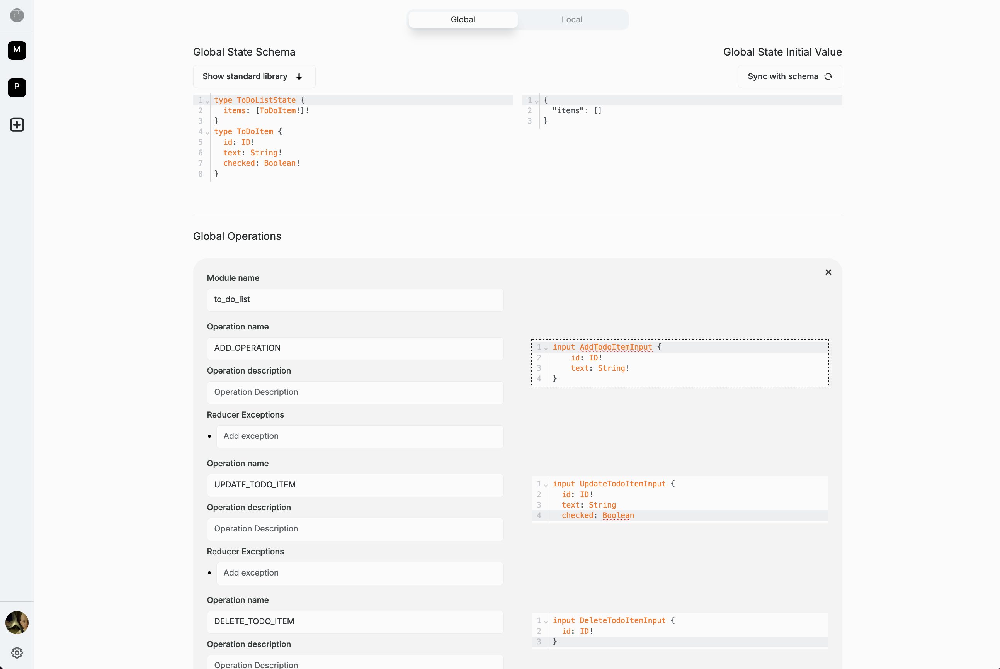

# Write the document specification

:::tip Tutorial Repository
📦 **Reference Code**: [step-2-generate-todo-list-document-model](https://github.com/powerhouse-inc/todo-tutorial/tree/step-2-generate-todo-list-document-model)

This tutorial step has a corresponding branch. After completing this step, your project will have a generated document model with:
- Document model specification files (`todo-list.json`, `schema.graphql`)
- Auto-generated TypeScript types and action creators
- Reducer scaffolding ready for implementation
:::

<details>
<summary>📖 How to use this tutorial</summary>

**Prerequisites**: Complete step 1 and set up the tutorial remote (see previous step).

### Compare your generated code

After running `ph generate TodoList.phdm.zip`, compare with the reference:

```bash
# Compare all generated files with step-2
git diff tutorial/step-2-generate-todo-list-document-model

# Compare specific directory
git diff tutorial/step-2-generate-todo-list-document-model -- document-models/todo-list/
```

### See what was generated

View the complete step-2 reference code:

```bash
# List files in the tutorial's step-2
git ls-tree -r --name-only tutorial/step-2-generate-todo-list-document-model document-models/

# View a specific file from step-2
git show tutorial/step-2-generate-todo-list-document-model:document-models/todo-list/schema.graphql
```

### Visual comparison

Use your IDE's git tools to visually compare branches (see step 1 for details).

</details>

In this tutorial, you will learn how to define the specifications for a **TodoList** document model within the Connect application using its GraphQL schema, and then export the resulting document model specification document for your Powerhouse project.
If you don't have a document specification file created yet, have a look at the previous step of this tutorial to create a new document specification.

Before you start, make sure you have the Connect application running locally with the command:

```bash
ph connect
```

The Connect application will start and you will see the following output:

```bash
  ➜  Local:   http://localhost:3000/
  ➜  Network: http://192.168.5.110:3000/
  ➜  press h + enter to show help
```

## TodoList document specification

Make sure you have named your document model `TodoList` (PascalCase, no spaces or hyphens).  
**Pay close attention to capitalization, as it influences our code generation.**

We'll continue with this project to teach you how to create a document model specification and later an editor for your document model. We use the **GraphQL Schema Definition Language** (SDL) to define the schema for the document model.  
Below, you can see the SDL for the `TodoList` document model.

:::info
This schema defines the **data structure** of the document model and the types involved in its operations, which are detailed further as input types.
Documents in Powerhouse leverage **event sourcing principles**, where every state transition is represented by an operation. GraphQL input types describe operations, ensuring that user intents are captured effectively. These operations detail the parameters needed for state transitions. The use of GraphQL aligns these transitions with explicit, validated, and reproducible commands.
:::

<details>
<summary>State schema of our simplified TodoList</summary>

```graphql
# The state of our TodoList
type TodoListState {
  items: [TodoItem!]!
}

# A single to-do item
type TodoItem {
  id: OID!
  text: String!
  checked: Boolean!
}
```

</details>

<details>
<summary>Operations schema of our simplified TodoList</summary>
```graphql
# Defines a GraphQL input type for adding a new to-do item
input AddTodoItemInput {
  text: String!
}

# Defines a GraphQL input type for updating a to-do item
input UpdateTodoItemInput {
  id: OID!
  text: String
  checked: Boolean
}

# Defines a GraphQL input type for deleting a to-do item
input DeleteTodoItemInput {
  id: OID!
}
```
</details>

## Define the document model specification

To be able to define the document model, you need to open the document model editor in Connect.

### The steps below show you how to do this:

1. In the Connect application, click on **'document model'** to open the document model specification editor.
2. Name your document model `TodoList` (PascalCase, no spaces or hyphens) in the Connect application. **Pay close attention to capitalization, as it influences code generation.**
3. You'll be presented with a form to fill in metadata about the document model. Fill in the details in the respective fields.

    In the **Document Type** field, type `powerhouse/todo-list` (lowercase with hyphen). This defines the new type of document that will be created with this document model specification.

    

4. In the code editor, you can see the SDL for the document model. Replace the existing SDL template with the SDL defined in the [State Schema](#state-schema) section. Only copy and paste the types, leaving the inputs for the next step. You can, however, already press the 'Sync with schema' button to set the initial state of your document model specification based on your Schema Definition Language.
5. Below the editor, find the input field `Add module`. You'll use this to create and name a module for organizing your input operations. In this case, we will name the module `todos`. Press enter.
6. Now there is a new field, called `Add operation`. Here you will have to add each input operation to the module, one by one.
7. Inside the `Add operation` field, type `ADD_TODO_ITEM` and press enter. A small editor will appear underneath it, with an empty input type that you have to fill. Copy the first input type from the [Operations Schema](#operations-schema) section and paste it in the editor. The editor should look like this:

    ```graphql
    input AddTodoItemInput {
        text: String!
    }
    ```

8. Repeat the process from step 7 for the other input operations: `UPDATE_TODO_ITEM` and `DELETE_TODO_ITEM`. You may have noticed that you only need to add the name of the operation (e.g., `UPDATE_TODO_ITEM`, `DELETE_TODO_ITEM`) without the `Input` suffix. It will then be generated once you press enter.

9. Once you have added all the input operations, click the `Export` button at the top right of the editor to save the document model specification document to your local machine. Ideally, you should save your file in the root of your Powerhouse project on your machine.

Check below screenshot for the complete implementation:



## Verify your document model generation

After running `ph generate TodoList.phdm.zip`, your project should have the following structure in `document-models/todo-list/`:

```
document-models/todo-list/
├── gen/                          # Auto-generated code (don't edit)
│   ├── actions.ts
│   ├── creators.ts              # Action creator functions
│   ├── types.ts                 # TypeScript type definitions
│   ├── reducer.ts
│   └── todos/
│       └── operations.ts        # Operation type definitions
├── src/                          # Your custom implementation
│   ├── reducers/
│   │   └── todos.ts            # Reducer functions (to implement next)
│   └── tests/
│       └── todos.test.ts        # Test file scaffolding
├── todo-list.json               # Document model specification
└── schema.graphql               # GraphQL schema
```

### Compare with reference

Verify your generated files match the expected structure:

```bash
# Compare your generated files with step-2
git diff tutorial/step-2-generate-todo-list-document-model -- document-models/todo-list/

# List what was generated in the reference
git ls-tree -r --name-only tutorial/step-2-generate-todo-list-document-model document-models/todo-list/
```

### Up next: reducers

Up next, you'll learn how to implement the runtime logic and components that will use the `TodoList` document model specification you've just created and exported.

