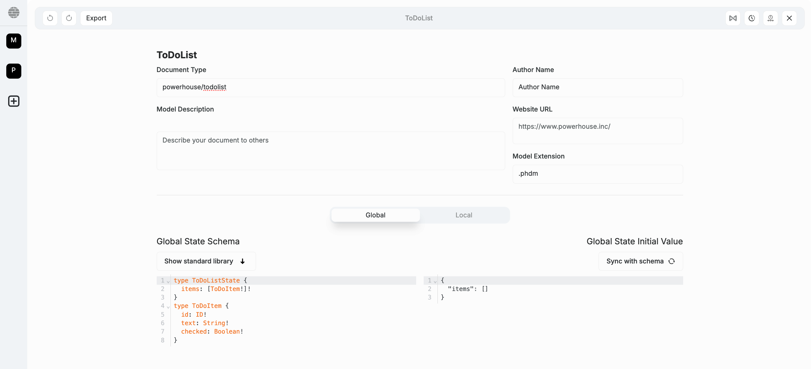

# Write the document specification

:::tip Tutorial Repository
📦 **Reference Code**: [step-2-generate-todo-list-document-model](https://github.com/powerhouse-inc/todo-tutorial/tree/step-2-generate-todo-list-document-model)

This tutorial step has a corresponding branch. After completing this step, your project will have a generated document model with:
- Document model specification files (`todo-list.json`, `schema.graphql`)
- Auto-generated TypeScript types and action creators
- Reducer scaffolding ready for implementation
:::

<details>
<summary>📖 How to use this tutorial</summary>

**Prerequisites**: Complete step 1 and set up the tutorial remote (see previous step).

### Compare your generated code

After running `ph generate TodoList.phdm.zip`, compare with the reference:

```bash
# Compare all generated files with step-2
git diff tutorial/step-2-generate-todo-list-document-model

# Compare specific directory
git diff tutorial/step-2-generate-todo-list-document-model -- document-models/todo-list/
```

### See what was generated

View the complete step-2 reference code:

```bash
# List files in the tutorial's step-2
git ls-tree -r --name-only tutorial/step-2-generate-todo-list-document-model document-models/

# View a specific file from step-2
git show tutorial/step-2-generate-todo-list-document-model:document-models/todo-list/schema.graphql
```

### Visual comparison with GitHub Desktop

After making a commit, use GitHub Desktop for visual diff:
1. **Branch** menu → **"Compare to Branch..."**
2. Select `tutorial/step-2-generate-todo-list-document-model`
3. Review all file differences in the visual interface

See step 1 for detailed GitHub Desktop instructions.

</details>

In this tutorial, you will learn how to define the specifications for a **todo-list** document model within Vetra Studio using its GraphQL schema, and then export the resulting document model specification document for your Powerhouse project.
If you don't have a document specification file created yet, have a look at the previous step of this tutorial to create a new document specification.

## TodoList document specification

We'll continue with this project to teach you how to create a document model specification and later an editor for your document model. We use the **GraphQL Schema Definition Language** (SDL) to define the schema for the document model.  
Below, you can see the SDL for the `TodoList` document model.

:::info
This schema defines the **data structure** of the document model and the types involved in its operations, which are detailed further as input types.
Documents in Powerhouse leverage **event sourcing principles**, where every state transition is represented by an operation. GraphQL input types describe operations, ensuring that user intents are captured effectively. These operations detail the parameters needed for state transitions. The use of GraphQL aligns these transitions with explicit, validated, and reproducible commands.

This is the essence of **Specification Driven Design & Development**: your schema serves as a machine-readable specification that both humans and AI agents can understand and execute—turning your intent into precise, maintainable functionality.
:::

<details>
<summary>State schema of our simplified TodoList</summary>

```graphql
# The state of our TodoList - contains an array of todo items
type TodoListState {
  items: [TodoItem!]!
}

# A single to-do item with its properties
type TodoItem {
  id: OID!        # Unique identifier for each to-do item
  text: String!   # The text description of the to-do item
  checked: Boolean!  # Status of the to-do item (checked/unchecked)
}
```

</details>

<details>
<summary>Operations schema of our simplified TodoList</summary>

```graphql
# Defines a GraphQL input type for adding a new to-do item
# Only text is required - ID is generated automatically, checked defaults to false
input AddTodoItemInput {
  text: String!  # The text for the new todo item
}

# Defines a GraphQL input type for updating a to-do item
# ID is required to identify which item to update
# text and checked are optional - only provided fields will be updated
input UpdateTodoItemInput {
  id: OID!       # Required: which item to update
  text: String   # Optional: new text value
  checked: Boolean  # Optional: new checked state
}

# Defines a GraphQL input type for deleting a to-do item
input DeleteTodoItemInput {
  id: OID!  # The ID of the item to delete
}
```

</details>

## Define the document model specification

### The steps below show you how to do this:

1. In Vetra Studio, click on **'document model'** to open the document model specification editor.
2. Name your document model `TodoList` (PascalCase, no spaces or hyphens) in the Connect application. **Pay close attention to capitalization, as it influences code generation.**
3. You'll be presented with a form to fill in metadata about the document model. Fill in the details in the respective fields.

    In the **Document Type** field, type `powerhouse/todo-list` (lowercase with hyphen). This defines the new type of document that will be created with this document model specification.

    

4. In the code editor, you can see the SDL for the document model. Replace the existing SDL template with the SDL defined in the [State Schema](#state-schema) section. Only copy and paste the types, leaving the inputs for the next step. You can, however, already press the 'Sync with schema' button to set the initial state of your document model specification based on your Schema Definition Language.
5. Below the editor, find the input field `Add module`. You'll use this to create and name a module for organizing your input operations. In this case, we will name the module `todos`. Press enter.
6. Now there is a new field, called `Add operation`. Here you will have to add each input operation to the module, one by one.
7. Inside the `Add operation` field, type `ADD_TODO_ITEM` and press enter. A small editor will appear underneath it, with an empty input type that you have to fill. Copy the first input type from the [Operations Schema](#operations-schema) section and paste it in the editor. The editor should look like this:

    ```graphql
    input AddTodoItemInput {
        text: String!
    }
    ```

8. Repeat the process from step 7 for the other input operations: `UPDATE_TODO_ITEM` and `DELETE_TODO_ITEM`. You may have noticed that you only need to add the name of the operation (e.g., `UPDATE_TODO_ITEM`, `DELETE_TODO_ITEM`) without the `Input` suffix. It will then be generated once you press enter.

9. In the meantime Vetra has been keeping an eye on your inputs and started code generation in your directory.
In your terminal you will also find any validation errors that help you to identify missing specifications. 

Check below screenshot for the complete implementation:


## Verify your document model generation

If you have been watching the terminal in your IDE you will see that Vetra has been tracking your changes and scaffolding your directory.
It will mention: 
```
ℹ [Vetra] Document model TodoList is valid, proceeding with code generation  
```
 Your project should have the following structure in `document-models/todo-list/`:

```
document-models/todo-list/
├── gen/                          # Auto-generated code (don't edit)
│   ├── actions.ts
│   ├── creators.ts              # Action creator functions
│   ├── types.ts                 # TypeScript type definitions
│   ├── reducer.ts
│   └── todos/
│       └── operations.ts        # Operation type definitions
├── src/                          # Your custom implementation
│   ├── reducers/
│   │   └── todos.ts            # Reducer functions (to implement next)
│   └── tests/
│       └── todos.test.ts        # Test file scaffolding
├── todo-list.json               # Document model specification
└── schema.graphql               # GraphQL schema
```

:::tip Check your work

To make sure everything works as expected:

```bash
# Check types compile correctly
pnpm tsc

# Check linting passes
pnpm lint

# Compare your generated files with step-2
git diff tutorial/step-2-generate-todo-list-document-model -- document-models/todo-list/
```

:::

### Up next: reducers

Up next, you'll learn how to implement the runtime logic and components that will use the `TodoList` document model specification you've just created and exported.

