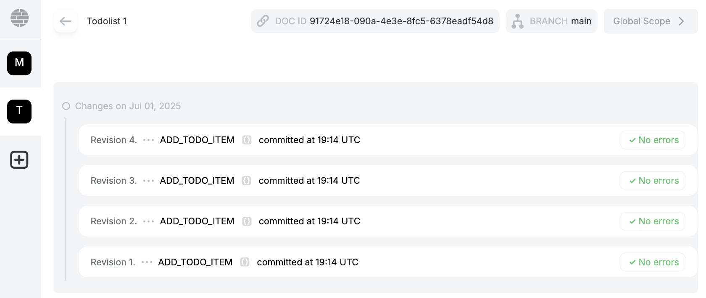

# Login with Renown

Renown is Powerhouse's decentralized identity and reputation system designed to address the challenge of trust within DAOs, where contributors often operate under pseudonyms. In traditional organizations, personal identity and reputation are key to establishing trust and accountability. Renown replicates this dynamic in the digital space, allowing contributors to earn experience and build reputation without revealing their real-world identities.

:::tip
When signing in with Renown use an Ethereum or blockchain address that is fit to function as your 'identity' as over time more experience and history will be accrued by this address. 
:::

## Login Flow 

### Find the Renown Icon
"**Login with Renown**" is a decentralized authentication flow that enables users to log into applications by signing a credential with their Ethereum wallet. Upon signing in, a Decentralized Identifier (DID) is created based on the user's Ethereum key. 

### Generate a DID to sign operations in Connect
This DID is then associated with a credential that authorizes a specific Connect instance to act on the user's behalf. That credential is stored securely on Ceramic, a decentralized data network. When the user performs actions through the Powerhouse Connect interface, those operations are signed with the DID and transmitted to Switchboard, which serves as the verifier. 

### Modify a document
Switchboard checks the validity of the DID and credential, ensuring the operation request is legitimate. This flow is designed to offer a verifiable, cryptographically secure login system that replaces traditional password-based authentication with decentralized identity and signature-based trust.

By leveraging this system, every operation or modification made to a document is cryptographically signed by the contributor's Renown identity. This ensures that each change is verifiable, traceable, and attributable to a specific pseudonymous user, providing a robust audit trail for all document activity. 

For a deeper dive into how these signed operations are recorded and visualized, see the [Operations History](/docs/academy/AdvancedTutorial/BuildingUserExperiences/DocumentTools/OperationHistory) page.

