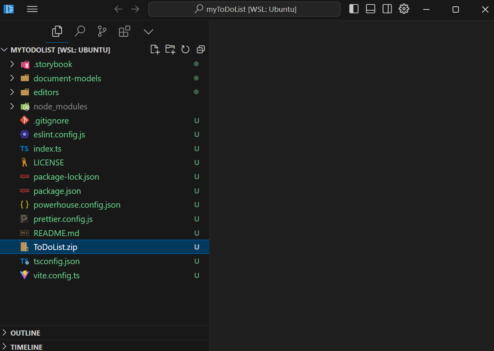

# Implement the document model

:::tip Tutorial Repository
📦 **Reference Code**: 
- **Reducer Implementation**: [step-3-implement-reducer-operation-handlers](https://github.com/powerhouse-inc/todo-tutorial/tree/step-3-implement-reducer-operation-handlers)
- **Tests Implementation**: [step-4-implement-tests-for-todos-operations](https://github.com/powerhouse-inc/todo-tutorial/tree/step-4-implement-tests-for-todos-operations)

This tutorial covers two steps:
1. **Step 3**: Implementing the reducer logic for add, update, and delete operations
2. **Step 4**: Writing comprehensive tests for the reducers

You can view the exact code changes between steps using `git diff step-3-implement-reducer-operation-handlers step-4-implement-tests-for-todos-operations`
:::

<details>
<summary>📖 How to use this tutorial</summary>

This tutorial covers **two steps**: implementing reducers (step-3) and tests (step-4).

### Compare your reducer implementation

After implementing your reducers:

```bash
# Compare your reducers with step-3
git diff tutorial/step-3-implement-reducer-operation-handlers -- document-models/todo-list/src/reducers/

# View the reference reducer implementation
git show tutorial/step-3-implement-reducer-operation-handlers:document-models/todo-list/src/reducers/todos.ts
```

### Compare your tests

After writing tests:

```bash
# Compare your tests with step-4
git diff tutorial/step-4-implement-tests-for-todos-operations -- document-models/todo-list/src/tests/

# See what changed from step-3 to step-4
git diff tutorial/step-3-implement-reducer-operation-handlers..tutorial/step-4-implement-tests-for-todos-operations
```

### Visual comparison with GitHub Desktop

After committing your work, compare visually:
1. **Branch** menu → **"Compare to Branch..."**
2. Select `tutorial/step-3-implement-reducer-operation-handlers` or `tutorial/step-4-implement-tests-for-todos-operations`
3. Review differences in the visual interface

See step 1 for detailed GitHub Desktop instructions.

### If you get stuck

View or reset to a specific step:

```bash
# View the reducer code from step-3
git show tutorial/step-3-implement-reducer-operation-handlers:document-models/todo-list/src/reducers/todos.ts

# Reset to step-3 (WARNING: loses your changes)
git reset --hard tutorial/step-3-implement-reducer-operation-handlers
```

</details>

In this section, we will implement and test the operation reducers for the **To-do List** document model. For this, you have to export the document model specification from the Connect application and import it into your Powerhouse project directory.

To export the document model specification, follow the steps in the [Define ToDoList Document Model](/academy/GetStarted/DefineToDoListDocumentModel) section.

## Understanding reducers in document models

Reducers are a core concept in Powerhouse document models. They implement the state transition logic for each operation defined in your schema.

:::info
**Connection to schema definition language (SDL)**: The reducers directly implement the operations you defined in your SDL. Remember how we defined `AddTodoItemInput`, `UpdateTodoItemInput`, and `DeleteTodoItemInput` in our schema?  
The reducers provide the actual implementation of what happens when those operations are performed.
:::

To import the document model specification into your Powerhouse project, you can either:

- Copy and paste the file directly into the root of your Powerhouse project.
- Or drag and drop the file into the Powerhouse project directory in the VSCode editor as seen in the image below:

Either step will import the document model specification into your Powerhouse project.



## In your project directory

The next steps will take place in the VSCode editor. Make sure to have it open and the terminal window inside VSCode open as well.

To write the operation reducers of the **To-do List** document model, you need to generate the document model code from the document model specification file you have exported into the Powerhouse project directory.

To do this, run the following command in the terminal:

```bash
ph generate TodoList.phd
```

Now you can navigate to `/document-models/todo-list/src/reducers/todos.ts` and start writing the operation reducers.

Open the `todos.ts` file and you should see the scaffolding code that needs to be filled for the three operations you have specified earlier. The generated file will look like this:

```typescript
import type { TodoListTodosOperations } from "todo-tutorial/document-models/todo-list";

export const todoListTodosOperations: TodoListTodosOperations = {
  addTodoItemOperation(state, action) {
    // TODO: Implement "addTodoItemOperation" reducer
    throw new Error('Reducer "addTodoItemOperation" not yet implemented');
  },
  updateTodoItemOperation(state, action) {
    // TODO: Implement "updateTodoItemOperation" reducer
    throw new Error('Reducer "updateTodoItemOperation" not yet implemented');
  },
  deleteTodoItemOperation(state, action) {
    // TODO: Implement "deleteTodoItemOperation" reducer
    throw new Error('Reducer "deleteTodoItemOperation" not yet implemented');
  },
};
```

## Write the operation reducers

1. Copy and paste the code below into the `todos.ts` file in the `reducers` folder.
2. Save the file.

<details>
<summary>Operation Reducers</summary>

```typescript
import { generateId } from "document-model/core";
import type { TodoListTodosOperations } from "todo-tutorial/document-models/todo-list";

// Export the operations object that implements all three todo operations
export const todoListTodosOperations: TodoListTodosOperations = {
  addTodoItemOperation(state, action) {
    // Generate a unique ID for the new todo item
    // Using generateId() from document-model/core ensures uniqueness
    const id = generateId();
    
    // Add the new item to the state
    // Powerhouse uses Immer.js, so this "mutation" is actually immutable
    state.items.push({ ...action.input, id, checked: false });
  },
  
  updateTodoItemOperation(state, action) {
    // Find the item to update by its ID
    const item = state.items.find((item) => item.id === action.input.id);
    
    // Return early if item not found (you could also throw an error)
    if (!item) return;
    
    // Update only the fields that are provided (partial update)
    // Using nullish coalescing (??) to keep existing values if undefined
    item.text = action.input.text ?? item.text;
    item.checked = action.input.checked ?? item.checked;
  },
  
  deleteTodoItemOperation(state, action) {
    // Filter out the item with the matching ID
    // This creates a new array without the deleted item
    state.items = state.items.filter((item) => item.id !== action.input.id);
  },
};

````
</details>

## Write the operation reducers tests

In order to make sure the operation reducers are working as expected, you need to write tests for them.

Navigate to `/document-models/todo-list/src/tests/todos.test.ts` and replace the scaffolding code with comprehensive tests.

Here are the tests for the three operations implemented in the reducers file. The test file:
- Uses Vitest for testing
- Generates mock data using `@powerhousedao/codegen`
- Creates an empty TodoList document model
- Tests add, update, and delete operations
- Verifies both the operation history and the resulting state

<details>
<summary>Operation Reducers Tests</summary>

```typescript
import { describe, it, expect } from "vitest";
import { generateMock } from "@powerhousedao/codegen";
import type {
  AddTodoItemInput,
  DeleteTodoItemInput,
  UpdateTodoItemInput,
} from "todo-tutorial/document-models/todo-list";
import {
  reducer,
  utils,
  isTodoListDocument,
  addTodoItem,
  AddTodoItemInputSchema,
  updateTodoItem,
  UpdateTodoItemInputSchema,
  deleteTodoItem,
  DeleteTodoItemInputSchema,
  TodoItemSchema,
} from "todo-tutorial/document-models/todo-list";

describe("Todos Operations", () => {
  // Test adding a new todo item
  it("should handle addTodoItem operation", () => {
    const document = utils.createDocument();
    const input: AddTodoItemInput = generateMock(AddTodoItemInputSchema());

    const updatedDocument = reducer(document, addTodoItem(input));
    expect(isTodoListDocument(updatedDocument)).toBe(true);

    // Verify the operation was recorded
    expect(updatedDocument.operations.global).toHaveLength(1);
    expect(updatedDocument.operations.global[0].action.type).toBe("ADD_TODO_ITEM");
    expect(updatedDocument.operations.global[0].action.input).toStrictEqual(input);
    expect(updatedDocument.operations.global[0].index).toEqual(0);
  });

  // Test updating a todo item's text
  it("should handle updateTodoItem operation to update text", () => {
    const mockItem = generateMock(TodoItemSchema());
    const input: UpdateTodoItemInput = generateMock(UpdateTodoItemInputSchema());
    input.id = mockItem.id;
    const newText = "new text";
    input.text = newText;
    input.checked = undefined;
    
    const document = utils.createDocument({
      global: {
        items: [mockItem],
      },
    });

    const updatedDocument = reducer(document, updateTodoItem(input));
    expect(isTodoListDocument(updatedDocument)).toBe(true);

    // Verify the operation was recorded
    expect(updatedDocument.operations.global).toHaveLength(1);
    expect(updatedDocument.operations.global[0].action.type).toBe("UPDATE_TODO_ITEM");
    
    // Verify the state was updated correctly
    const updatedItem = updatedDocument.state.global.items.find(
      (item) => item.id === input.id,
    );
    expect(updatedItem?.text).toBe(newText);
    expect(updatedItem?.checked).toBe(mockItem.checked);
  });

  // Test updating a todo item's checked status
  it("should handle updateTodoItem operation to update checked", () => {
    const mockItem = generateMock(TodoItemSchema());
    const input: UpdateTodoItemInput = generateMock(UpdateTodoItemInputSchema());
    input.id = mockItem.id;
    const newChecked = !mockItem.checked;
    input.checked = newChecked;
    input.text = undefined;
    
    const document = utils.createDocument({
      global: {
        items: [mockItem],
      },
    });

    const updatedDocument = reducer(document, updateTodoItem(input));
    expect(isTodoListDocument(updatedDocument)).toBe(true);

    const updatedItem = updatedDocument.state.global.items.find(
      (item) => item.id === input.id,
    );
    expect(updatedItem?.text).toBe(mockItem.text);
    expect(updatedItem?.checked).toBe(newChecked);
  });

  // Test deleting a todo item
  it("should handle deleteTodoItem operation", () => {
    const mockItem = generateMock(TodoItemSchema());
    const document = utils.createDocument({
      global: {
        items: [mockItem],
      },
    });
    
    const input: DeleteTodoItemInput = generateMock(DeleteTodoItemInputSchema());
    input.id = mockItem.id;
    
    const updatedDocument = reducer(document, deleteTodoItem(input));
    expect(isTodoListDocument(updatedDocument)).toBe(true);

    // Verify the operation was recorded
    expect(updatedDocument.operations.global).toHaveLength(1);
    expect(updatedDocument.operations.global[0].action.type).toBe("DELETE_TODO_ITEM");
    
    // Verify the item was removed from state
    const updatedItems = updatedDocument.state.global.items;
    expect(updatedItems).toHaveLength(0);
  });
});
```

</details>

Now you can run the tests to make sure the operation reducers are working as expected.

```bash
pnpm run test
```

Output should be as follows:

```bash
 ✓ document-models/todo-list/src/tests/document-model.test.ts (3 tests) 1ms
 ✓ document-models/todo-list/src/tests/todos.test.ts (4 tests) 8ms

 Test Files  2 passed (2)
      Tests  7 passed (7)
   Start at  19:37:33
   Duration  1.84s (transform 75ms, setup 0ms, collect 2.03s, tests 9ms, environment 0ms, prepare 92ms)
```

If you got the same output, you have successfully implemented the operation reducers and tests for the **To-do List** document model. Congratulations, you've successfully set up the backbone for a simple **To-do List** document.

## Compare with reference branches

Verify your implementation matches the tutorial steps:

```bash
# View step-3 reducer implementation
git show tutorial/step-3-implement-reducer-operation-handlers:document-models/todo-list/src/reducers/todos.ts

# View step-4 test implementation
git show tutorial/step-4-implement-tests-for-todos-operations:document-models/todo-list/src/tests/todos.test.ts

# See what changed between step-3 and step-4
git diff tutorial/step-3-implement-reducer-operation-handlers..tutorial/step-4-implement-tests-for-todos-operations
```

## Up next: To-do list editor

In the next chapter of this introduction track you will learn how to implement an editor for your document model so you can see a simple user interface for the **To-do List** document model in action.
