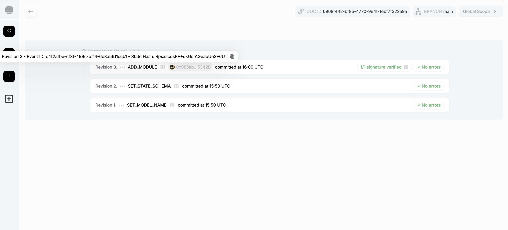
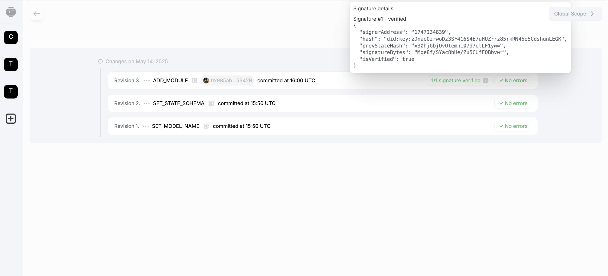
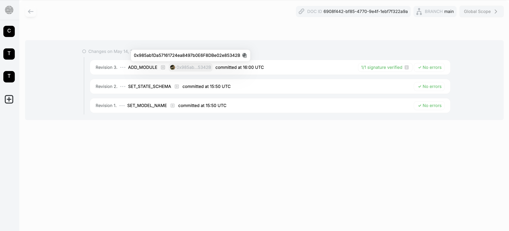

# Operations history

## What is a document model?
A **document model** in Powerhouse is the core unit for managing business data. Each document (such as an invoice, contributor agreement, or scope of work) is created from a specific document model, which defines:

- **State schema:** What data the document contains
- **Operations:** What actions can modify that document

## What is operations history?
Every time a user edits a document, they do so by submitting a document operation (e.g., `ADD_LINE_ITEM`, `UPDATE_RECIPIENT`). These operations are:

- **Appended** to the document's history
- **Immutable** (you never overwrite; you always append)
- **Replayable** — the current document state is the result of applying all past operations in sequence

This design is based on **event sourcing** principles.

## Why use an operations history?
- **Auditability:** Inspect every change ever made to a document.
- **Transparency:** Contributors see what others have done.
- **Versioning:** Revert to any prior state or resolve conflicts using branching and merging.
- **Interoperability:** Operations are just data—they can be signed, stored on-chain, or synchronized across systems.


## Example: Invoice document
Suppose you're editing a `powerhouse/invoice` document. Its operations history might look like this:

```plaintext
SET_RECIPIENT(name: "Acme Corp")
ADD_LINE_ITEM(description: "Design Work", unitCost: $500)
UPDATE_DUE_DATE(date: "2025-06-01")
```

The document's state at any time is the result of running those operations in order.

## Visualizing operations history

### Revision list and details
In Connect the Powerhouse UI displays a chronologic list of all applied modifications to the document, each with a unique event ID, state hash, and commit message. You can inspect each revision for signatures and errors.


### Viewing revision hashes and event IDs
Hovering over a revision reveals its event ID and state hash, providing traceability for every change.




### Signature verification
Clicking the signature badge shows signature details, including signer address, hash, and verification status. This ensures every operation is cryptographically auditable.
Read more about how we are using [Renown](/academy/MasteryTrack/BuildingUserExperiences/Authorization/RenownAuthenticationFlow) for authentication & verification of signer data. 




### Viewing committer addresses
You can also view the committer's address for each revision, supporting full transparency and accountability.




## Replay, branch, and merge (under development)
- **Replay:** When you load a document, the system replays all operations to build its state.
- **Branch:** Create a parallel version of the document to test changes or handle conflicts.
- **Merge:** Combine branches intelligently based on operations, not just raw field values.

