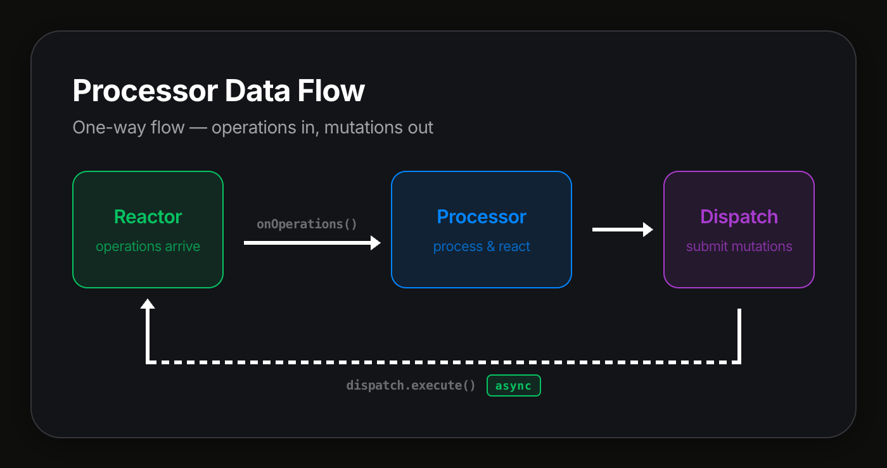

# Processor best practices

This guide covers advanced patterns for processors that need to mutate documents or query indexed data. It builds on the concepts from [Building a Processor](/academy/MasteryTrack/WorkWithData/BuildingAProcessor) — read that first if you haven't already.

:::tip Prerequisites
Before reading this guide, make sure you're familiar with the basics:

- [Building a Processor](/academy/MasteryTrack/WorkWithData/BuildingAProcessor) — processor interface, factories, and filters

:::

## One-way data flow

Processors should follow a one-way data flow: operations flow **in** via `onOperations`, and mutations flow **out** via `dispatch`.



The key principle: **never block on a reactor operation from inside a processor**. When a processor dispatches actions, the job is submitted asynchronously — the processor does not wait for it to complete. If the processor needs to react to the result, it will receive the resulting operations in a future `onOperations` call.

This design keeps processors predictable, avoids circular dependencies, and prevents scenarios where a processor waits on work that depends on that same processor finishing.

## Dispatching actions with `dispatch`

The `dispatch` API lets a processor mutate documents by executing actions. It is available on the `IProcessorHostModule` object passed to your factory.

```typescript
import type { Action } from "document-model";

interface IProcessorDispatch {
  execute(
    docId: string,
    branch: string,
    actions: Action[],
    signal?: AbortSignal,
    meta?: Record<string, unknown>,
  ): Promise<ProcessorDispatchResult>;
}

type ProcessorDispatchResult = {
  id: string; // Job ID
  status: string; // Job status at time of submission
};
```

Under the hood, `dispatch.execute()` calls `reactorClient.executeAsync()` — it submits the job to the reactor and returns immediately with the job info. The processor does not wait for the job to complete.

### Accessing `dispatch` in a factory

Capture `module.dispatch` in your factory and pass it to your processor:

```typescript
import type {
  IProcessor,
  IProcessorDispatch,
  IProcessorHostModule,
  ProcessorRecord,
  ProcessorFilter,
} from "@powerhousedao/reactor-browser";
import type { PHDocumentHeader } from "document-model";

export const myProcessorFactory =
  (module: IProcessorHostModule) =>
  async (driveHeader: PHDocumentHeader): Promise<ProcessorRecord[]> => {
    const processor = new MyProcessor(module.dispatch);

    const filter: ProcessorFilter = {
      branch: ["main"],
      documentId: ["*"],
      documentType: ["powerhouse/invoice"],
      scope: ["global"],
    };

    return [{ processor, filter }];
  };
```

### Example: cross-document automation

A processor that watches for approved invoices and dispatches a payment action to a separate document:

```typescript
import type {
  IProcessor,
  IProcessorDispatch,
} from "@powerhousedao/reactor-browser";
import type { OperationWithContext } from "document-model";

export class InvoiceApprovalProcessor implements IProcessor {
  constructor(
    private dispatch: IProcessorDispatch,
    private paymentDocId: string,
  ) {}

  async onOperations(operations: OperationWithContext[]): Promise<void> {
    for (const { operation, context } of operations) {
      if (
        operation.action.type === "SET_STATUS" &&
        operation.action.input?.status === "approved"
      ) {
        await this.dispatch.execute(this.paymentDocId, "main", [
          {
            type: "CREATE_PAYMENT",
            input: {
              invoiceId: context.documentId,
              amount: operation.action.input.amount,
            },
            scope: "global",
          },
        ]);
      }
    }
  }

  async onDisconnect(): Promise<void> {}
}
```

The processor dispatches the `CREATE_PAYMENT` action and moves on. It does not wait for the payment document to be updated. If the processor needs to know the payment was created, it can subscribe to `powerhouse/payment` operations via its filter.

### Parameter reference

| Parameter | Type                      | Required | Description                                   |
| --------- | ------------------------- | -------- | --------------------------------------------- |
| `docId`   | `string`                  | Yes      | Target document ID                            |
| `branch`  | `string`                  | Yes      | Branch to apply actions to (usually `"main"`) |
| `actions` | `Action[]`                | Yes      | Actions to dispatch                           |
| `signal`  | `AbortSignal`             | No       | Cancellation signal                           |
| `meta`    | `Record<string, unknown>` | No       | Additional metadata for the job               |

### Why not `reactorClient`?

:::warning Anti-pattern: using reactorClient directly
Do not use `reactorClient` methods directly from inside a processor. Use `dispatch` instead.

**Why:**

1. **Potential blocking.** Methods like `reactorClient.execute()` wait for the job to reach `READ_READY` status before returning. This means the call could potentially wait on processors to finish their current batch — including the very processor making the call.

2. **Unnecessary round-trip.** The processor will receive the resulting operations through `onOperations` anyway. Waiting for the result synchronously adds latency without benefit.

3. **One-way flow.** Processors should be written with a one-way data flow: react to operations, dispatch new work, and move on. If you need the result of a dispatch, handle it in a future `onOperations` call — don't block waiting for it.

**Instead of:**

```typescript
// Bad: blocks until job completes
const doc = await reactorClient.execute(docId, "main", actions);
```

**Use:**

```typescript
// Good: submits and returns immediately
await this.dispatch.execute(docId, "main", actions);
```

:::

## Querying data with `getReadModel`

The `getReadModel` API lets a processor look up a registered read model by name. Read models are materialized views maintained by the reactor — they are updated as operations are written and provide efficient query access to indexed data.

```typescript
getReadModel<T>(name: string): T
```

Pass the read model's `name` property and cast to the expected type. Throws an error if the read model is not found.

### Default read models

The reactor registers several built-in read models that processors can access:

| Name                          | Type                                | Description                                                                                  |
| ----------------------------- | ----------------------------------- | -------------------------------------------------------------------------------------------- |
| `"document-view"`             | `IDocumentView`                     | Maintains document snapshots for reads; provides `get()`, `find()`, and consistency tracking |
| `"document-indexer"`          | `IDocumentIndexer`                  | Tracks document relationships (parent/child) and metadata                                    |
| `"processor-manager"`         | `IProcessorManager`                 | Routes operations to registered processors                                                   |
| `"subscription-notification"` | `SubscriptionNotificationReadModel` | Notifies subscription callbacks when documents change                                        |

For example, to look up a document snapshot from inside a processor:

```typescript
import type { IDocumentView } from "@powerhousedao/reactor";

const documentView = module.getReadModel<IDocumentView>("document-view");
```

Custom read models registered via `IReadModelCoordinator` are also available by their `name` property.

### Example: querying indexed data

A processor that checks a budget read model before dispatching a payment:

```typescript
import type {
  IProcessor,
  IProcessorDispatch,
} from "@powerhousedao/reactor-browser";
import type { OperationWithContext } from "document-model";

interface IBudgetReadModel {
  getRemainingBudget(departmentId: string): Promise<number>;
}

export class BudgetCheckProcessor implements IProcessor {
  constructor(
    private dispatch: IProcessorDispatch,
    private budgetModel: IBudgetReadModel,
  ) {}

  async onOperations(operations: OperationWithContext[]): Promise<void> {
    for (const { operation, context } of operations) {
      if (operation.action.type !== "REQUEST_PAYMENT") continue;

      const { departmentId, amount } = operation.action.input;
      const remaining = await this.budgetModel.getRemainingBudget(departmentId);

      if (remaining >= amount) {
        await this.dispatch.execute(context.documentId, "main", [
          {
            type: "APPROVE_PAYMENT",
            input: { departmentId, amount },
            scope: "global",
          },
        ]);
      }
    }
  }

  async onDisconnect(): Promise<void> {}
}
```

The factory wires the read model:

```typescript
export const budgetCheckProcessorFactory =
  (module: IProcessorHostModule) =>
  async (driveHeader: PHDocumentHeader): Promise<ProcessorRecord[]> => {
    const budgetModel = module.getReadModel<IBudgetReadModel>("budget");

    const processor = new BudgetCheckProcessor(module.dispatch, budgetModel);

    return [
      {
        processor,
        filter: {
          branch: ["main"],
          documentId: ["*"],
          documentType: ["powerhouse/expense-report"],
          scope: ["global"],
        },
      },
    ];
  };
```

:::info Read model availability
`getReadModel` throws if the read model is not registered. Ensure the read model is registered with the reactor before your processor factory runs. If the read model is optional, wrap the call in a try/catch in your factory and handle the missing case gracefully.
:::

## `IProcessorHostModule` reference

The `IProcessorHostModule` is passed to your factory's outer function and provides access to all processor APIs:

```typescript
interface IProcessorHostModule {
  analyticsStore: IAnalyticsStore;
  relationalDb: IRelationalDb;
  processorApp: ProcessorApp;
  dispatch: IProcessorDispatch;
  getReadModel<T>(name: string): T;
  config?: Map<string, unknown>;
}
```

| Field            | Type                     | Description                                           |
| ---------------- | ------------------------ | ----------------------------------------------------- |
| `analyticsStore` | `IAnalyticsStore`        | Time-series analytics store for writing metrics       |
| `relationalDb`   | `IRelationalDb`          | Relational database for creating namespaced stores    |
| `processorApp`   | `ProcessorApp`           | The host application (`"connect"` or `"switchboard"`) |
| `dispatch`       | `IProcessorDispatch`     | Fire-and-forget action dispatch (see above)           |
| `getReadModel`   | `<T>(name: string) => T` | Read model lookup by name (see above)                 |
| `config`         | `Map<string, unknown>`   | Optional processor-specific configuration             |

:::info Import paths
`@powerhousedao/reactor-browser` re-exports these types for convenience in browser environments. If you are working outside the browser (Node.js, CLI tools, server-side code), import directly from `@powerhousedao/reactor` or `@powerhousedao/shared`.
:::

## Summary

- **Use `dispatch.execute()`** to mutate documents from processors — never `reactorClient` directly
- **Use `getReadModel()`** to query indexed data for lookups and validation
- **Design for one-way data flow**: operations in via `onOperations`, mutations out via `dispatch`
- **Never block** on reactor operations that might circle back to the processor pipeline
- **React asynchronously**: if you need the result of a dispatch, handle it in a future `onOperations` call
- **Access all APIs** through `IProcessorHostModule` in your factory function

### Related pages

- [Building a Processor](/academy/MasteryTrack/WorkWithData/BuildingAProcessor) — processor basics
- [Relational Database Processor](/academy/MasteryTrack/WorkWithData/RelationalDbProcessor) — database-backed processors
- [Processor Migration Guide](/academy/APIReferences/ProcessorMigrationGuide) — migrating from the legacy strand-based API
