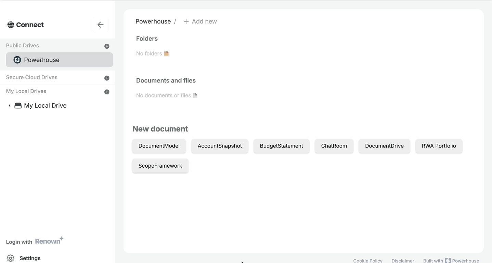
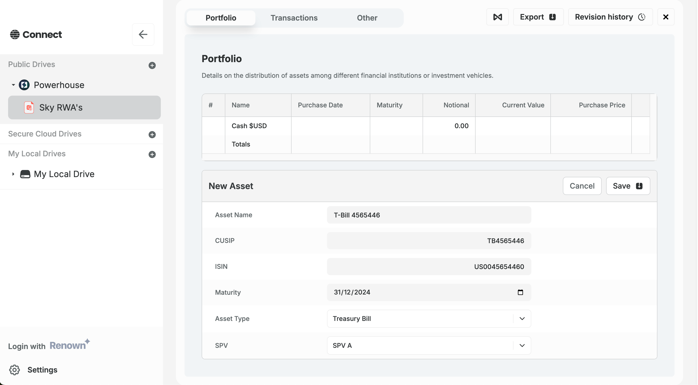
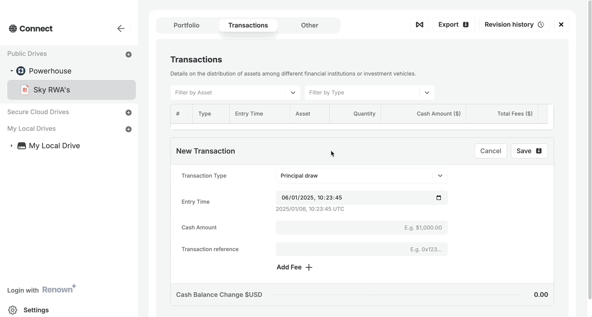
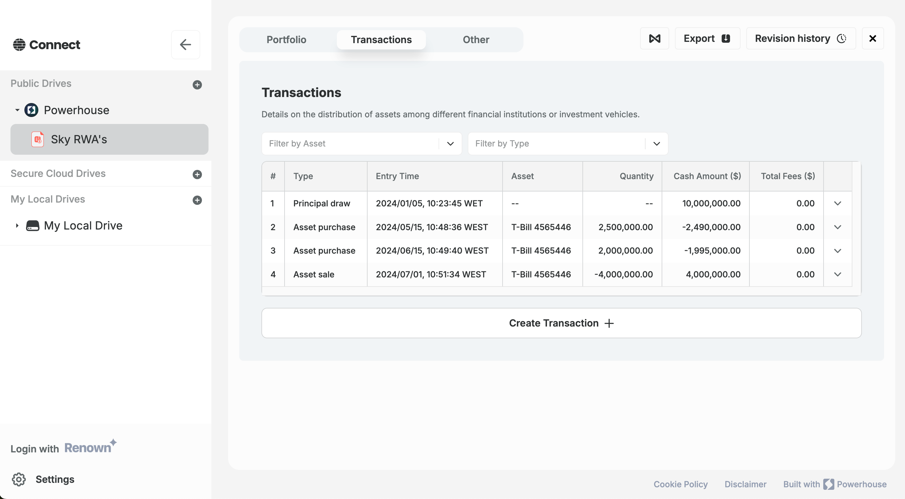

# Generate the reactor and analytics processor

### Launch the reactor

**First**, navigate to the project directory with `cd rwa-analytics` to start the reactor from the project directory.
Now open the directory with your code editor with the command `code . `

Next, launch the reactor by running the following command in your terminal. 
`ph reactor` . A Reactor instance is a local (or remote) node in the Powerhouse network that can hold & sychronize data. You'll see the following output in your terminal while the reactor is starting up and a new browser window opens with the Connect application. The reactor you've created will become available as a public drive in Connect's left hand side bar, named `Powerhouse`.

```bash
[Reactor]: Initializing ReactorRouterManager...
[Reactor]: > Registered system subgraph.
[Reactor]: > Registered d/:drive subgraph.
[Reactor]:   ➜  Reactor:   http://localhost:4001/d/powerhouse
[Reactor]: > Registered analytics subgraph.
[Reactor]: > Loading document models from /Users/yourmachine/rwa-analytics-demo/document-models
[Reactor]: > Loading processors from /Users/yourmachine/rwa-analytics-demo/processors
[Reactor]: > Loading subgraphs from /Users/yourmachine/rwa-analytics-demo/subgraphs
[Connect]: Watching local document models at '/Users/yourmachine/rwa-analytics-demo/document-models'...
[Connect]: Watching local document editors at '/Users/yourmachine/rwa-analytics-demo/editors'...
[Connect]:   ➜  Local:   http://localhost:3000/
```

As you can see the reactor registered the default system subgraph but also the `d/:drive` subgraph for fetching documents and pushing updates. It also registered the analytics subgraph, which we'll use later for running analytics queries on the document model in the next steps. 

### Generate the analytics processor
**Next** we'll open up a second terminal window and generate the analytics processor.
Use the following command to generate the analytics processor in a seperate terminal window.
```bash
npm run generate -- --processor rwa-analytics --document-types makerdao/rwa-portfolio
```
In your project directory you'll now see the folder 'processors' being created. 
Later we'll see how this processor is actively listening for the operations on a document model.
Eventually we'll replace the default code of the generated processor with our own custom analytics processor code to listen to specific operations, dimensions and metrics.

### Add data to the document model in the reactor

Now that we've generated the analytics processor we need to give it some data to listen to.
For this we've created the local reactor instance, which will represent a node in the Powerhouse network. 
It represents a node that is usually hosted as a remote server, but in our case we run it locally on our machine. 
The document model data will be stored in the local reactor instance and be analyzed by the analytics processor. 

Let's move on to the next step where we'll create a new RWA document model and add data to it.

### A brief introduction to the RWA document model

:::info
An RWA document model helps an arranger for Sky (previously MakerDAO) to accurately track the value of a Real World Asset (RWA) such as US treasury bills by tracking the purchase, sale and other transactions on the asset. 
In the case of Sky these real world assets are used to back the Sky/MakerDAO stablecoin. 
Let's pretend we're an arranger and we want to track the value of a new RWA asset and analyze the total value of the assetclass on a monthly basis. 
Aside from setting up an analytics processor you'll now also become familiar with how the RWA reporting workflow is captured in a document model. 
:::

We'll run through the following scenario:			
	1. Add the Asset "T-Bill 4565446" with CUSIP : TB4565446, maturity 01/12/2024. So we have a new asset to track and work with in the document model.		
	2. Make a "principal draw" of $10,000,000 on May 1. We're simulating an arranger borrowing $10,000,000 from Sky to purchase the asset.				
	3. Make a purchase of 2,500,000 TB4565446 bills for $2,490,000 on May 15.				
	4. Make a purchase of 2,000,000 TB4565446 bills for $1,995,000 on June 15.				
	5. Make a sale of 4,000,000 TB4565446 bills for $4,000,000 on July 1.				
	6. Verify that the document data is correctly entered.					
	7. Inspect the document history.

### Create a new RWA document model in Connect

Under the 'New Document' section in Connect, click on the 'RWA Portfolio' document. 
Name your document model `Sky Rwa's` and click on 'Create'.



You'll immmediaty see that you've arrived in the portfolio editor with the option to add a new asset. 
Since this document model is a portfolio for tracking the value of different assets, we'll first need to create the asset to be able to add any transaction history to them and track the value of the assets. 

Hit the 'create asset' button. Which will offer you an overview of all the fields you need to fill in. 
Before we can add an asset, we need to create a new "Special purpose vehicle" (SPV) for the asset. 
A SPV is a legal entity that is created to hold the real world asset such as a US treasury bill. 
For the sake of easily remembering the SPV let's name it 'SPV A'. 


Let's add the asset details now and fill in the following details:

- Asset name: T-Bill 4565446
- CUSIP: TB4565446
- ISIN: US0045654460
- Maturity: 12/31/2024
- Asset Type: Treasury Bill
- SPV: SPV A

Click on the 'Save' button to save the asset.
Your new asset should look like this:



### Add a transaction to the asset

We're now going to add a transaction to the asset and therefor simulate an arranger borrowing $10,000,000 through a loan from Sky to purchase the asset. 

To do this, move to the transaction tab and click on the 'create transaction' button below the table. 

Fill in the following details to complete the transaction of $10,000,000 from Sky to the SPV, known as a principal draw.

- Transaction type: Principal Draw
- Entry Time: 01/05/2024
- Cash Amount: $10,000,000
- Transaction reference: 0x123 (this is a reference to the transaction on the blockchain)

Click on the 'Save' button to save the transaction.



You'll now see the transaction appear in the transaction table.

### Let's buy and sell some T-bills!

Now that we've created the T-bill asset and took out a loan from Sky to purchase it, we can start buying some T-bills. 
Let's buy 2,500,000 T-bills for $2,490,000 on May 15.

Create a new transaction and fill in the following details:

- Transaction type: Asset Purchase
- Entry Time: 15/05/2024
- Asset name: T-Bill 4565446 - US0045654460 - TB4565446
- Quantity: 2,500,000
- Asset proceeds: $2,490,000 (this is the price of the T-bills, the price at maturity is $2,500,000, so the profit is $10,000)
- Transaction reference: 0x123456 (this is a reference to the transaction on the blockchain)

Click on the 'Save' button to save the transaction.

To make the analysis slightly more interesting, let's also buy 2,000,000 T-bills for $1,995,000 on June 15.

Create a new transaction and fill in the following details:

- Transaction type: Asset Purchase
- Entry Time: 15/06/2024
- Asset name: T-Bill 4565446 - US0045654460 - TB4565446
- Quantity: 2,000,000
- Asset proceeds: $1,995,000
- Transaction reference: 0x123456789 

Click on the 'Save' button to save the transaction.

Our last transaction will be a sale of 4,000,000 T-bills for $4,000,000 on July 1.

Create a new transaction and fill in the following details:

- Transaction type: Asset Sale
- Entry Time: 01/07/2024
- Asset name: T-Bill 4565446 - US0045654460 - TB4565446
- Quantity: 4,000,000
- Asset proceeds: $4,000,000
- Transaction reference: 0x1234567890

Click on the 'Save' button to save the transaction.

Your table of transactions should now look like this:



### Verify that the document data is correctly entered and inspect the document history		

Connect offers you with a few ways to inspect the document data and history. Click on the 'revision history' button in the top right corner of your document model in Connect to see the history of your operations on the document model.

Here you'll see that the logic and intelligence of the document model has created a group transaction for the asset, which is the sum of all the sub transactions for the T-bill asset. When you hover over the 'CREATE_GROUP_TRANSACTION' operation you'll see the exact logic that was used to create the group transaction. It's this data that will be used by the analytics processor to calculate the value of the asset over time.

Additionally, Connect has a seamless integration with Switchboard, which offer a graphql interface to the document model.
This allows you to inspect the document data and history in a structured way. Currently we're making use of the Apollo GraphQL sandbox to inspect the document data as it's the easiest way to get started.

To inspect the document data, click on the 'Switchboard' icon in the top right corner of your document model in Connect.

This will open a new tab with the graphql interface to the document model. If you click 'run' the base query will be executed and you'll see the document data and history. You'll find all the transactions we've added to the asset in the document model previously. 

Now let's move on to the next step where we'll update the analytics processor code to listen to the document model and calculate the total value of the asset class on a monthly basis.