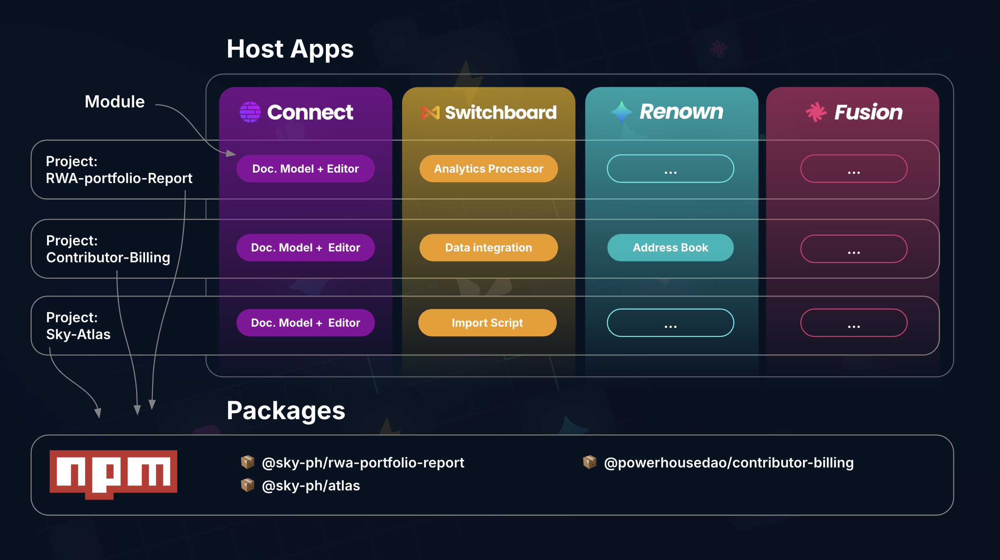
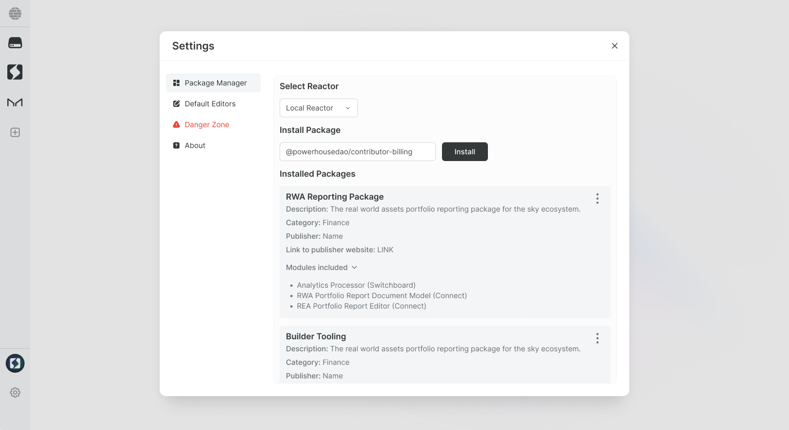

# Publish your package

:::warning
**This guide assumes familiarity with building document models in Vetra Studio.**  
Please start with the [**Get Started**](/academy/GetStarted/home) chapter or [**Document Model Creation**](/academy/MasteryTrack/DocumentModelCreation/SpecifyTheStateSchema) section if you are new to building document models.
:::

This guide covers the process of **building** and **publishing** a Powerhouse package to NPM.

:::info Key Concepts
- **Powerhouse Package**: A collection of modules published to NPM that can be installed on a server instance or locally. Organizations build packages for specific purposes or workflows.
- **Powerhouse Modules**: The building blocks of your package—document models, editors, processors, or scripts.
- **Vetra Studio**: The development hub where you assemble specifications for your package. Each module is defined through specification documents that drive code generation.
- **Powerhouse Drive-apps**: Customized drive interfaces that enhance document functionality and workflows within a drive.


:::

## 1. Building your project

### 1.1. Initialize your project

Start by initializing a new Powerhouse project:

```bash
ph init
```

You'll be prompted to name your project, which will become the package name when published to NPM.

<details>
<summary>Command not working? Did you install `ph-cmd`?</summary>

The Powerhouse CLI (`ph-cmd`) is a command-line interface tool that provides essential commands for managing Powerhouse projects. Install it globally using:

```bash
pnpm install -g ph-cmd
```

Key commands include:

- `ph vetra --watch` for launching Vetra Studio
- `ph connect` for running Connect locally (alternative)
- `ph switchboard` or `ph reactor` for starting the API service
- `ph init` to start a new project
- `ph help` to get an overview of all available commands

</details>

<details>
<summary>How to use different branches?</summary>

When using the Powerhouse CLI, you can access dev & staging branches for experimental features or bugfixes under development.

| Command                            | Description                                           |
| ---------------------------------- | ----------------------------------------------------- |
| **pnpm install -g ph-cmd**         | Install latest stable version                         |
| **pnpm install -g ph-cmd@dev**     | Install development version                           |
| **pnpm install -g ph-cmd@staging** | Install staging version                               |
| **ph init**                        | Use latest stable version of the boilerplate          |
| **ph init --dev**                  | Use development version of the boilerplate            |
| **ph init --staging**              | Use staging version of the boilerplate                |
| **ph use**                         | Switch all dependencies to latest production versions |
| **ph use dev**                     | Switch all dependencies to development versions       |
| **ph use prod**                    | Switch all dependencies to production versions        |

Please be aware that these versions can contain bugs and experimental features that aren't fully tested.

</details>

### 1.2. Launch Vetra Studio

Launch Vetra Studio in interactive watch mode for development:

```bash
ph vetra --interactive --watch
```

This mode provides:
- **Interactive confirmations** before code generation
- **Dynamic reloading** for document-models and editors
- **Live preview** of your changes in Vetra Studio

<details>
<summary>Alternatively: Use Connect</summary>

You can also use Connect for local development:

```bash
ph connect
```

This opens Connect in your browser at `http://localhost:3000/`, providing a local Reactor for testing.

</details>

### 1.3. Configure package details

In Vetra Studio, navigate to the **Package Details** section of your Vetra Studio drive to configure:

- **Package name**: Use the format `@your-org-ph/package-name` (the `-ph` suffix identifies Powerhouse ecosystem packages)
- **Description**: A meaningful description of your package
- **Keywords**: Search terms for discoverability
- **Version**: Following semantic versioning (e.g., `1.0.0`)
- **Author** and **License** information

These details are stored in your `package.json` and a `manifest.json` file is automatically generated from this configuration.

```json
{
  "name": "@your-org-ph/package-name",
  "version": "1.0.0",
  "author": "Your Name",
  "license": "AGPL-3.0-only",
  "publishConfig": {
    "access": "public"
  }
}
```

### 1.4. Build your modules

With Vetra Studio running, build your package modules:

1. **Document Models**: Define your document model specifications in Vetra Studio. The state schema and operations are automatically generated into code.
2. **Editors**: Create editor specifications linked to your document models. Vetra generates the scaffolding code.
3. **Reducers**: Implement the state transition logic in the generated reducer files.
4. **Unit Tests**: Write tests for your reducer logic in the `tests/` directory.

Run tests to verify your implementation:

```bash
pnpm run test
```

### 1.5. Verify your build

Build your project to verify everything compiles correctly:

```bash
pnpm build
```

This creates an optimized build output ready for distribution. Test the build locally:

```bash
ph vetra --interactive --watch
```

Create documents of your defined types and verify all functionality works as expected.

### 1.6. Store in version control

Initialize a git repository to track changes:

```bash
git init
git add .
git commit -m "Initial commit"
```

## 2. Publishing your project

### 2.1. Set up NPM organization

Create an organization on [NPM](https://www.npmjs.com/) using the naming convention `@yourorganization-ph`:

- The `-ph` suffix identifies Powerhouse ecosystem packages
- Example: `@acme-ph`

We recommend using a **dedicated NPM account** for your organization rather than a personal account.

### 2.2. Log in to NPM

```bash
npm login
```

Follow the prompts in your terminal or browser to authenticate.

### 2.3. Version your package

Use semantic versioning to update your package version. The `pnpm version` command will:
- Update the `version` in `package.json`
- Create a Git commit for the version change
- Create a Git tag (e.g., `v1.0.1`)

```bash
# Patch release (1.0.0 → 1.0.1) - bugfixes
pnpm version patch

# Minor release (1.0.1 → 1.1.0) - new features
pnpm version minor

# Major release (1.1.0 → 2.0.0) - breaking changes
pnpm version major
```

### 2.4. Push to Git

Push your commits and version tag to your remote repository:

```bash
git push origin main
git push origin vX.Y.Z  # Replace with your actual tag
```

### 2.5. Publish to NPM

```bash
pnpm publish
```

For scoped packages intended to be public, ensure your `package.json` includes the `publishConfig` shown earlier, or use:

```bash
pnpm publish --access public
```

To publish a pre-release version:

```bash
# Ensure your version reflects the pre-release (e.g., 1.1.0-beta.0)
pnpm publish --tag beta
```

:::info Git Tags vs NPM Tags
- **Git Tags**: Markers in your repository history (e.g., `v1.0.0`) created by `pnpm version`
- **NPM Dist-Tags**: Labels pointing to published versions (`latest`, `beta`, `next`). When publishing without a tag, the version gets the `latest` tag by default.
:::

## 3. Installing your package

Once published, install your package in any Powerhouse environment:

```bash
ph install @your-org-ph/package-name
```

This makes your document models and editors available within that Powerhouse instance.

<details>
<summary>Future: Package Manager UI</summary>

A visual package manager is planned for Connect's settings, allowing installation at the click of a button.



</details>

---

**Congratulations on publishing your package!** Your document models and editors are now available for installation across the Powerhouse ecosystem.
