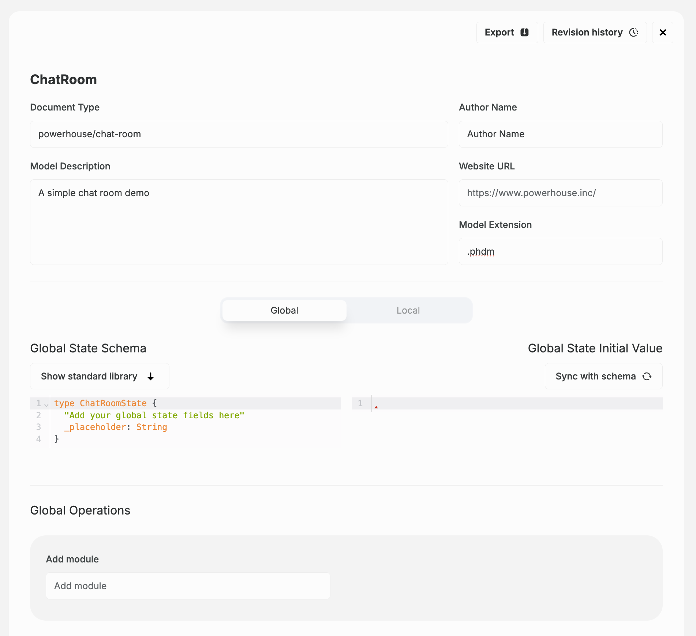

# Write the document specification

:::tip Tutorial Repository
📦 **Reference Code**: [chatroom-demo](https://github.com/powerhouse-inc/chatroom-demo)

This tutorial step has a corresponding implementation in the repository. After completing this step, your project will have a document model specification with:
- Document model specification files (`chat-room.json`, `schema.graphql`)
- Auto-generated TypeScript types and action creators
- Reducer scaffolding ready for implementation
:::

<details>
<summary>📖 How to use this tutorial</summary>

**Prerequisites**: Complete step 1 and set up the tutorial remote (see previous step).

### Compare your generated code

As Vetra generates code automatically, compare with the reference:

```bash
# Compare all generated files with the reference
git diff tutorial/main -- document-models/chat-room/

# View a specific file from the reference
git show tutorial/main:document-models/chat-room/schema.graphql
```

### Visual comparison with GitHub Desktop

After making a commit, use GitHub Desktop for visual diff:
1. **Branch** menu → **"Compare to Branch..."**
2. Select `tutorial/main`
3. Review all file differences in the visual interface

See step 1 for detailed GitHub Desktop instructions.

</details>

In this tutorial, you will learn how to define the specifications for a **ChatRoom** document model within Vetra Studio using its GraphQL schema, and then export the resulting document model specification document for your Powerhouse project.

If you don't have a document specification file created yet, have a look at the previous step of this tutorial to create a new document specification.

Before you start, make sure you have Vetra Studio running locally with the command:

```bash
ph vetra
```

## ChatRoom document specification

Make sure you have named your document model `ChatRoom` (PascalCase, no spaces or hyphens).  
**Pay close attention to capitalization, as it influences code generation.**

We use the **GraphQL Schema Definition Language** (SDL) to define the schema for the document model. Below, you can see the SDL for the `ChatRoom` document model.

:::info
This schema defines the **data structure** of the document model and the types involved in its operations. Documents in Powerhouse leverage **event sourcing principles**, where every state transition is represented by an operation. GraphQL input types describe operations, ensuring that user intents are captured effectively.
:::

<details>
<summary>State schema of our ChatRoom</summary>

```graphql
type ChatRoomState {
  id: OID!
  name: String!
  description: String
  createdAt: DateTime
  createdBy: ID
  messages: [Message!]!
}

type Message {
  id: OID!
  sender: Sender!
  content: String
  sentAt: DateTime!
  reactions: [Reaction!]
}

type Sender {
  id: ID!
  name: String
  avatarUrl: URL
}

type Reaction {
  type: ReactionType!
  reactedBy: [ID!]!
}

enum ReactionType {
  THUMBS_UP
  THUMBS_DOWN
  LAUGH
  HEART
  CRY
}
```

</details>

<details>
<summary>Messages Module: Operations for ChatRoom Messages</summary>

```graphql
# Add a new message to the chat-room
input AddMessageInput {
  messageId: OID!
  sender: SenderInput!
  content: String!
  sentAt: DateTime!
}

# Sender information for a message
input SenderInput {
  id: ID!
  name: String
  avatarUrl: URL
}

# Add an emoji reaction to a message
input AddEmojiReactionInput {
  messageId: OID!
  reactedBy: ID!
  type: ReactionType!
}

# Remove an emoji reaction from a message
input RemoveEmojiReactionInput {
  messageId: OID!
  senderId: ID!
  type: ReactionType!
}
```

</details>

<details>
<summary>Settings Module: Operations for ChatRoom Settings</summary>

```graphql
# Edit the chat-room name
input EditChatNameInput {
  name: String
}

# Edit the chat-room description
input EditChatDescriptionInput {
  description: String
}
```

</details>

## Define the document model specification

To define the document model, you need to open the document model editor in Vetra Studio.

### Steps to define your document model:

1. In Vetra Studio, click on **'ChatRoom' Document** to open the document model specification editor.

2. You'll be presented with a form to fill in metadata about the document model. Fill in the details in the respective fields.

   In the **Document Type** field, type `powerhouse/chat-room` (lowercase with hyphen). This defines the new type of document that will be created with this document model specification.

   

3. In the code editor, you can see the SDL for the document model. Replace the existing SDL template with the SDL defined in the **State Schema** section above. Only copy and paste the types, leaving the inputs for the next step. You can press the 'Sync with schema' button to set the initial state of your document model based on your Schema Definition Language.

4. Verify that your **Global State Initial Value** looks like this:

   ```json
    {
      "ID": "",
      "name": "",
      "description": null,
      "createdAt": null,
      "createdBy": null,
      "messages": []
    }
   ```

5. Below the editor, find the input field `Add module`. Create the first module for message-related operations. Name the module `messages`. Press enter.

6. Now there is a new field, called `Add operation`. Here you will add each input operation to the module, one by one.

7. Inside the `Add operation` field, type `ADD_MESSAGE` and press enter. A small editor will appear underneath with an empty input type that you need to fill. Copy the `AddMessageInput` and `SenderInput` from the **Messages Module** section and paste them in the editor:

   ```graphql
   input AddMessageInput {
     messageId: OID!
     sender: SenderInput!
     content: String!
     sentAt: DateTime!
   }

   input SenderInput {
     id: ID!
     name: String
     avatarUrl: URL
   }
   ```

8. Add the remaining message operations to the `messages` module: `ADD_EMOJI_REACTION` and `REMOVE_EMOJI_REACTION`. Note that you only need to add the operation name (e.g., `ADD_EMOJI_REACTION`) without the `Input` suffix—it will be generated automatically.

9. Add **reducer exceptions** to the `ADD_MESSAGE` operation for validation: `MessageContentCannotBeEmptyError` and `MessageNotFoundError`. These will be used later to validate messages.

10. Create a second module called `settings` for the chat room configuration operations.

11. Add the settings operations to the `settings` module: `EDIT_CHAT_NAME` and `EDIT_CHAT_DESCRIPTION`.

12. In the meantime, Vetra has been keeping an eye on your inputs and started code generation in your directory. In your terminal you will also find any validation errors that help you to identify missing specifications.

## Verify your document model generation

If you have been watching the terminal in your IDE you will see that Vetra has been tracking your changes and scaffolding your directory. Your project should have the following structure in `document-models/chat-room/`:

```
document-models/chat-room/
├── gen/                              # Auto-generated code (don't edit)
│   ├── actions.ts
│   ├── creators.ts                   # Action creator functions
│   ├── types.ts                      # TypeScript type definitions
│   ├── reducer.ts
│   ├── messages/                     # Messages module
│   │   ├── actions.ts
│   │   ├── creators.ts
│   │   ├── error.ts                  # Error classes for validation
│   │   └── operations.ts
│   └── settings/                     # Settings module
│       ├── actions.ts
│       ├── creators.ts
│       ├── error.ts
│       └── operations.ts
├── src/                              # Your custom implementation
│   ├── reducers/
│   │   ├── messages.ts               # Message operation reducers
│   │   └── settings.ts               # Settings operation reducers
│   └── tests/
│       ├── document-model.test.ts    # Document model tests
│       ├── messages.test.ts          # Messages operation tests
│       └── settings.test.ts          # Settings operation tests
├── chat-room.json                    # Document model specification
└── schema.graphql                    # GraphQL schema
```

### Compare with reference

Verify your generated files match the expected structure:

```bash
# Compare your generated files with the reference
git diff tutorial/main -- document-models/chat-room/

# List what was generated in the reference
git ls-tree -r --name-only tutorial/main document-models/chat-room/
```

## Up next: Reducers

In the next step, you'll learn how to implement the runtime logic that will use the `ChatRoom` document model specification you've just created.
