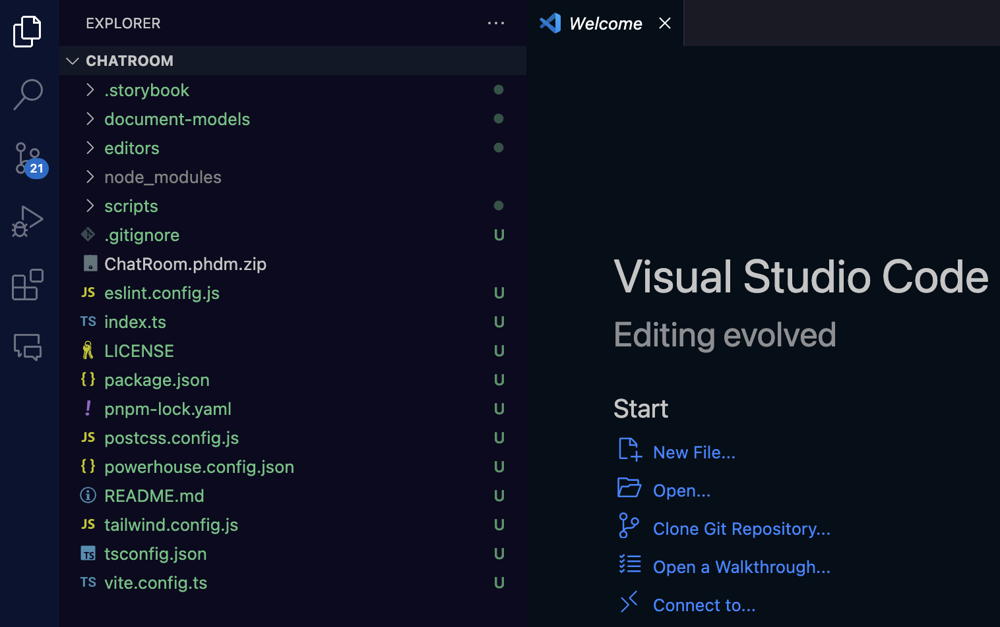
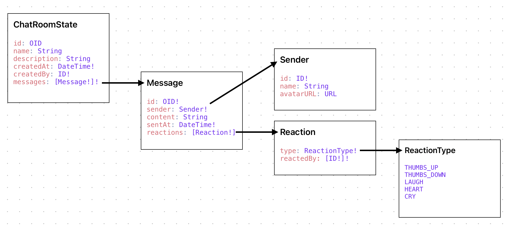

# Implement the document model

:::tip Tutorial Repository
📦 **Reference Code**: [chatroom-demo](https://github.com/powerhouse-inc/chatroom-demo)

This tutorial covers two key implementations:
1. **Reducers**: Implementing the reducer logic for all ChatRoom operations
2. **Tests**: Writing comprehensive tests for the reducers

You can view the exact implementation in the repository's `document-models/chat-room/src/` directory.
:::

<details>
<summary>📖 How to use this tutorial</summary>

This tutorial covers implementing reducers and tests.

### Compare your reducer implementation

After implementing your reducers:

```bash
# Compare your reducers with the reference
git diff tutorial/main -- document-models/chat-room/src/reducers/

# View the reference reducer implementation
git show tutorial/main:document-models/chat-room/src/reducers/messages.ts
```

### Compare your tests

After writing tests:

```bash
# Compare your tests with the reference
git diff tutorial/main -- document-models/chat-room/src/tests/

# View the reference test implementation
git show tutorial/main:document-models/chat-room/src/tests/messages.test.ts
```

### Visual comparison with GitHub Desktop

After committing your work, compare visually:
1. **Branch** menu → **"Compare to Branch..."**
2. Select `tutorial/main`
3. Review differences in the visual interface

See step 1 for detailed GitHub Desktop instructions.

### If you get stuck

View or reset to the reference:

```bash
# View the reducer code from the reference
git show tutorial/main:document-models/chat-room/src/reducers/messages.ts

# Reset to reference (WARNING: loses your changes)
git reset --hard tutorial/main
```

</details>

In this section, we will implement and test the operation reducers for the **ChatRoom** document model. For this, you have to export the document model specification from the Connect application and import it into your Powerhouse project directory.

To export the document model specification, follow the steps in the [Define ChatRoom Document Model](/academy/ExampleUsecases/Chatroom/DefineChatroomDocumentModel) section.

## Understanding reducers in document models

Reducers are a core concept in Powerhouse document models. They implement the state transition logic for each operation defined in your schema.

:::info
**Connection to schema definition language (SDL)**: The reducers directly implement the operations you defined in your SDL. Remember how we defined `AddMessageInput`, `AddEmojiReactionInput`, `RemoveEmojiReactionInput`, `EditChatNameInput`, and `EditChatDescriptionInput` in our schema?  
The reducers provide the actual implementation of what happens when those operations are performed.
:::

To import the document model specification into your Powerhouse project, you can either:

- Copy and paste the file directly into the root of your Powerhouse project.
- Or drag and drop the file into the Powerhouse project directory in the VSCode editor as seen in the image below:

Either step will import the document model specification into your Powerhouse project.



## In your project directory

The next steps will take place in the VSCode editor. Make sure to have it open and the terminal window inside VSCode open as well.

To write the operation reducers of the **ChatRoom** document model, you need to generate the document model code from the document model specification file you have exported into the Powerhouse project directory.

To do this, run the following command in the terminal:

```bash
ph generate ChatRoom.phd
```

You will see that this action created a range of files for you. Before diving in, let's look at this simple schema to familiarize yourself with the structure you've defined in the document model once more. It shows how each type is connected to the next one.



Now you can navigate to `/document-models/chat-room/src/reducers/messages.ts` and start writing the operation reducers.

Open the `messages.ts` file and you should see the scaffolding code that needs to be filled for the five operations you have specified earlier. The generated file will look like this:

```typescript
import type { ChatRoomMessagesOperations } from "chatroom/document-models/chat-room";

export const chatRoomMessagesOperations: ChatRoomMessagesOperations = {
    addMessageOperation(state, action) {
        // TODO: Implement "addMessageOperation" reducer
        throw new Error('Reducer "addMessageOperation" not yet implemented');
    },
    senderOperation(state, action) {
        // TODO: Implement "senderOperation" reducer
        throw new Error('Reducer "senderOperation" not yet implemented');
    },
    addEmojiReactionOperation(state, action) {
        // TODO: Implement "addEmojiReactionOperation" reducer
        throw new Error('Reducer "addEmojiReactionOperation" not yet implemented');
    },
    removeEmojiReactionOperation(state, action) {
        // TODO: Implement "removeEmojiReactionOperation" reducer
        throw new Error('Reducer "removeEmojiReactionOperation" not yet implemented');
    }
};
```

## Write the operation reducers

1. Copy and paste the code below into the `messages.ts` file in the `reducers` folder.
2. Save the file.

<details>
<summary>Operation Reducers</summary>

```typescript
import {
  MessageNotFoundError,
  MessageContentCannotBeEmptyError,
} from "../../gen/messages/error.js";
import type { ChatRoomMessagesOperations } from "chatroom-package/document-models/chat-room";

export const chatRoomMessagesOperations: ChatRoomMessagesOperations = {
  addMessageOperation(state, action) {
    if (action.input.content === "") {
      throw new MessageContentCannotBeEmptyError();
    }

    const newMessage = {
      id: action.input.messageId,
      sender: {
        id: action.input.sender.id,
        name: action.input.sender.name || null,
        avatarUrl: action.input.sender.avatarUrl || null,
      },
      content: action.input.content,
      sentAt: action.input.sentAt,
      reactions: [],
    };

    state.messages.push(newMessage);
  },
  addEmojiReactionOperation(state, action) {
    const message = state.messages.find((m) => m.id === action.input.messageId);
    if (!message) {
      throw new MessageNotFoundError(
        `Message with ID ${action.input.messageId} not found`,
      );
    }

    if (!message.reactions) {
      message.reactions = [];
    }

    const existingReaction = message.reactions.find(
      (r) => r.type === action.input.type,
    );

    if (existingReaction) {
      if (!existingReaction.reactedBy.includes(action.input.reactedBy)) {
        existingReaction.reactedBy.push(action.input.reactedBy);
      }
    } else {
      message.reactions.push({
        type: action.input.type,
        reactedBy: [action.input.reactedBy],
      });
    }
  },
  removeEmojiReactionOperation(state, action) {
    const message = state.messages.find((m) => m.id === action.input.messageId);
    if (!message) {
      throw new MessageNotFoundError(
        `Message with ID ${action.input.messageId} not found`,
      );
    }

    if (!message.reactions) {
      return;
    }

    const reactionIndex = message.reactions.findIndex(
      (r) => r.type === action.input.type,
    );
    if (reactionIndex === -1) {
      return;
    }

    const reaction = message.reactions[reactionIndex];
    const userIndex = reaction.reactedBy.indexOf(action.input.senderId);

    if (userIndex !== -1) {
      reaction.reactedBy.splice(userIndex, 1);

      if (reaction.reactedBy.length === 0) {
        message.reactions.splice(reactionIndex, 1);
      }
    }
  },
};
```
</details>


1. Do the same for the reducers of our "settings" operations. Copy and paste the code below into the `settings.ts` file in the `reducers` folder.
2. Save the file.


<details>
<summary>Operation Reducers</summary>
import type { ChatRoomSettingsOperations } from "chatroom-package/document-models/chat-room";

export const chatRoomSettingsOperations: ChatRoomSettingsOperations = {
  editChatNameOperation(state, action) {
    state.name = action.input.name || "";
  },
  editChatDescriptionOperation(state, action) {
    state.description = action.input.description || "";
  },
};
</details>


## Write the operation reducer tests

In order to make sure the operation reducers are working as expected, you need to write tests for them.

Navigate to `/document-models/chat-room/src/tests` and replace the scaffolding code with comprehensive tests.

Here are the tests for the five operations implemented in the reducers file. The test file:
- Uses Vitest for testing
- Creates an empty ChatRoom document model
- Tests add message, add/remove reactions, and edit operations
- Verifies both the operation history and the resulting state

<details>
<summary>Operation Reducer Tests</summary>

```typescript
import { describe, it, expect, beforeEach } from "vitest";
import { generateId } from "document-model/core";
import {
  reducer,
  utils,
  addMessage,
  addEmojiReaction,
  removeEmojiReaction,
  editChatName,
  editChatDescription,
} from "../../gen/index.js";
import type {
  ChatRoomDocument,
  AddMessageInput,
  AddEmojiReactionInput,
  RemoveEmojiReactionInput,
  EditChatNameInput,
  EditChatDescriptionInput,
} from "../../gen/types.js";

describe("GeneralOperations Operations", () => {
  let document: ChatRoomDocument;

  beforeEach(() => {
    document = utils.createDocument();
  });

  // Helper function to add a message for testing
  const addMessageHelper = (): [ChatRoomDocument, AddMessageInput] => {
    const input: AddMessageInput = {
      content: "Hello, World!",
      messageId: generateId(),
      sender: {
        id: "anon-user",
        name: null,
        avatarUrl: null,
      },
      sentAt: new Date().toISOString(),
    };

    const updatedDocument = reducer(document, addMessage(input));

    return [updatedDocument, input];
  };

  // Test adding a new message
  it("should handle addMessage operation", () => {
    const [updatedDocument, input] = addMessageHelper();

    // Verify the operation was recorded
    expect(updatedDocument.operations.global).toHaveLength(1);
    expect(updatedDocument.operations.global[0].action.type).toBe("ADD_MESSAGE");
    expect(updatedDocument.operations.global[0].action.input).toStrictEqual(input);
    expect(updatedDocument.operations.global[0].index).toEqual(0);

    // Verify the message was added to state
    expect(updatedDocument.state.global.messages).toHaveLength(1);
    expect(updatedDocument.state.global.messages[0]).toMatchObject({
      id: input.messageId,
      content: input.content,
      sender: input.sender,
      sentAt: input.sentAt,
      reactions: [],
    });
  });

  // Test adding an emoji reaction
  it("should handle addEmojiReaction operation", () => {
    const [doc, addMessageInput] = addMessageHelper();

    let updatedDocument = doc;

    const addEmojiReactionInput: AddEmojiReactionInput = {
      messageId: addMessageInput.messageId,
      reactedBy: "anon-user",
      type: "THUMBS_UP",
    };

    updatedDocument = reducer(
      updatedDocument,
      addEmojiReaction(addEmojiReactionInput),
    );

    // Verify the operation was recorded
    expect(updatedDocument.operations.global).toHaveLength(2);
    expect(updatedDocument.operations.global[1].action.type).toBe("ADD_EMOJI_REACTION");
    expect(updatedDocument.operations.global[1].action.input).toStrictEqual(
      addEmojiReactionInput,
    );
    expect(updatedDocument.operations.global[1].index).toEqual(1);

    // Verify the reaction was added
    expect(updatedDocument.state.global.messages[0].reactions).toHaveLength(1);
    expect(updatedDocument.state.global.messages[0].reactions?.[0]).toMatchObject({
      reactedBy: [addEmojiReactionInput.reactedBy],
      type: addEmojiReactionInput.type,
    });
  });

  // Test adding reaction to non-existing message
  it("should handle addEmojiReaction operation to a non existing message", () => {
    const input: AddEmojiReactionInput = {
      messageId: "invalid-message-id",
      reactedBy: "anon-user",
      type: "THUMBS_UP",
    };

    const updatedDocument = reducer(document, addEmojiReaction(input));

    expect(updatedDocument.operations.global).toHaveLength(1);
    expect(updatedDocument.operations.global[0].action.type).toBe("ADD_EMOJI_REACTION");
    expect(updatedDocument.state.global.messages).toHaveLength(0);
  });

  // Test removing an emoji reaction
  it("should handle removeEmojiReaction operation", () => {
    const [doc, addMessageInput] = addMessageHelper();

    let updatedDocument = doc;

    const addEmojiReactionInput: AddEmojiReactionInput = {
      messageId: addMessageInput.messageId,
      reactedBy: "anon-user",
      type: "THUMBS_UP",
    };

    updatedDocument = reducer(
      updatedDocument,
      addEmojiReaction(addEmojiReactionInput),
    );

    const input: RemoveEmojiReactionInput = {
      messageId: addMessageInput.messageId,
      senderId: "anon-user",
      type: "THUMBS_UP",
    };

    updatedDocument = reducer(updatedDocument, removeEmojiReaction(input));

    // Verify the operation was recorded
    expect(updatedDocument.operations.global).toHaveLength(3);
    expect(updatedDocument.operations.global[2].action.type).toBe("REMOVE_EMOJI_REACTION");
    expect(updatedDocument.operations.global[2].action.input).toStrictEqual(input);
    expect(updatedDocument.operations.global[2].index).toEqual(2);

    // Verify the reaction was removed
    expect(updatedDocument.state.global.messages[0].reactions).toHaveLength(0);
  });

  // Test editing chat name
  it("should handle editChatName operation", () => {
    const input: EditChatNameInput = {
      name: "New Chat Name",
    };

    const updatedDocument = reducer(document, editChatName(input));

    // Verify the operation was recorded
    expect(updatedDocument.operations.global).toHaveLength(1);
    expect(updatedDocument.operations.global[0].action.type).toBe("EDIT_CHAT_NAME");
    expect(updatedDocument.operations.global[0].action.input).toStrictEqual(input);
    expect(updatedDocument.operations.global[0].index).toEqual(0);

    // Verify the name was updated
    expect(updatedDocument.state.global.name).toBe(input.name);
  });

  // Test editing chat description
  it("should handle editChatDescription operation", () => {
    const input: EditChatDescriptionInput = {
      description: "New Chat Description",
    };

    const updatedDocument = reducer(document, editChatDescription(input));

    // Verify the operation was recorded
    expect(updatedDocument.operations.global).toHaveLength(1);
    expect(updatedDocument.operations.global[0].action.type).toBe("EDIT_CHAT_DESCRIPTION");
    expect(updatedDocument.operations.global[0].action.input).toStrictEqual(input);
    expect(updatedDocument.operations.global[0].index).toEqual(0);

    // Verify the description was updated
    expect(updatedDocument.state.global.description).toBe(input.description);
  });
});
```

</details>

Now you can run the tests to make sure the operation reducers are working as expected.

```bash
pnpm run test
```

Output should be as follows:

```bash
 ✓ document-models/chat-room/src/tests/document-model.test.ts (3 tests) 1ms
 ✓ document-models/chat-room/src/tests/general-operations.test.ts (6 tests) 8ms

 Test Files  2 passed (2)
      Tests  9 passed (9)
   Start at  15:19:52
   Duration  3.61s (transform 77ms, setup 0ms, collect 3.50s, tests 14ms, environment 0ms, prepare 474ms)
```

If you got the same output, you have successfully implemented the operation reducers and tests for the **ChatRoom** document model.

## Compare with reference implementation

Verify your implementation matches the tutorial:

```bash
# View reference reducer implementation
git show tutorial/main:document-models/chat-room/src/reducers/general-operations.ts

# View reference test implementation
git show tutorial/main:document-models/chat-room/src/tests/general-operations.test.ts

# Compare your entire implementation
git diff tutorial/main -- document-models/chat-room/src/
```

## Up next: ChatRoom editor

Continue to the next section to learn how to implement the document model editor so you can see a simple user interface for the **ChatRoom** document model in action.
