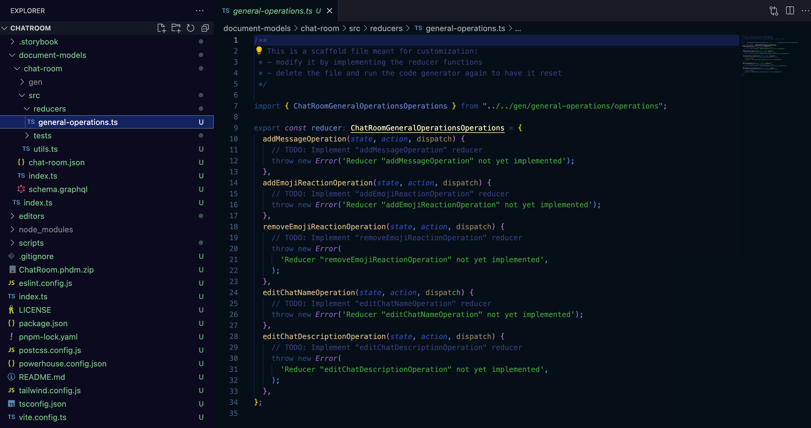

# Implement Operation Reducers

In this section, we will implement and test the operation reducers for the `ChatRoom` document model. In order to do this, you have to export the document model from the Connect application and import it into your powerhouse project directory.

To export the document model, follow the steps in the `Define Chatroom Document Model` section.

## Import Document Model and Generate Code

To import the document model into your powerhouse project, you can either:

- Copy&Paste the file directly into the root of your powerhouse project.
- Or drag&drop the file into the powerhouse project directory in the VSCode editor as seen in the image below:

Either step will import the document model into your powerhouse project.


The next steps will take place in the VSCode editor. Make sure to have it open and the terminal window inside vscode open as well.

To write the opearation reducers of the `ChatRoom` document model, you need to generate the document model code from the document model file you have exported into the powerhouse project directory.

To do this, run the following command in the terminal:

```bash
ph generate ChatRoom.phdm.phd
```

You will see that this action created a range of files for you. Before diving in we'll look at this simple schema to make you familiar with the structure you've defined in the document model once more. It shows how each type is connected to the next one.


Now you can navigate to `/document-models/chat-room/src/reducers/general-operations.ts` and start writing the operation reducers.

Open the `general-operations.ts` file and you should see the code that needs to be filled for the five operations you have defined earlier. Image below shows the code that needs to be filled:



## Write the Operation Reducers

1. Copy&paste the code below into the `general-operations.ts` file in the `reducers` folder.
2. Save the `general-operations.ts` file.

```typescript
/**
 * This is a scaffold file meant for customization:
 * - modify it by implementing the reducer functions
 * - delete the file and run the code generator again to have it reset
 */

import { MessageContentCannotBeEmpty } from "../../gen/general-operations/error.js";
import type { ChatRoomGeneralOperationsOperations } from "chatroom/document-models/chat-room";

export const chatRoomGeneralOperationsOperations: ChatRoomGeneralOperationsOperations =
  {
    addMessageOperation(state, action) {
      if (action.input.content === "") {
        throw new MessageContentCannotBeEmpty();
      }

      const newMessage = {
        id: action.input.messageId,
        sender: {
          id: action.input.sender.id,
          name: action.input.sender.name || null,
          avatarUrl: action.input.sender.avatarUrl || null,
        },
        content: action.input.content,
        sentAt: action.input.sentAt,
        reactions: [],
      };

      state.messages.push(newMessage);
    },
    addEmojiReactionOperation(state, action) {
      const message = state.messages.find(
        (m) => m.id === action.input.messageId,
      );
      if (!message) {
        return state;
      }

      if (!message.reactions) {
        message.reactions = [];
      }

      const existingReaction = message.reactions.find(
        (r) => r.type === action.input.type,
      );

      if (existingReaction) {
        if (!existingReaction.reactedBy.includes(action.input.reactedBy)) {
          existingReaction.reactedBy.push(action.input.reactedBy);
        }
      } else {
        message.reactions.push({
          type: action.input.type,
          reactedBy: [action.input.reactedBy],
        });
      }
    },
    removeEmojiReactionOperation(state, action) {
      const message = state.messages.find(
        (m) => m.id === action.input.messageId,
      );
      if (!message) {
        return state;
      }

      if (!message.reactions) {
        return;
      }

      const reactionIndex = message.reactions.findIndex(
        (r) => r.type === action.input.type,
      );
      if (reactionIndex === -1) {
        return;
      }

      const reaction = message.reactions[reactionIndex];
      const userIndex = reaction.reactedBy.indexOf(action.input.senderId);

      if (userIndex !== -1) {
        reaction.reactedBy.splice(userIndex, 1);

        if (reaction.reactedBy.length === 0) {
          message.reactions.splice(reactionIndex, 1);
        }
      }
    },
    editChatNameOperation(state, action) {
      state.name = action.input.name || "";
    },
    editChatDescriptionOperation(state, action) {
      state.description = action.input.description || "";
    },
  };

```

## Write the Operation Reducers Tests

In order to make sure the operation reducers are working as expected before implementing an editor interface, you need to write tests for them.

The auto generated test will only validate if an action or message in our case is included but will not verify if the reducer mutation is succesfull. This is the type of test you'll have to write as a developer.

Navigate to `/document-models/chat-room/src/tests/general-operations.test.ts` and copy&paste the code below into the file. Save the file.

Here are the tests for the five operations written in the reducers file.

```typescript
/**
 * This is a scaffold file meant for customization:
 * - change it by adding new tests or modifying the existing ones
 */

import { describe, it, expect, beforeEach } from "vitest";
import { generateId } from "document-model/core";
import {
  reducer,
  utils,
  addMessage,
  addEmojiReaction,
  removeEmojiReaction,
  editChatName,
  editChatDescription,
} from "../../gen/index.js";
import type {
  ChatRoomDocument,
  AddMessageInput,
  AddEmojiReactionInput,
  RemoveEmojiReactionInput,
  EditChatNameInput,
  EditChatDescriptionInput,
} from "../../gen/types.js";

describe("GeneralOperations Operations", () => {
  let document: ChatRoomDocument;

  beforeEach(() => {
    document = utils.createDocument();
  });

  const addMessageHelper = (): [ChatRoomDocument, AddMessageInput] => {
    // This is a helper function for our upcoming tests
    const input: AddMessageInput = {
      content: "Hello, World!",
      messageId: generateId(),
      sender: {
        id: "anon-user",
        name: null,
        avatarUrl: null,
      },
      sentAt: new Date().toISOString(),
    };

    const updatedDocument = reducer(document, addMessage(input));

    return [updatedDocument, input];
  };

  it("should handle addMessage operation", () => {
    const [updatedDocument, input] = addMessageHelper();

    expect(updatedDocument.operations.global).toHaveLength(1); // We're validating that the message is being added to the operations history
    expect(updatedDocument.operations.global[0].action.type).toBe(
      "ADD_MESSAGE",
    );
    expect(updatedDocument.operations.global[0].action.input).toStrictEqual(
      input,
    );
    expect(updatedDocument.operations.global[0].index).toEqual(0);

    expect(updatedDocument.state.global.messages).toHaveLength(1); // We're validating that the message is present in the message state of the document
    expect(updatedDocument.state.global.messages[0]).toMatchObject({
      id: input.messageId,
      content: input.content,
      sender: input.sender,
      sentAt: input.sentAt,
      reactions: [], // We also want to make sure that reaction object is an empty array
    });
  });

  it("should handle addEmojiReaction operation", () => {
    // We're validating that we can react using an emoji with a helper function
    const [doc, addMessageInput] = addMessageHelper();

    let updatedDocument = doc;

    const addEmojiReactionInput: AddEmojiReactionInput = {
      messageId: addMessageInput.messageId,
      reactedBy: "anon-user",
      type: "THUMBS_UP",
    };

    updatedDocument = reducer(
      updatedDocument,
      addEmojiReaction(addEmojiReactionInput),
    );

    expect(updatedDocument.operations.global).toHaveLength(2); // We're validating that the emoji reaction is added to the operation history of the doc.
    expect(updatedDocument.operations.global[1].action.type).toBe(
      "ADD_EMOJI_REACTION",
    );
    expect(updatedDocument.operations.global[1].action.input).toStrictEqual(
      addEmojiReactionInput,
    );
    expect(updatedDocument.operations.global[1].index).toEqual(1);

    expect(updatedDocument.state.global.messages[0].reactions).toHaveLength(1); // We're validating that the message we created has only one reaction
    expect(
      updatedDocument.state.global.messages[0].reactions?.[0],
    ).toMatchObject({
      reactedBy: [addEmojiReactionInput.reactedBy], // We're validating that reactedBy object only contains the right address
      type: addEmojiReactionInput.type,
    });
  });

  it("should handle addEmojiReaction operation to a non existing message", () => {
    // We're testing that the state doesn't change when reacting to a non-existing message
    const input: AddEmojiReactionInput = {
      messageId: "invalid-message-id",
      reactedBy: "anon-user",
      type: "THUMBS_UP",
    };

    const updatedDocument = reducer(document, addEmojiReaction(input));

    expect(updatedDocument.operations.global).toHaveLength(1);
    expect(updatedDocument.operations.global[0].action.type).toBe(
      "ADD_EMOJI_REACTION",
    );
    expect(updatedDocument.state.global.messages).toHaveLength(0);
  });

  it("should handle removeEmojiReaction operation", () => {
    // We're making use of a helper function to check if we can remove an EmojiReaction
    const [doc, addMessageInput] = addMessageHelper();

    let updatedDocument = doc;

    const addEmojiReactionInput: AddEmojiReactionInput = {
      messageId: addMessageInput.messageId,
      reactedBy: "anon-user",
      type: "THUMBS_UP",
    };

    updatedDocument = reducer(
      updatedDocument,
      addEmojiReaction(addEmojiReactionInput),
    );

    const input: RemoveEmojiReactionInput = {
      // We're validating the removal of a message by our anon-user with a specific messageId
      messageId: addMessageInput.messageId,
      senderId: "anon-user",
      type: "THUMBS_UP",
    };

    updatedDocument = reducer(updatedDocument, removeEmojiReaction(input));

    expect(updatedDocument.operations.global).toHaveLength(3); // We're validating that the operation was added to the operation history.
    expect(updatedDocument.operations.global[2].action.type).toBe(
      "REMOVE_EMOJI_REACTION",
    );
    expect(updatedDocument.operations.global[2].action.input).toStrictEqual(
      input,
    );
    expect(updatedDocument.operations.global[2].index).toEqual(2);

    // When the last user removes their reaction, the entire reaction should be removed
    expect(updatedDocument.state.global.messages[0].reactions).toHaveLength(0);
  });

  it("should handle editChatName operation", () => {
    const input: EditChatNameInput = {
      name: "New Chat Name",
    };

    const updatedDocument = reducer(document, editChatName(input));

    expect(updatedDocument.operations.global).toHaveLength(1); // We're validating that the operation is added to the operations history
    expect(updatedDocument.operations.global[0].action.type).toBe(
      "EDIT_CHAT_NAME",
    );
    expect(updatedDocument.operations.global[0].action.input).toStrictEqual(
      input,
    );
    expect(updatedDocument.operations.global[0].index).toEqual(0);

    expect(updatedDocument.state.global.name).toBe(input.name);
  });

  it("should handle editChatDescription operation", () => {
    const input: EditChatDescriptionInput = {
      description: "New Chat Description",
    };

    const updatedDocument = reducer(document, editChatDescription(input));

    expect(updatedDocument.operations.global).toHaveLength(1); // We're validating that the operation is added to the operations history
    expect(updatedDocument.operations.global[0].action.type).toBe(
      "EDIT_CHAT_DESCRIPTION",
    );
    expect(updatedDocument.operations.global[0].action.input).toStrictEqual(
      input,
    );
    expect(updatedDocument.operations.global[0].index).toEqual(0);

    expect(updatedDocument.state.global.description).toBe(input.description);
  });
});
```

Now you can run the tests to make sure the operation reducers are working as expected.

```bash
npm run test
```

Output should be as follows:

```bash
 Test Files  2 passed (2)
      Tests  7 passed (7)
   Start at  15:19:52
   Duration  3.61s (transform 77ms, setup 0ms, collect 3.50s, tests 14ms, environment 0ms, prepare 474ms)
```

If you got the same output, you have successfully implemented the operation reducers and tests for the `ChatRoom` document model.
Continue to the next section to learn how to implement the document model editor so you can see a simple user interface for the `ChatRoom` document model in action.
