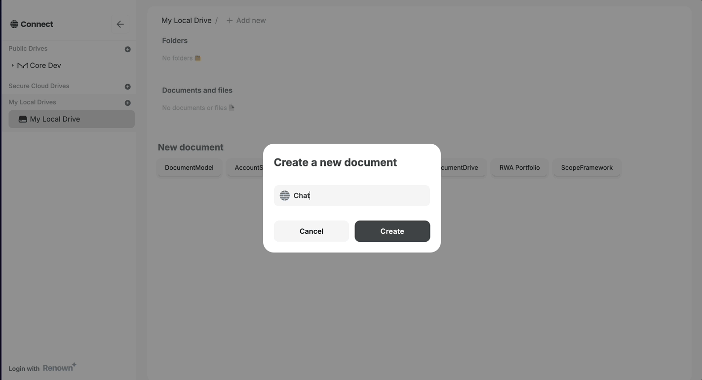

# Build the ChatRoom editor

:::tip Tutorial Repository
📦 **Reference Code**: [chatroom-demo](https://github.com/powerhouse-inc/chatroom-demo)

This tutorial covers building the ChatRoom editor:
1. **Editor Scaffolding**: Generating the editor template with `ph generate --editor`
2. **Component Implementation**: Building a complete, interactive chat UI with components

Explore the complete implementation in the `editors/chat-room-editor/` directory.
:::

<details>
<summary>📖 How to use this tutorial</summary>

This tutorial shows building from **generated scaffolding** to a **complete chat UI**.

### Compare your generated editor

After running `pnpm generate --editor`:

```bash
# Compare generated scaffolding with the reference
git diff tutorial/main -- editors/chat-room-editor/

# View the generated editor template
git show tutorial/main:editors/chat-room-editor/editor.tsx
```

### Browse the complete implementation

Explore the production-ready component structure:

```bash
# List all components in the reference
git ls-tree -r --name-only tutorial/main editors/chat-room-editor/components/

# View a specific component
git show tutorial/main:editors/chat-room-editor/components/ChatRoom.tsx
```

### Visual comparison with GitHub Desktop

After committing your editor code:
1. **Branch** menu → **"Compare to Branch..."**
2. Select `tutorial/main`
3. See all your custom components vs. the reference implementation

See step 1 for detailed GitHub Desktop instructions.

</details>

In this chapter we will continue with the interface or editor implementation of the **ChatRoom** document model. This means you will create a user interface for the **ChatRoom** document model which will be used inside the Connect app to visualize your chatroom, send messages, and react with emojis.

## Generate the editor template

Run the command below to generate the editor template for the **ChatRoom** document model.  
This command reads the **ChatRoom** document model definition from the `document-models` folder and generates the editor template in the `editors/chat-room-editor` folder.

```bash
pnpm generate --editor chat-room-editor --document-types powerhouse/chat-room
```

Notice the `--editor` flag which specifies the editor name, and the `--document-types` flag defines the document type `powerhouse/chat-room`.

Once complete, you'll have a new directory structure:

```
editors/chat-room-editor/
├── components/
│   └── EditName.tsx          # Auto-generated component for editing document name
├── editor.tsx                # Main editor component (to be customized)
└── module.ts                 # Editor module configuration
```

Navigate to the `editors/chat-room-editor/editor.tsx` file and open it in your editor. You'll see a basic template ready for customization.

### Editor implementation options

When building your editor component within the Powerhouse ecosystem, you have several options for styling:

1. **Default HTML Styling:** Standard HTML tags will render with default styles offered through the boilerplate.
2. **Tailwind CSS:** Connect Studio comes with Tailwind CSS integrated. You can directly use Tailwind utility classes.
3. **Custom CSS Files:** You can import traditional CSS files to apply custom styles.

Connect Studio provides a dynamic local environment. By running `ph connect`, you can visualize your components instantly as you build them.

## Build the editor with components

We'll build the editor using a component-based approach for better organization and reusability.

### Component-based architecture

The ChatRoom editor structure includes several components that you can either build yourself or copy from the reference repository:

- `editor.tsx` - Main editor wrapper (imports ChatRoom)
- `ChatRoom.tsx` - Main container component that orchestrates all other components
- `Message.tsx` - Individual message component with reactions
- `EmojiReaction.tsx` - Emoji reaction UI component
- `TextInput.tsx` - Input component for sending messages
- `Avatar.tsx` - User avatar component

### Option 1: Copy components from the reference

Download the repository of the chatroom-demo as a zip file from https://github.com/powerhouse-inc/chatroom-demo and navigate to `editors/chat-room-editor` to copy both the `components` folder and `utils.ts` file.

In this folder you'll find:
- An avatar component for chat room participants
- The chatroom environment itself
- A header for the chatroom
- The UI for rendering messages, usernames, and reaction popups
- The emoji reaction interface
- A text input field component

The utils function will help you with mapping information from the document model to your chatroom components, such as mapping emoji values to the relevant emoji to be displayed.

### Option 2: Build the main editor file

If you want to understand how everything connects, here's the main `editor.tsx` implementation:

```typescript
import { generateId } from "document-model/core";
import { useUser } from "@powerhousedao/reactor-browser/connect";
import { useSelectedChatRoomDocument } from "../../document-models/chat-room/hooks.js";
import {
  addMessage,
  addEmojiReaction,
  removeEmojiReaction,
  editChatName,
  editChatDescription,
} from "../../document-models/chat-room/gen/creators.js";
import {
  ChatRoom,
  type ChatRoomProps,
  type MessageProps,
} from "./components/index.js";
import { reactionKeyToReactionType, mapReactions } from "./utils.js";

export default function Editor() {
  const [document, dispatch] = useSelectedChatRoomDocument();
  const user = useUser();

  const disableChatRoom = !user;

  if (!document) {
    return <div>Loading...</div>;
  }

  // Map document messages to component props
  const messages: ChatRoomProps["messages"] =
    document.state.global.messages.map((message) => ({
      id: message.id,
      message: message.content || "",
      timestamp: message.sentAt,
      userName: message.sender.name || message.sender.id,
      imgUrl: message.sender.avatarUrl || undefined,
      isCurrentUser: message.sender.id === user?.address,
      reactions: mapReactions(message.reactions),
    }));

  // Handler for sending messages
  const onSendMessage: ChatRoomProps["onSendMessage"] = (message) => {
    if (!message) return;

    dispatch(
      addMessage({
        messageId: generateId(),
        content: message,
        sender: {
          id: user?.address || "anon-user",
          name: user?.ens?.name || null,
          avatarUrl: user?.ens?.avatarUrl || null,
        },
        sentAt: new Date().toISOString(),
      }),
    );
  };

  // Handler for adding reactions
  const addReaction = (
    messageId: string,
    userId: string,
    reactionType: "HEART" | "THUMBS_UP" | "THUMBS_DOWN" | "LAUGH" | "CRY",
  ) => {
    dispatch(
      addEmojiReaction({
        messageId,
        reactedBy: userId,
        type: reactionType,
      }),
    );
  };

  // Handler for removing reactions
  const removeReaction = (
    messageId: string,
    userId: string,
    reactionType: "HEART" | "THUMBS_UP" | "THUMBS_DOWN" | "LAUGH" | "CRY",
  ) => {
    dispatch(
      removeEmojiReaction({
        messageId,
        senderId: userId,
        type: reactionType,
      }),
    );
  };

  // Handler for clicking on reactions (toggle behavior)
  const onClickReaction: MessageProps["onClickReaction"] = (reaction) => {
    const message = messages.find(
      (message) => message.id === reaction.messageId,
    );

    if (!message) return;

    const messageId = reaction.messageId;
    const reactionType = reactionKeyToReactionType(reaction.type);
    const currentUserId = user?.address || "anon-user";

    const existingReaction = message.reactions?.find(
      (r) => r.type === reaction.type,
    );

    if (existingReaction) {
      const dispatchAction = existingReaction.reactedBy.includes(currentUserId)
        ? removeReaction
        : addReaction;

      dispatchAction(messageId, currentUserId, reactionType);
    } else {
      addReaction(messageId, currentUserId, reactionType);
    }
  };

  // Handlers for editing chat metadata
  const onSubmitTitle: ChatRoomProps["onSubmitTitle"] = (title) => {
    dispatch(editChatName({ name: title }));
  };

  const onSubmitDescription: ChatRoomProps["onSubmitDescription"] = (
    description,
  ) => {
    dispatch(editChatDescription({ description }));
  };

  return (
    <div style={{ height: "calc(100vh - 140px)" }}>
      <ChatRoom
        description={
          document.state.global.description || "This is a chat room demo"
        }
        disabled={disableChatRoom}
        messages={messages}
        onClickReaction={onClickReaction}
        onSendMessage={onSendMessage}
        onSubmitDescription={onSubmitDescription}
        onSubmitTitle={onSubmitTitle}
        title={document.state.global.name || "Chat Room Demo"}
      />
    </div>
  );
}
```

**What's happening here:**

- We use `useSelectedChatRoomDocument` hook to get the document state and dispatch function
- We use `useUser` to get the current user information (for authentication)
- We map the document's messages to props that our ChatRoom component expects
- We create handlers for sending messages, adding/removing reactions, and editing metadata
- We dispatch operations (`addMessage`, `addEmojiReaction`, etc.) from our generated creators

:::info Key Concept: useSelectedChatRoomDocument hook
The `useSelectedChatRoomDocument` hook is generated by the Powerhouse CLI. It provides:
1. The current document state (`document`)
2. A dispatch function to send actions to the reducer

This hook connects your React components to the document model's state and operations.
:::

## Test your editor

Now you can run the Connect app and see the **ChatRoom** editor in action:

```bash
ph connect
```

In Connect, in the bottom right corner you'll find a new Document Model that you can create: **ChatRoom**. Click on it to create a new ChatRoom document.

:::warning Authentication Required
A warning will prompt you to login before you can send messages. Login with an Ethereum address via Renown to start sending messages.
:::



**Try it out:**
1. Create a new ChatRoom document
2. Login with your Ethereum wallet
3. Send messages using the input field
4. React to messages with emoji reactions
5. Click the chat name or description to edit them

Congratulations! 🎉  
If you managed to follow this tutorial until this point, you have successfully implemented the **ChatRoom** document model with its reducer operations and editor.

## Compare with the reference implementation

The tutorial repository includes the complete ChatRoom editor with all components:

```
editors/chat-room-editor/
├── components/
│   ├── Avatar.tsx            # User avatar display
│   ├── ChatRoom.tsx          # Main chat container
│   ├── Header.tsx            # Chat header with title/description
│   ├── Message.tsx           # Individual message display
│   ├── EmojiReaction.tsx     # Reaction UI
│   ├── TextInput.tsx         # Message input field
│   └── index.ts              # Component exports
├── editor.tsx                # Main editor component
├── utils.ts                  # Utility functions for data mapping
└── module.ts                 # Editor module configuration
```

**View individual components from the reference:**

```bash
# See the ChatRoom component implementation
git show tutorial/main:editors/chat-room-editor/components/ChatRoom.tsx

# Explore the Message component
git show tutorial/main:editors/chat-room-editor/components/Message.tsx

# Compare your implementation with the reference
git diff tutorial/main -- editors/chat-room-editor/
```

## Key concepts learned

In this tutorial you've learned:

✅ **Component-based architecture** - Breaking down complex UIs into reusable components  
✅ **Document model hooks** - Using `useSelectedChatRoomDocument` to connect React to your document state  
✅ **User authentication** - Using `useUser` hook for wallet-based authentication  
✅ **Action dispatching** - How to dispatch operations from your UI  
✅ **Type-safe development** - Leveraging TypeScript with generated types from your SDL  
✅ **Real-time collaboration** - Building features that work across multiple users

## Up next: Local Reactor

In the next section, you'll learn how to run a local Reactor to test real-time synchronization between multiple users.
