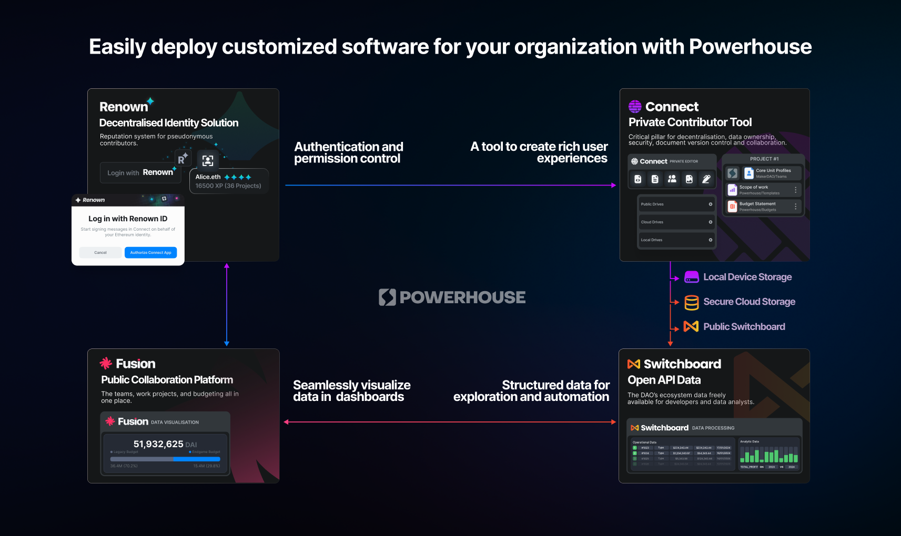

# Powerhouse Architecture

**Vetra is part of the Powerhouse Ecosystem** and acts as the builder platform for creating an independent, open-source and decentralized back-end for any SaaS, ERP, CMS or CRM needs.

## Local First. Built to Scale.

Vetra helps you build any type of web application on a **Reactive Document Architecture**. Define workflows once, deploy them globally, and co-own the software you create. The architecture is built on a minimal but powerful tech-stack: **GraphQL**, **TypeScript**, and **React**.

### Reactive Document Architecture

The Powerhouse framework is built around structured document models and declarative design:

- **Reactive**: Real-time, responsive, and message-driven with an elastic scalable architecture.
- **Document-Centric**: Documents as local-first, self-contained data structures and nodes in a decentralized network.
- **Git-like UX**: State-of-the-art editing with history branching, merging, and commenting.
- **Stateful**: Documents with well-defined operations as state transitions become mini-APIs.
- **Scalable**: CQRS and EDA-inspired architecture with read models for data aggregation.

## Target Audiences

Vetra supports a variety of organizations with a headless open-source back-end:

- Decentralized Autonomous Organizations (DAOs)
- Scalable Network Organizations (an evolution of DAOs within the Powerhouse framework)
- NGOs and Governmental Organizations
- Cooperatives and distributed teams

## Host Applications

The Powerhouse ecosystem makes use of 4 core host applications that together form a modular, scalable operating system for any organization or business. Each application serves a distinct role, yet they are interdependent—working as a unified system to streamline operations, enhance collaboration, and drive automation.

1. **Connect** – A collaboration hub and private workspace for independent contributors.
2. **Switchboard** – The data infrastructure and API engine for managing remote instances.
3. **Fusion** – An SDK for visualizing collected data and public-facing collaboration.
4. **Renown** – A decentralized reputation and identity system.

## How It All Connects: Reactors

The host applications sync their documents with one another through **Reactors**. A reactor is a node within any Powerhouse network responsible for storing documents, resolving conflicts, and verifying document event histories.

Reactors can be configured for:
- **Local Storage** – For offline or on-device access.
- **Cloud Storage** – For centralized, scalable data management.
- **Decentralized Storage** – Such as Ceramic or IPFS for distributed storage.

The documents within the network react to one another through the **DocSync** protocol—which sends updates from one reactor to another, ensuring all data stays synchronized across the system.

## Powerhouse Platforms

With the help of these host applications, Powerhouse is launching 2 platforms that demonstrate the infrastructure that can be built with the Powerhouse tech-stack:

- [**Vetra Builder Platform**](https://vetra.io/): Sovereign infrastructure for scalable network organizations—local first, built to scale.
- [**Achra Decentralized Operations Platform**](https://achra.com/): Where open organizations can procure and purchase services. 
