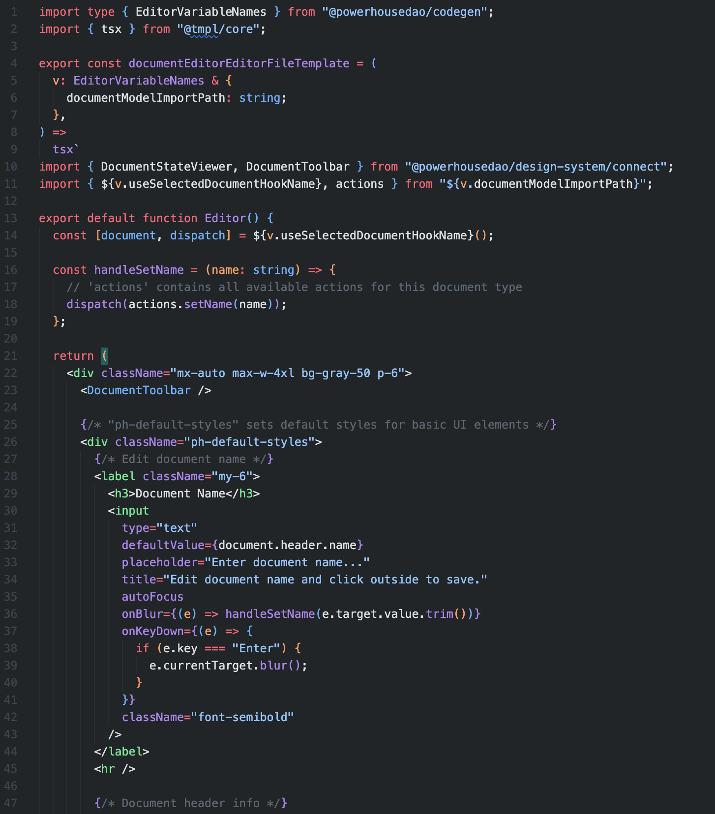
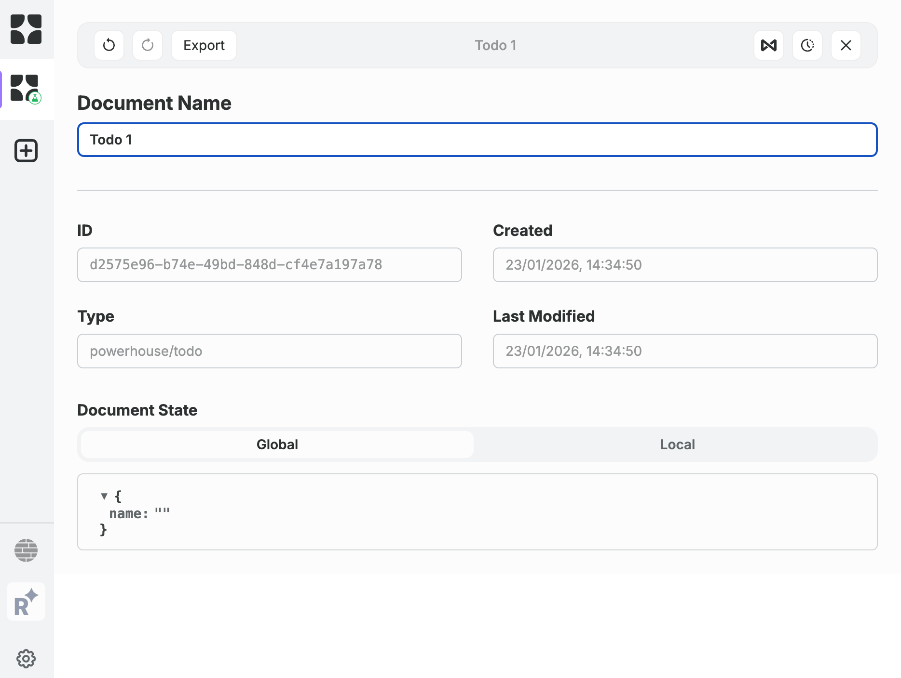

# Powerhouse v5.3.0 🚀

### ✨ Highlights

1. **Authentication & Permissions** - CLI authentication and document-level permissions
2. **Improved Code Generation** - TS Morph and templates for faster, more reliable generation
3. **Runtime Document Model Subgraphs** - No more generated subgraph code to manage

<!-- This release focuses on authentication, permissions, improved code generation, and runtime document model subgraphs. -->

---

# 🔐 CLI Authentication

New commands for authentication workflows:

| Command           | Description                                   |
| ----------------- | --------------------------------------------- |
| `ph login`        | Authenticate with your Powerhouse identity    |
| `ph access-token` | Generate access tokens for API authentication |

<!-- The CLI now supports full authentication workflows for secure operations and programmatic API access. -->

---

# 🛡️ Document Permission Service

Fine-grained access control at the document level for Switchboard.

- **Operation Permissions** - Control who can perform specific operations
- **Document Group Permissions** - Organize documents with shared access rules
- **Feature Flag** - Enable/disable via configuration

When enabled, all document operations are validated against permission rules.

<!-- Enterprise-grade access control that integrates seamlessly with existing Switchboard deployments. -->

---

# 📊 Autogenerated Document Model Subgraphs

Subgraphs are now **automatically available** on Switchboard at runtime.

### ⚠️ Action Required

Previously generated subgraphs should be **deleted** to avoid conflicts.

<!-- This eliminates manual subgraph generation and maintenance. Clean up old generated files to prevent runtime conflicts. -->

# ⚛️ New React Hooks

`useGetDocument` and `useGetDocuments`

```typescript
const getDocument = useGetDocument();

const onDocumentSelected = async (id: string) => {
  const document = await getDocument(id); // Fetch on demand
};
```

---

# ⚛️ Dispatch Callbacks

Optional callbacks to handle results of dispatched actions.

```typescript
const [document, dispatch] = useDocumentById(documentId);

dispatch(
  myAction,
  (errors) => {
    // Handle errors (e.g., show toast notification)
    alert(errors);
  },
  (document) => {
    // Handle success
    console.log("Document updated:", document);
  },
);
```

<!-- Useful for showing toast notifications or triggering follow-up actions based on dispatch results. -->

---

# ⚛️ React Hooks Bug Fixes

- Hooks returning multiple documents now correctly update when any document changes
- Improved React Suspense integration to avoid unnecessary loading states

Thank you **Liberuum**!

<!-- These improvements make working with documents more reliable and flexible. -->

---

# 🎨 Document Model Editor Improvements

Enhanced state editing experience in the Document Model Editor.

<video src="doc%20model%20state.mov" controls width="700"></video>

<!-- The Document Model Editor now provides a better experience for editing document state schemas with improved validation and feedback. -->

---

# 🛠️ Improved Code Generation

Faster, more reliable code generation with **TS Morph** and **templates**.

- Templates are easier to maintain and customize
- More predictable output
- Better error messages



<!-- The new template-based approach makes codegen more maintainable and gives developers clearer error messages when something goes wrong. -->

---

# 📝 Updated Editor Boilerplate

Better starting point for custom editors with improved default styling.



<!-- The new boilerplate includes DocumentToolbar integration, proper state management with hooks, and cleaner default styles. -->

---

# 🔄 Migration Steps

1. **Run migrations** - `ph migrate`
2. **Update editor styles** - Editors now control their own padding
3. **Delete document model subgraphs** - Remove generated subgraphs to avoid conflicts
4. **Update config files** - Add `vitest.config.ts` to `tsconfig.json` exclude and ESLint's `allowDefaultProject`

<!-- Follow these steps carefully for a smooth upgrade to v5.3.0. -->

---

# 📚 Documentation

Coming soon to **https://academy.vetra.io**

- Reactor API Authorization
- Document Permission System
- Inspector Modal guide
- Updated hooks documentation
- Vetra Studio usage guides

---
