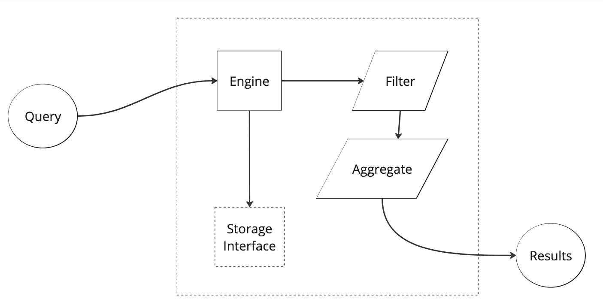
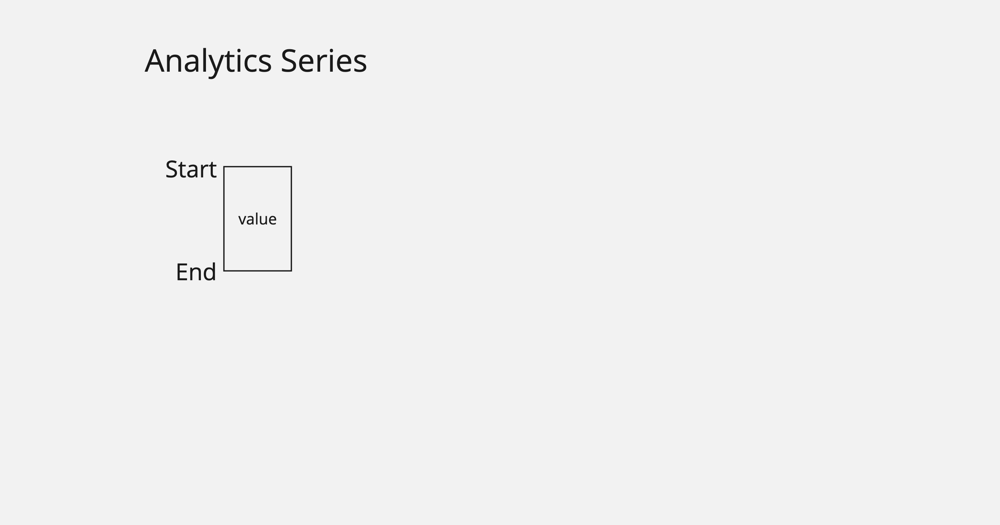
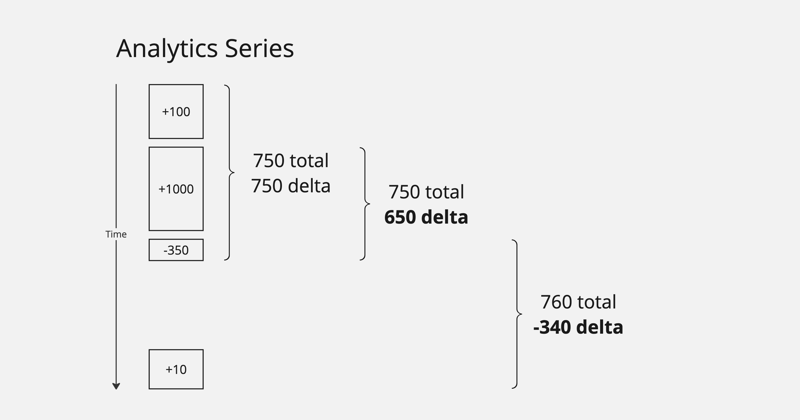
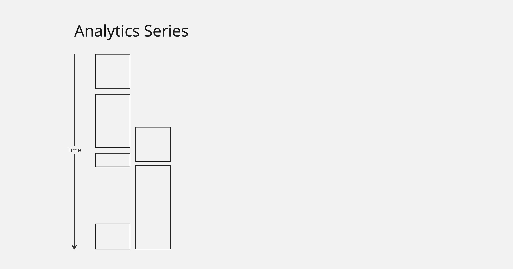
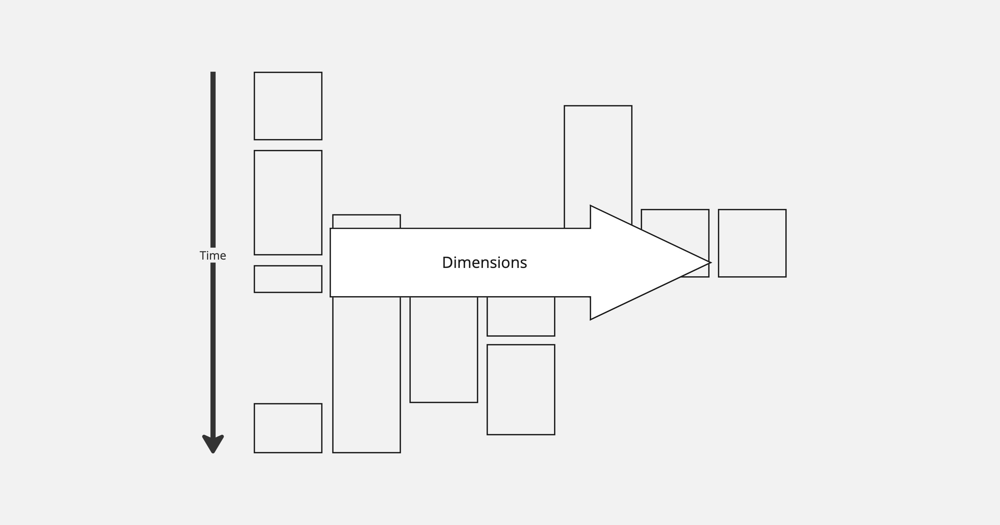
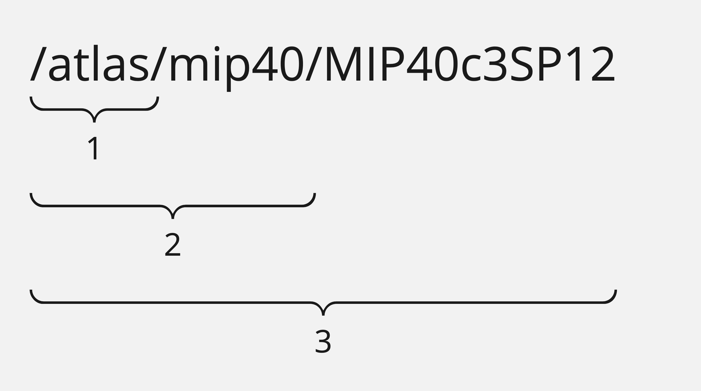

# Getting Started

## Introduction

Welcome to the Powerhouse Analytics Engine Documentation. This engine is a powerful time-series analytics system, written in Typescript with an optional GraphQL interface on top. It is designed to run _anywhere_. Browsers, server environments, CLI tools, etc.

This documentation serves as a guide for Typescript and GraphQL API usage, not library development. For documentation on how to build or contribute to this project, see our [README](https://github.com/powerhouse-inc/analytics-engine/blob/main/README.md).

## Overview

This system can be broken up into several major systems: **queries**, **engine components** (including filters and aggregation), and **storage**. Each of these systems have detailed documentation, but it is most helpful to start with a holistic understanding of the major pieces of data: series and dimensions.

### Series and Dimensions

All metrics are collected and stored using only two objects: **AnalyticsSeries** and **AnalyticsDimension**. To be a successful consumer of this system, It is vital to understand the intent of these two pieces of data.

Typical time-series databases (like [Graphite](https://graphiteapp.org/)) usually store data as `(time, value)` tuples: relating an explicit value to an explicit time. In the Web3 space, we have learned through [real uses cases with MakerDAO](https://fusion.sky.money/), that this isn't quite flexible enough for Web3 constructs.

Instead, the time series values in this system are given by a value paired with a _time interval_. That is, values have a start and an end. This allows for interpolation functions across a time interval, like a linear change.

Of course, the default is simply a constant function, giving a constant value inside of the time interval.

This means that when we want to query data, we are querying over intervals and can query for either "running totals" or changes (deltas) over an interval.

In the example above, querying over different intervals returns different totals and deltas depending on interval. This is another difference with typical time-series databases: deltas as first class. The analytics system takes care of this aggregation for users.

In real use cases, we generally have many data sets running in parallel. In this example, we have two related systems, both inserting data. Some of the intervals overlap, some don't, and we see some gaps in the data as well.

The question is: how do we query and aggregate this related data? We could potentially make multiple queries and do this ourselves, but it would require a good understanding of the implementation details.

This is where the **AnalyticsDimension** object comes into play.

While there will be thousands or millions of series objects, there will be far fewer referenced dimension objects. Dimensions allow users to decorate series objects with query and aggregation information. These objects are shared across all the series records.

Visually, you can think of series as values running up and down, while dimensions allow for query and aggregation _across_ the different series objects.

### Structure v Reporting

The Series and Dimensions objects give control over how metric data is defined and related. That is, they define the **structure** of data. Three new concepts: Paths, LODs, and granularity, are parameters used to define how the system should _report_ the data.

### Paths

Let's start with paths. A `path` is a field on an `AnalyticsDimension` that describes the _specificity of the query_.

In this example, inspired by real MakerDAO metrics, we have a number of series values that have been decorated with a couple of dimensions. Dimensions, as we have discussed, have a name like "budget". They also have this `path` field, which looks like a URI or directory hierarchy: a string made up of smaller strings separated by `/`s.

Note that, some series values have been decorated with multiple dimensions, some with a single dimension, and some have not been decorated with either.

It's clear enough that when we request budget data for a specific MIP dimension, like the purple one (`/atlas/mip40/MIP40c3SP61`), we should be getting totals and deltas across only the purple series objects.

But what if we want to query across everything related to `mip40`?

This is the beauty of dimension paths. All we need to do is use a `path` to describe the _specificity_ of the query. In this case, we use `/atlas/mip40`, which will match all dimensions that start with `/atlas/mip40`, which in turn matches all series values related to to those dimensions.

### LODs

`LOD` is short for "level of detail", and it is not a field found on either the series or dimension objects. It is a parameter used in queries only, to determine how results are aggregated across dimensions.

Let's look at our example again.

Here we have asked for a report on the `budget` metric, with path `/atlast/mip40`. The path determines the specificity of the query, and LOD determines how to aggregate results.

An LOD of `0` will group all results together in a single value. An LOD of `1` will group results by the first part of the path, in this case: `/atlas`. And so on for an LOD of 2 or 3. This means that increasing the LOD will increase the number of values retieved as the system needs to aggregate with higher specificity.

An LOD greater than the number of parts of the path (in this case, 4 or more) will append a `/*` for each additional path part to the end of the grouped results but will provide the same results as the highest level of detail.

### Granularity

While LODs allow you to aggregate series data across dimensions, _granularity_ refers to how data is aggregated over time. It determines the time span each data point or record covers. Choosing the right granularity is crucial for meaningful analysis, as it affects the interpretation and insights that can be drawn from the data.

#### Available Options

The analytics engine supports various granularity options, each suitable for different types of analysis:

1. `total`: Provides a cumulative view of data over the entire time frame available in the dataset. Best used for overall summaries and long-term analysis.

2. `annual`: Aggregates data on a yearly basis. Ideal for year-over-year comparisons and annual trend analysis.

3. `semiAnnual` : Breaks down data into six-month periods. Useful for understanding bi-annual trends and patterns.

4. `quarterly`: Divides data into quarters, offering insights into seasonal trends or quarter-over-quarter performance.

5. `monthly` : Monthly granularity is useful for a more detailed view of trends and patterns, particularly useful for operational planning and monitoring.

6. `weekly` : Provides weekly data aggregation, which is helpful for short-term performance tracking and operational adjustments.
daily: Offers a day-to-day breakdown, ideal for detailed analysis of daily operations or events.

7. `hourly`: The most granular level, providing insights into hourly fluctuations. Useful in scenarios where short-term data spikes or dips are significant.

#### How Granularity Affects Query Results

- Data Volume: Higher granularity (like hourly or daily) results in a larger volume of data points, providing more detailed insights but potentially leading to more complex analysis. Lower granularity (like annual or total) simplifies the data into fewer, broader data points.

- Trend Analysis: Finer granularity helps in identifying short-term trends and anomalies, whereas coarser granularity is better for long-term trend analysis and strategic planning.
Performance Impact: Queries with finer granularity might be more resource-intensive and take longer to execute due to the larger number of data points processed.

- Contextual Relevance: The choice of granularity should match the context of the analysis. For instance, financial planning might prefer annual or quarterly granularity, while operational monitoring might require daily or hourly data.

- Comparative Analysis: Different granularity levels can be used for comparative analysis, such as comparing detailed daily data (through daily granularity) against broader monthly trends (using monthly granularity) to understand day-to-day variations within the context of a monthly overview.

In summary, the choice of granularity in your query significantly influences the scope, detail, and utility of the analytics results. It is important to align the granularity with the specific analytical objectives and the nature of the data being analyzed to ensure that the insights derived are both relevant and actionable.

## Cheatsheet

These are high-level definitions of major terms you will need to know.

* **AnalyticsSeries** - The individual metric values, comprised of `(value, start, end)`. There should be one of these for every change in value.

* **AnalyticsDimension** - Shared objects that decorate series objects with `name` and `path` information. Used to relate metrics to one another.

* **Path** - Composable, `/`-delimited string field on dimension that is used to _determine specificity_ during queries.

* **LOD** - A number that, when paired with `path`, determines how to aggregate values across dimensions.

* **Granularity** - Determines how to aggregate values over time, like "monthly" or "yearly".

## Next Steps

Next steps depend on use case.

* For developers looking to **input data**, or **query data with Typescript**, see the [Typescript](./typescript/) docs.
* For developers interested in **querying data with GraphQL**, see the [GraphQL](./graphql/) documentation. Data cannot be input through GraphQL.
* For developers interested in **contributing to this project**, see the developer documentation [on GitHub](https://github.com/powerhouse-inc/analytics-engine).
