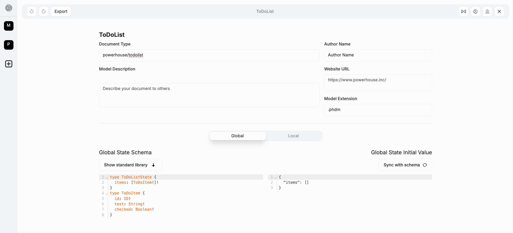
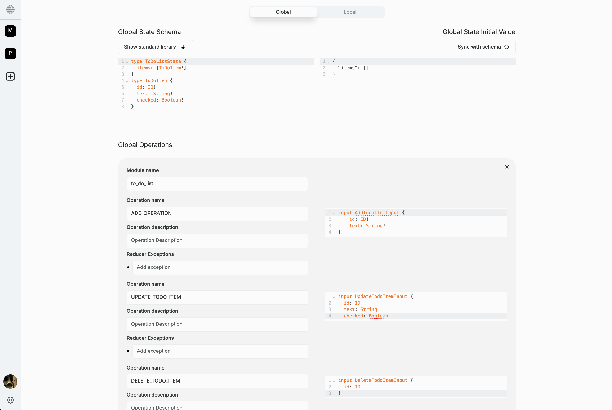

# The ToDoList Data Model

In this tutorial, you will learn how to design your document model and export it to be later used in your Powerhouse project.
If you don't have a document model created yet, have a look at the previous step of this tutorial to create a new document model.

Before you start, make sure you have the Connect application running with the command `ph connect`

## ToDoList Document Model Schema

Likely you have called your project 'ToDoList'. If not, please to make a new document and pay attention to the capitalisation as it influences our code. We'll continue with this project to teach you how to create a document model and later an editor for your model. We use the GraphQL Schema Definition Language (SDL) to define the document model schema. Below, you can see the SDL for the `ToDoList` document model.

:::info
This schema contains the **data structure** of the document model and the basic operations that can be performed on the document model.
Document models in Powerhouse leverage **event sourcing principles**, where every state transition is represented by an operation. GraphQL input types describe operations, ensuring that user intents are captured effectively. These operations detail the parameters needed for state transitions The use of GraphQL aligns these transitions with explicit, validated, and reproducible commands, supporting **CQRS** (Command Query Responsibility Segregation) patterns.
:::

## State Schema

```graphql
# The state of our todolist
type ToDoListState {
  items: [ToDoItem!]!
}

# A single to-do item
type ToDoItem {
  id: ID!
  text: String!
  checked: Boolean!
}
```

## Operations Schema

```graphql
# Defines a GraphQL input type for adding a new to-do item
input AddTodoItemInput {
  id: ID!
  text: String!
}

# Defines a GraphQL input type for updating a to-do item
input UpdateTodoItemInput {
  id: ID!
  text: String
  checked: Boolean
}

# Defines a GraphQL input type for deleting a to-do item
input DeleteTodoItemInput {
  id: ID!
}
```

## Define the Document Model

To be able to define the document model, you need to open the document model editor in Connect. 

The steps below show you how to do this:

1. In the Connect application, click on the **'document model'** editor to open the document model editor.
2. Call your document model 'ToDoList' and pay attention to capitalisation. 
3. You'll be welcomed with a form to fill, this is metadata about the document model, fill in the details in the fields. 

    In the `Document Type` field, type `powerhouse/todolist`. This defines the new type of document that will be created with this document model.
    
    

4. In the code editor, you can see the SDL for the document model. Replace the existing SDL with the SDL defined in the [State Schema](#state-schema) section. Only copy and paste the types, leaving the inputs for the next step. You can however already press 'Sync with schema' button to set the initial state of your document model based on your Schema Definition Language. 
5. Below the editor, there is an input field `Add module`. You need to create and name a module that the input operations will be added to. In this case, we will name the module `to_do_list`. Press enter.
6. Now there is a new field, called `Add operation`. Here you will have to add each input operation to the module, one by one.
7. Inside the `Add operation` field, type `ADD_TODO_ITEM` and press enter. A small editor will appear underneath it, with an empty input type that you have to fill. Copy the first input type from the [Operations Schema](#operations-schema) section and paste it in the editor. The editor should look like this:

    ```graphql
    input AddTodoItemInput {
        id: ID!
        text: String!
    }
    ```

7. Repeat step 6 for the other input operations. If you noticed, you only need to add the name `(UPDATE_TODO_ITEM, DELETE_TODO_ITEM)` of the operation without the `input` suffix. Then it will be generated once you press enter.
8. Once you have added all the input operations, click on the `Export` button, at the top right of the editor, to save the document model on your local machine. Ideally you already save your file in the root of your powerhouse project on your machine.

Check below screenshot for the complete implementation:


