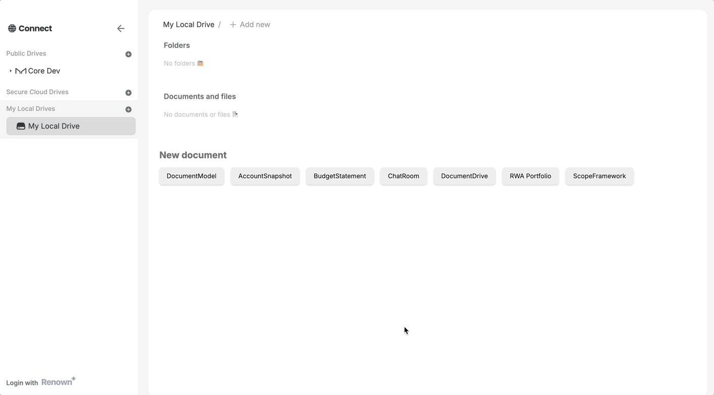

# Create New Powerhouse Project

## Create New Powerhouse Document Model Library Project

To create a new Powerhouse Document Model Library project, you can use the `pnpm create document-model-lib` command in your terminal. This command will create a new project in the current directory.

:::info
This command will create a new project in the current directory.
You can run the command in the terminal window of your OS or you open the newly installed VSCode and run the command in the terminal window of VSCode.
You will need VSCode later in the tutorial once you have generated the document model.
Make sure the terminal reflects the directory where you want to create the new project.
To open a directory in a terminal, you use the cd command to change your current directory. The cd command takes an argument, usually the name of the folder you want to move to, so the full command is 
```bash
cd your-directory
```
This essentially opens that folder and places you in it.
:::

Once you've navigated to the directory where you want to create the new project and in your terminal, run the following command:

```bash
pnpm create document-model-lib
```

In the terminal, you will be asked to enter the project name. Fill in the project name and press enter. Make sure to use the name `ChatRoom` as the project name with capital letter R so all of our tutorial code works.

```bash
you@yourmachine:~/Powerhouse$ ph create document-model-lib

> npx
> create-document-model-lib

? What is the project name? ‣ ChatRoom
```	

Once the project is created, you will see the following output:

```bash
 The installation is done!

 You can start by typing:
    cd ChatRoom
```

Navigate to the newly created project directory:

```bash
cd ChatRoom
```

Once you are in the project directory, now you can run the `ph connect` command to instantiate a local version of the Connect application to start building your document model.

Run the following command to start the Connect application:

```bash
ph connect
```

The Connect application will start and you will see the following output:

```bash
you@yourmachine:~/Powerhouse/chatroom$ ph run connect

> Chatroom@1.0.0 connect
> connect --config-file ./powerhouse.config.json

Watching local document models at '/home/you/Powerhouse/ChatRoom/document-models'...
Watching local document editors at '/home/you/Powerhouse/ChatRoom/editors'...
  ➜  Local:   http://localhost:3000/
  ➜  press h + enter to show help
```

A new browser window will open and you will see the Connect application. If it doesn't open automatically, you can open it manually by navigating to `http://localhost:3000/` in your browser.

Create a new document model by clicking on the `DocumentModel` button by the "New Document" section. The Gif below shows you where to click.



If you followed the steps correctly, you should have an empty document model created called `ChatRoom`.

In the next tutorial, you will learn how to design your document model and export it to be later used in your Powerhouse project.
