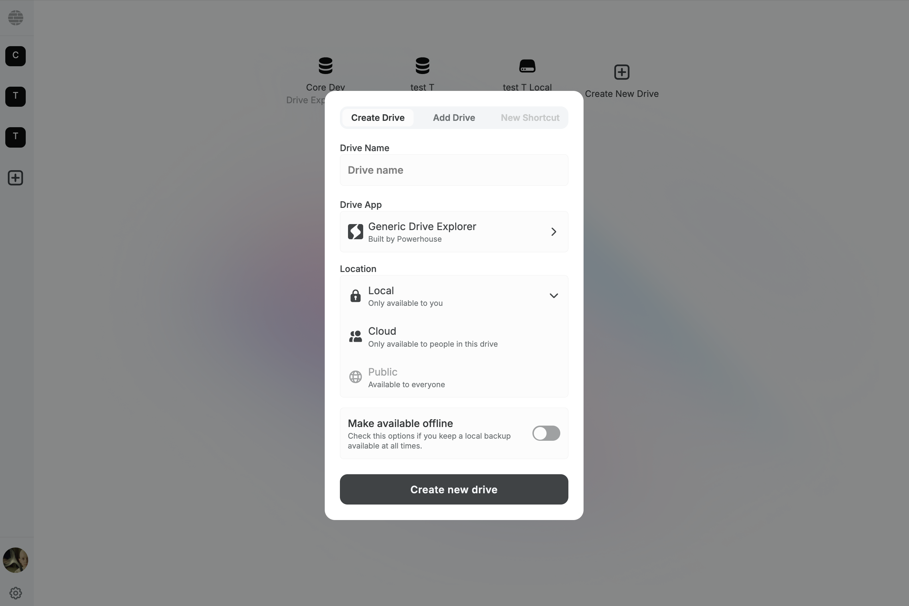

# Configuring Drives

A drive in Powerhouse is a container for documents and data. This guide will walk you through the process of configuring and managing drives in your Powerhouse environment.

## Prerequisites

Before configuring drives, ensure you have:
- Powerhouse CLI installed
- Access to a Powerhouse instance
- Appropriate permissions to create and manage drives

## Understanding Drives

### Local Drives

A local drive is a container for local documents and data, hosted on your local machine. Technically a drive is just another document with a list of the documents inside the drive. When you run connect locally with `ph connect` a local drive is automatically added. You can also create a new local drive by clicking 'add drive' in connect.

### Remote Drives vs. reactors 

Remote drives in Powerhouse allow you to connect to and work with data stored in external systems or cloud services. These drives act as bridges between Powerhouse contributors and/or other data sources, enabling seamless data synchronization. Drives can exist in 3 category locations.

- **Local Storage**: For offline or on-device access.
- **Cloud Storage**: For centralized, scalable data management.
- **Decentralized Storage**: Such as Ceramic or IPFS, enabling distributed and blockchain-based storage options.

:::info
**Powerhouse Reactors** are the nodes in the network that store and synchronise documents & drives , resolve conflicts and rerun operations to verify document event histories. 
Reactors can be configured for local storage, centralized cloud storage or on a decentralized storage network. 

A reactor allows you to store multiple documents, but also host **drives** & Drive Explorers with different organisational purposes, users, access rights and more.
:::

A drive exists by making use of a reactor and the storagelayer that specific reactor is based on. A reactor is the lower level component that makes synchronisation of documents & drives possible. 

### Drive Apps 

Drive Explorers (also known as Drive Apps) are specialized interfaces that enhance how users interact with document models within a drive. As mentioned previously, technically a drive is just another document, with a list of the documents inside the drive. So it is obvious that you can create a custom editor for your drive-document. These customized editors are called Drive explorers or Drive Apps. They provide custom views, organization tools, and interactive features tailored to specific use cases. For example, a Drive Explorer might present data as a Kanban board, provide aggregated insights, or offer specialized widgets for data processing. To learn more about building and customizing Drive Explorers, check out our [Building a Drive Explorer](/docs/academy/03-BuildingUserExperiences/02-BuildingADriveExplorer.md) guide.

## Creating a New Drive

To create a new drive in Powerhouse, follow these steps:
1. Click on the "Create New Drive" button in the Connect interface or in the Connect sidebar on the (+) Icon. 
2. In the modal that appears, enter a name for your drive in the "Drive Name" field.
3. Select the desired Drive App (such as the Generic Drive Explorer, or any other Drive App you've installed).
4. Choose the location for your drive: Local (only available to you), Cloud (available to people in this drive), or Public (available to everyone).
5. (Optional) Enable the "Make available offline" toggle if you want to keep a local backup of your drive.
6. Once all options are set, click the "Create new drive" button to finalize and create your drive.

