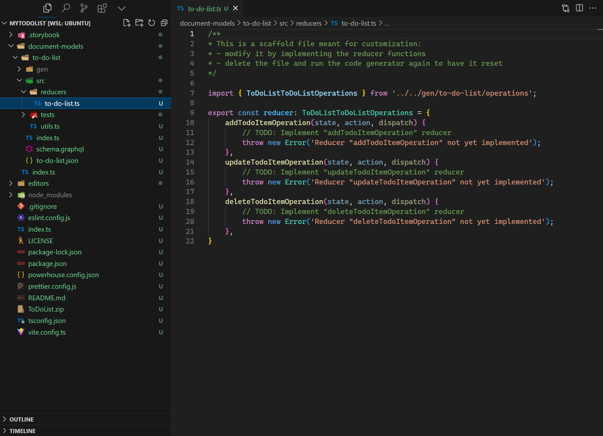

# Implement Operation Reducers

In this section, we will implement and test the operation reducers for the `ToDoList` document model. In order to do this, you have to export the document model from the Connect application and import it into your powerhouse project directory. 

To export the document model, follow the steps in the `Define ToDoList Document Model` section.

## Import Document Model and Generate Code

To import the document model into your powerhouse project, you can either:
 
- Copy&Paste the file directly into the root of your powerhouse project.
- Or drag&drop the file into the powerhouse project directory in the VSCode editor as seen in the image below:

Either step will import the document model into your powerhouse project.


The next steps will take place in the VSCode editor. Make sure to have it open and the terminal window inside vscode open as well. 


To write the opearation reducers of the `ToDoList` document model, you need to generate the document model code from the document model file you have exported into the powerhouse project directory.

To do this, run the following command in the terminal:

```bash
npm run generate ToDoList.zip
```

Now you can navigate to `/document-models/to-do-list/src/reducers/to-do-list.ts` and start writing the operation reducers.

Open the `to-do-list.ts` file and you should see the code that needs to be filled for the three operations you have defined earlier. Image below shows the code that needs to be filled:



## Write the Operation Reducers

1. Copy&paste the code below into the `to-do-list.ts` file in the `reducers` folder.
2. Save the file.


```typescript
/**
* This is a scaffold file meant for customization: 
* - modify it by implementing the reducer functions
* - delete the file and run the code generator again to have it reset
*/

import { ToDoListToDoListOperations } from '../../gen/to-do-list/operations';

export const reducer: ToDoListToDoListOperations = {
    addTodoItemOperation(state, action, dispatch) {
        state.stats.total += 1;
        state.stats.unchecked += 1;
        state.items.push({
            id: action.input.id,
            text: action.input.text,
            checked: false,
        });
    },
    updateTodoItemOperation(state, action, dispatch) {
        const item = state.items.find(item => item.id === action.input.id);
        if (!item) {
            throw new Error(`Item with id ${action.input.id} not found`);
        }
        if (action.input.text) {
            item.text = action.input.text;
        }
        if (action.input.checked) {
            state.stats.unchecked -= 1;
            state.stats.checked += 1;
            item.checked = action.input.checked;
        }
        if (action.input.checked === false) {
            state.stats.unchecked += 1;
            state.stats.checked -= 1;
            item.checked = action.input.checked;
        }
    },
    deleteTodoItemOperation(state, action, dispatch) {
        const item = state.items.find(item => item.id === action.input.id);
        state.stats.total -= 1;
        if (item?.checked) {
            state.stats.checked -= 1;
        }
        if (item?.checked === false) {
            state.stats.unchecked -= 1;
        }
        state.items = state.items.filter(item => item.id !== action.input.id);
    },
}
	