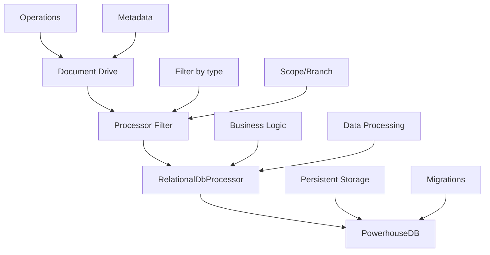

# Relational Db Processor Technical Specification

## Goals

The relational database processor system aims to provide a standardized, type-safe, and maintainable approach for processing document operations in Powerhouse projects that require persistent database storage. The system addresses current limitations in code generation templates and establishes consistent patterns for processor development across the ecosystem.

**Primary Goals:**

- Provide a unified interface for relational database processors with database integration
- Enable type-safe database operations using PowerhouseDB
- Standardize migration management at the project level
- Simplify processor development by abstracting common database operations
- Ensure consistent error handling and resource management
- Support seamless integration with the Powerhouse document drive system

**Supporting Goals:**

- Reduce boilerplate code in processor implementations
- Enable automatic database schema generation and migration
- Provide clear separation between infrastructure and business logic
- Support multiple processors sharing database tables within a project
- Enable easy testing and debugging of processor logic

## Usage Overview

Developers interact with the relational database processor system through a standardized factory pattern and base class abstraction. When creating a new relational database processor, developers:

1. **Generate the processor structure** using the CLI command:

   ```bash
   ph generate processor search-indexer --processor-type relationalDb --document-types "sky/atlas-scope,sky/atlas-foundation"
   ```

2. **Extend the base class** to focus on business logic rather than database setup:

   ```typescript
   export class SearchIndexerProcessor extends RelationalDbProcessor<Database> {
     async onStrands<TDocument extends PHDocument>(
       strands: InternalTransmitterUpdate<TDocument>[],
     ): Promise<void> {
       const db = await this.getDb();
       // Focus on business logic, not database initialization
     }
   }
   ```

3. **Define database schema** through migrations that are automatically managed by the base class

4. **Register processors** through the factory pattern that handles filtering and lifecycle management

The system solves the problem of inconsistent processor implementations, manual database setup, and lack of type safety that currently exists in the codebase. Developers can expect automatic migration management, type-safe database operations, and consistent error handling across all relational database processors.

## Data

The relational database processor system manages several types of data:

### Input Data

- **Document Operations**: Streams of document operations from the Powerhouse document drive system
- **Document Metadata**: Document IDs, types, branches, and scopes for filtering
- **Operation Payloads**: State changes and operation types that need processing

### Persistent Data

- **Processor-specific tables**: Custom tables defined by each processor for storing processed data
- **Migration metadata**: PowerhouseDB migration tracking for schema versioning
- **Health check data**: Operational status and performance metrics

### Data Flow



### Data Transformations

- **Operation Extraction**: Raw operations are transformed into processor-specific data structures
- **Content Indexing**: Document state is processed into searchable content (for search processors)
- **Aggregation**: Multiple operations are aggregated into summary data (for analytics processors)
- **Normalization**: Data is normalized for consistent storage and querying

## Interfaces and Abstractions

### Core Interfaces

#### IProcessor Interface

```typescript
interface IProcessor {
  onStrands<TDocument extends PHDocument>(
    strands: InternalTransmitterUpdate<TDocument>[],
  ): Promise<void>;
  onDisconnect(): Promise<void>;
}
```

This interface provides the contract for all processors, ensuring consistent lifecycle management.

#### RelationalDbProcessor Class

```typescript
abstract class RelationalDbProcessor<TDatabase = any> implements IProcessor {

  constructor(
    protected _namespace: string,
    protected _filter: RelationalDbProcessorFilter,
    protected relationalDb: IRelationalDb<TDatabaseSchema>,
  );
  protected async getDb(): Promise<PowerhouseDB<TDatabase>>;
  protected async healthCheck(tableName: string): Promise<boolean>;
}
```

This base class abstracts database initialization, migration management, and resource cleanup, allowing derived classes to focus on business logic.

### Processor Factory Pattern

```typescript
type ProcessorFactory = (driveId: string) => ProcessorRecord[];

type ProcessorRecord = {
  processor: IProcessor;
  filter: ListenerFilter;
};
```

The factory pattern enables dynamic processor creation with configurable filtering and lifecycle management.

### Database Abstractions

#### PowerhouseDB Type Alias

```typescript
// packages/document-drive/src/processors/types.ts
import { type Kysely } from "kysely";

/**
 * PowerhouseDB is the standardized database interface for relational database processors.
 * This abstraction provides type-safe database operations while hiding the underlying
 * database framework implementation details.
 */
export type PowerhouseDB<TDatabase = any> = Kysely<TDatabase>;
```

#### Database Schema Interface

```typescript
interface Database {
  search_index: {
    id: string;
    document_id: string;
    content: string;
    created_at: Date;
  };
  // ... other processor-specific tables
}
```

Type-safe database operations through PowerhouseDB's query builder, with generated types ensuring compile-time safety.

#### Migration Management

```typescript
// migrations/001-initial-schema.ts
export async function up(db: PowerhouseDB<any>): Promise<void>;
export async function down(db: PowerhouseDB<any>): Promise<void>;
```

Project-level migrations that are automatically discovered and applied by the base class.

### Abstraction Benefits

- **Complexity Hiding**: Database setup, migration management, and connection handling are abstracted away
- **Framework Independence**: The underlying database framework is hidden behind the PowerhouseDB abstraction
- **Simplification**: Developers focus on business logic rather than infrastructure concerns
- **Consistency**: All processors follow the same patterns for error handling and resource management
- **Testability**: Clear separation of concerns enables easier unit testing of business logic

## Network Messages

The relational database processor system primarily operates on internal document drive messages rather than external network communication. However, the following message patterns are relevant:

### Document Drive Messages

- **InternalTransmitterUpdate**: Contains document operations and metadata
  - Size: Variable (depends on operation payload)
  - Frequency: High (real-time document updates)
  - Purpose: Trigger processor execution

### Health Check Messages

- **Database Connectivity**: Periodic health checks to relational database
  - Size: Small (< 1KB)
  - Frequency: Low (every 30 seconds)
  - Purpose: Monitor processor health

### Migration Messages

- **Schema Updates**: Database schema changes during startup
  - Size: Variable (depends on schema complexity)
  - Frequency: Low (only during deployment/startup)
  - Purpose: Ensure database schema is current

## Performance Considerations

### Memory Hotspots

- **Document Operation Buffering**: Large batches of operations may consume significant memory
  - **Mitigation**: Process operations in smaller batches with configurable batch sizes
  - **Monitoring**: Track memory usage per processor instance

- **Database Connection Pooling**: Multiple processors sharing database connections
  - **Mitigation**: Implement connection pooling in the base class
  - **Monitoring**: Track connection pool utilization

### CPU Hotspots

- **Operation Processing**: Complex business logic in processor implementations
  - **Mitigation**: Implement async processing with configurable concurrency limits
  - **Monitoring**: Track processing time per operation type

- **Migration Execution**: Database schema updates during startup
  - **Mitigation**: Run migrations asynchronously during initialization
  - **Monitoring**: Track migration execution time

### Database Performance

- **Query Optimization**: Complex queries in processor business logic
  - **Mitigation**: Use PowerhouseDB's query builder for optimized SQL generation
  - **Monitoring**: Track query execution time and plan analysis

### Benchmarks Required

- **Operation Throughput**: Operations processed per second per processor
- **Memory Usage**: Peak memory consumption during high-load scenarios
- **Database Latency**: Average query execution time for common operations
- **Migration Performance**: Time to apply migrations for large schema changes

## Security

### Worst Case Scenarios

#### Compromised Processor Instance

**Risk**: A compromised processor could:

- Access sensitive document data from the relational database
- Modify database schema through migration injection
- Exfiltrate data through malicious business logic
- Impact other processors sharing the same database

**Mitigation**:

- **Database Isolation**: Each project uses separate database instances
- **Migration Validation**: Migrations are validated and signed before execution
- **Input Sanitization**: All document operations are validated before processing
- **Audit Logging**: All database operations are logged for security monitoring

#### Database Access Compromise

**Risk**: Unauthorized access to the relational database could:

- Expose all processed document data
- Modify processor-generated data
- Disrupt processor operations

**Mitigation**:

- **Connection Encryption**: All database connections use TLS encryption
- **Access Control**: Database access is restricted to processor instances only
- **Data Encryption**: Sensitive data is encrypted at rest
- **Backup Security**: Database backups are encrypted and access-controlled

### Data Protection

- **Document Data**: Processed document content may contain sensitive information
- **User Data**: User activity and preferences stored by processors
- **System Data**: Migration metadata and processor configuration

### Security Measures

- **Principle of Least Privilege**: Processors only access required database tables
- **Input Validation**: All document operations are validated before processing
- **Output Sanitization**: Processed data is sanitized before storage
- **Audit Trails**: Complete audit logging of all processor operations

## Testing

### Testing Strategy

#### Unit Testing

- **Processor Logic**: Test business logic in isolation using mocked database
- **Base Class**: Test database initialization and migration management
- **Factory Pattern**: Test processor creation and filtering logic

#### Integration Testing

- **Database Integration**: Test processor with real database using test containers
- **Migration Testing**: Test migration up/down cycles with sample data
- **Document Drive Integration**: Test processor with real document operations

#### End-to-End Testing

- **Full Workflow**: Test complete document processing pipeline
- **Performance Testing**: Load testing with realistic document operation volumes
- **Error Recovery**: Test processor recovery from various failure scenarios

### Testing Environment

- **Development**: Local database with sample data
- **Staging**: Isolated environment with production-like data volumes
- **Production**: Canary deployments with gradual rollout

### Testing Tools

- **Vitest**: Unit and integration testing framework
- **Test Containers**: Database testing with isolated containers
- **Performance Benchmarks**: Custom benchmarking suite for throughput testing

### Quality Assurance

- **Automated Testing**: CI/CD pipeline with comprehensive test coverage
- **Manual Testing**: QA team validation of processor behavior
- **Performance Monitoring**: Continuous monitoring of processor performance metrics

## Rollout

### Target Audience

- **Powerhouse Developers**: Teams building document-driven applications
- **Third-party Developers**: External developers using Powerhouse ecosystem
- **System Integrators**: Teams integrating Powerhouse with existing systems

### Release Strategy

#### Phase 1: Internal Adoption

1. **Base Class Implementation**: Deploy `RelationalDbProcessor` to `document-drive` package
2. **Template Updates**: Update codegen templates to use new base class
3. **Migration Tools**: Deploy migration management utilities
4. **Documentation**: Complete developer documentation and examples

#### Phase 2: Ecosystem Rollout

1. **Package Updates**: Update all Powerhouse packages to use new processor pattern
2. **Migration Support**: Provide migration tools for existing processors
3. **Training**: Developer training sessions and workshops
4. **Community Support**: Establish community channels for support

#### Phase 3: External Release

1. **Public Documentation**: Release comprehensive public documentation
2. **Example Projects**: Create example projects demonstrating best practices
3. **CLI Tools**: Release CLI tools for processor generation and management
4. **Community Feedback**: Gather feedback and iterate on implementation

### Consumption Methods

- **NPM Packages**: Install `document-drive` for base classes
- **CLI Tools**: Use `ph generate processor` for processor generation
- **Templates**: Use provided templates for consistent implementation
- **Documentation**: Follow comprehensive guides and examples

### Migration Path

- **Existing Processors**: Gradual migration with backward compatibility
- **New Projects**: Direct adoption of new patterns
- **Legacy Support**: Maintain support for existing processor implementations

## Unknowns

1. **Performance Scaling**: How will the system perform with thousands of concurrent processors?
2. **Migration Complexity**: How to handle complex schema migrations across multiple processors?
3. **Database Sharding**: Will single-database-per-project scale for large deployments?
4. **Cross-Processor Dependencies**: How to handle processors that depend on data from other processors?
5. **Real-time Requirements**: What are the latency requirements for real-time document processing?
6. **Backup and Recovery**: How to handle backup and recovery for processor-generated data?
7. **Monitoring Integration**: How to integrate with existing monitoring and alerting systems?
8. **Multi-tenancy**: How to support multi-tenant deployments with data isolation?
