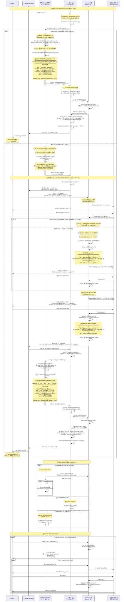

# Renown Authentication Flow v2 - DID-Based Authorization

## Overview

Version 2 of the Renown authentication flow introduces a **pure DID-based architecture** that eliminates the need for Verifiable Credentials (VCs) and Verifiable Presentations (VPs). Instead, it leverages DID documents as the single source of truth for authorization.

## Flow Diagram



## Key Concepts

### User DID: `did:renown:<phid>`
- **Format**: `did:renown:<phid>` where `<phid>` is derived from the user's Ethereum address
- **Purpose**: Represents the user's persistent identity across all Renown applications
- **Controller**: The user's Ethereum address (via `did:pkh:eip155:1:0x...`)
- **Storage**: DID document stored in Powerhouse Drive

### Device DID: `did:key:<deviceKey>`
- **Format**: `did:key:zDevice...` (Ed25519 key pair)
- **Purpose**: Represents a specific browser, mobile app, or desktop application
- **Lifecycle**: Created locally by the SDK, authorized by the user, can be revoked
- **Storage**: Private key stored securely in device-specific storage (IndexedDB, Secure Enclave, OS Keychain)

### DID Document Structure

```json
{
  "id": "did:renown:<phid>",
  "controller": ["did:pkh:eip155:1:0x1AD3d7..."],
  "authentication": [
    {
      "id": "did:renown:<phid>#eth-key-1",
      "type": "EcdsaSecp256k1RecoveryMethod2020",
      "controller": "did:renown:<phid>",
      "blockchainAccountId": "eip155:1:0x1AD3d7..."
    },
    {
      "id": "did:renown:<phid>#device-key-1",
      "type": "Ed25519VerificationKey2020",
      "controller": "did:renown:<phid>",
      "publicKeyMultibase": "zDevice...",
      "expiresAt": "2025-11-22T00:00:00Z"
    }
  ],
  "assertionMethod": [...],
  "capabilityDelegation": [...]
}
```

## Authentication Flow

### Fast Path (Returning Users) ⚡

When a user has already authorized a device DID:

1. **Challenge Generation**
   - Relying Party (e.g., vetra.io) generates a random nonce
   - Sends challenge to SDK

2. **Challenge Signing**
   - SDK retrieves device DID private key from secure storage
   - Creates signed JWT:
     ```json
     {
       "iss": "did:key:zDevice...",
       "sub": "did:renown:<phid>",
       "aud": "did:web:vetra.io",
       "nonce": "random-nonce-xyz",
       "iat": 1761028500,
       "exp": 1761029100
     }
     ```
   - Signs with device DID private key

3. **Verification**
   - RP receives signed response
   - Fetches DID document from renown.id
   - Verifies device DID is in `authentication` array
   - Verifies signature using device public key
   - Checks expiration and revocation status
   - Creates session for `did:renown:<phid>`

**Result**: Login completes in ~500ms with no user interaction

### Initial Setup (First-Time Users) 🆕

When a user connects for the first time or from a new device:

#### Step 1: Device DID Creation (Client-Side)
```javascript
// SDK generates device DID locally
const deviceKeypair = await generateEd25519Keypair();
const deviceDID = `did:key:${encodeMultibase(deviceKeypair.publicKey)}`;

// Store private key securely
await secureStorage.set('device-did-key', deviceKeypair.privateKey);
```

#### Step 2: Redirect to Renown.id
```
https://renown.id/authorize?
  deviceDid=did:key:zDevice...
  &challenge=random-nonce-xyz
  &redirectUri=https://vetra.io/callback
```

#### Step 3: User DID Creation or Lookup
- User connects MetaMask wallet
- If first time: Create `did:renown:<phid>` from ETH address
  - Generate `<phid>` from address hash
  - Create DID document with ETH address in `authentication`
  - Store in Powerhouse Drive
- If returning: Retrieve existing `did:renown:<phid>`

#### Step 4: Device Authorization
- User signs message: "Authorize device did:key:zDevice... to act on behalf of did:renown:<phid>"
- Signature proves wallet ownership
- Renown.id adds device DID to DID document's `authentication` array
- DID document updated and stored

#### Step 5: Authentication Response
- SDK receives confirmation
- Caches device DID → user DID mapping
- Signs challenge with device DID
- Sends to RP for verification
- Session created for `did:renown:<phid>`

## Security Model

### No VCs/VPs Required

Traditional flow (v1):
```
User → Get VC from Issuer → Wrap in VP → Present to Verifier
```

New flow (v2):
```
User → Authorize Device DID → Sign Challenge → Verifier checks DID document
```

**Benefits**:
- Simpler architecture
- Fewer moving parts = fewer attack vectors
- DID document is the single source of truth
- Direct cryptographic proof via signatures

### Device Authorization Model

1. **Ethereum Address** (Controller)
   - Ultimate authority over `did:renown:<phid>`
   - Can add/revoke device DIDs
   - Required for high-privilege operations

2. **Device DIDs** (Delegated Authority)
   - Limited scope: authentication only
   - Time-bound (expiration dates)
   - Can be revoked at any time
   - Device-specific (browser/mobile/desktop)

### Threat Model

| Attack Vector | Mitigation |
|--------------|------------|
| Device compromise | Revoke device DID, others unaffected |
| Replay attacks | Nonce + short expiration (10 min) |
| Man-in-the-middle | HTTPS + signature verification |
| DID document tampering | Stored in Powerhouse Drive, integrity verified |
| Wallet compromise | User must revoke all device DIDs |

## Device Management

### Viewing Authorized Devices
```javascript
// Fetch DID document
const didDoc = await fetch(`https://renown.id/did/${phid}`);

// List all device DIDs
const devices = didDoc.authentication.filter(
  auth => auth.type === 'Ed25519VerificationKey2020'
);

// Display to user
devices.forEach(device => {
  console.log({
    id: device.id,
    publicKey: device.publicKeyMultibase,
    expiresAt: device.expiresAt,
    deviceType: inferDeviceType(device.id) // Browser, Mobile, etc.
  });
});
```

### Revoking a Device
```javascript
// User signs revocation message
const signature = await wallet.signMessage(
  `Revoke device ${deviceId} from did:renown:<phid>`
);

// Update DID document
await renown.revokeDevice(phid, deviceId, signature);

// Device can no longer authenticate
```

### Device Naming (Optional Enhancement)
```json
{
  "id": "did:renown:<phid>#device-key-1",
  "type": "Ed25519VerificationKey2020",
  "controller": "did:renown:<phid>",
  "publicKeyMultibase": "zDevice...",
  "expiresAt": "2025-11-22T00:00:00Z",
  "name": "MacBook Pro - Chrome", // Optional user-friendly name
  "lastUsed": "2025-10-22T14:30:00Z"
}
```

## Implementation Guide

### SDK Implementation

```typescript
class RenownSDK {
  private deviceDID?: string;
  private deviceKeyPair?: CryptoKeyPair;
  private userDID?: string;

  // Initialize device DID
  async initializeDevice() {
    const cached = await this.storage.get('device-did');
    if (cached) {
      this.deviceDID = cached.did;
      this.deviceKeyPair = cached.keyPair;
      this.userDID = cached.userDID;
      return;
    }

    // Generate new device DID
    this.deviceKeyPair = await crypto.subtle.generateKey(
      { name: 'Ed25519', namedCurve: 'Ed25519' },
      true,
      ['sign', 'verify']
    );

    const publicKeyBytes = await crypto.subtle.exportKey(
      'raw',
      this.deviceKeyPair.publicKey
    );

    this.deviceDID = `did:key:${encodeMultibase(publicKeyBytes)}`;
  }

  // Authenticate to RP
  async authenticate(challenge: string, rpDID: string) {
    if (!this.deviceDID || !this.userDID) {
      // Need authorization - redirect to renown.id
      return this.redirectToAuthorize(challenge);
    }

    // Sign challenge
    const response = await this.signChallenge(challenge, rpDID);
    return response;
  }

  private async signChallenge(nonce: string, audience: string) {
    const payload = {
      iss: this.deviceDID,
      sub: this.userDID,
      aud: audience,
      nonce,
      iat: Math.floor(Date.now() / 1000),
      exp: Math.floor(Date.now() / 1000) + 600 // 10 min
    };

    const signature = await crypto.subtle.sign(
      'Ed25519',
      this.deviceKeyPair!.privateKey,
      new TextEncoder().encode(JSON.stringify(payload))
    );

    return createJWT(payload, signature);
  }

  private redirectToAuthorize(challenge: string) {
    const params = new URLSearchParams({
      deviceDid: this.deviceDID!,
      challenge,
      redirectUri: window.location.href
    });

    window.location.href = `https://renown.id/authorize?${params}`;
  }
}
```

### Verifier (RP) Implementation

```typescript
class RenownVerifier {
  async verifyAuthentication(signedResponse: string) {
    // 1. Parse JWT
    const jwt = parseJWT(signedResponse);
    const { iss: deviceDID, sub: userDID, nonce, aud } = jwt.payload;

    // 2. Verify audience
    if (aud !== this.rpDID) {
      throw new Error('Invalid audience');
    }

    // 3. Verify nonce
    if (!this.verifyNonce(nonce)) {
      throw new Error('Invalid or expired nonce');
    }

    // 4. Fetch DID document
    const didDoc = await this.fetchDIDDocument(userDID);

    // 5. Verify device DID is authorized
    const deviceAuth = didDoc.authentication.find(
      auth => auth.publicKeyMultibase === extractKey(deviceDID)
    );

    if (!deviceAuth) {
      throw new Error('Device not authorized');
    }

    // 6. Check expiration
    if (deviceAuth.expiresAt && new Date(deviceAuth.expiresAt) < new Date()) {
      throw new Error('Device authorization expired');
    }

    // 7. Verify signature
    const publicKey = decodeMultibase(deviceAuth.publicKeyMultibase);
    const isValid = await crypto.subtle.verify(
      'Ed25519',
      publicKey,
      jwt.signature,
      new TextEncoder().encode(jwt.signedData)
    );

    if (!isValid) {
      throw new Error('Invalid signature');
    }

    // 8. Create session
    return {
      userDID,
      deviceDID,
      authenticated: true
    };
  }

  private async fetchDIDDocument(did: string) {
    const phid = did.replace('did:renown:', '');
    const response = await fetch(`https://renown.id/did/${phid}`);
    return response.json();
  }
}
```

## Performance Optimizations

### DID Document Caching
```typescript
// Cache DID documents for 5 minutes
const didCache = new Map<string, { doc: DIDDocument, timestamp: number }>();

async function fetchDIDDocument(did: string) {
  const cached = didCache.get(did);
  const now = Date.now();

  if (cached && now - cached.timestamp < 5 * 60 * 1000) {
    return cached.doc;
  }

  const doc = await fetch(`https://renown.id/did/${did}`).then(r => r.json());
  didCache.set(did, { doc, timestamp: now });

  return doc;
}
```

### Background Authorization Checks
```typescript
// Periodically verify device is still authorized
setInterval(async () => {
  const didDoc = await fetchDIDDocument(sdk.userDID);
  const stillAuthorized = didDoc.authentication.some(
    auth => auth.publicKeyMultibase === extractKey(sdk.deviceDID)
  );

  if (!stillAuthorized) {
    // Device was revoked - clear local state
    await sdk.clearAuthorization();
    window.location.href = '/login';
  }
}, 5 * 60 * 1000); // Every 5 minutes
```

## Migration from v1

### Key Differences

| Aspect | v1 (VC/VP) | v2 (Pure DID) |
|--------|-----------|---------------|
| Credential | VC JWT issued by renown.id | No credential needed |
| Presentation | VP JWT with wrapped VC | Direct challenge signing |
| Verification | Verify VP + VC signatures | Verify signature + check DID doc |
| Revocation | Check revocation endpoint | Check DID document |
| Device auth | Implicit (one VC) | Explicit (device DIDs) |
| Caching | Cache VC JWT | Cache device DID authorization |

### Migration Path

1. **Phase 1**: Run v1 and v2 in parallel
   - Support both VC/VP and pure DID flows
   - Gradually onboard users to v2

2. **Phase 2**: Automatic device DID creation
   - When v1 VC is presented, create device DID
   - Add to DID document automatically

3. **Phase 3**: Deprecate v1
   - Remove VC/VP code paths
   - Pure DID only

## Benefits of v2

### Simplicity
- ✅ No VC issuance ceremony
- ✅ No VP wrapping logic
- ✅ Direct signature verification
- ✅ Single source of truth (DID document)

### Security
- ✅ Fine-grained device control
- ✅ Easy revocation
- ✅ Clear authorization model
- ✅ Time-bound delegations

### User Experience
- ✅ One-time authorization per device
- ✅ Instant logins after setup
- ✅ Device management UI
- ✅ Cross-device identity

### Privacy
- ✅ Device DIDs don't reveal user identity
- ✅ Verifiers can't correlate across services (unless user DID is shared)
- ✅ Selective disclosure of device info

## Future Enhancements

### 1. Biometric Device Binding
```json
{
  "id": "did:renown:<phid>#device-key-1",
  "type": "Ed25519VerificationKey2020",
  "publicKeyMultibase": "zDevice...",
  "biometricRequired": true // Require Face ID/Touch ID to use
}
```

### 2. Device Capabilities
```json
{
  "id": "did:renown:<phid>#device-key-1",
  "type": "Ed25519VerificationKey2020",
  "publicKeyMultibase": "zDevice...",
  "capabilities": ["read", "write:limited"] // Fine-grained permissions
}
```

### 3. Multi-Device Sync
- Secure sync of device DIDs across trusted devices
- QR code authorization flow for new devices

### 4. Hardware Security Modules (HSM)
- Store device keys in hardware security modules
- Enhanced protection for desktop applications

## Conclusion

Renown Authentication v2 represents a significant simplification of the authentication architecture by embracing pure DID-based authorization. By eliminating VCs and VPs, we've created a more maintainable, secure, and user-friendly system that leverages the full power of Decentralized Identifiers.

The DID document serves as the authoritative registry of authentication methods, making device management transparent and revocation immediate. Users maintain full control over their identity while enjoying the convenience of fast, seamless authentication across all their devices.
