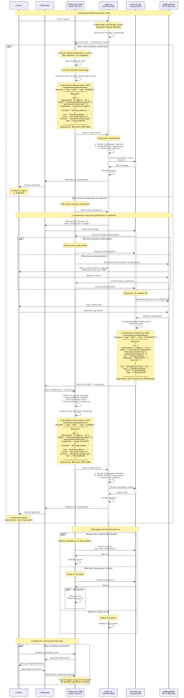

# Renown Authentication Flow - Summary

## Overview

The Renown authentication system is a decentralized identity solution built on W3C Verifiable Credentials (VC) and Verifiable Presentations (VP) standards. It provides secure, privacy-preserving authentication with credential caching for optimal performance and includes robust protection against replay attacks through challenge-response mechanisms.



## Core Architecture

### Participants

- **User** - End user authenticating to the application
- **Browser** - Client environment running the application
- **Renown SDK** - JavaScript library with credential caching and VP creation
- **vetra.io** - Verifier/Relying Party (the application requiring authentication)
- **renown.id** - Credential Issuer/Identity Provider
- **MetaMask** - Ethereum wallet for signing credentials

### Dual-DID System

**Ethereum DID** (`did:pkh:eip155:1:0x...`)
- Controlled by user's wallet (MetaMask)
- Issues verifiable credentials
- Represents blockchain identity

**Renown DID** (`did:key:zDnae...`)
- Generated by Renown SDK (client-side)
- Creates verifiable presentations
- Enables credential delegation and caching

---

## Authentication Flow

### Initial Request: Challenge Generation

Every authentication begins with **replay attack prevention**:

1. User clicks "Login" on vetra.io
2. **vetra.io generates a unique challenge nonce** (cryptographically random)
3. Challenge is sent to Renown SDK with authentication request
4. Challenge is preserved throughout the flow (in state for redirects)

**Purpose**: The challenge binds each VP to a specific authentication session, preventing attackers from reusing captured credentials.

---

## Path 1: Fast Path (Cached Credentials)

**Duration**: ~500ms

Used when the user has a valid cached credential from a previous authentication.

### Flow Steps

1. **Cache Check**
   - Renown SDK checks IndexedDB for cached credential
   - Validates: not expired, not revoked, properly formatted

2. **Create Presentation**
   - SDK retrieves cached VC JWT
   - Creates VP including the challenge nonce
   - Signs VP with SDK's private key (EdDSA)

3. **Verification**
   - vetra.io verifies challenge matches (prevents replay)
   - Verifies VP signature (Renown DID)
   - Verifies embedded VC signature (ETH wallet)
   - Checks credential not expired
   - Quick revocation check with renown.id

4. **Session Creation**
   - Session created and user redirected to dashboard
   - **Total time: ~500ms** ⚡

---

## Path 2: Full Flow (New Credentials)

**Duration**: ~3-5 seconds

Used for first-time users or when cached credential is invalid/expired.

### Flow Steps

1. **Cache Miss**
   - No valid cached credential found
   - SDK notifies vetra.io

2. **Redirect to Identity Provider**
   - vetra.io redirects to renown.id (challenge preserved in state)
   - Authentication interface loads

3. **Wallet Authorization**
   - **If previously authorized**: SDK reuses stored authorization
   - **If first time**: User approves MetaMask authorization request (one-time)

4. **Credential Creation**
   - renown.id requests signature from MetaMask
   - User approves credential signature
   - **MetaMask signs credential** with ETH private key (ES256K-R)
   - renown.id creates VC JWT and stores in Powerhouse Document Drive

5. **Credential Caching**
   - VC JWT returned to browser
   - SDK caches in IndexedDB (encrypted)
   - Expiration timer set
   - Revocation endpoint stored

6. **Create Presentation**
   - SDK creates VP with challenge nonce
   - Signs VP with SDK's private key (EdDSA)

7. **Verification & Session**
   - vetra.io verifies challenge matches (prevents replay)
   - Verifies VP and VC signatures
   - Checks credential not expired
   - Checks revocation status
   - Creates session and redirects to dashboard

---

## Security Features

### Challenge-Response Mechanism

**Every authentication uses a unique challenge:**

```
Challenge Generation (vetra.io)
    ↓
Challenge → SDK → VP Creation (challenge in nonce field)
    ↓
VP → vetra.io → Challenge Verification
    ↓
Match? → Continue | Mismatch? → Reject
```

**Security Properties:**
- **Unique**: Generated fresh for each authentication
- **Random**: Cryptographically unpredictable (32+ bytes)
- **Signed**: Included in VP payload under digital signature
- **Verified**: Checked before signature verification
- **Single-use**: Cleared after successful verification
- **Time-bound**: Tied to session lifetime

**Protection Against:**
- Replay attacks (captured VPs cannot be reused)
- Man-in-the-middle (challenge bound to specific session)
- Session hijacking (challenge tied to legitimate session)

### Credential Signatures

| Artifact | Signed By | Algorithm | Purpose |
|----------|-----------|-----------|---------|
| **Verifiable Credential (VC)** | ETH Wallet (MetaMask) | ES256K-R | Proves identity ownership |
| **Verifiable Presentation (VP)** | Renown SDK | EdDSA | Proves credential possession for this session |

### Secure Storage

| Data | Location | Encryption | Access |
|------|----------|------------|--------|
| **VC JWT** | IndexedDB | AES-GCM | Browser only |
| **SDK Private Key** | Browser Memory | N/A | Runtime only |
| **Challenge** | Server Session | N/A | Server only |
| **Metadata** | IndexedDB | Yes | Browser only |

---

## Background Optimizations

The SDK performs continuous background operations for seamless UX:

### 1. Automatic Credential Refresh
- **Frequency**: 1 day before expiration
- **Process**: Silent credential refresh without user interaction
- **Benefit**: Users never experience expired credentials

### 2. Periodic Revocation Check
- **Frequency**: Every 5 minutes
- **Process**: Check revocation status with renown.id
- **Action**: If revoked, clear cache and require re-authentication
- **Benefit**: Fast revocation propagation (<5 minutes vs on-demand)

### 3. Session Keep-Alive
- **Process**: vetra.io refreshes JWT tokens periodically
- **Benefit**: Maintains active session without re-authentication

### 4. Parallel Operations
- Credential refresh, revocation checks, and session refresh run in parallel
- Non-blocking operations
- Optimal resource utilization

---

## Performance Characteristics

| Metric | Fast Path | Full Flow | Improvement |
|--------|-----------|-----------|-------------|
| **Duration** | ~500ms | 3-5s | **10x faster** |
| **User Signatures** | 0 | 2 | **No prompts** |
| **MetaMask Prompts** | 0 | 2 | **No interruption** |
| **Network Requests** | 2 | 6+ | **Minimal** |
| **Redirects** | 0 | 2 | **Seamless** |

### User Experience Comparison

**First-Time User:**
```
Login → Redirect → Connect Wallet → Sign → Wait → Login Success
⏱️  3-5 seconds
```

**Returning User (Cached):**
```
Login → ✓ Login Success
⏱️  ~500ms
🎉 Instant!
```

---

## Technical Implementation

### VP Structure with Challenge

```json
{
  "vp": {
    "@context": ["https://www.w3.org/2018/credentials/v1"],
    "type": ["VerifiablePresentation"],
    "verifiableCredential": ["eyJ0eXAi....[VC JWT]"],
    "holder": "did:key:zDnae..."
  },
  "iss": "did:key:zDnae...",
  "aud": "did:web:vetra.io",
  "nonce": "random-challenge-xyz",  // ← Challenge from verifier
  "iat": 1761028500
}
```
**Signature**: EdDSA (Renown SDK private key)

### VC Structure

```json
{
  "vc": {
    "@context": ["https://www.w3.org/2018/credentials/v1"],
    "type": ["VerifiableCredential", "RenownCredential"],
    "credentialSubject": {
      "id": "did:key:zDnae...",
      "address": "0x1AD3d7...",
      "chainId": 1
    }
  },
  "iss": "did:pkh:eip155:1:0x...",
  "sub": "did:key:zDnae...",
  "nbf": 1761028420,
  "exp": 1761633220
}
```
**Signature**: ES256K-R (ETH wallet via MetaMask)

---

## Security Verification Chain

Each authentication involves multiple layers of verification:

1. ✅ **Challenge Verification** - Nonce matches original challenge
2. ✅ **VP Signature** - Signed by Renown DID (holder)
3. ✅ **VC Signature** - Signed by ETH DID (issuer)
4. ✅ **Expiration Check** - Credential not expired
5. ✅ **Revocation Check** - Credential not revoked
6. ✅ **Audience Check** - VP audience matches verifier
7. ✅ **Timestamp Check** - VP issued recently (iat)

**All checks must pass for successful authentication.**

---

## Key Benefits

### Performance
- **10x faster** for returning users (~500ms vs 3-5s)
- Minimal network requests with cached credentials
- No wallet prompts for repeat logins

### Security
- **Challenge-response prevents replay attacks**
- Multi-layer signature verification
- Frequent revocation checks (every 5 minutes)
- Encrypted credential storage
- Single-use challenges

### Privacy
- Credentials stored locally in user's browser
- User controls their identity data
- Decentralized architecture (no central authority)
- Minimal data exposed to verifiers

### User Experience
- Instant login for returning users
- Transparent credential refresh
- One-time wallet authorization
- No repetitive signing prompts
- Seamless background operations

---

## Standards Compliance

The Renown authentication flow implements:

- ✅ **W3C Verifiable Credentials Data Model** - Credential structure
- ✅ **W3C Decentralized Identifiers (DIDs)** - Identity format
- ✅ **did:pkh Method** - Blockchain account DIDs
- ✅ **did:key Method** - Key-based DIDs
- ✅ **Challenge-Response Protocol** - Replay attack prevention

---

## Implementation Checklist

### For Verifiers (Relying Parties)

- [ ] Generate unique challenge for each authentication request
- [ ] Store challenge server-side in session
- [ ] Send challenge with authentication request
- [ ] **Verify challenge FIRST** before checking signatures
- [ ] Verify VP signature (Renown DID)
- [ ] Verify embedded VC signature (ETH wallet)
- [ ] Check credential expiration
- [ ] Check revocation status with renown.id
- [ ] Clear challenge after successful verification (single-use)
- [ ] Create session and redirect user

### For SDK/Client Implementation

- [ ] Check cache for valid credentials first
- [ ] Receive challenge from verifier
- [ ] Include challenge in VP nonce field
- [ ] Sign VP with SDK private key
- [ ] Cache credentials securely (IndexedDB, encrypted)
- [ ] Implement automatic credential refresh
- [ ] Implement periodic revocation checks
- [ ] Handle challenge throughout redirect flow
- [ ] Clear expired credentials from cache

---

## Common Pitfalls

❌ **Not verifying challenge first**
- Leads to replay attack vulnerability
- Always verify challenge before signature checks

❌ **Reusing challenges**
- Challenges must be single-use
- Generate fresh challenge for each authentication

❌ **Storing challenge client-side**
- Challenge must be stored server-side only
- Prevents client-side tampering

❌ **Not preserving challenge through redirects**
- Use state parameter in OAuth-like flows
- Verify challenge matches after return

❌ **Skipping revocation checks**
- Always check revocation status
- Implement periodic background checks

❌ **Not encrypting cached credentials**
- Always encrypt credentials in IndexedDB
- Use Web Crypto API (AES-GCM)

---

## Quick Reference

### Flow Decision Tree

```
User clicks "Login"
    ↓
Generate Challenge
    ↓
Check Cache
    ├─ Valid Credential?
    │   ├─ YES → Fast Path (~500ms)
    │   │   ├─ Create VP with challenge
    │   │   ├─ Verify challenge + signatures
    │   │   └─ ✓ Logged in
    │   │
    │   └─ NO → Full Flow (3-5s)
    │       ├─ Redirect to renown.id (with challenge)
    │       ├─ Authorize wallet (if needed)
    │       ├─ Sign credential with MetaMask
    │       ├─ Cache credential
    │       ├─ Create VP with challenge
    │       ├─ Verify challenge + signatures
    │       └─ ✓ Logged in
```

### Challenge Lifecycle

```
1. Generate (verifier)
2. Store in session (server-side)
3. Send to SDK
4. Include in VP (nonce field)
5. Sign VP (SDK key)
6. Return VP to verifier
7. Verify match (CRITICAL)
8. Clear challenge (single-use)
```

---

## Conclusion

The Renown authentication flow provides a **secure, performant, and user-friendly** decentralized identity solution that combines:

- **Speed**: 10x faster for returning users
- **Security**: Challenge-response + multi-layer signature verification
- **Privacy**: User-controlled, decentralized credentials
- **Standards**: W3C VC/DID compliance
- **UX**: Seamless background operations, minimal user friction

The integration of challenge-response mechanisms ensures **robust protection against replay attacks** while maintaining the performance benefits of credential caching.

---

**Version**: 1.0.0
**Last Updated**: 2025-10-21
**For detailed flow**: See `authentication-flow-improved.mmd`
**For implementation details**: See `renown-authentication-flow.md`
