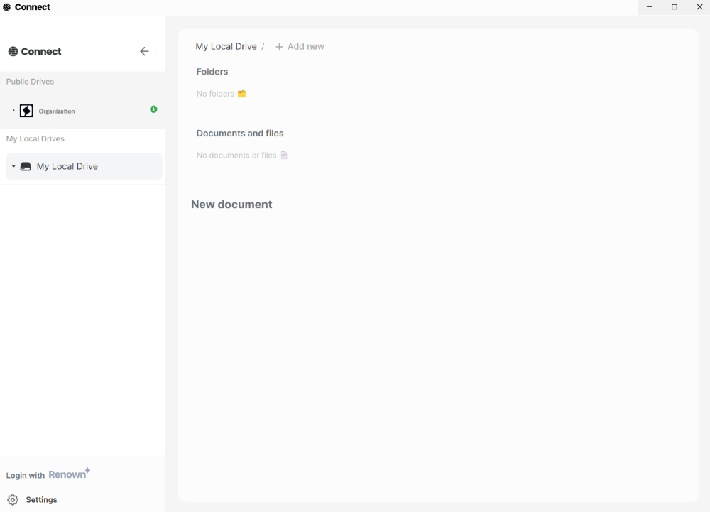

# Powerhouse Connect

Open-source desktop and web application for document model management.
Interact, create, edit and manage documents with ease.

- Connect functions as a private editor & contributor tool for contributors of open organisations. It allows teams to manage internal documents with full control over the data ownership. Connect is available as stand-alone desktop application or in the cloud.
- Connect offers a navigation menu for adding, synchronising and browsing document drives that are shared within an organisation or are private to the contributor.
- Connect allows contributors to edit and work on different 'document model types' selected or defined by the organisation.



## Prerequisites

You can follow these instructions to setup a dev environment:

- Install [**Node (LTS)**](https://nodejs.org/en/download/)
- Clone this repository
- Run `npm install` to install dependencies

**Starting Connect**

```bash
npm start # start desktop app
# OR
npm run dev:web # start web app
```

After initialized, you can access the web app at `http://localhost:5173`.

**Create a packaged version of the desktop app**

```bash
npm run make # Create package for the current platform
npm run make:mac # Create package for Mac OSX
npm run make:linux # Create package for Linux
npm run make:windows # Create package for Windows
```

## Troubleshooting

- For a complete list of *Electron Forge* options and requirements, visit the [official docs](https://github.com/electron-userland/electron-forge#usage).

- If you're experiencing troubles with node-gyp on Windows 11, follow [this guide](https://devkimchi.com/2021/11/26/troubleshooting-node-gyp-package-on-windows11/).

- If you're experiencing troubles with node-gyp on older versions, check out [this guide](https://spin.atomicobject.com/2019/03/27/node-gyp-windows/).

- To use yarn via Windows PowerShell, check [this guide](https://bobbyhadz.com/blog/yarn-cannot-be-loaded-running-scripts-disabled)

- For any other issues, reach out to our discord server [`#ask-powerhouse-team`](https://discord.com/channels/815917281728659516/883285185595047937) channel for help.
