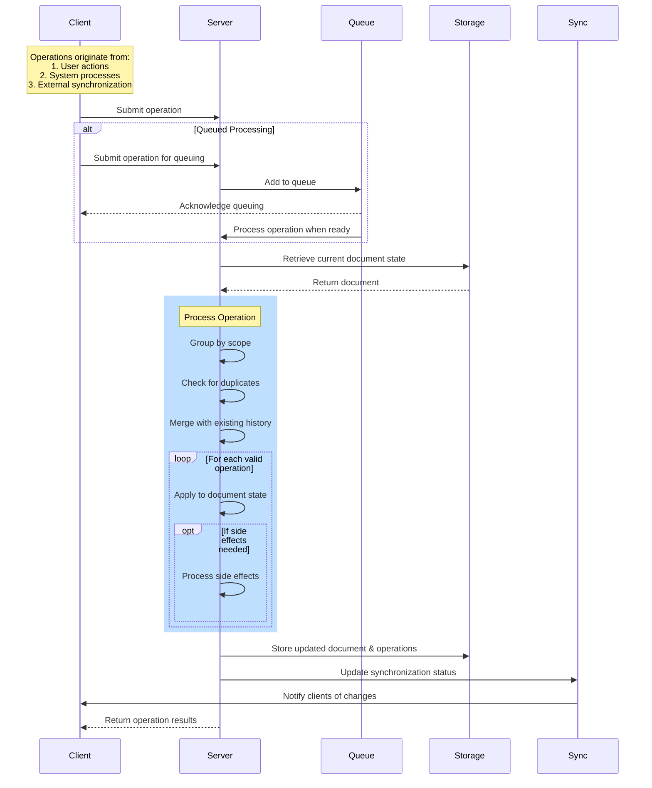

# Operation Lifecycle

This document outlines the high-level lifecycle of Operations in the system.

## What is an Operation?

Operations represent atomic changes to documents in the system. They are the core mechanism for modifying state in a consistent and trackable way.

## Operation Lifecycle Sequence Diagram

## Operation Lifecycle Steps

### 1. Creation
Operations are created from:
- User actions in the client application
- System processes running automatically
- External systems during synchronization

### 2. Submission
Operations follow one of two paths:
- **Direct processing**: Immediate handling
- **Queued processing**: Added to a job queue for processing later

### 3. Processing
When the system processes an operation:
- The current document state is retrieved
- The operation is validated and checked for conflicts
- The operation is merged into the document's history
- The document state is updated
- Any side effects are processed

### 4. Persistence
The system stores:
- The operation in the document history
- The updated document state

### 5. Notification
The system notifies:
- Synchronization components about the change
- Connected clients that need the update
- Other systems that depend on this document

### 6. Results
The system reports:
- Success or failure status
- Updated document state
- Any side effects that occurred

## Key Concepts

### History Management
- Operations form an ordered history of changes
- The system maintains this history for tracking and conflict resolution
- This enables features like undo/redo and collaboration

### Conflict Resolution
When operations conflict:
- The system applies a consistent merge strategy
- Operations may be reordered based on timestamps
- Automatic resolution when possible, error reporting when not

### Side Effects
Some operations trigger side effects:
- Document creation or deletion
- Metadata updates
- Cross-document references

### Synchronization
The system maintains consistency across:
- Multiple clients
- Offline and online states
- Different access patterns 