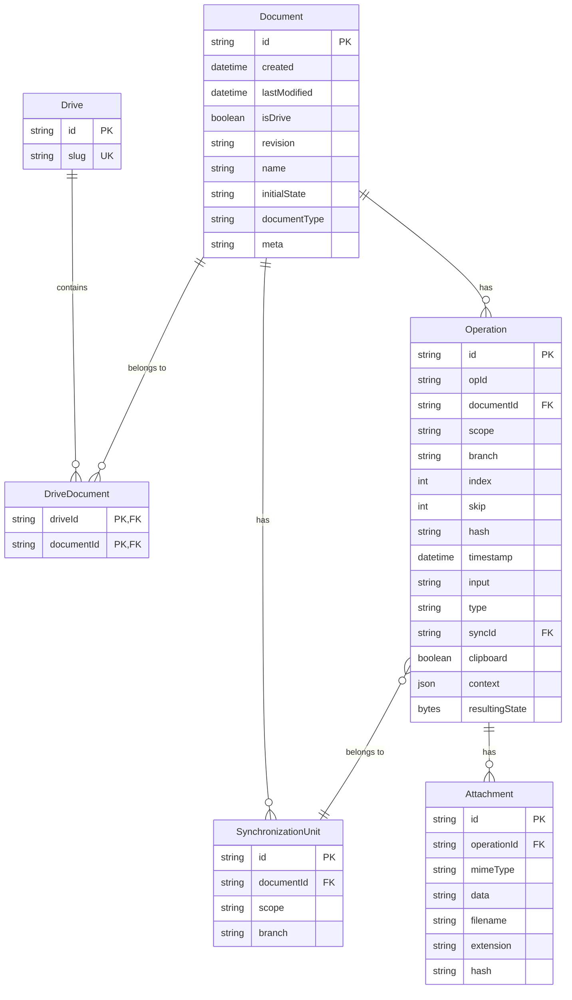

This entity relationship diagram visually represents the database schema defined in the Prisma configuration. The diagram follows the crow's foot notation where:

- `||--o{` represents a one-to-many relationship
- `}o--||` represents a many-to-one relationship
- `PK` indicates a Primary Key
- `FK` indicates a Foreign Key
- `UK` indicates a Unique Key

## Relationships Explained

1. **Drive to DriveDocument**: A Drive can contain many DriveDocuments
2. **Document to DriveDocument**: A Document can belong to many DriveDocuments
3. **Document to Operation**: A Document can have many Operations
4. **Document to SynchronizationUnit**: A Document can have many SynchronizationUnits
5. **Operation to SynchronizationUnit**: Many Operations can belong to one SynchronizationUnit
6. **Operation to Attachment**: An Operation can have many Attachments
