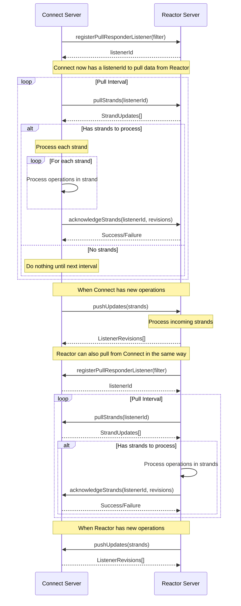

# Document Drive Synchronization

This document describes the synchronization mechanism between two BaseDocumentDriveServers.

## Sequence Diagram

## Synchronization Overview

The synchronization between document drive servers uses both pull and push mechanisms:

### Pull-based Synchronization

1. **Registration**: A server registers as a pull responder listener on another server
2. **Periodic Pulls**: At regular intervals, the server pulls strands of operations
3. **Processing**: The server processes the operations locally
4. **Acknowledgment**: The server acknowledges processing by sending listener revisions

### Push-based Synchronization

1. **Direct Push**: When a server has new operations, it can directly push them to another server
2. **Batching**: Operations are batched to avoid overwhelming the receiving server
3. **Acknowledgment**: The receiving server returns listener revisions to confirm receipt

This bi-directional synchronization ensures that changes made on either server propagate to the other, maintaining consistency between distributed document drives.
