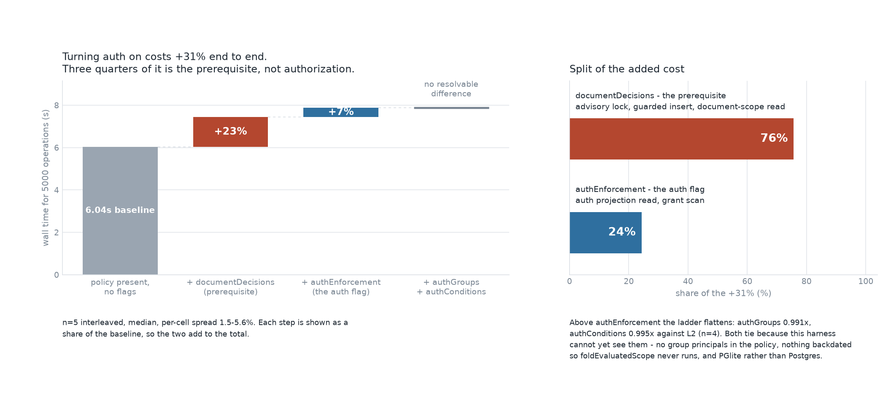
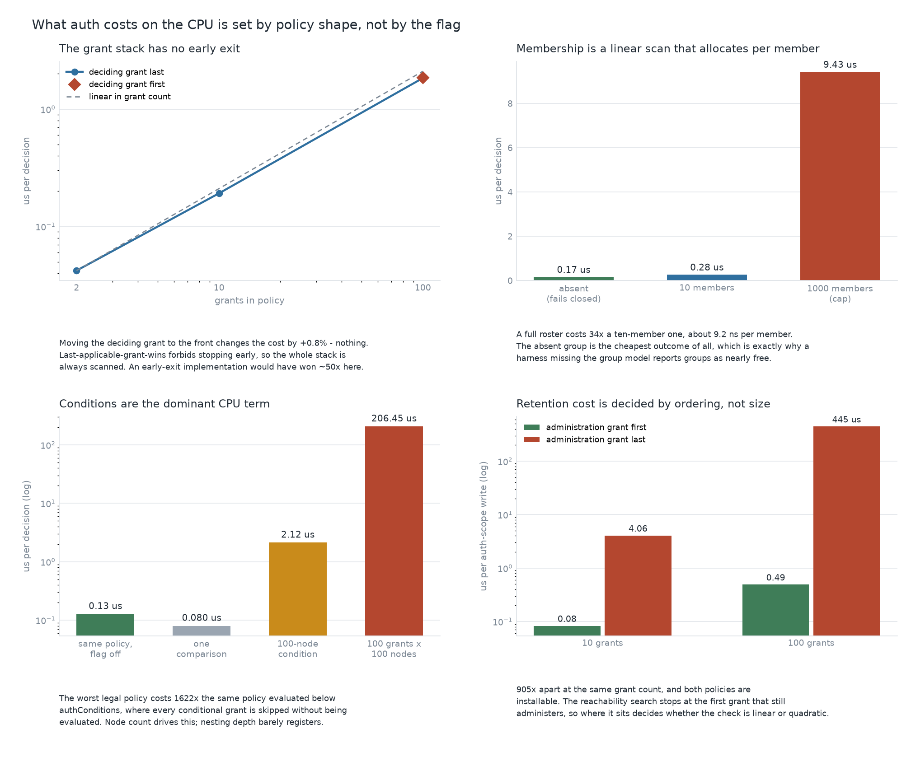
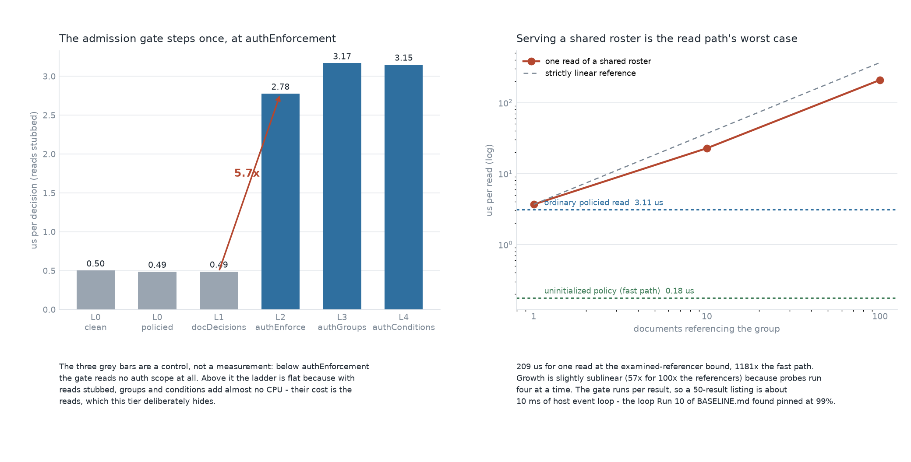

# What auth enforcement costs

A reading of the auth-scope cost matrix, for deciding whether to turn the flags
on and what to watch once they are. The run-by-run log, with every cell and
every caveat, is [`test/integration/AUTH-MATRIX.md`](./test/integration/AUTH-MATRIX.md).

Everything here is measured on the recorded runs in `results/` and `data/`.
Figures are regenerated by `.venv/bin/python3 plot-auth-matrix.py`.

---

## 1. Most of what turning auth on costs is not authorization



Enforcement is staged across four feature flags, each requiring the one above
it: `documentDecisions` -> `authEnforcement` -> `authGroups` -> `authConditions`.
A reactor refuses to start on a set that skips one, so the axis is a ladder and
not a set of independent switches.

End to end the full ladder costs **+31%** on the meso workload. **+23 of those
points are `documentDecisions`** - the prerequisite, which replaces the
meta-cache gate with a Postgres advisory lock, a guarded insert and a
document-scope read. `authEnforcement`, the flag that actually evaluates the
policy, adds **6%**.

This is the number most likely to be misread. An auth-off-versus-auth-on
comparison produces one figure, 31%, and hands all of it to authorization. Three
quarters of it belongs to the admission mechanism underneath, which is a
different piece of work with a different owner and a different fix.

**Two rungs are not yet measurable and their ties should not be read as free.**
`authGroups` and `authConditions` come out level with `authEnforcement`
(0.991x and 0.995x, n=4), and that is a statement about the harness: the policy
carries no group principals, nothing is backdated so `foldEvaluatedScope` never
runs, and PGlite does not take the advisory lock the way Postgres does.

---

## 2. On the CPU, cost is set by policy shape - not by which flag is on



Four independent drivers, all of them properties of the policy a deployment
writes rather than of the code:

**The grant stack is always scanned in full.** Cost is linear in grant count
(9.7x from 10 grants to 100). Moving the deciding grant to the front changes
nothing measurable, which is the evidence that no early exit happens:
last-applicable-grant-wins forbids one. An implementation that could stop early
would have been about 50x faster on that cell.

**Group membership allocates per member.** A 1000-member roster costs 34x a
ten-member one, roughly 9.2 ns per member, because matching lowercases every
member it visits. The cheapest possible group outcome is a group the map does not
hold - which is exactly why a harness that forgets to register the group model
reports groups as nearly free while appearing to measure them.

**Conditions are the dominant CPU term.** The worst legal policy - 100 grants
each carrying a 100-node `where` - costs **206 us per decision**, against
**0.13 us for the identical policy evaluated below `authConditions`**, where
conditional grants are skipped without being evaluated. That is a **1622x**
step. Node count drives it; nesting depth barely registers.

**Auth-scope writes are quadratic when administration sits low in the stack.**
At the same 100 grants, retention costs 0.49 us with the administration grant
first and **445 us with it last** - **905x apart**, and both policies are
installable. The reachability search stops at the first grant that still
administers, so placement decides whether the check is linear or quadratic.

The last two are the actionable ones. Neither is a code cost anyone can tune
from outside; both are policy-authoring choices, and one of them - put the
administration grant first - is a one-line change worth 905x.

---

## 3. The two gates behave differently, and only one is parallel



**The admission gate steps once.** With reads stubbed, the ladder is flat below
`authEnforcement` (those bars are a control: the gate reads no auth scope at
all), steps 5.7x at `authEnforcement`, and is flat again above it. Groups and
conditions add almost no CPU at the head of a stream - their cost is the reads,
one `getState` per distinct group plus one for the executing scope. That locates
the remaining question in I/O, not compute.

**The read gate's worst case is two orders of magnitude worse than its
common case.** An ordinary policied read is 3.11 us. Reading a group roster that
100 documents reference is **209 us**, because deciding whether to serve it
rebuilds each referencing document's decision model in turn. Growth is slightly
sublinear only because probes run four at a time.

Two things make that number matter more than it looks. The gate runs **once per
result**, so a 50-result listing over shared rosters is about 10 ms - and reads
are gated on the `ReactorClient` in the **host process**, so none of it is
absorbed by the executor's worker pool. `BASELINE.md` Run 10 already found that
event loop pinned at 99.3% utilisation.

And the fast path is a trap for measurement, not just a performance note: an
uninitialized policy short-circuits at 0.18 us, 17x cheaper than a policied
read. Any harness that forgets `INITIALIZE_AUTH` measures that and concludes the
read gate is free.

---

## What this means if you are about to flip the flags

1. **Budget the prerequisite separately from auth.** `documentDecisions` is
   three quarters of the cost and is a lock-and-insert change, not a policy
   change. It should be evaluated, rolled out and monitored on its own.
2. **Treat policy authoring as a performance surface.** Put the administration
   grant first. Keep grant lists short. Prefer a few wide grants to many narrow
   conditional ones. The spread between a careless and a careful policy at the
   same grant count is three orders of magnitude.
3. **Watch reads, not writes, on the host.** Write-path auth lands in the worker
   pool. Read-path and sync-serving auth land on the one loop that is already
   saturated, and the roster walk has no cache of any kind.
4. **Do not quote the +31% as the production number yet.** It comes from
   in-memory PGlite with no worker pool, no signature verification, nothing
   backdated and no group principals. Each of those makes it an underestimate in
   a different direction.

## What is still unmeasured

In priority order, with the reason each one matters:

1. **The ladder against real Postgres.** The advisory lock over the read set is
   the mechanism by which `authGroups` makes every document sharing a group
   serialise, and append-condition conflicts retry up to 20 times *exempt from
   the retry limit*, re-running the whole gate against an invalidated cache. On
   PGlite neither behaves realistically. This is the largest single gap.
2. **A backdated arm.** `foldEvaluatedScope` folds the entire effective stream
   of the evaluated scope and is the most expensive construct in the feature. It
   is also unreachable from an ordinary write, so `authConditions` will keep
   measuring as a tie until actions are stamped in the past.
3. **The macro tier.** The bench host sets no flags, installs no policy,
   registers no group model, stubs signature verification to `() => true`, and
   builds its signer with no user - so its subject address is the empty string,
   which no address or group principal can match.
4. **The write cache as a confound.** `maxDocuments` defaults to 100 and the LRU
   is keyed per stream, not per document. Each rung adds a stream per document,
   so at the historical `NUM_DRIVES=64` turning on `documentDecisions` alone
   takes the cache from 64 to 128 streams against a 100-stream capacity. Pin it
   before any sweep, or the sweep will read keyframe rebuilds as policy cost.
5. **Re-evaluation fan-out.** A membership change enqueues one job per
   referencing document. Bursty, so no steady-state profile will see it.

## Reproducing

```sh
# micro tier: CPU, storage stubbed
pnpm --filter @powerhousedao/reactor bench:auth
pnpm --filter @powerhousedao/reactor bench:auth:record    # writes results/auth-scope.json
pnpm --filter @powerhousedao/reactor bench:auth:compare    # diffs a later run against it

# the guard that must pass before any number is trusted
pnpm --filter @powerhousedao/reactor exec vitest run test/bench/auth-policies.test.ts

# meso tier: end to end, one rung at a time
tsx scripts/profiling/reactor-direct.ts 10 -o 500 -b 100 --auth-level L2 --auth-grants 100

# figures
cd packages/reactor/bench
python3 -m venv .venv && .venv/bin/pip install numpy matplotlib
.venv/bin/python3 plot-auth-matrix.py
```

Two measurement notes worth carrying forward, both learned the hard way while
producing the numbers above. Batch the meso runs: `waitForJob` polls on a 10 ms
timer, so at batch size 1 every effect here is below the quantum and the ladder
reads as flat. And interleave repetitions rather than running each level to
completion in turn: blocked ordering produced a confident 5% difference between
two rungs that interleaving erased entirely.
