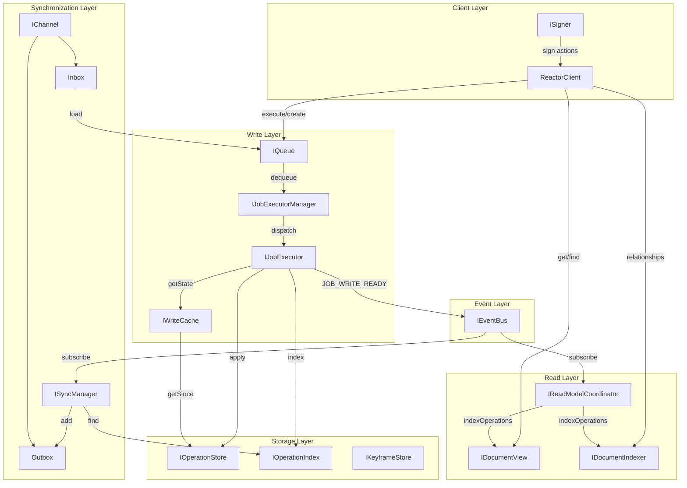
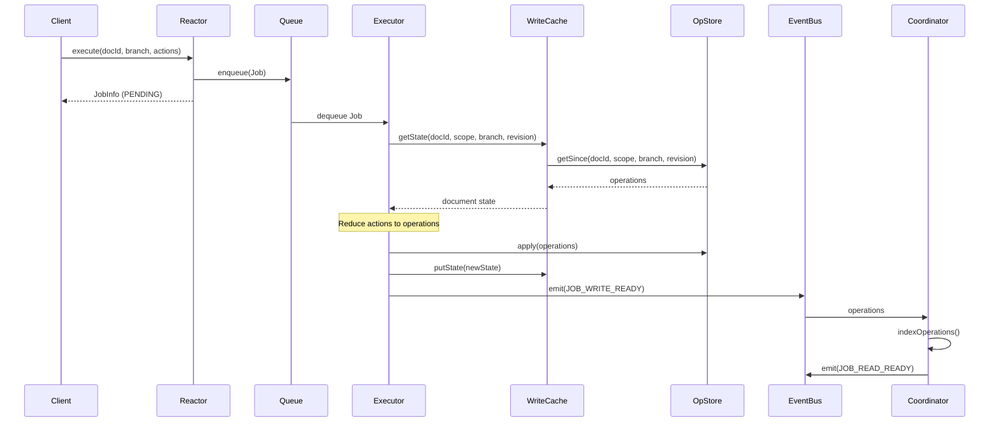
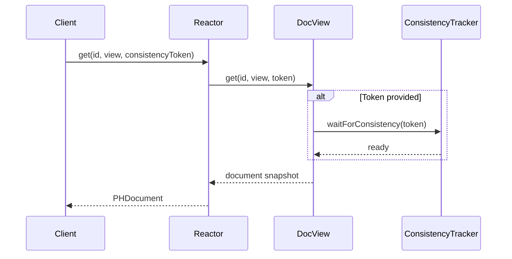
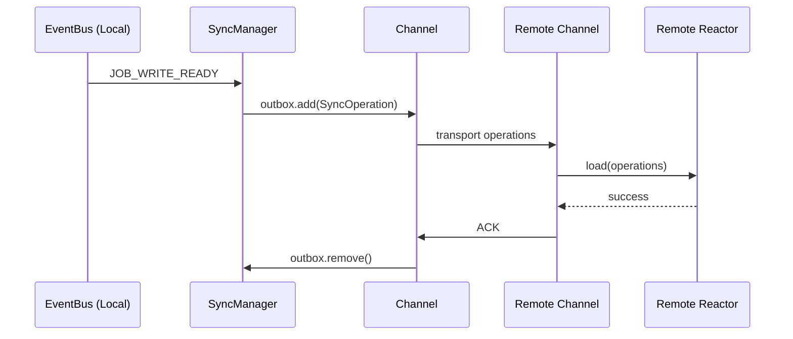

# Reactor Architecture

This document provides a comprehensive overview of the Reactor system for developers who need to understand, modify, or extend it.

## Table of Contents

- [Overview](#overview)
- [System Architecture](#system-architecture)
- [Core Concepts](#core-concepts)
- [Data Flow](#data-flow)
- [Components](#components)
- [Storage Layer](#storage-layer)
- [Synchronization](#synchronization)
- [Design Decisions](#design-decisions)
- [Extension Points](#extension-points)

---

## Overview

The Reactor is an event-sourced document management system that:

1. Stores documents as sequences of immutable operations
2. Provides async job-based mutation processing
3. Maintains read models for efficient querying
4. Synchronizes operations between distributed instances

### Key Principles

- **Event Sourcing**: State is derived from a sequence of operations, never mutated directly
- **Async Processing**: All mutations go through a job queue for ordering and retry
- **Read-After-Write Consistency**: ConsistencyTokens coordinate reads with prior writes
- **Pluggable Storage**: Interfaces allow different storage backends

### ReactorBuilder (Default Wiring)

Most applications construct Reactor via `ReactorBuilder`, which wires:

- PGlite + Kysely (schema migrations and storage)
- In-memory queue and event bus
- Write cache and operation index
- Read models (DocumentView, DocumentIndexer, subscription notifications)
- Job executor manager

See: `src/core/reactor-builder.ts`

---

## System Architecture



---

## Core Concepts

### PHDocument

A document with event-sourced state. Key properties:

- **header**: Metadata including id, documentType, slug, branch, timestamps
- **state**: Current computed state, containing document scope and global scope
- **operations**: The operation history (not stored on the document itself)

Documents are immutable at the application layer. Changes are expressed as Actions that produce Operations.

See: `document-model` package for type definitions

### Operation

An immutable record representing a single state change:

```typescript
// From document-model
type Operation = {
  id: string; // Stable derived operation id
  index: number; // Sequential index within scope
  skip: number; // Skip count for reshuffle/undo
  timestampUtcMs: string; // ISO timestamp
  hash: string; // Content hash for verification
  error?: string; // Error message for failed action
  resultingState?: string; // Serialized state after applying operation
  action: Action; // The action that produced this operation
};
```

Operations are stored per `(documentId, scope, branch)` triple, maintaining a separate sequence for each combination.
Scope and branch are carried in `OperationContext`, not on the operation itself.

### OperationWithContext

Operations are processed alongside their context:

```typescript
type OperationWithContext = {
  operation: Operation;
  context: {
    documentId: string;
    documentType: string;
    scope: string;
    branch: string;
    resultingState?: string;
    ordinal: number; // Global ordering across all operations
  };
};
```

Read models and sync depend on the context fields, especially `resultingState` and `ordinal`.

### Scope

Operations are partitioned by scope:

- **global**: Shared state visible to all users
- **local**: User-specific state (preferences, UI state)
- **document**: System operations (CREATE_DOCUMENT, DELETE_DOCUMENT, UPGRADE_DOCUMENT, relationships)
- **Custom scopes**: Application-defined partitions

Different scopes maintain independent operation sequences on the same document, enabling patterns like:

- Private drafts (local) vs published content (global)
- Per-user annotations that don't affect shared state

### Branch

Documents support multiple branches for draft/published workflows:

- **main**: Default branch, typically the "published" version
- **Custom branches**: Drafts, experiments, or parallel versions

Operations are isolated per branch. Branching/merging operations are planned but not yet implemented.

### Job

A unit of work submitted to the reactor:

```typescript
type Job = {
  id: string;
  kind: "mutation" | "load";
  documentId: string;
  scope: string;
  branch: string;
  actions: Action[]; // For mutations
  operations: Operation[]; // For loads (sync)
  queueHint: string[]; // Job dependencies
  maxRetries: number;
  errorHistory: ErrorInfo[];
};
```

Jobs ensure:

- Sequential processing per document (queue keys still include scope and branch)
- Retry logic with error tracking
- Dependency ordering via `queueHint`

### ConsistencyToken

A token capturing the "write frontier" for read-after-write consistency:

```typescript
type ConsistencyToken = {
  version: 1;
  createdAtUtcIso: string;
  coordinates: ConsistencyCoordinate[];
};

type ConsistencyCoordinate = {
  documentId: string;
  scope: string;
  branch: string;
  operationIndex: number;
};
```

Usage:

1. Mutation returns JobInfo with ConsistencyToken
2. Pass token to read operations (get, find)
3. Read model blocks until it has indexed past those coordinates

Consistency tokens are updated on `JOB_WRITE_READY` and become visible to reads after `JOB_READ_READY`.

---

## Data Flow

### Write Path



**Key points:**

1. `execute()` immediately returns with PENDING status
2. Job is processed async by executor pool
3. WriteCache provides efficient state reconstruction
4. Events notify downstream systems (read models, sync)
5. `JOB_READ_READY` is emitted after all pre-ready read models complete, then post-ready models run

### Read Path



**Key points:**

1. ConsistencyToken is optional but recommended after writes
2. waitForConsistency blocks until read model catches up
3. Document snapshots are maintained by IDocumentView

### Sync Path



**Key points:**

1. SyncManager listens for local `JOB_WRITE_READY` events
2. Operations matching remote filters are queued
3. Channels handle transport and acknowledgment
4. Remote loads operations via reactor.load()

---

## Components

### Reactor (`src/core/reactor.ts`)

The main entry point implementing `IReactor`. Coordinates all subsystems.

**Key methods:**

- `create(document)`: Create new document
- `execute(docId, branch, actions)`: Apply mutations
- `executeBatch(request)`: Submit dependent mutation jobs
- `load(docId, branch, operations)`: Load operations from sync
- `get(id, view, token)`: Retrieve document
- `find(search, view, paging, token)`: Search documents
- `kill()`: Graceful shutdown

**Interfaces:** `src/core/types.ts`

### Queue (`src/queue/`)

Job queue with per-document ordering.

**Implementation:** In-memory queue with Map-based organization by `(documentId, scope, branch)`

**Key behaviors:**

- Jobs for same document/scope/branch execute sequentially
- Jobs for different documents can execute in parallel
- Execution is serialized per document even across scopes and branches
- Supports blocking for graceful shutdown

**Interfaces:** `src/queue/interfaces.ts`

### JobExecutor (`src/executor/`)

Executes individual jobs against the document model.

**Flow:**

1. Verify action signatures (if signed)
2. Load document state from WriteCache
3. Reduce actions to produce operations
4. Write operations atomically to OperationStore
5. Update WriteCache with new state
6. Emit events

**Interfaces:** `src/executor/interfaces.ts`

### OperationStore (`src/storage/`)

Persistent storage for operations with revision tracking.

**Key methods:**

- `apply(docId, documentType, scope, branch, revision, fn)`: Atomic write with optimistic locking
- `getSince(docId, scope, branch, revision)`: Paginated read
- `getRevisions(docId, branch)`: Get latest revision per scope

**Implementation:** Kysely-based SQL storage (`src/storage/kysely/store.ts`)

**Interfaces:** `src/storage/interfaces.ts`

### WriteCache (`src/cache/`)

LRU cache for document states to avoid full replay.

**Strategy:**

1. Check ring buffer for cached state at or before target revision
2. On miss: replay from nearest keyframe or operation 0
3. Cache result for future requests

**Interfaces:** `src/cache/write/interfaces.ts`

### DocumentView (`src/read-models/document-view.ts`)

Maintains document snapshots for efficient reads.

**Key behaviors:**

- Subscribes to JOB_WRITE_READY events
- Updates snapshots incrementally as operations arrive
- Supports ConsistencyToken-based waiting
- Handles slug resolution
- Requires `resultingState` in OperationContext (does not rebuild from operations)

**Interfaces:** `src/storage/interfaces.ts` (IDocumentView)

### DocumentIndexer (`src/storage/kysely/document-indexer.ts`)

Tracks document relationships (parent/child, custom types).

**Operations indexed:**

- ADD_RELATIONSHIP: Creates edge in graph
- REMOVE_RELATIONSHIP: Removes edge

**Query methods:**

- `getOutgoing()`: Children and other targets
- `getIncoming()`: Parents and other sources
- `findPath()`: BFS path finding
- `findAncestors()`: Full ancestor graph

**Interfaces:** `src/storage/interfaces.ts` (IDocumentIndexer)

### EventBus (`src/events/`)

Synchronous pub/sub for internal events.

**Event types:** (from `src/events/types.ts`)

- `JOB_PENDING`: Job enqueued
- `JOB_RUNNING`: Job execution started
- `JOB_WRITE_READY`: Write phase complete
- `JOB_READ_READY`: Read models updated
- `JOB_FAILED`: Job failed

**Interfaces:** `src/events/interfaces.ts`

Queue events are separate: `JOB_AVAILABLE` (from `src/queue/types.ts`).

**Semantics:** `emit()` is sequential, awaited, and aggregates subscriber errors.

### SyncManager (`src/sync/`)

Orchestrates multi-remote synchronization.

**Key concepts:**

- **Remote**: Configuration for a sync target (URL, auth, filters)
- **Channel**: Bidirectional connection with inbox/outbox mailboxes
- **Collection**: Flattened stream of operations for efficient cursor tracking

**Interfaces:** `src/sync/interfaces.ts`

### Registry (`src/registry/`)

Stores document model modules for reducer lookup.

**Usage:**

```typescript
const module = registry.getModule(documentType);
const reducer = module.documentModel.reducer;
```

**Interfaces:** `src/registry/interfaces.ts`

### ReactorBuilder (`src/core/reactor-builder.ts`)

Builds a complete Reactor module with default storage, caches, read models, and executors.
This is the preferred entry point for most applications.

---

## Storage Layer

### Database Schema

The Kysely-based storage uses these tables:

**Operation**: Operation storage with per-scope sequencing and action payloads

**Keyframe**: Optional snapshots for fast replay

**Document**: Document metadata cache (creation and update timestamps)

**DocumentSnapshot**: Read model snapshots per document/scope/branch

**DocumentRelationship**: Graph edges for relationships

**SlugMapping**: Slug-to-id mapping for `getBySlug`

**ViewState** and **IndexerState**: Read model progress tracking

**document_collections**: Collection membership for sync

**operation_index_operations**: Global operation index with `ordinal`

**sync_remotes** and **sync_cursors**: Sync configuration and progress

See: `src/storage/migrations/` for complete schema

### Keyframes

Optional snapshots for faster state reconstruction:

```typescript
interface IKeyframeStore {
  putKeyframe(docId, scope, branch, revision, document): Promise<void>;
  findNearestKeyframe(
    docId,
    scope,
    branch,
    targetRevision,
  ): Promise<{ revision; document }>;
}
```

Keyframes trade storage space for reduced replay time on documents with many operations.

---

## Synchronization

### Collection-Based Sync

Operations are grouped into collections for efficient cursor tracking:

```typescript
// Collection ID format for drives
const collectionId = `drive.${branch}.${driveId}`;
```

When a document is added to a drive, it joins the drive's collection. The sync cursor tracks position in the flattened operation stream across all documents in the collection using `ordinal` values from the operation index.

### Channel Types

**GqlChannel** (`src/sync/channels/gql-channel.ts`):

- GraphQL-based transport over HTTP
- Polling with configurable interval
- Cursor-based incremental sync

**PollingChannel** (`src/sync/channels/polling-channel.ts`):

- Generic polling infrastructure
- Backoff on failures

### Sync Protocol

```
Local Write:
1. Operations written locally
2. JOB_WRITE_READY event
3. SyncManager filters by remote config
4. Operations added to outbox
5. Channel transports to remote
6. Remote loads via reactor.load()
7. ACK received, outbox cleared

Remote Sync:
1. Channel polls remote
2. Operations received in inbox
3. SyncManager calls reactor.load()
4. Operations processed as "load" job
5. ACK sent to remote
6. Cursor updated
```

---

## Design Decisions

### Why Event Sourcing?

1. **Auditability**: Complete history of all changes
2. **Sync**: Operations can be replayed on remote instances
3. **Undo/Redo**: Skip parameter enables efficient undo
4. **Conflict Resolution**: Operations can be reordered during sync

### Why Async Job Processing?

1. **Ordering**: Guarantees sequential processing per document (even across scopes and branches)
2. **Retry**: Failed jobs can be retried with backoff
3. **Backpressure**: Queue provides natural flow control
4. **Batching**: Jobs can batch multiple operations efficiently

### Why Separate Read Models?

1. **Query Optimization**: Snapshots avoid replaying operations
2. **Relationship Queries**: Graph index enables efficient traversal
3. **Consistency**: Read models can lag behind writes
4. **Extensibility**: New read models can be added without changing write path

### Why ConsistencyTokens?

1. **User Experience**: Immediate read-after-write for the writer
2. **Performance**: Other readers can use eventually-consistent reads
3. **Flexibility**: Caller decides consistency requirements

---

## Extension Points

### Adding a Document Model

1. Create model using document-model tools
2. Export as DocumentModelModule
3. Register via ReactorBuilder:

```typescript
const reactor = await new ReactorBuilder()
  .withDocumentModels([myModule])
  .build();
```

### Adding a Storage Backend

1. Implement `IOperationStore` interface
2. Optionally implement `IKeyframeStore`
3. Provide via ReactorBuilder

### Adding a Read Model

1. Implement `IReadModel` interface:

```typescript
interface IReadModel {
  indexOperations(operations: OperationWithContext[]): Promise<void>;
}
```

2. Register with IReadModelCoordinator (pre-ready or post-ready depending on consistency needs)

### Adding a Sync Channel

1. Implement `IChannel` interface:

```typescript
interface IChannel {
  inbox: Mailbox<SyncOperation>;
  outbox: Mailbox<SyncOperation>;
  deadLetter: Mailbox<SyncOperation>;
  init(): Promise<void>;
  shutdown(): void;
  updateCursor(ordinal: number): Promise<void>;
}
```

2. Create `IChannelFactory` for the channel type
3. Register factory with SyncManager

### Adding Processors

Processors react to operations after write:

1. Implement processor function
2. Register via ProcessorManager

See: `src/processors/`

---

## Further Reading

- **Code**: TypeScript interfaces are the authoritative API reference
  - `src/core/types.ts` - Reactor interface
  - `src/storage/interfaces.ts` - Storage interfaces
  - `src/sync/interfaces.ts` - Sync interfaces
- **Archive**: Historical planning docs in `docs/archive/planning-v1/`
