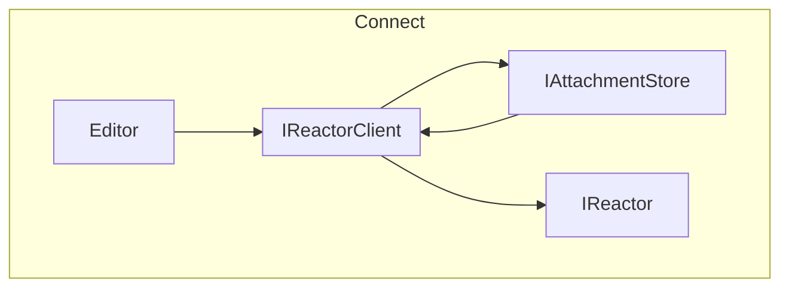

# Overview

### Summary

Attachments are binary files that accompany Documents via Operations. Attachments allow operations to reference media without bloating the state object.

The attachment system is designed to be completely separate from the document system. Reactor has no knowledge of the attachment system, and the attachment system has no knowledge of the document system.

The `IReactorClient` interface puts these pieces together.

### Diagram

### Dependencies

- [Operations](../Operations/index.md)

### Links

- [Interface](interface.md)
- [Usage](usage.md)
