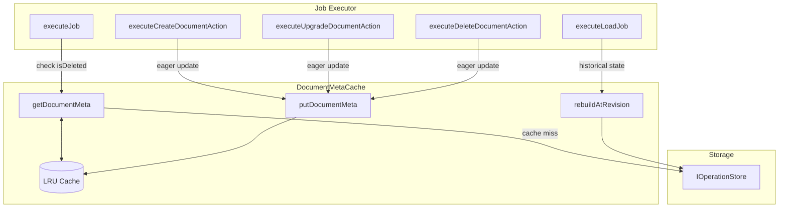

# DocumentMetaCache Overview

## Problem Statement

**All guarantees in job execution are scope-specific.** When the job executor calls `getState(docId, "global", branch)`, there is **no contract guaranteeing** that `document.state.document` (the document scope state) will be current or even present. This is a cross-scope dependency that the write cache architecture doesn't explicitly handle.

The document scope contains critical metadata needed during job execution:
- `version` - needed for multi-version document models
- `isDeleted` / `deletedAtUtcIso` - needed to validate document is not deleted
- `hash` - needed for operation verification

### Root Cause

The write cache and keyframes are scope-specific (`{documentId}:{scope}:{branch}`). When loading state for a non-document scope:
- Keyframes contain the document state at the time they were stored (may be stale)
- Cached snapshots contain document state at the time they were cached (may be stale)
- Even cold miss rebuilds fetch document scope ops as an implementation detail, not a guaranteed contract

### Example Scenarios

**Scenario 1: Stale cache after document scope modification**
1. CREATE_DOCUMENT + UPGRADE_DOCUMENT (version 1) executed in document scope
2. Some global scope operations executed, keyframe stored for global scope
3. Another UPGRADE_DOCUMENT (version 2) executed in document scope
4. `getState(docId, "global", branch)` called - loads from global keyframe with version 1
5. Job executor checks version and gets wrong value

**Scenario 2: Stale isDeleted flag**
1. Create document + UPGRADE_DOCUMENT
2. Apply global scope operation, cache result with putState
3. Apply DELETE_DOCUMENT in document scope
4. `getState(docId, "global", branch)` called - cache hit returns stale isDeleted
5. Job executor doesn't know document was deleted

**Scenario 3: Reshuffling with UPGRADE_DOCUMENT**
1. UPGRADE_DOCUMENT executed (sets version to 2) at revision N
2. New operation A arrives with **earlier timestamp** than UPGRADE_DOCUMENT
3. Operation A needs to be applied at revision N-1 (before UPGRADE_DOCUMENT), then UPGRADE_DOCUMENT reapplied
4. To apply A correctly, we need document scope state **as of revision N-1** (version 1)
5. Caching only "latest" (version 2) is insufficient - must reconstruct at target revision

## Solution: DocumentMetaCache

A separate `DocumentMetaCache` class that caches `PHDocumentState` per document, with eager updates when special operations occur. This provides an **explicit cross-scope contract** for accessing document scope metadata.

### Architecture



### Cache Key Structure

Key format: `{documentId}:{branch}` (no scope since this is always document scope)

### Rebuild Logic

**`getDocumentMeta()` (latest):**
1. Check cache - return if hit
2. On miss: Fetch all document scope operations via `operationStore.getSince(documentId, "document", branch, -1)`
3. Find CREATE_DOCUMENT to get document type
4. Apply all UPGRADE_DOCUMENT and DELETE_DOCUMENT operations using shared utility functions:
   - `createDocumentFromAction()` - creates initial document from CREATE_DOCUMENT
   - `applyUpgradeDocumentAction()` - applies UPGRADE_DOCUMENT to document
   - `applyDeleteDocumentAction()` - applies DELETE_DOCUMENT to document
5. Extract `document.state.document` as the `PHDocumentState`
6. Cache and return result

**`rebuildAtRevision(targetRevision)` (historical):**
1. Fetch document scope operations via `operationStore.getSince(documentId, "document", branch, -1)`
2. Find CREATE_DOCUMENT to get document type
3. Apply UPGRADE_DOCUMENT and DELETE_DOCUMENT operations **only up to targetRevision**
4. Return result (no caching - historical state is not cached)

### Shared Utility Functions

The `DocumentMetaCache` uses the same utility functions as the job executor to ensure consistent behavior:

```typescript
// From src/executor/util.ts
import {
  createDocumentFromAction,
  applyUpgradeDocumentAction,
  applyDeleteDocumentAction,
} from "../executor/util.js";
```

This avoids code duplication and ensures that document state reconstruction is identical whether done by the job executor or the metadata cache.

### PHDocumentState

The `PHDocumentState` type contains the document scope metadata:

```typescript
// From document-model package
export type PHDocumentState = {
  version: number;        // Document version (starts at 0)
  hash: {
    algorithm: string;    // Hash algorithm (e.g., "sha1")
    encoding: string;     // Hash encoding (e.g., "base64")
  };
  isDeleted?: boolean;          // True if document was deleted
  deletedAtUtcIso?: string;     // ISO timestamp of deletion
};
```

Note: Document versions start at `0`. The version is updated via UPGRADE_DOCUMENT operations.

### Integration Points

**SimpleJobExecutor constructor** - accepts `IDocumentMetaCache` parameter

**After CREATE_DOCUMENT:**
```typescript
this.documentMetaCache.putDocumentMeta(documentId, job.branch, {
  state: document.state.document,
  documentType: document.header.documentType,
  documentScopeRevision: 1,
});
```

**After UPGRADE_DOCUMENT:**
```typescript
this.documentMetaCache.putDocumentMeta(documentId, job.branch, {
  state: updatedDocument.state.document,
  documentType: updatedDocument.header.documentType,
  documentScopeRevision: operation.index + 1,
});
```

**After DELETE_DOCUMENT:**
```typescript
this.documentMetaCache.putDocumentMeta(documentId, job.branch, {
  state: updatedDocument.state.document, // includes isDeleted: true
  documentType: updatedDocument.header.documentType,
  documentScopeRevision: operation.index + 1,
});
```

**Before processing regular actions (isDeleted check):**
```typescript
const docMeta = await this.documentMetaCache.getDocumentMeta(job.documentId, job.branch);
if (docMeta.state.isDeleted) {
  return {
    success: false,
    error: new DocumentDeletedError(job.documentId, docMeta.state.deletedAtUtcIso),
    // ...
  };
}
```

**During reshuffling:**
```typescript
const historicalMeta = await this.documentMetaCache.rebuildAtRevision(
  documentId,
  branch,
  targetRevision
);
// Use historicalMeta.state.version when applying operations at that revision
```

### Dependency Injection

The `DocumentMetaCache` requires `IOperationStore` for cache miss rebuilds. It is constructed alongside `KyselyWriteCache` and injected into:
- `SimpleJobExecutor` (for eager updates and metadata access)

```typescript
// In ReactorBuilder
const documentMetaCache = new DocumentMetaCache(operationStore, {
  maxDocuments: 1000,
});
await documentMetaCache.startup();

// Passed to SimpleJobExecutor constructor
const executor = new SimpleJobExecutor(
  // ... other dependencies
  documentMetaCache,
  // ...
);
```

## Implementation Files

- `src/cache/document-meta-cache.ts` - Implementation
- `src/cache/document-meta-cache-types.ts` - Types and interface
- `src/executor/util.ts` - Shared utility functions (createDocumentFromAction, applyUpgradeDocumentAction, applyDeleteDocumentAction)
- `test/cache/document-meta-cache.test.ts` - Unit tests
- `test/cache/write/document-scope-staleness.test.ts` - Integration tests demonstrating the problem and solution

### Links

* [Interface](./document-meta-cache-interface.md) - TypeScript interface
* [Write Cache](./write-cache.md) - Related scope-specific caching system
