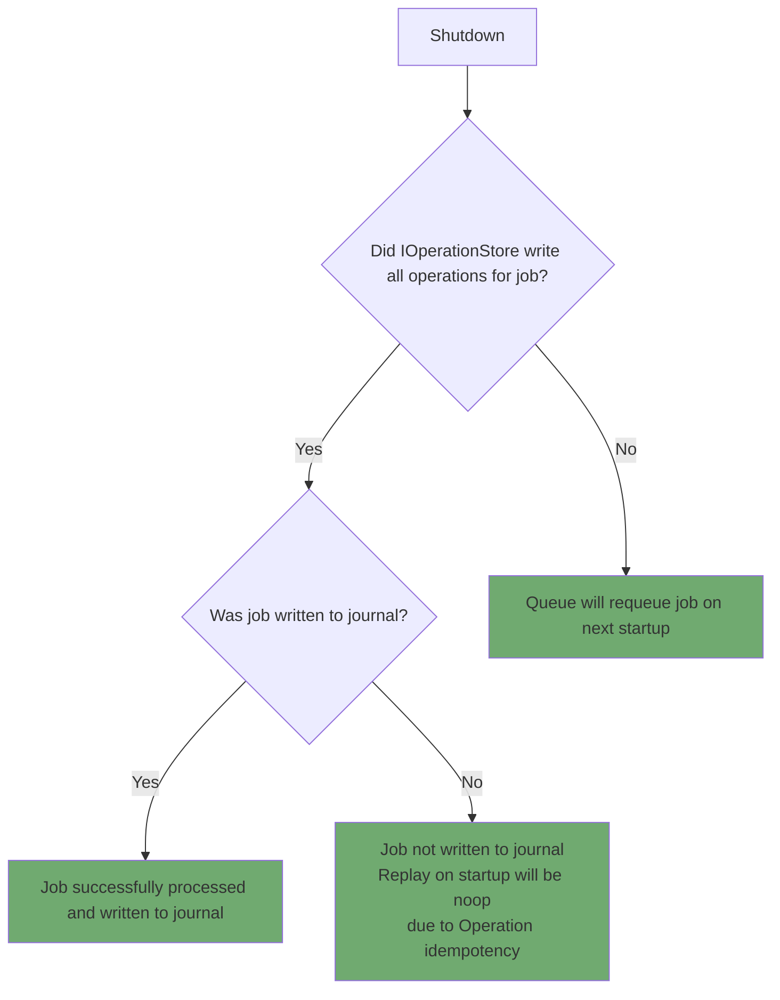
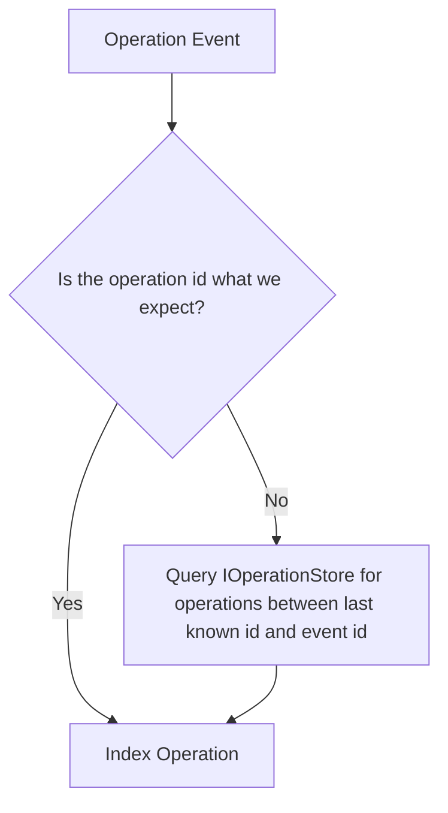
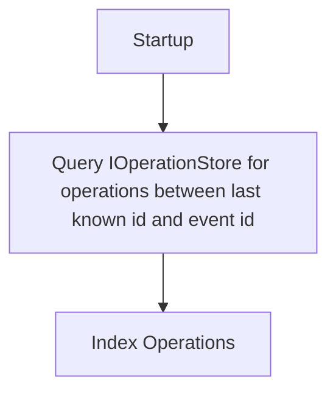

# Graceful Shutdown

The Reactor package is designed to be a portable, long running process. We can run it in a browser, a `node` process (or `bun`, `deno`, etc.), a worker thread -- all of which have different runtime and performance characteristics. We have designed the reactor package so that, in whatever environment it is running, it is as durable as possible between application restarts.

Any system that has been "shutdown" is permanently disabled.

## Browser v Server

Graceful shutdown has to work differently in the browser and on the server.

Browser APIs use a [variety](https://webkit.org/blog/516/webkit-page-cache-ii-the-unload-event/) of [unload events](https://developer.mozilla.org/en-US/docs/Web/API/Window/beforeunload_event). All of these events require synchronous handling, and are allowed to write synchronously to local storage (`indexedDB` is unfortunately not an option as it does not have synchronous writes).

Unix and Linux environments use the `SIGTERM` signal to indicate that the process should shutdown. The process can handle this signal in whatever way it wants (including by completely ignoring it). Generally in production environments, a grace period is allowed for the process to finish its work. [In the case of Docker Compose](https://docs.docker.com/compose/support-and-feedback/faq/#why-do-my-services-take-10-seconds-to-recreate-or-stop), for instance, a grace period of 10 seconds is allowed before the container instead sends a `SIGKILL` signal. The same flow is true for Kubernetes (and documented in the [GCP best practices](https://cloud.google.com/blog/products/containers-kubernetes/kubernetes-best-practices-terminating-with-grace)).

## Unified API

Even though there are significant differences between the browser and the server, we want to provide a unified API for graceful shutdown. This unified API will be used throughout the Reactor package for sub-systems that need to follow this same shutdown pattern.

```tsx
/**
 * A status object that describes the shutdown status of a system.
 */
interface IShutdownStatus {
  /**
   * A callback that is called once after `isShutdown` is set to true.
   */
  onShutdown(callback: () => void): void;
}
```

So, for example, the `IReactor` interface will have a `kill` method that returns an `IShutdownStatus` object.

```tsx
interface IReactor {
  kill(): IShutdownStatus;

  // elided ...
}
```

The `kill()` method mimics the `SIGTERM` signal and synchronously returns an `IShutdownStatus` object. This is needed for browsers as there is no way to ensure an async function resolves synchronously.

In a browser environment, the `kill()` method must be able to synchronously call the `onShutdown` callback.

```tsx
reactor.kill().onShutdown(() => {
  console.log("Reactor has been shutdown"); // this will be logged first
});

console.log("Waiting for reactor to shutdown..."); // this will be logged second
```

In a server environment, a graceful shutdown period should be allowed for the reactor to finish its work (i.e. flush job queue, finish db writes, etc). A host application, like Switchboard, can watch this value to determine if the reactor has been shutdown.

```tsx
// hook into SIGTERM signal
process.on("SIGTERM", () => {
  console.log("Graceful shutdown initiated.");

  // forward the signal to the reactor
  reactor.kill().onShutdown(() => {
    console.log("Graceful shutdown complete.");

    // reactor is now shutdown, so we can exit the process
    process.exit(0);
  });
});
```

## IReactor

While an `IReactor` is shutting down, the API will bounce incoming requests. All `IReactor` API functions will throw a `GracefulShutdownError` to indicate that the operation is not currently allowed.

```tsx
class GracefulShutdownError extends Error {
  constructor() {
    super("Reactor is shutting down");
  }
}
```

### Queue

The `IQueue` interface includes `block` and `unblock` methods to allow the host application to block the queue from accepting new jobs. This means that inside the `IReactor`'s `kill` method, the queue should be blocked.

```tsx
kill(): ShutdownStatus {
  // elided ...

  this.queue.block();

  // elided ...
}
```

The `isDrained` property will be `true` if and only if all jobs have been resolved. An optional callback can be provided to the `block` method to be called when the queue is drained. This is useful for the host application to know when the queue is drained and can exit the process.

```tsx
this.queue.block(() => {
  console.log("Queue is drained");
});
```

Since the queue is durable, the queue will requeue jobs that it couldn't finish. This is especially relevant in the browser, where page close allows only a short, synchronous operation.

### Jobs

The queue may no longer accepting new jobs, but the executor is still trying to drain the queue.

In the case of a server process, the `IJobExecutor` should be allowed to continue working for some time.

However, the `IReactor` only needs to check that the queue is drained. This ensures that jobs are finnished processing.s

### IOperationStore

The `IOperationStore` needs no special handling for graceful shutdown or crash.

On the case of shutdown, there are limited cases:



### IDocumentView / IDocumentIndexer

These two projections must ensure eventual consistency with the `IOperationStore`. During shutdown or crash scenarios, there may be operations that were applied to the store but not yet processed by the document view.

We maintain eventual consistency through two primary scenarios:

#### Runtime

In this scenario, a projection receives an event over the event bus with a sequential id greater than the last operation id it knows about.



#### Startup

In this scenario, the startup process makes sure the projection is up to date at startup.



### IProcessorManager

The `IProcessorManager` must ensure eventual consistency with the `IOperationStore`. During shutdown or crash scenarios, there may be operations that were applied to the store but not yet processed by the processor manager.

The `IProcessorManager` is responsible for many processors, and each processor has its own filter, so it must carefully manage this per processor.

We maintain eventual consistency through two primary scenarios:

#### Runtime

#### Startup

### ISyncManager

The `ISyncManager` needs no special draining logic. It can be shutdown immediately and is not affected by graceful shutdowns or crashes.

This is because the `pull` and `push` mechanisms already include all the information necessary to catch an `IReactor` up to the latest state.

### Events

The event system is completely in-memory. This means that there are some edge cases in which, on crash or shutdown, the `IEventBus` may lose events and not guarantee delivery. External systems need to handle their own eventual consistency.

We do provide an `isDrained` method on the `IEventBus` to help external systems determine if the event bus is drained.

```tsx
if (eventBus.isDrained()) {
  console.log("Event bus is drained");
}
```

We don't want to block events from being processed, so this implemented as a simple boolean flag that must be polled.

```tsx
setInterval(() => {
  if (eventBus.isDrained()) {
    console.log("Event bus is drained");
  }
}, 100);
```

This means that `IReactor` will turn block the queue, wait for the queue to be drained, then wait for the event bus to be drained.
