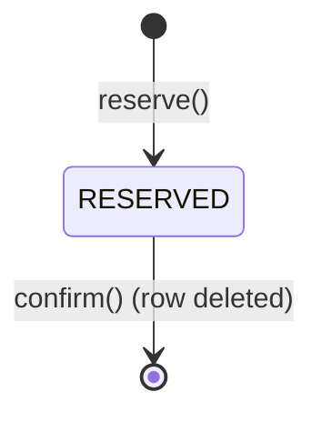
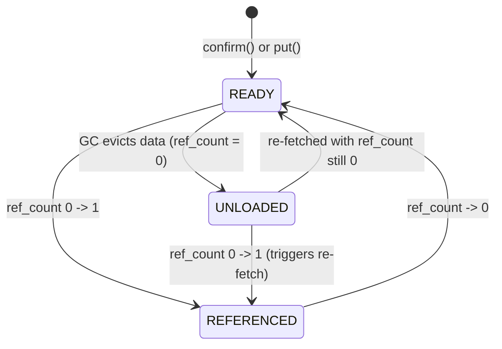
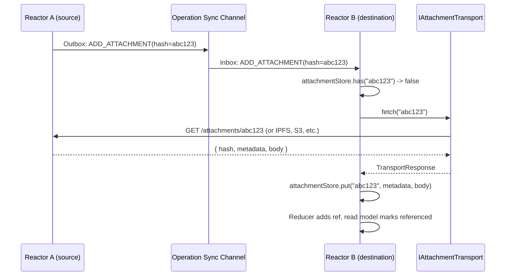
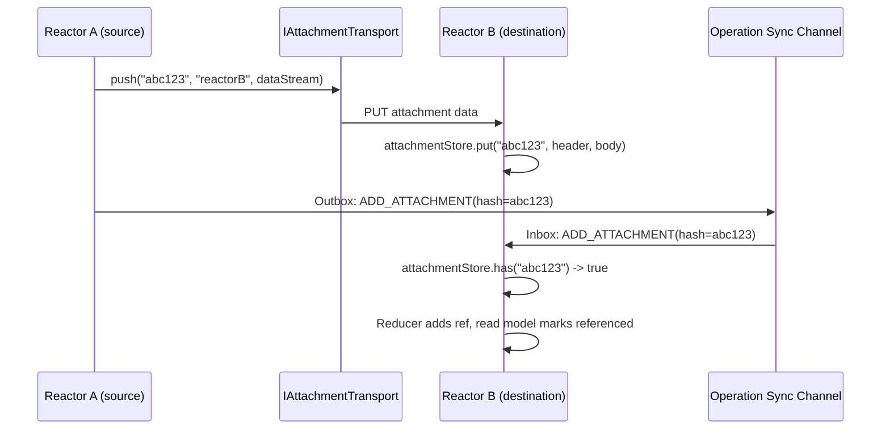
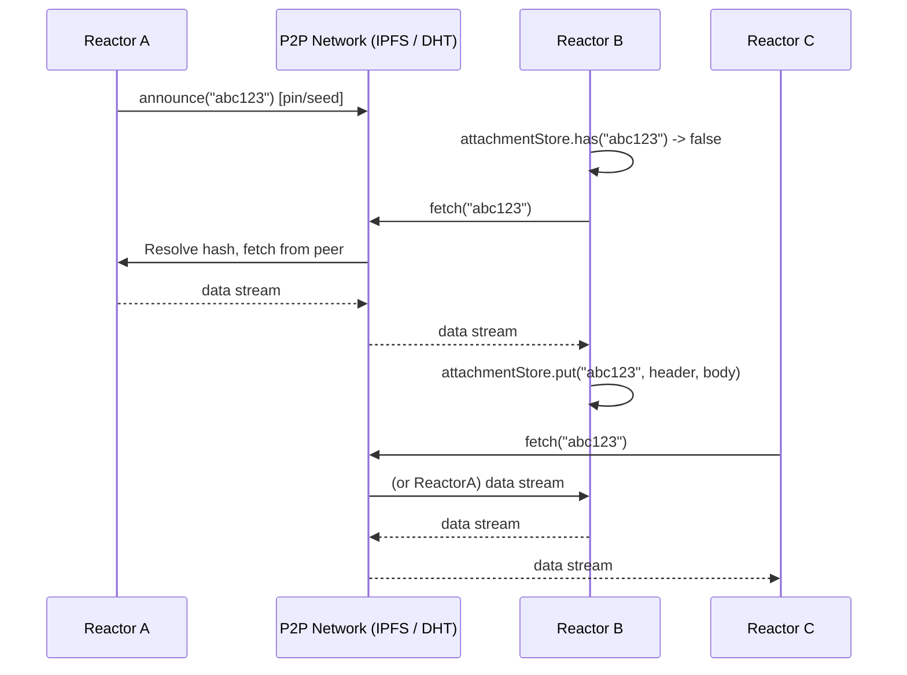
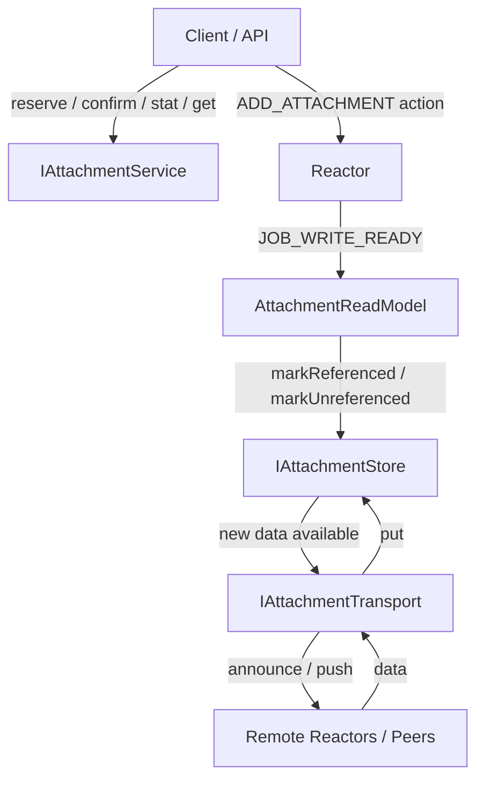
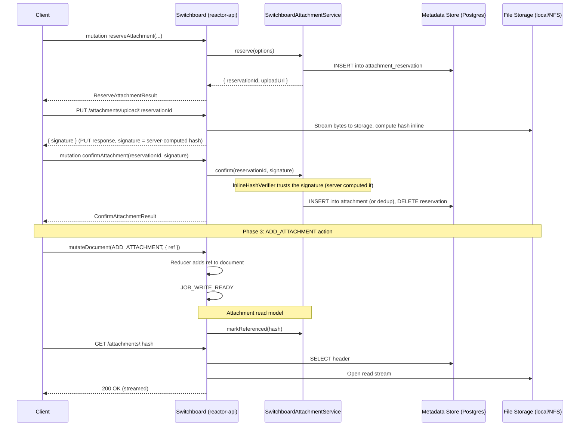
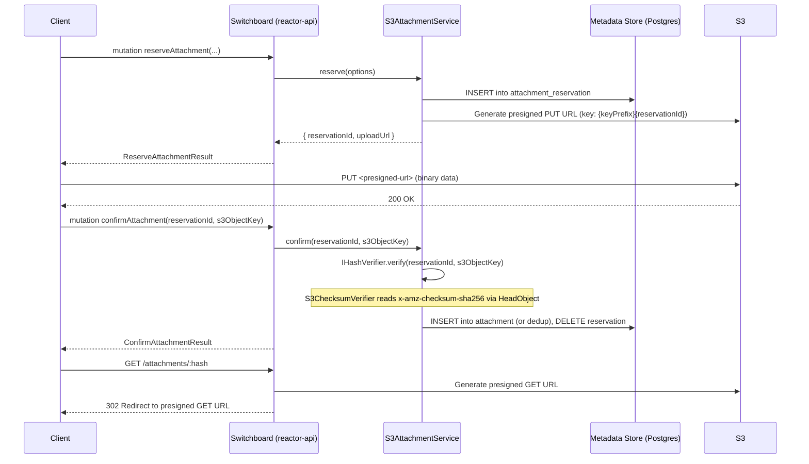
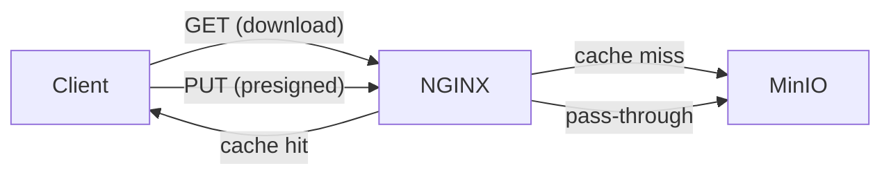

# Attachments

## Summary

Attachments are binary files that accompany documents. The attachment system provides a multi-phase upload flow that decouples attachment data from the action/operation pipeline:

1. **Reserve** -- The client requests an attachment slot and receives an upload URL.
2. **Upload** -- The client uploads binary data directly to that URL.
3. **Reference** -- The client dispatches an `ADD_ATTACHMENT` core action on the document.

This design allows the upload target to change without affecting the client protocol. The initial implementation proxies uploads through switchboard. A later implementation issues S3 presigned URLs so clients upload directly to object storage. The content-addressed design (hash-based identity) also supports p2p transfer mechanisms.

## Current State

Attachments are currently inlined as base64-encoded `data` fields on every action and operation. This has several problems:

- Operations carry the full binary payload through the job queue, sync channels, and GraphQL transport.
- Large files bloat the operation store and increase sync bandwidth.
- There is no way to upload an attachment independently of submitting an action.
- There is no lifecycle tracking -- attachments either exist (inline) or they don't.

The `Attachment` type today (`packages/shared/document-model/actions.ts`):

```ts
type Attachment = {
  data: string; // base64
  mimeType: string;
  extension?: string | null;
  fileName?: string | null;
};

type AttachmentInput = Attachment & {
  hash: string;
};
```

## Design

### Principles

1. **Content-addressed.** Every attachment is identified by the hash of its data. Two identical files produce the same hash and can be deduplicated. This is the foundation for p2p transfer -- any peer that has the bytes can serve them.

2. **Transport-agnostic.** The mechanism for moving bytes between reactors is pluggable (`IAttachmentTransport`), just as `IChannel`/`IChannelFactory` is pluggable for operation sync. Switchboard, S3, IPFS, BitTorrent, or a simple HTTP exchange are all valid transports.

3. **Two-layer sync.** Operation sync (existing channels) carries `ADD_ATTACHMENT`/`REMOVE_ATTACHMENT` core actions that declare _which_ attachments a document uses. Attachment data sync (`IAttachmentTransport`) moves the _bytes_. These are independent -- a reactor may receive the operation referencing an attachment before the data is available locally.

4. **Core actions for relationships.** `ADD_ATTACHMENT` and `REMOVE_ATTACHMENT` are core actions on the base document-model reducer (alongside `SET_NAME`, `PRUNE`, and `LOAD_STATE` in `_baseReducer`; `UNDO` and `REDO` are handled separately by `processUndoRedo()` before the base reducer runs). They record the document-to-attachment mapping in the operation history and give sync channels the information needed to trigger data transfer.

### Attachment Lifecycle

Reservations and attachments have separate lifecycles. A reservation lives in `attachment_reservation` and is transient. An attachment lives in `attachment` and is permanent (metadata is never deleted).

**Reservation lifecycle** (in `attachment_reservation`):



Reservations do not expire. Upload URL expiry (e.g. presigned URL TTL) is the upload target's concern. If a URL expires before the client finishes uploading, the client requests a new URL; the reservation itself remains valid. Reservations are only removed when `confirm()` succeeds (promoting the data to the `attachment` table).

**Attachment lifecycle** (in `attachment`):



| Status       | Meaning                                                      |
| ------------ | ------------------------------------------------------------ |
| `READY`      | Data is available locally. Can be served and referenced.     |
| `REFERENCED` | ref_count > 0 and data is available locally.                 |
| `UNLOADED`   | Data evicted. Metadata retained. Re-fetchable via transport. |

`ref_count` and `status` are independent concerns. `ref_count` tracks how many documents reference the attachment. `status` tracks whether data is available locally. The valid combinations:

| ref_count | status     | Meaning                                                        |
| --------- | ---------- | -------------------------------------------------------------- |
| 0         | READY      | Data available, no references. GC-eligible after grace period. |
| > 0       | REFERENCED | Data available, actively referenced. Normal steady state.      |
| 0         | UNLOADED   | Data evicted, no references. Inert.                            |
| > 0       | UNLOADED   | Data needed but not yet available. Re-fetch in progress.       |

Transitions:

- `READY -> REFERENCED`: `ref_count` incremented above 0 by the attachment read model after `ADD_ATTACHMENT`.
- `REFERENCED -> READY`: `ref_count` decremented to 0 after `REMOVE_ATTACHMENT`. Attachment is now GC-eligible.
- `READY -> UNLOADED`: GC evicts data for attachments with `ref_count = 0` past the grace period. Metadata is retained.
- `UNLOADED -> REFERENCED`: `markReferenced()` increments `ref_count` above 0 while data is evicted and triggers a re-fetch via the store-transport pair. When the transport delivers the data, `put()` restores it and sets status to `REFERENCED` (because `ref_count > 0`).
- `UNLOADED -> READY`: `put()` restores data while `ref_count` is still 0 (e.g., speculative prefetch). Unlikely in practice.

GC only acts on `ref_count = 0`. An `UNLOADED` attachment with `ref_count > 0` is never evicted -- it is awaiting re-fetch.

**Unloading is a data eviction, not a logical delete.** The metadata record is always retained so the hash remains known. If the attachment is needed again, it is re-fetched through the transport layer -- the same mechanism used for pending attachments during sync. The behavior of eviction depends on the storage backend:

- **Mutable backends** (local disk, S3/MinIO): The implementation removes the data files to reclaim space.
- **Immutable backends** (IPFS, content-addressed stores): Unloading means unpinning / ceasing to serve, not erasure.

### Core Actions

`ADD_ATTACHMENT` and `REMOVE_ATTACHMENT` are base document actions, handled by `_baseReducer` alongside `SET_NAME`, `PRUNE`, and `LOAD_STATE`. (`UNDO` and `REDO` are handled earlier by `processUndoRedo()` in `baseReducer`, before `_baseReducer` is called.)

#### ADD_ATTACHMENT

Records that a document uses a specific attachment. The reducer adds the ref to the document's attachment set. The document does not store attachment metadata -- that is the `IAttachmentService`'s responsibility. The document only tracks _which_ refs it uses.

```ts
type AddAttachmentInput = {
  ref: AttachmentRef;
};
```

#### REMOVE_ATTACHMENT

Records that a document no longer uses a specific attachment.

```ts
type RemoveAttachmentInput = {
  ref: AttachmentRef;
};
```

#### Reducer

The base reducer handles both actions by managing a simple set of refs on the document:

```ts
// In _baseReducer, alongside SET_NAME, PRUNE, LOAD_STATE:
case "ADD_ATTACHMENT":
  return addAttachmentOperation(document, parsedAction.input);

case "REMOVE_ATTACHMENT":
  return removeAttachmentOperation(document, parsedAction.input);
```

```ts
type PHDocument<TState> = {
  header: PHDocumentHeader;
  state: TState;
  operations: DocumentOperations;
  // ...existing fields...
  attachments: AttachmentRef[]; // set semantics -- no duplicates
};
```

The reducer is pure -- it has no dependency on `IAttachmentService`. It enforces set semantics: `ADD_ATTACHMENT` is a no-op if the ref is already present, and `REMOVE_ATTACHMENT` removes the ref entirely (not just the first occurrence). Metadata (mimeType, size, hash, etc.) is retrieved at read time via `IAttachmentService.stat()` when the application needs it.

`isDocumentAction()` (`documents.ts:162`) must also be updated to include `ADD_ATTACHMENT` and `REMOVE_ATTACHMENT`. Generated reducers use this guard to skip base document actions (returning state unchanged), so without the update, generated reducers would attempt to process these actions instead of deferring to `_baseReducer`.

This keeps a clean separation:

- **Document** knows _which_ attachments it uses (refs).
- **IAttachmentService** knows _what_ each attachment is (metadata, retrieval, client upload flow).
- **IAttachmentStore** manages local data and reference counts for the reactor.
- **IAttachmentTransport** moves attachment bytes between reactors, paired with the store.

Garbage collection uses the refs stored on documents to determine which attachments are still in use across the system.

### Types

```ts
/**
 * Content hash of the attachment data. This is the primary identifier.
 * Format is algorithm-dependent, e.g. SHA-256 hex.
 */
type AttachmentHash = string;

/**
 * A reference to an attachment, used in document state and action inputs.
 * Format: `attachment://v<version>:<hash>`
 *
 * The version prefix allows changing the hash algorithm, encoding, or
 * length without leaking implementation details into the ref format.
 * Version 1 is defined as SHA-256 hex.
 *
 * Using the hash as the ref makes attachments content-addressable:
 * any peer that has the bytes for a given hash can serve the attachment.
 */
type AttachmentRef = `attachment://v${number}:${string}`;

/**
 * Status of an attachment in its lifecycle.
 */
type AttachmentStatus = "ready" | "referenced" | "unloaded";

/**
 * Metadata about an attachment. Only exists after data is stored
 * (via confirm for client uploads, or put for sync).
 */
type AttachmentHeader = {
  hash: AttachmentHash;
  mimeType: string;
  fileName: string; // base name without extension, e.g. "photo"
  sizeBytes: number;
  extension: string | null; // e.g. "png", null if unknown
  status: AttachmentStatus;
  source: "local" | "sync";
  createdAtUtc: string; // ISO 8601
};

/**
 * Metadata provided alongside attachment data during sync.
 * The remaining fields (hash, status, source, createdAtUtc) are
 * set by the store when it creates the attachment record.
 */
type AttachmentMetadata = {
  mimeType: string;
  fileName: string; // base name without extension
  sizeBytes: number;
  extension: string | null;
};

/**
 * Options provided when reserving an attachment slot.
 */
type ReserveAttachmentOptions = {
  mimeType: string;
  fileName: string; // base name without extension, e.g. "photo"
  extension?: string | null; // e.g. "png", null if unknown
};

/**
 * Result of reserving an attachment slot.
 */
type ReserveAttachmentResult = {
  /** Temporary ID used until the hash is known */
  reservationId: string;
  /** URL to upload the binary data to (PUT request) */
  uploadUrl: string;
  /** HTTP headers to include in the upload request */
  uploadHeaders: Record<string, string>;
  /** Timestamp after which the upload URL is no longer valid */
  expiresAtUtc: string; // ISO 8601
};

/**
 * Opaque proof that data was uploaded. The service passes this
 * to its configured IHashVerifier to resolve a verified hash.
 */
type UploadSignature = string;

/**
 * Result of confirming an upload has completed.
 */
type ConfirmAttachmentResult = {
  /** The content hash, now known after upload */
  hash: AttachmentHash;
  /** The ref to use in ADD_ATTACHMENT actions */
  ref: AttachmentRef;
  header: AttachmentHeader;
};

/**
 * Parameters for retrieving attachment data.
 */
type GetAttachmentParams = {
  range?: string;
};

/**
 * Response when retrieving attachment data from the local store.
 * Includes full AttachmentHeader with local reactor concerns
 * (status, source, ref_count-derived semantics).
 */
type AttachmentResponse = {
  header: AttachmentHeader;
  body: ReadableStream<Uint8Array>;
};

/**
 * Response when fetching attachment data from a remote transport.
 * Lighter than AttachmentResponse -- a remote peer cannot meaningfully
 * populate status or source, which are local reactor concerns.
 * The store assigns those fields when it calls put() on receipt.
 */
type TransportResponse = {
  hash: AttachmentHash;
  metadata: AttachmentMetadata;
  body: ReadableStream<Uint8Array>;
};
```

### IAttachmentService

The client-facing interface for the multi-phase upload flow: reserve a slot, confirm the upload, query metadata, and retrieve data. This is what applications (editors, Connect, CLI tools) interact with.

```ts
interface IAttachmentService {
  /**
   * Reserve a new attachment slot.
   * Returns an upload URL. The caller uploads data to that URL.
   */
  reserve(options: ReserveAttachmentOptions): Promise<ReserveAttachmentResult>;

  /**
   * Confirm that an upload has completed.
   * Creates an attachment record (or returns existing on dedup).
   * Returns the content hash and ref.
   *
   * The caller provides a signature -- an opaque proof that the
   * data was uploaded. The service delegates validation to its
   * configured IHashVerifier, which resolves the signature to
   * a verified AttachmentHash. This avoids requiring the service
   * to download and re-hash the data.
   *
   * Dedup: if an attachment with the verified hash already exists,
   * confirm() returns the existing ref rather than rejecting.
   * Content-addressed storage means identical uploads converge
   * on the same hash -- the second upload is a no-op.
   *
   * Always client-initiated via the confirmAttachment mutation.
   */
  confirm(
    reservationId: string,
    signature: UploadSignature,
  ): Promise<ConfirmAttachmentResult>;

  /**
   * Get attachment metadata by ref.
   */
  stat(ref: AttachmentRef): Promise<AttachmentHeader>;

  /**
   * Retrieve attachment data.
   * Only succeeds for attachments in READY or REFERENCED status.
   */
  get(
    ref: AttachmentRef,
    params?: GetAttachmentParams,
    signal?: AbortSignal,
  ): Promise<AttachmentResponse>;
}
```

### IHashVerifier

Resolves an `UploadSignature` to a verified `AttachmentHash`. The service delegates hash verification here so that `confirm()` never needs to download and re-hash the data. Each deployment configures the verifier that matches its upload target.

```ts
interface IHashVerifier {
  /**
   * Verify the signature and return the content hash and size.
   * Throws if the signature is invalid or cannot be verified.
   */
  verify(
    reservationId: string,
    signature: UploadSignature,
  ): Promise<{ hash: AttachmentHash; sizeBytes: number }>;
}
```

Built-in implementations:

| Verifier             | How it works                                                                                                                                                                        | When to use                            |
| -------------------- | ----------------------------------------------------------------------------------------------------------------------------------------------------------------------------------- | -------------------------------------- |
| `InlineHashVerifier` | The upload endpoint computes the hash and size while streaming bytes to disk. The signature encodes both (e.g. `hash:sizeBytes`), already trusted because the server computed them. | Switchboard-proxied uploads            |
| `S3ChecksumVerifier` | Reads the `x-amz-checksum-sha256` and `Content-Length` from the S3 object (via `HeadObject`). The signature is the S3 object key.                                                   | S3/MinIO uploads with checksum enabled |

Custom implementations can use any verification scheme (e.g., a signed token from a CDN edge, a notarized receipt from IPFS).

### IAttachmentStore

The reactor-facing interface for managing local attachment data. The attachment read model calls `markReferenced`/`markUnreferenced` for reference tracking. The `IAttachmentTransport` calls `put` when it receives data from a remote. The store notifies its configured transport when new data arrives (via `put` or after a client upload is confirmed), forming a bidirectional store-transport pair.

It is intentionally separate from `IAttachmentService` -- the client upload flow and the reactor's internal data management are different concerns, even when a single class implements both.

```ts
interface IAttachmentStore {
  /**
   * Check whether attachment data is available locally.
   * Returns true if the bytes can be served from this reactor's store.
   */
  has(hash: AttachmentHash): Promise<boolean>;

  /**
   * Retrieve attachment header and data stream by hash.
   * Returns null if the attachment is not available locally
   * (unloaded or not yet synced).
   */
  get(hash: AttachmentHash): Promise<AttachmentResponse | null>;

  /**
   * Store attachment data received from a remote (during sync or re-fetch).
   * Used by IAttachmentTransport implementations to write
   * data into the local store.
   *
   * Behavior depends on existing state:
   * - No existing row: INSERT with source='sync'. Derives ref_count
   *   from the attachment_ref table (COUNT of matching refs). Sets
   *   status based on derived ref_count (> 0 -> 'referenced',
   *   0 -> 'ready').
   * - Existing row with status='unloaded': restore data, set status
   *   based on current ref_count (ref_count > 0 -> 'referenced',
   *   ref_count = 0 -> 'ready').
   * - Existing row with any other status: no-op (dedup).
   */
  put(
    hash: AttachmentHash,
    header: AttachmentMetadata,
    data: ReadableStream<Uint8Array>,
  ): Promise<void>;

  /**
   * Increment the reference count for an attachment.
   * Called by the attachment read model after an ADD_ATTACHMENT
   * operation is committed.
   *
   * If no attachment row exists (sync path -- the operation arrived
   * before the data), the store defers the increment. The ref is
   * tracked in attachment_ref; when put() later creates the row,
   * it derives ref_count from the attachment_ref table so the
   * count is correct on arrival. listPending() uses a LEFT JOIN
   * against attachment to find refs with no row or UNLOADED status.
   *
   * If the row exists and ref_count transitions from 0 to 1,
   * the store updates status to 'referenced'. If the row is
   * currently UNLOADED, the store also triggers a re-fetch via the
   * transport (status transitions to REFERENCED when data arrives).
   */
  markReferenced(hash: AttachmentHash): Promise<void>;

  /**
   * Decrement the reference count for an attachment.
   * Called by the attachment read model after a REMOVE_ATTACHMENT
   * operation is committed. When ref_count reaches 0, the store
   * updates status back to 'ready' (eligible for GC).
   */
  markUnreferenced(hash: AttachmentHash): Promise<void>;

  /**
   * Unload attachment data.
   *
   * Evicts the local bytes and sets status to 'unloaded'. The
   * metadata record is retained so the hash is still known. If the
   * attachment is referenced again (ref_count goes back above 0),
   * the store-transport pair re-fetches the data from a peer --
   * the same path used for pending attachments during sync.
   *
   * On immutable backends (IPFS), this unpins/stops serving
   * rather than deleting.
   */
  unload(hash: AttachmentHash): Promise<void>;

  /**
   * List attachments referenced by local documents that are not
   * yet available in the local store.
   */
  listPending(): Promise<AttachmentHash[]>;

  /**
   * Register a callback for when a pending attachment becomes available.
   */
  onAvailable(callback: (event: AttachmentAvailableEvent) => void): () => void;
}
```

A single implementation class can implement both interfaces:

```ts
class SwitchboardAttachmentManager
  implements IAttachmentService, IAttachmentStore { ... }
```

### IAttachmentTransport

The `IAttachmentTransport` interface handles moving attachment bytes between reactors. It forms a bidirectional pair with `IAttachmentStore`:

- **Outbound**: The store notifies the transport when new data is available. The transport announces or pushes to peers.
- **Inbound**: The transport receives data from peers and calls `IAttachmentStore.put()` to store it locally.

This mirrors the role of `IChannel` for operation sync -- `IChannel` moves operations, `IAttachmentTransport` moves attachment data.

Different transports serve different topologies:

| Transport        | Topology      | How it works                                             |
| ---------------- | ------------- | -------------------------------------------------------- |
| Switchboard HTTP | Client-server | Fetch from the remote's attachment service endpoint      |
| S3               | Client-server | Redirect to presigned GET URLs                           |
| IPFS             | P2P           | Resolve by content hash via IPFS gateway or local node   |
| BitTorrent       | P2P           | Swarm around content hash (magnet link)                  |
| Reactor Direct   | P2P           | Direct HTTP fetch from peer reactor's attachment service |

```ts
/**
 * Transport for moving attachment data between reactors.
 *
 * Forms a bidirectional pair with IAttachmentStore. The store calls
 * announce/push when new data arrives locally. The transport calls
 * store.put() when data arrives from a remote.
 */
interface IAttachmentTransport {
  /**
   * Fetch attachment data by hash from a remote source.
   *
   * The transport resolves the hash to a data source (server endpoint,
   * S3 presigned URL, IPFS CID, peer reactor, etc.) and returns a stream.
   *
   * @param hash - Content hash of the attachment
   * @param signal - Abort signal for cancellation
   * @returns The attachment data with metadata, or null if not available.
   *          Returns TransportResponse (not AttachmentResponse) because
   *          remote peers cannot populate local concerns like status/source.
   */
  fetch(
    hash: AttachmentHash,
    signal?: AbortSignal,
  ): Promise<TransportResponse | null>;

  /**
   * Announce that this reactor has attachment data available.
   *
   * For server-centric transports, this may be a no-op (the server
   * already has the data after upload). For p2p transports, this
   * registers the data in the network (e.g., IPFS pin, BitTorrent seed).
   */
  announce(hash: AttachmentHash): Promise<void>;

  /**
   * Push attachment data to a specific remote.
   *
   * Used for eager replication strategies where the source reactor
   * pushes data to known peers rather than waiting for pull requests.
   *
   * @param hash - Content hash of the attachment
   * @param remote - Target remote identifier
   * @param data - The attachment data stream
   */
  push(
    hash: AttachmentHash,
    remote: string,
    data: ReadableStream<Uint8Array>,
  ): Promise<void>;
}

/**
 * Factory for creating attachment transport instances.
 * Mirrors IChannelFactory for operation sync.
 */
interface IAttachmentTransportFactory {
  instance(config: AttachmentTransportConfig): IAttachmentTransport;
}

type AttachmentTransportConfig = {
  type: string;
  parameters: Record<string, unknown>;
};
```

### Attachment Sync Flow

Attachment sync is triggered by operation sync. When a reactor receives operations containing `ADD_ATTACHMENT` actions, it needs to acquire the referenced attachment data.

#### Pull-based sync (default)



#### Push-based sync (eager replication)

For scenarios where the source reactor wants to ensure data is available before the operation arrives (or where the destination cannot initiate connections):



#### P2P sync

In a p2p topology, there is no central server. Reactors discover attachment data through the content hash:



### Pending Attachments and Availability

A reactor may receive an `ADD_ATTACHMENT` operation before the attachment data is available locally. This is expected and must be handled gracefully:

1. The `ADD_ATTACHMENT` action is committed to the document's operation history regardless of whether the data is local. The operation is valid -- it records the fact that the attachment exists.

2. The reactor tracks "pending" attachments -- those referenced by committed operations but not yet available locally. This is an `IAttachmentStore` concern, not a document state concern. See `IAttachmentStore.listPending()` and `IAttachmentStore.onAvailable()`.

3. The store-transport pair handles fetching pending attachment data in the background. The transport fetches and calls `IAttachmentStore.put()` to store it locally.

4. When application code (e.g., an editor) tries to `get()` a pending attachment via `IAttachmentService`, the service can either block until available, return a "not yet available" error, or return a placeholder -- this is configurable per use case.

5. `IAttachmentStore` emits events via `onAvailable()` when pending attachments become available, allowing the UI to update.

### Attachment Read Model

The attachment read model subscribes to `JOB_WRITE_READY` events and manages the attachment lifecycle in response to committed operations. This follows the same pattern as the sync read model (`ISyncManager`) and the document view read model (`IDocumentView`).

The read model is registered with `IReadModelCoordinator` and implements `IReadModel`. It has no interaction with the executor or reducer -- it only reacts to committed operations after the fact.



The store and transport form a bidirectional pair -- similar to how a sync channel's inbox and outbox work together. When the store receives new attachment data (via client upload or `put`), it notifies the transport, which announces or pushes to peers. When the transport receives data from a peer, it writes to the store via `put`.

Responsibilities of the attachment read model:

1. **Reference counting**: The read model inspects the `action.type` of each committed operation:
   - `ADD_ATTACHMENT`: call `markReferenced()` for the ref in the action input.
   - `REMOVE_ATTACHMENT`: call `markUnreferenced()` for the ref in the action input.
   - All other action types: ignored.

   This is simple and sufficient for the normal path. The read model does not need access to `resultingState` or any document state -- it reacts purely to the operation stream.

   **UNDO/REDO and ref_count drift**: UNDO produces a NOOP operation with a `skip` value; it does not produce an inverse `REMOVE_ATTACHMENT` or `ADD_ATTACHMENT`. This means the read model cannot adjust ref_count from the NOOP alone. As a result, ref_count may drift after undo/redo sequences involving attachment actions. The consequences are bounded:
   - **ref_count too high** (e.g., UNDO of ADD not decremented): the attachment stays referenced longer than necessary, delaying GC. Not harmful -- just wasted storage.
   - **ref_count too low** (e.g., UNDO of REMOVE not incremented): the attachment becomes GC-eligible while still logically referenced. The data may be unloaded, but unloaded attachments retain metadata and are re-fetchable via the transport.

   A periodic **reconciliation pass** corrects drift by scanning all documents' `attachments` arrays and recomputing ref_count from the actual refs in use. This can run on a longer interval than GC (e.g., daily) since drift is uncommon and its effects are recoverable.

2. **Garbage collection**: Periodically scans for attachments with `ref_count = 0` past their grace period and calls `IAttachmentStore.unload()` to evict their data.

The read model does not interact with `IAttachmentTransport`. Data availability and replication are handled by the store-transport pair directly.

### Client Integration

The client interacts only with `IAttachmentService`. The executor and reducer are pure -- they have no dependency on attachment interfaces.

1. **Upload**: Client calls `reserve()`, uploads data to the URL, then calls `confirm()` with the signature from the upload response. The service verifies the signature, creates the attachment record, and returns the ref. The store notifies the transport, which announces to peers.

2. **Attach**: Client dispatches `ADD_ATTACHMENT` core action. The reducer adds the ref to the document. The read model updates reference counts asynchronously.

3. **Download**: Client calls `IAttachmentService.get()` to retrieve attachment data.

4. **Remove**: Client dispatches `REMOVE_ATTACHMENT`. The reducer removes the ref. The read model updates reference counts; GC handles eventual cleanup.

5. **Validation** (optional): If attachment readiness should be checked before accepting the action, this belongs at the API boundary (e.g., the GraphQL resolver calls `IAttachmentService.stat()` before forwarding to `reactor.execute()`). The executor and reducer remain pure.

### Usage

#### Client: Upload and attach

```ts
// 1. Reserve a slot
const reservation = await attachmentService.reserve({
  mimeType: "image/png",
  fileName: "diagram.png",
  extension: "png",
});

// 2. Upload data to the provided URL.
//    The server computes the content hash and returns it in the response.
const uploadResponse = await fetch(reservation.uploadUrl, {
  method: "PUT",
  headers: {
    ...reservation.uploadHeaders,
    "Content-Type": "image/png",
  },
  body: file,
});
const { signature } = await uploadResponse.json();

// 3. Confirm and get the ref (may happen automatically depending on impl).
//    The signature is an opaque proof of upload returned by the upload target.
//    The service validates it via its configured IHashVerifier.
const { ref, hash } = await attachmentService.confirm(
  reservation.reservationId,
  signature,
);

// 4. Dispatch ADD_ATTACHMENT core action
await reactor.execute(docId, "main", [
  {
    type: "ADD_ATTACHMENT",
    input: { ref },
    scope: "global",
  },
]);

// 5. Now use the ref in a domain action
await reactor.execute(docId, "main", [
  {
    type: "SET_COVER_IMAGE",
    input: { imageRef: ref },
    scope: "global",
  },
]);
```

#### Client: Download an attachment

```ts
const response = await attachmentService.get("attachment://abc123def");
console.log(response.header.mimeType); // "image/png"
await response.body.pipeTo(destination);
```

#### GraphQL API

```graphql
type ReserveAttachmentResult {
  reservationId: String!
  uploadUrl: String!
  uploadHeaders: JSONObject!
  expiresAtUtc: String!
}

type ConfirmAttachmentResult {
  hash: String!
  ref: String!
}

type AttachmentHeader {
  hash: String!
  mimeType: String!
  fileName: String!
  sizeBytes: Int!
  extension: String
  status: String!
  source: String!
  createdAtUtc: String!
}

type Mutation {
  reserveAttachment(
    mimeType: String!
    fileName: String!
    extension: String
  ): ReserveAttachmentResult!

  confirmAttachment(
    reservationId: String!
    signature: String!
  ): ConfirmAttachmentResult!
}

type Query {
  attachment(hash: String!): AttachmentHeader
}
```

Attachment data retrieval uses a REST endpoint to support streaming and range requests:

```
GET /attachments/:hash
```

## Package Structure

```
packages/
  reactor/
    src/
      attachments/
        interfaces.ts        # IAttachmentService, IAttachmentStore, IAttachmentTransport
        types.ts             # AttachmentStatus, AttachmentHeader, etc.
        index.ts             # Re-exports

  shared/
    document-model/
      actions.ts             # ADD_ATTACHMENT, REMOVE_ATTACHMENT action types
      reducer.ts             # Core action handling in _baseReducer
      documents.ts           # AttachmentRef[] on PHDocument

  attachment-service/        # New package
    src/
      switchboard/           # Switchboard-backed implementation
        switchboard-attachment-service.ts
        switchboard-attachment-transport.ts
        upload-handler.ts
      s3/                    # S3-backed implementation
        s3-attachment-service.ts
        s3-attachment-transport.ts
        s3-event-handler.ts
      p2p/                   # P2P transport implementations
        ipfs-attachment-transport.ts
        direct-attachment-transport.ts
      storage/
        interfaces.ts        # IAttachmentMetadataStore
        kysely/              # Postgres metadata storage
      index.ts
```

The interface and types live in `reactor/` so they can be imported by the reactor core without depending on any implementation. The core action types and reducer logic live in `shared/document-model/` alongside the existing core actions. The `attachment-service` package contains concrete implementations.

## Implementation: Switchboard-Backed

The initial implementation where switchboard acts as both the reservation endpoint and the upload target. The `SwitchboardAttachmentTransport` fetches data from remote switchboard instances via HTTP.

### Flow



### Switchboard Attachment Transport

When a switchboard instance receives synced operations with `ADD_ATTACHMENT`, it uses `SwitchboardAttachmentTransport` to fetch data from the source:

```ts
class SwitchboardAttachmentTransport implements IAttachmentTransport {
  async fetch(hash: AttachmentHash, signal?: AbortSignal) {
    // Fetch from the remote switchboard's REST endpoint
    const response = await fetch(`${this.remoteUrl}/attachments/${hash}`, {
      signal,
      headers: this.authHeaders(),
    });
    // ...
  }

  async announce(hash: AttachmentHash) {
    // No-op for switchboard -- data is already on the server after upload
  }

  async push(hash: AttachmentHash, remote: string, data: ReadableStream) {
    // PUT to the remote switchboard's attachment endpoint
    await fetch(`${remoteUrl}/attachments/${hash}`, {
      method: "PUT",
      body: data,
      headers: this.authHeaders(),
    });
  }
}
```

### Storage

Attachment metadata is stored in Postgres. Attachment data is stored on the local filesystem or a mounted volume.

Reservations and attachments are separate tables. A reservation is transient
upload coordination; an attachment is a permanent content-addressed record.
This separation gives `put()` (sync path) a clean entry point that does not
require a reservation.

```sql
-- Transient: tracks in-progress client uploads.
-- Rows are created by reserve() and removed by confirm().
CREATE TABLE attachment_reservation (
  reservation_id  TEXT PRIMARY KEY,
  mime_type       TEXT NOT NULL,
  file_name       TEXT NOT NULL,
  extension       TEXT,
  upload_url      TEXT NOT NULL,
  created_at_utc  TEXT NOT NULL   -- ISO 8601
);

-- Permanent: content-addressed attachment metadata.
-- Rows are created by confirm() (client upload) or put() (sync).
CREATE TABLE attachment (
  hash              TEXT PRIMARY KEY,
  mime_type         TEXT NOT NULL,
  file_name         TEXT NOT NULL,
  size_bytes        BIGINT NOT NULL,
  extension         TEXT,
  ref_count         INTEGER NOT NULL DEFAULT 0,
  status            TEXT NOT NULL DEFAULT 'ready',
  storage_path      TEXT NOT NULL,
  source            TEXT NOT NULL DEFAULT 'local', -- 'local' | 'sync'
  created_at_utc    TEXT NOT NULL,   -- ISO 8601
  referenced_at_utc TEXT             -- ISO 8601
);

CREATE INDEX idx_attachment_status ON attachment(status);

-- Read model state: tracks which refs each (document, scope, branch)
-- currently holds. Used by the read model to track ADD/REMOVE operations
-- and by put() to derive ref_count when creating a new attachment row.
CREATE TABLE attachment_ref (
  document_id TEXT NOT NULL,
  scope       TEXT NOT NULL,
  branch      TEXT NOT NULL,
  ref         TEXT NOT NULL,  -- AttachmentRef (e.g. "attachment://<hash>")
  PRIMARY KEY (document_id, scope, branch, ref)
);
```

**How each path writes:**

- **`reserve()`** inserts into `attachment_reservation`. No attachment row yet.
- **`confirm(reservationId, signature)`** reads the reservation, delegates to `IHashVerifier` to resolve the signature to a verified hash, inserts into `attachment` (or returns existing ref on dedup), then deletes the reservation.
- **`put(hash, header, data)`** inserts directly into `attachment`. Derives `ref_count` from `attachment_ref` (COUNT of matching refs) and sets status accordingly (`ref_count > 0` -> `referenced`, `0` -> `ready`). If the hash already exists and the row is `UNLOADED`, restores the data and updates status based on current `ref_count`. If the hash exists with any other status, it is a no-op (dedup). No reservation involved.
- **GC** unloads unreferenced attachments past the grace period.

### Garbage Collection

A periodic task runs to:

1. Unload `READY` attachments (ref_count = 0) past a configurable grace period (default: 24 hours) -- evicts data, retains metadata.
2. For mutable backends: remove data files for `UNLOADED` attachments. For immutable backends: unpin/stop serving.

Reservations are not garbage-collected. They are removed only by `confirm()`. Abandoned reservations are inert (no data, no storage cost beyond the row) and can be cleaned up manually if needed.

### Limitations

- Upload bandwidth is limited by the switchboard instance's network and disk I/O.
- No CDN or edge caching for downloads.
- Single point of failure for the upload path.

## Implementation: S3-Backed

The production implementation where clients upload directly to S3 via presigned URLs. Switchboard handles reservation and metadata but never touches the attachment bytes.

### Flow



### S3 Attachment Transport

```ts
class S3AttachmentTransport implements IAttachmentTransport {
  async fetch(hash: AttachmentHash, signal?: AbortSignal) {
    // Generate presigned GET URL and fetch
    const url = await this.generatePresignedGetUrl(hash);
    const response = await fetch(url, { signal });
    // ...
  }

  async announce(hash: AttachmentHash) {
    // No-op -- data is in S3, accessible to anyone with the presigned URL
  }

  async push(hash: AttachmentHash, remote: string, data: ReadableStream) {
    // Upload to S3 on behalf of the remote
    const url = await this.generatePresignedPutUrl(hash);
    await fetch(url, { method: "PUT", body: data });
  }
}
```

### Confirmation

Confirmation is always client-initiated. After uploading to S3, the client calls `confirmAttachment` with the S3 object key as the `UploadSignature`. The service delegates to `S3ChecksumVerifier`, which reads `x-amz-checksum-sha256` from the object via `HeadObject` -- no download required.

The S3 object key for uploads is always `{keyPrefix}{reservationId}`. This convention allows the verifier to map from the signature back to the reservation record. S3 uploads must be configured with `x-amz-checksum-algorithm: SHA256` (included in `uploadHeaders` from `reserve()`) so that the checksum is available for verification.

### Garbage Collection

S3 lifecycle rules can handle optional physical cleanup on this mutable backend:

- The metadata store GC unloads unreferenced `READY` attachments.
- S3 lifecycle rules can optionally remove objects tagged `status=unloaded` after a retention period.
- Metadata records are always retained in Postgres. Physical removal of S3 objects is optional.

## Implementation: Self-Hosted (MinIO + NGINX)

For deployments that need S3-compatible storage without depending on AWS. This uses the same `S3AttachmentService` and `S3AttachmentTransport` implementations as the AWS S3 path -- MinIO is API-compatible, so no code changes are needed.

### Architecture



- **MinIO** (community fork: [pgsty/minio](https://github.com/pgsty/minio)) provides the S3-compatible API: presigned PUT/GET URLs, multipart upload, bucket lifecycle rules.
- **NGINX** sits in front as a reverse proxy providing TLS termination, HTTP/2, and `proxy_cache` for download requests.

### MinIO Configuration

```yaml
# docker-compose example
services:
  minio:
    image: pgsty/minio:latest
    command: server /data --console-address ":9001"
    environment:
      MINIO_ROOT_USER: admin
      MINIO_ROOT_PASSWORD: ${MINIO_ROOT_PASSWORD}
      # Enable S3 event notifications via webhook
      MINIO_NOTIFY_WEBHOOK_ENABLE_ATTACHMENTS: "on"
      MINIO_NOTIFY_WEBHOOK_ENDPOINT_ATTACHMENTS: "http://switchboard:3000/webhooks/attachment-uploaded"
    volumes:
      - minio-data:/data
    ports:
      - "9000:9000" # S3 API
      - "9001:9001" # Console
```

The `S3AttachmentService` configuration points to the MinIO endpoint instead of AWS:

```ts
const attachmentService = new S3AttachmentService({
  bucket: "attachments",
  region: "us-east-1", // required by S3 SDK but ignored by MinIO
  endpoint: "http://minio:9000", // MinIO endpoint
  forcePathStyle: true, // MinIO uses path-style URLs
  keyPrefix: "attachments/",
  uploadUrlTtlSeconds: 3600,
  downloadUrlTtlSeconds: 900,
  credentials: {
    accessKeyId: process.env.MINIO_ACCESS_KEY,
    secretAccessKey: process.env.MINIO_SECRET_KEY,
  },
});
```

### NGINX Cache Configuration

NGINX caches GET responses from MinIO. The cache key strips the presigned URL signature parameters so that requests for the same attachment hit the cache regardless of who signed the URL.

```nginx
proxy_cache_path /var/cache/nginx/attachments
  levels=1:2
  keys_zone=attachments:10m
  max_size=10g
  inactive=7d
  use_temp_path=off;

server {
  listen 443 ssl http2;
  server_name attachments.example.com;

  # Upload: pass through to MinIO (no caching)
  location ~ ^/attachments/upload/ {
    proxy_pass http://minio:9000;
    proxy_request_buffering off;
    client_max_body_size 500m;
  }

  # Download: cache aggressively
  location ~ ^/attachments/ {
    proxy_cache attachments;

    # Strip signature params from cache key so different
    # presigned URLs for the same object share cache entries.
    proxy_cache_key "$uri";

    proxy_cache_valid 200 7d;
    proxy_cache_valid 404 1m;
    proxy_cache_use_stale error timeout updating;

    add_header X-Cache-Status $upstream_cache_status;

    proxy_pass http://minio:9000;
  }
}
```

Because attachments are content-addressed (the hash is in the URL path), the cache key `$uri` is stable -- the same hash always produces the same path, regardless of the presigned query parameters.

### Presigned URL Considerations

Presigned URLs and CDN caching have an inherent tension: each URL includes unique signature query parameters, which can defeat cache hit rates. The self-hosted setup handles this:

- **Uploads** (`PUT`): bypass the cache entirely (NGINX `proxy_request_buffering off`). Presigned uniqueness is not a problem.
- **Downloads** (`GET`): NGINX strips query params from the cache key via `proxy_cache_key "$uri"`. Since the path contains the content hash (`/attachments/<hash>`), all requests for the same attachment share one cache entry.
- **Alternative**: for public or internally-accessible attachments, skip presigned URLs for downloads entirely and serve directly through NGINX with simple auth, eliminating the tension.

### When to Use This vs. AWS S3

| Consideration                 | Self-hosted (MinIO + NGINX) | AWS S3 + CloudFront        |
| ----------------------------- | --------------------------- | -------------------------- |
| Operational control           | Full                        | Managed                    |
| Cost at scale                 | Hardware/bandwidth only     | Per-request + egress       |
| Geographic distribution       | Manual (multi-site MinIO)   | Built-in (CloudFront POPs) |
| Compliance / data sovereignty | Data stays on your infra    | AWS regions                |
| S3 event notifications        | Webhook to switchboard      | Lambda / EventBridge       |
| Setup complexity              | Moderate                    | Low                        |

### Deployment Variants

**Single-node**: MinIO + NGINX on the same machine. Good for development, small teams, or single-site deployments.

**Multi-node MinIO cluster**: MinIO supports distributed mode across multiple nodes with erasure coding. NGINX in front for load balancing and caching. Good for production single-site.

**Multi-site**: MinIO site replication syncs buckets across geographic locations. Each site runs NGINX edge cache. Approximates a CDN without third-party services.

## Implementation: P2P Transport

For decentralized deployments where reactors communicate directly without a central server.

### Content-Addressed Identity

The `AttachmentRef` format `attachment://<hash>` is content-addressed by design. This means:

- Any reactor that has the bytes for a given hash can serve the attachment.
- Deduplication is automatic -- identical files resolve to the same hash.
- Verification is built in -- the receiver hashes the bytes and checks against the ref.

### IPFS Transport

```ts
class IpfsAttachmentTransport implements IAttachmentTransport {
  async fetch(hash: AttachmentHash, signal?: AbortSignal) {
    // Map hash to IPFS CID and fetch via local IPFS node or gateway
    const cid = this.hashToCid(hash);
    const response = await this.ipfsClient.cat(cid, { signal });
    // ...
  }

  async announce(hash: AttachmentHash) {
    // Pin the content so this node serves it to the network
    const cid = this.hashToCid(hash);
    await this.ipfsClient.pin.add(cid);
  }

  async push(hash: AttachmentHash, remote: string, data: ReadableStream) {
    // In IPFS, push is just announce -- peers pull on demand
    await this.announce(hash);
  }
}
```

### Direct Reactor Transport

For simple p2p setups where reactors know each other's addresses:

```ts
class DirectAttachmentTransport implements IAttachmentTransport {
  private peers: Map<string, string>; // remoteName -> baseUrl

  async fetch(hash: AttachmentHash, signal?: AbortSignal) {
    // Try each known peer until one has the attachment
    for (const [name, baseUrl] of this.peers) {
      const response = await fetch(`${baseUrl}/attachments/${hash}`, {
        signal,
      });
      if (response.ok) {
        return toTransportResponse(response);
      }
    }
    return null;
  }

  async announce(hash: AttachmentHash) {
    // Could notify peers via a lightweight gossip protocol
  }

  async push(hash: AttachmentHash, remote: string, data: ReadableStream) {
    const baseUrl = this.peers.get(remote);
    await fetch(`${baseUrl}/attachments/${hash}`, {
      method: "PUT",
      body: data,
    });
  }
}
```

## Migration from Inline Attachments

The inline base64 attachment format will coexist with `AttachmentRef` during a transition period.

### Phase 1: Add support for refs (non-breaking)

- Add `ADD_ATTACHMENT` and `REMOVE_ATTACHMENT` core actions to the base reducer.
- Actions can contain either inline `AttachmentInput[]` or `AttachmentRef` values in their input fields.
- Inline attachments are processed as today. Refs are handled by the attachment read model post-commit.
- New attachments should use the multi-phase flow.

### Phase 2: Migrate sync to use refs

- Sync channels stop transferring inline attachment data.
- Instead, `ADD_ATTACHMENT` operations trigger the store-transport pair to move data between reactors.
- The transport config becomes part of the remote/channel configuration.

### Phase 3: Remove inline support

- The `attachments` field on `Action` is removed.
- All attachment data flows through `IAttachmentService`, `IAttachmentStore`, and `IAttachmentTransport`.
- The `Attachment` type with inline `data: string` is deprecated and removed.
