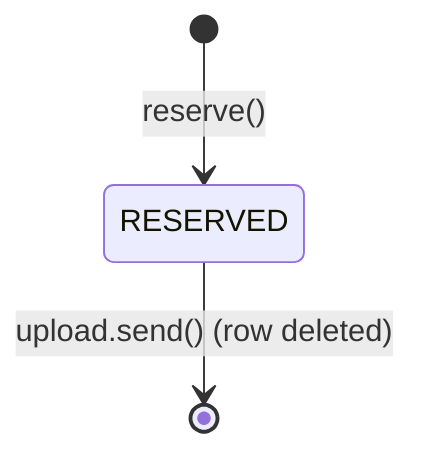
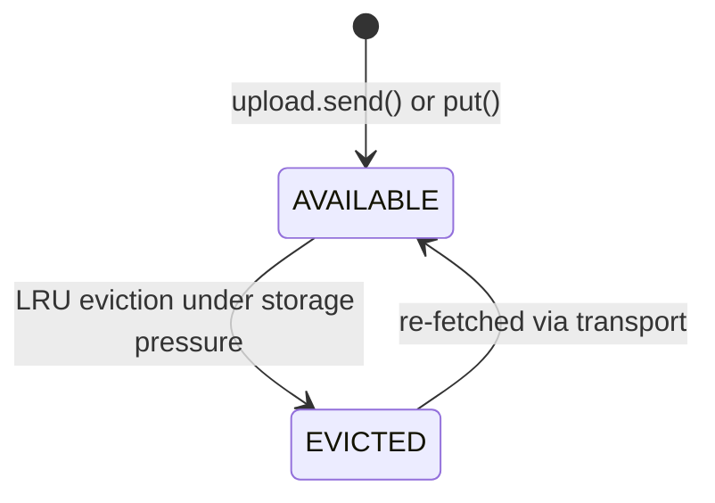
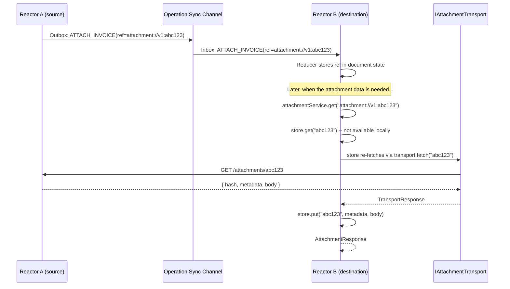
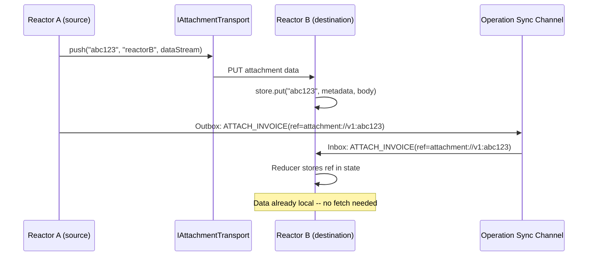
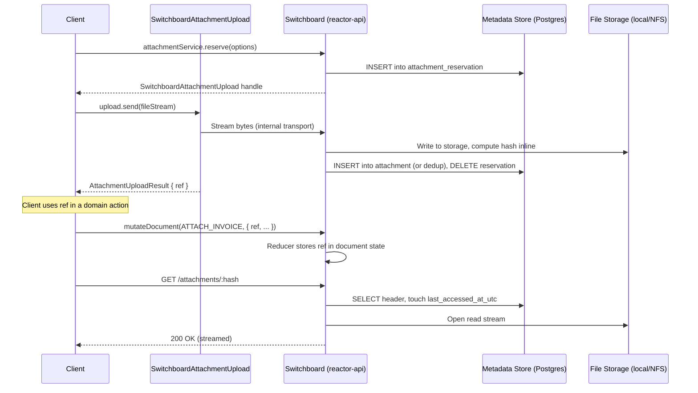
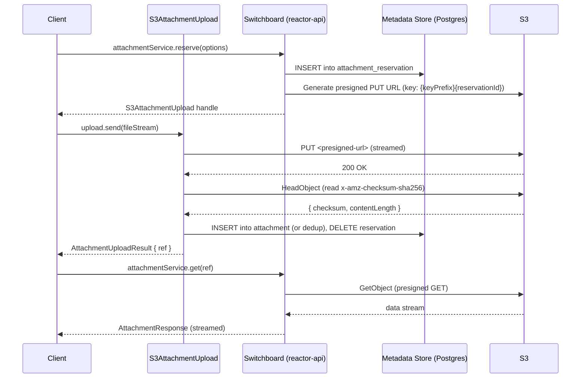

# Attachments

## Summary

Attachments are binary files that accompany documents. The attachment system provides an upload flow that decouples binary data from the action/operation pipeline:

1. **Reserve** -- The client requests an attachment slot and receives an upload handle.
2. **Upload** -- The client streams binary data through the handle and receives an `AttachmentRef`.
3. **Use** -- The client includes the ref in a domain action input (e.g., `ATTACH_INVOICE`).

The upload handle (`IAttachmentUpload`) abstracts the transport. The caller does not know or care whether bytes flow via HTTP, S3 presigned URLs, or any other mechanism. This is the key design constraint: the core interface never exposes URLs, headers, or any transport-specific detail.

Attachment refs are opaque strings that live inside domain action inputs, declared via the `Attachment` scalar in document model GraphQL schemas. There are no special core actions for attachments -- the ref is just a value that the reducer puts in state like any other field.

The content-addressed design (hash-based identity) supports deduplication and verification.

## Current State

Attachments are currently inlined as base64-encoded `data` fields on every action and operation. This has several problems:

- Operations carry the full binary payload through the job queue, sync channels, and GraphQL transport.
- Large files bloat the operation store and increase sync bandwidth.
- There is no way to upload an attachment independently of submitting an action.
- There is no lifecycle tracking -- attachments either exist (inline) or they don't.

The `Attachment` type today (`packages/shared/document-model/actions.ts`):

```ts
type Attachment = {
  data: string; // base64
  mimeType: string;
  extension?: string | null;
  fileName?: string | null;
};

type AttachmentInput = Attachment & {
  hash: string;
};
```

## Design

### Principles

1. **Content-addressed.** Every attachment is identified by the hash of its data. Two identical files produce the same hash and can be deduplicated.

2. **Transport-agnostic.** The mechanism for moving bytes between reactors is pluggable (`IAttachmentTransport`), just as `IChannel`/`IChannelFactory` is pluggable for operation sync.

3. **Refs are values.** An `AttachmentRef` is a plain string that travels inside domain action inputs. Document model schemas declare attachment fields using the `Attachment` scalar. The reducer stores the ref in state like any other field. There are no special core actions, no attachment set on the document, and no read model for reference tracking.

4. **Lazy data availability.** A reactor may have an `AttachmentRef` in document state before the binary data is available locally. This is expected. When the data is needed, the attachment service fetches it from a peer via the transport layer. The data and the ref are independent concerns.

5. **LRU eviction.** Garbage collection is storage-pressure-driven, not reference-count-driven. The store evicts least-recently-accessed data when storage limits are reached. Evicted data retains its metadata and can be re-fetched from any peer that has the bytes.

### The Attachment Scalar

The `Attachment` scalar in a document model GraphQL schema declares that a field holds an `AttachmentRef`. The codegen pipeline already detects `": Attachment"` in operation schemas and generates appropriate types.

```graphql
# In a document model schema
scalar Attachment

input AttachInvoiceInput {
  vendorName: String!
  amount: Float!
  scan: Attachment!
}
```

The generated TypeScript type maps `Attachment` to `string` (specifically `AttachmentRef`). The reducer treats it as an opaque string:

```ts
attachInvoiceOperation(state, action) {
  state.invoices.push({
    vendorName: action.input.vendorName,
    amount: action.input.amount,
    scan: action.input.scan, // AttachmentRef string
  });
}
```

The `Attachment` scalar is the entire integration surface between document models and the attachment system. Document model authors do not interact with `IAttachmentService`, `IAttachmentStore`, or `IAttachmentTransport` -- they just declare `Attachment` fields and use the refs they receive from the upload flow.

### Attachment Lifecycle

Reservations and attachment data have separate lifecycles. A reservation is transient upload coordination. Attachment data is a content-addressed blob in the store.

**Reservation lifecycle** (in `attachment_reservation`):



Reservations do not expire at the reservation level. Transport-specific expiry (e.g. presigned URL TTL) is the upload handle's concern -- if the underlying mechanism expires, the handle can refresh it transparently. Reservations are only removed when `upload.send()` succeeds (promoting the data to the `attachment` table).

**Attachment data lifecycle** (in `attachment`):



| Status      | Meaning                                                      |
| ----------- | ------------------------------------------------------------ |
| `AVAILABLE` | Data is stored locally. Can be served immediately.           |
| `EVICTED`   | Data removed to free space. Metadata retained. Re-fetchable. |

The lifecycle is simple because there is no reference counting. The store does not track which documents use which attachments. It only knows: do I have the bytes, or not?

**Eviction is a data removal, not a logical delete.** The metadata record is always retained so the hash remains known. If the data is needed again, it is re-fetched through the transport layer. The behavior of eviction depends on the storage backend:

- **Mutable backends** (local disk, S3): The implementation removes the data files to reclaim space.
- **Immutable backends** (content-addressed stores): Eviction means unpinning / ceasing to serve, not erasure.

### Types

```ts
/**
 * Content hash of the attachment data. This is the primary identifier.
 * Format is algorithm-dependent, e.g. SHA-256 hex.
 */
type AttachmentHash = string;

/**
 * A reference to an attachment, used in document state and action inputs.
 * Format: `attachment://v<version>:<hash>`
 *
 * The version prefix allows changing the hash algorithm, encoding, or
 * length without leaking implementation details into the ref format.
 * Version 1 is defined as SHA-256 hex.
 *
 * Using the hash as the ref makes attachments content-addressable:
 * any peer that has the bytes for a given hash can serve the attachment.
 */
type AttachmentRef = `attachment://v${number}:${string}`;

/**
 * Status of attachment data in the local store.
 */
type AttachmentStatus = "available" | "evicted";

/**
 * Metadata about an attachment. Only exists after data is stored
 * (via upload.send for client uploads, or put for sync).
 */
type AttachmentHeader = {
  hash: AttachmentHash;
  mimeType: string;
  fileName: string; // base name without extension, e.g. "photo"
  sizeBytes: number;
  extension: string | null; // e.g. "png", null if unknown
  status: AttachmentStatus;
  source: "local" | "sync";
  createdAtUtc: string; // ISO 8601
  lastAccessedAtUtc: string; // ISO 8601, for LRU eviction
};

/**
 * Metadata provided alongside attachment data during sync.
 * The remaining fields (hash, status, source, createdAtUtc, lastAccessedAtUtc)
 * are set by the store when it creates the attachment record.
 */
type AttachmentMetadata = {
  mimeType: string;
  fileName: string; // base name without extension
  sizeBytes: number;
  extension: string | null;
};

/**
 * Options provided when reserving an attachment slot.
 */
type ReserveAttachmentOptions = {
  mimeType: string;
  fileName: string; // base name without extension, e.g. "photo"
  extension?: string | null; // e.g. "png", null if unknown
};

/**
 * Result of uploading attachment data through a handle.
 */
type AttachmentUploadResult = {
  /** The content hash, now known after upload */
  hash: AttachmentHash;
  /** The ref to use in domain action inputs */
  ref: AttachmentRef;
  header: AttachmentHeader;
};

/**
 * Response when retrieving attachment data from the local store.
 */
type AttachmentResponse = {
  header: AttachmentHeader;
  body: ReadableStream<Uint8Array>;
};

/**
 * Response when fetching attachment data from a remote transport.
 * Lighter than AttachmentResponse -- a remote peer cannot meaningfully
 * populate status or source, which are local reactor concerns.
 * The store assigns those fields when it calls put() on receipt.
 */
type TransportResponse = {
  hash: AttachmentHash;
  metadata: AttachmentMetadata;
  body: ReadableStream<Uint8Array>;
};
```

### IAttachmentService

The client-facing interface for uploading, querying, and retrieving attachments. This is what applications (editors, Connect, CLI tools) interact with.

```ts
interface IAttachmentService {
  /**
   * Reserve a new attachment slot and return an upload handle.
   *
   * The handle abstracts the transport -- the caller streams data
   * through it without knowing whether bytes flow via HTTP, S3,
   * or any other mechanism.
   */
  reserve(options: ReserveAttachmentOptions): Promise<IAttachmentUpload>;

  /**
   * Get attachment metadata by ref.
   *
   * @throws AttachmentNotFound if the ref is unknown.
   */
  stat(ref: AttachmentRef): Promise<AttachmentHeader>;

  /**
   * Retrieve attachment data.
   *
   * Always succeeds for any known ref. The underlying store handles
   * re-fetching evicted data from the transport transparently.
   */
  get(ref: AttachmentRef, signal?: AbortSignal): Promise<AttachmentResponse>;
}
```

### IAttachmentUpload

The upload handle returned by `reserve()`. It encapsulates all transport-specific concerns (URLs, credentials, streaming protocols) behind a single `send()` method.

```ts
interface IAttachmentUpload {
  /**
   * Unique identifier for this reservation.
   */
  reservationId: string;

  /**
   * Stream attachment data through this handle.
   *
   * The handle manages the full upload lifecycle internally:
   * writing bytes to the backing store, computing or verifying
   * the content hash, creating the attachment record, and
   * cleaning up the reservation.
   *
   * Dedup: if an attachment with the same content hash already
   * exists, send() returns the existing ref. Content-addressed
   * storage means identical uploads converge on the same hash.
   *
   * @returns The content hash, ref, and header for the uploaded attachment.
   */
  send(data: ReadableStream<Uint8Array>): Promise<AttachmentUploadResult>;
}
```

Each `IAttachmentService` implementation provides its own upload handle:

| Implementation                | Handle behavior                                                                 |
| ----------------------------- | ------------------------------------------------------------------------------- |
| `SwitchboardAttachmentUpload` | Streams to the switchboard's upload endpoint. Hash computed server-side inline. |
| `S3AttachmentUpload`          | PUTs to a presigned S3 URL. Hash verified via `HeadObject` after upload.        |
| `DirectAttachmentUpload`      | Streams to the local store. Hash computed inline.                               |

Hash verification is an internal concern of the upload handle implementation. The caller never sees signatures, verifiers, or transport-specific details.

### IAttachmentStore

The reactor-facing interface for managing local attachment data. The `IAttachmentTransport` calls `put` when it receives data from a remote. The store notifies its configured transport when new data arrives (via `put` or after a client upload completes), forming a bidirectional store-transport pair.

It is intentionally separate from `IAttachmentService` -- the client upload flow and the reactor's internal data management are different concerns, even when a single class implements both.

```ts
interface IAttachmentStore {
  /**
   * Check whether attachment data is available locally.
   * Returns true if the bytes can be served from this reactor's store
   * without a transport round-trip. Does not trigger a remote fetch.
   */
  has(hash: AttachmentHash): Promise<boolean>;

  /**
   * Retrieve attachment header and data stream by hash.
   * Updates lastAccessedAtUtc on access.
   *
   * If the data has been evicted, re-fetches it from the transport,
   * restores it locally via put(), and returns the data. This makes
   * eviction transparent to callers -- get() always succeeds for
   * any known hash.
   *
   * @throws AttachmentNotFound if the hash is unknown (no metadata
   *         record exists).
   */
  get(hash: AttachmentHash): Promise<AttachmentResponse>;

  /**
   * Store attachment data received from a remote (during sync or re-fetch).
   * Used by IAttachmentTransport implementations to write data into
   * the local store.
   *
   * Behavior depends on existing state:
   * - No existing row: INSERT with source='sync', status='available'.
   * - Existing row with status='evicted': restore data, set status
   *   to 'available'.
   * - Existing row with status='available': no-op (dedup).
   */
  put(
    hash: AttachmentHash,
    metadata: AttachmentMetadata,
    data: ReadableStream<Uint8Array>,
  ): Promise<void>;

  /**
   * Evict attachment data to reclaim storage.
   *
   * Removes the local bytes and sets status to 'evicted'. The
   * metadata record is retained so the hash is still known. If the
   * data is needed again, the service fetches it via the transport.
   *
   * Eviction must not destroy data while a get() stream is in
   * flight. Implementations must skip hashes with active readers
   * (e.g. via a refcount or lease) and revisit them on the next
   * GC pass.
   *
   * On immutable backends, this unpins/stops serving rather
   * than deleting.
   */
  evict(hash: AttachmentHash): Promise<void>;

  /**
   * Get the total storage used by locally available attachment data.
   * Used by the GC policy to decide when to evict.
   */
  storageUsed(): Promise<number>;
}
```

A single implementation class can implement both interfaces:

```ts
class SwitchboardAttachmentManager
  implements IAttachmentService, IAttachmentStore { ... }
```

### IAttachmentTransport

The `IAttachmentTransport` interface handles moving attachment bytes between reactors. It forms a bidirectional pair with `IAttachmentStore`:

- **Outbound**: The store notifies the transport when new data is available. The transport announces or pushes to peers.
- **Inbound**: The transport receives data from peers and calls `IAttachmentStore.put()` to store it locally.

This mirrors the role of `IChannel` for operation sync -- `IChannel` moves operations, `IAttachmentTransport` moves attachment data.

Different transports serve different topologies:

| Transport        | Topology      | How it works                                        |
| ---------------- | ------------- | --------------------------------------------------- |
| Switchboard HTTP | Client-server | Fetch from the remote's attachment service endpoint |
| S3               | Client-server | Redirect to presigned GET URLs                      |

```ts
/**
 * Transport for moving attachment data between reactors.
 *
 * Forms a bidirectional pair with IAttachmentStore. The store calls
 * announce/push when new data arrives locally. The transport calls
 * store.put() when data arrives from a remote.
 */
interface IAttachmentTransport {
  /**
   * Fetch attachment data by hash from a remote source.
   *
   * The transport resolves the hash to a data source (server endpoint,
   * S3 presigned URL, etc.) and returns a stream.
   *
   * @param hash - Content hash of the attachment
   * @param signal - Abort signal for cancellation
   * @returns The attachment data with metadata, or null if not available.
   *          Returns TransportResponse (not AttachmentResponse) because
   *          remote peers cannot populate local concerns like status/source.
   */
  fetch(
    hash: AttachmentHash,
    signal?: AbortSignal,
  ): Promise<TransportResponse | null>;

  /**
   * Announce that this reactor has attachment data available.
   *
   * For server-centric transports, this may be a no-op (the server
   * already has the data after upload).
   */
  announce(hash: AttachmentHash): Promise<void>;

  /**
   * Push attachment data to a specific remote.
   *
   * Used for eager replication strategies where the source reactor
   * pushes data to known peers rather than waiting for pull requests.
   *
   * @param hash - Content hash of the attachment
   * @param remote - Target remote identifier
   * @param data - The attachment data stream
   */
  push(
    hash: AttachmentHash,
    remote: string,
    data: ReadableStream<Uint8Array>,
  ): Promise<void>;
}

/**
 * Factory for creating attachment transport instances.
 * Mirrors IChannelFactory for operation sync.
 */
interface IAttachmentTransportFactory {
  instance(config: AttachmentTransportConfig): IAttachmentTransport;
}

type AttachmentTransportConfig = {
  type: string;
  parameters: Record<string, unknown>;
};
```

### Attachment Sync Flow

Attachment data sync is independent from operation sync. Operations carry `AttachmentRef` values in their inputs. The attachment service resolves refs to data on demand.

#### Lazy sync (default)

When a reactor receives operations containing attachment refs, it does not eagerly fetch the data. The data is fetched when someone actually needs it (e.g., the UI renders an image, an export needs the file).



#### Push-based sync (eager replication)

For scenarios where the source reactor wants to ensure data is available before the destination needs it:



### Client Integration

The client interacts with `IAttachmentService` for upload/download and dispatches normal domain actions that include attachment refs. The executor and reducer are pure -- they have no dependency on attachment interfaces.

1. **Upload**: Client calls `reserve()` to get an upload handle, then calls `handle.send(stream)` to upload data. The handle manages the full lifecycle -- writing bytes, computing the hash, creating the attachment record, and cleaning up the reservation. Returns the ref.

2. **Use**: Client dispatches a domain action with the ref in its input (e.g., `ATTACH_INVOICE({ ref, vendorName, amount })`). The reducer stores the ref in document state.

3. **Download**: Client calls `IAttachmentService.get(ref)` to retrieve attachment data. If the data is not local, the service fetches it via the transport layer transparently.

4. **Validation** (optional): If attachment readiness should be checked before accepting the action, this belongs at the API boundary (e.g., the GraphQL resolver calls `IAttachmentService.stat()` before forwarding to `reactor.execute()`). The executor and reducer remain pure.

### Usage

#### Client: Upload and use in a domain action

```ts
// 1. Reserve a slot -- returns an upload handle, not a URL.
const upload = await attachmentService.reserve({
  mimeType: "application/pdf",
  fileName: "invoice",
  extension: "pdf",
});

// 2. Stream data through the handle. The handle manages transport,
//    hash computation, and record creation internally.
const { ref } = await upload.send(file.stream());

// 3. Use the ref in a domain action -- one dispatch, no special actions.
await reactor.execute(docId, "main", [
  {
    type: "ATTACH_INVOICE",
    input: { ref, vendorName: "Acme Corp", amount: 1500 },
    scope: "global",
  },
]);
```

#### Client: Download an attachment

```ts
// The service handles lazy fetching -- if data is evicted or not yet
// synced, it fetches from a peer transparently.
const response = await attachmentService.get("attachment://v1:abc123def");
console.log(response.header.mimeType); // "application/pdf"
await response.body.pipeTo(destination);
```

#### GraphQL API

The GraphQL API is an adapter layer. Browser clients cannot use the streaming `IAttachmentUpload` interface directly, so the API decomposes the upload flow into HTTP-friendly steps. This is a presentation concern -- the core `IAttachmentService` interface remains transport-agnostic.

```graphql
type AttachmentUploadResult {
  hash: String!
  ref: String!
}

type AttachmentHeader {
  hash: String!
  mimeType: String!
  fileName: String!
  sizeBytes: BigInt!
  extension: String
  status: String!
  source: String!
  createdAtUtc: String!
}

type Query {
  attachment(hash: String!): AttachmentHeader
}
```

The GraphQL layer exposes upload as a multipart mutation or delegates to a REST upload endpoint -- the specific mechanism depends on the deployment. Attachment data retrieval uses a REST endpoint to support streaming:

```
GET /attachments/:hash
```

### Garbage Collection

GC is storage-pressure-driven using LRU eviction. There is no reference counting.

A periodic task runs when storage exceeds a configurable threshold:

1. Query attachments ordered by `last_accessed_at_utc` ascending (least recently used first).
2. Evict data until storage drops below the target threshold.
3. Evicted rows retain metadata (`hash`, `mime_type`, etc.) so the hash is still known.
4. If evicted data is needed again, `IAttachmentService.get()` fetches it from a peer via the transport.

For mutable backends (disk, S3), eviction removes the data files.

Reservations are not garbage-collected. They are removed only when `upload.send()` succeeds. Abandoned reservations are inert (no data, no storage cost beyond the row) and can be cleaned up manually if needed.

## Package Structure

```
packages/
  reactor/
    src/
      attachments/
        types.ts             # AttachmentRef, AttachmentHash

  reactor-attachments/       # New package, depends on reactor
    src/
      interfaces.ts          # IAttachmentService, IAttachmentUpload, IAttachmentStore, IAttachmentTransport
      types.ts               # AttachmentStatus, AttachmentHeader, AttachmentMetadata, etc.
      switchboard/           # Switchboard-backed implementation
        switchboard-attachment-service.ts
        switchboard-attachment-upload.ts
        switchboard-attachment-transport.ts
      s3/                    # S3-backed implementation
        s3-attachment-service.ts
        s3-attachment-upload.ts
        s3-attachment-transport.ts
      storage/
        kysely/              # Postgres metadata storage
      index.ts
```

`AttachmentRef` (and `AttachmentHash`) live in `reactor/` because they are value types used by document model schemas and the codegen `Attachment` scalar. Everything else -- interfaces, implementations, storage -- lives in the `reactor-attachments/` package, which depends on `reactor`.

## Implementation: Switchboard-Backed

The initial implementation where switchboard acts as both the reservation endpoint and the upload target. The `SwitchboardAttachmentTransport` fetches data from remote switchboard instances via HTTP.

### Flow



### Switchboard Attachment Transport

When a switchboard instance needs attachment data that is not local (e.g., after syncing operations from another reactor), it uses `SwitchboardAttachmentTransport` to fetch data from the source:

```ts
class SwitchboardAttachmentTransport implements IAttachmentTransport {
  async fetch(hash: AttachmentHash, signal?: AbortSignal) {
    // Fetch from the remote switchboard's REST endpoint
    const response = await fetch(`${this.remoteUrl}/attachments/${hash}`, {
      signal,
      headers: this.authHeaders(),
    });
    // ...
  }

  async announce(hash: AttachmentHash) {
    // No-op for switchboard -- data is already on the server after upload
  }

  async push(hash: AttachmentHash, remote: string, data: ReadableStream) {
    // PUT to the remote switchboard's attachment endpoint
    await fetch(`${remoteUrl}/attachments/${hash}`, {
      method: "PUT",
      body: data,
      headers: this.authHeaders(),
    });
  }
}
```

### Storage

Attachment metadata is stored in Postgres. Attachment data is stored on the local filesystem or a mounted volume.

Reservations and attachments are separate tables. A reservation is transient upload coordination; an attachment is a permanent content-addressed record. This separation gives `put()` (sync path) a clean entry point that does not require a reservation.

```sql
-- Transient: tracks in-progress client uploads.
-- Rows are created by reserve() and removed by upload.send().
CREATE TABLE attachment_reservation (
  reservation_id  TEXT PRIMARY KEY,
  mime_type       TEXT NOT NULL,
  file_name       TEXT NOT NULL,
  extension       TEXT,
  created_at_utc  TEXT NOT NULL   -- ISO 8601
);

-- Permanent: content-addressed attachment metadata.
-- Rows are created by upload.send() (client upload) or put() (sync).
CREATE TABLE attachment (
  hash                TEXT PRIMARY KEY,
  mime_type           TEXT NOT NULL,
  file_name           TEXT NOT NULL,
  size_bytes          BIGINT NOT NULL,
  extension           TEXT,
  status              TEXT NOT NULL DEFAULT 'available',
  storage_path        TEXT NOT NULL,
  source              TEXT NOT NULL DEFAULT 'local', -- 'local' | 'sync'
  created_at_utc      TEXT NOT NULL,    -- ISO 8601
  last_accessed_at_utc TEXT NOT NULL    -- ISO 8601, for LRU eviction
);

CREATE INDEX idx_attachment_status ON attachment(status);
CREATE INDEX idx_attachment_lru ON attachment(last_accessed_at_utc ASC)
  WHERE status = 'available';
```

**How each path writes:**

- **`reserve()`** inserts into `attachment_reservation`. No attachment row yet.
- **`upload.send(data)`** streams bytes to storage, computes the content hash, reads the reservation, upserts into `attachment` (`INSERT ... ON CONFLICT (hash) DO NOTHING`), then deletes the reservation. If the hash already exists the insert is a no-op and the existing ref is returned. All internal to the upload handle.
- **`put(hash, metadata, data)`** upserts into `attachment` (`INSERT ... ON CONFLICT (hash) DO UPDATE SET status = 'available'` when the existing row is `evicted`, `DO NOTHING` when `available`). Concurrent puts for the same hash are safe -- at most one restores the data, the rest are no-ops. No reservation involved.
- **`get(hash)`** returns data and updates `last_accessed_at_utc`. If the data has been evicted, the store re-fetches it from the transport and restores it locally before returning.
- **GC** evicts least-recently-accessed attachments when storage exceeds threshold.

### Limitations

- Upload bandwidth is limited by the switchboard instance's network and disk I/O.
- No CDN or edge caching for downloads.
- Single point of failure for the upload path.

## Implementation: S3-Backed

The production implementation where the upload handle streams data directly to S3 via presigned URLs. Switchboard handles reservation and metadata but never touches the attachment bytes.

### Flow



### S3 Attachment Transport

```ts
class S3AttachmentTransport implements IAttachmentTransport {
  async fetch(hash: AttachmentHash, signal?: AbortSignal) {
    // Generate presigned GET URL and fetch
    const url = await this.generatePresignedGetUrl(hash);
    const response = await fetch(url, { signal });
    // ...
  }

  async announce(hash: AttachmentHash) {
    // No-op -- data is in S3, accessible to anyone with the presigned URL
  }

  async push(hash: AttachmentHash, remote: string, data: ReadableStream) {
    // Upload to S3 on behalf of the remote
    const url = await this.generatePresignedPutUrl(hash);
    await fetch(url, { method: "PUT", body: data });
  }
}
```

### Hash Verification

The `S3AttachmentUpload` handle verifies the content hash after upload by reading `x-amz-checksum-sha256` from the S3 object via `HeadObject` -- no download required. This is internal to the handle; the caller only sees the returned ref.

The S3 object key for uploads is always `{keyPrefix}{reservationId}`. S3 uploads are configured with `x-amz-checksum-algorithm: SHA256` (set internally by the handle) so that the checksum is available for verification.

### Garbage Collection

S3 lifecycle rules can handle optional physical cleanup:

- The metadata store GC marks `evicted` when storage exceeds threshold (LRU).
- S3 lifecycle rules can optionally remove objects tagged `status=evicted` after a retention period.
- Metadata records are always retained in Postgres. Physical removal of S3 objects is optional.

## Migration from Inline Attachments

The inline base64 attachment format will coexist with `AttachmentRef` during a transition period.

### Phase 1: Add attachment service (non-breaking)

- Deploy `IAttachmentService` and `IAttachmentStore` alongside the existing inline mechanism.
- Actions can contain either inline `AttachmentInput[]` or `AttachmentRef` values in their input fields.
- Inline attachments are processed as today. Refs resolve through the attachment service.
- New attachments should use the multi-phase upload flow. The codegen `Attachment` scalar resolves to `AttachmentRef` (string).

### Phase 2: Migrate sync to use refs

- Sync channels stop transferring inline attachment data.
- Attachment data moves between reactors via `IAttachmentTransport` (lazy fetch or eager push).
- The transport config becomes part of the remote/channel configuration.

### Phase 3: Remove inline support

- The `attachments` field on `Action` is removed.
- All attachment data flows through `IAttachmentService`, `IAttachmentStore`, and `IAttachmentTransport`.
- The `Attachment` type with inline `data: string` is deprecated and removed.
