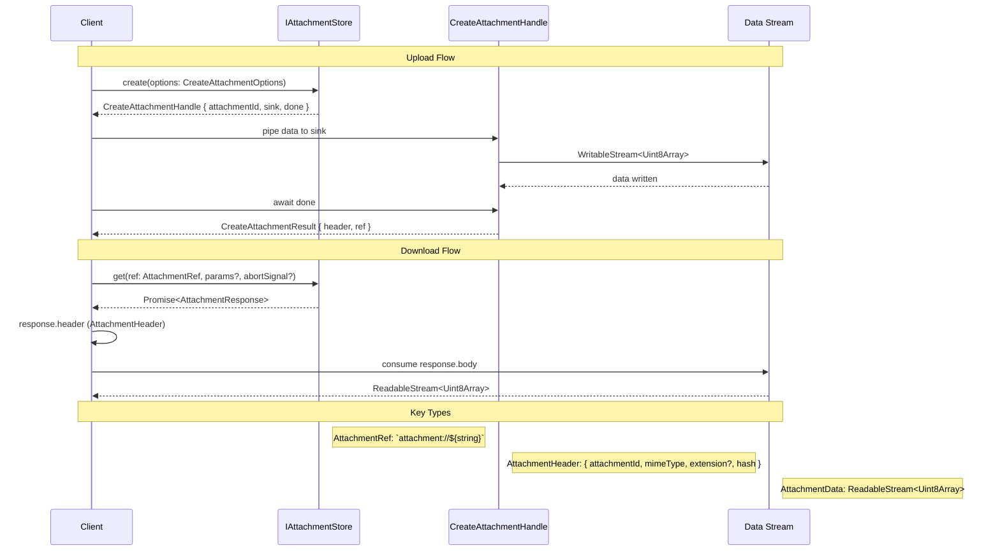

# Interface

```tsx
/**
 * Raw stream of bytes for the attachment.
 */
type AttachmentData = ReadableStream<Uint8Array>;

/**
 * The header metadata for an attachment.
 */
export type AttachmentHeader = {
  attachmentId: string;
  mimeType: string;
  extension?: string | null;

  /** Typically a crc32 hash of the file bytes */
  hash: string;
};

/**
 * The reference to an attachment. This is what should be stored in documents.
 * 
 * In the form `attachment://<attachmentId>`.
 */
export type AttachmentRef = `attachment://${string}`;

/** Options that accompany a new attachment (stream is passed separately) */
export interface CreateAttachmentOptions {
  /** MIME type, e.g. `"image/png"` */
  mimeType: string;

  /** The file name of the attachment */
  fileName: string;

  /** The size of the attachment in bytes */
  sizeBytes: number;

  /** Optional file-name extension (no leading “.”) */
  extension?: string | null;
}

/** Handle returned by `create()` — mirrors Node’s `ClientRequest` */
export interface CreateAttachmentHandle {
  /** The attachment ID that will be used for the attachment */
  attachmentId: string;

  /**
   * Writable sink for the raw bytes.
   * 
   * Pipe any `Readable`/`ReadableStream` into it, call `close()` when done,
   * or `abort()` early.
   */
  sink: WritableStream<Uint8Array>;

  /** Promise that fulfils with header + ref when the upload completes */
  done: Promise<CreateAttachmentResult>;
}

/** Resolves once the store has fully persisted the upload */
export interface CreateAttachmentResult {
  header: AttachmentHeader;
  ref: AttachmentRef;
}

/** Options for retrieving an existing attachment */
export interface GetAttachmentOptions {
  // ?
}

/**
 * Response returned by `get`, modelled after the browser `Response` API:
 * – Creating the `AttachmentResponse` is quick; the caller then consumes
 *   `body` asynchronously.
 */
export interface AttachmentResponse {
  /** Metadata known as soon as the request is fulfilled */
  header: AttachmentHeader;

  /** Stream to be read (or cancelled) by the caller */
  body: AttachmentData;
}

/* ──────────────────────────────────────────────────────────
 *  Store interface
 * ────────────────────────────────────────────────────────── */

export interface IAttachmentStore {
  /**
   * Get the attachment header for a given attachment ID.
   */
  stat(attachmentId: string): Promise<AttachmentHeader>;

  /**
   * Start uploading a new attachment.
   *
   * – Returns **synchronously** with a writable `sink`; callers pipe or write
   *   data into it just like writing to an HTTP request body.
   * – `handle.done` resolves only after the store flushes the last byte and
   *   finalises the header (hash, generated ID, …).
   */
  create(options: CreateAttachmentOptions): CreateAttachmentHandle;

  /**
   * Retrieve an attachment.
   *
   * The Promise resolves as soon as the request is under way and the header
   * is available.  The actual bytes are delivered through `response.body`,
   * which the caller can read, pipe, or cancel just like `fetch()`’s body
   * stream.
   * 
   * `abortSignal` is used to abort the request early.
   */
  get(
    ref: AttachmentRef,
    params?: GetAttachmentParams,
    abortSignal?: AbortSignal,
  ): Promise<AttachmentResponse>;
}

```

### Diagram


