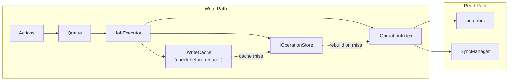

# Cache

### Summary

Cache implementations for Reactor performance optimization. This directory contains specifications for two distinct caching systems that serve different purposes in the Reactor architecture.

### Caching Systems

#### IOperationIndex

The operation index provides an optimized, flattened view of operations organized by collections for efficient querying by listeners and sync channels. This is a persistent, database-backed index that reduces operations across many related documents into optimized streams.

**Key characteristics:**

- Persistent storage (PostgreSQL/PGLite)
- Collection-based organization
- Used by listeners and sync managers
- Optimizes the read path for operation streams

#### IWriteCache

The write cache is an in-memory LRU cache that stores ring buffers of `PHDocument` snapshots for fast retrieval by the job executor. It allows executors to start from recent document snapshots instead of replaying all operations from the beginning. The cache requires `IDocumentModelRegistry` to access reducers for rebuilding documents on cache misses.

**Key characteristics:**

- In-memory storage only
- Ring buffer per document stream
- Stores complete PHDocument objects
- Requires IDocumentModelRegistry for cache miss handling
- Used by job executors
- Optimizes the write path for job execution

### Dependencies

- [IOperationStore](../Storage/IOperationStore.md) - Source of operations for both caches
- [IDocumentModelRegistry](../Jobs/document-model-registry.md) - Provides reducers for IWriteCache to rebuild documents on cache miss

### Links

#### IOperationIndex
* [Interface](interface.md) - TypeScript interface for the operation index
* [Schema](schema.md) - Database schema for the operation index
* [Overview](operation-index.md) - Detailed architectural overview

#### IWriteCache
* [Interface](write-cache-interface.md) - TypeScript interface for the write cache
* [Overview](write-cache.md) - Detailed architectural overview

### Integration in Reactor Flow

**Write path optimization:**

1. Job executor calls `IWriteCache.getState()` with documentId, documentType, scope, branch, and revision
2. Write cache handles retrieval internally:
   - On cache hit: returns cached PHDocument, updates LRU (fast)
   - On cache miss: loads from `IOperationStore`, gets reducer from `IDocumentModelRegistry`, replays operations, stores PHDocument in ring buffer, updates LRU, returns document
3. Executor receives complete PHDocument at requested revision
4. Executor executes reducers with new actions to produce updated PHDocument
5. Executor calls `IWriteCache.putState()` to store resulting PHDocument in cache
6. Executor writes operations to `IOperationStore` and `IOperationIndex`

**Read path optimization:**

1. Listeners query `IOperationIndex` for filtered operations
2. Sync manager queries `IOperationIndex` for synchronization
3. `IOperationIndex` provides pre-computed, optimized views
