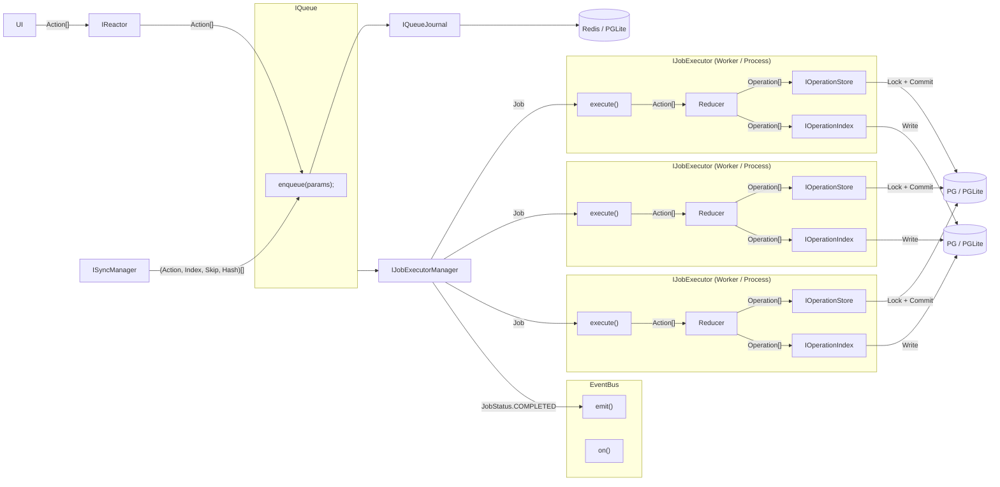
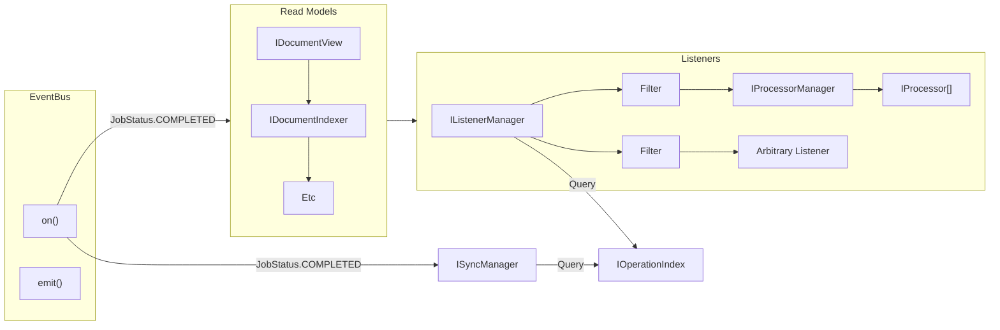

# IOperationIndex

The goal of the `IOperationIndex` is to reduce operations across many related documents into a single stream of operations to optimize the flow of operations to listeners. This allows a `Listener`, for example, to have a simple, optimized cursor to iterate over operations that affect it. Additionally, the object will allow us to reduce the complexity of the storage adapters.

### Ideal Command-Sourcing v Reactor Command-Sourcing

In Command-Sourcing, the typical approach is to store the stream of commands before they hit the "Aggregate", which is the entity that processes the commands. A "Write Model" calls aggregates with the commands and generates events.

In our case, the only Aggregate is the document model reducer. Our "command stream" is the `IOperationStore`, and it contains both the commands and the _aggregate results_.

This means that Reactor diverges from typical approaches in that there is no stream of commands that have not yet been processed (we have something _similar_, where the `IQueueJournal` stores "pre-executed" commands (i.e. Actions), but this is not append-only, and its concern is the durability of actions, not the stream of commands).

The "Write Model" is essentially the `IJobExecutor`, which calls the reducer, generates events, then stores things.

### Is the `IOperationIndex` a "Read Model"?

There are two main approaches to implementing the `IOperationIndex`:

1. Write to both `IOperationStore` and `IOperationIndex` in `IJobExecutor` (inside the "Write Model"). The reason we do not want to combine these two interfaces into a single entity is because they have different requirements: `IOperationStore` will have implementations for IPFS and Swarm, while `IOperationIndex` will always only have an implementation on top of a relational database (Kysely with PG or PGLite).

2. Write to `IOperationStore` in `IJobExecutor`, and `IOperationIndex` "eventually", in response to Event Bus job completion events. This effectively makes the `IOperationIndex` a read model. This, however, would mean the `IOperationIndex` can be stale. In addition, we would need an additional catchup mechanism to ensure that the `IOperationIndex` is up to date. But the catchup mechanism is essentially what the operation index is designed to make simpler.

Thus, `IOperationIndex` is a write model and approach (1) is the more viable option.

### Requirements

- `IOperationIndex` must have a rollback mechanism, in order to support optimistic writes, in the case that writes to the `IOperationStore` fail.
  - Because the index is not append-only, every write already has full update/delete capabilities. If the paired write to `IOperationStore` fails after we have staged index mutations, we simply open a compensating transaction that reverses the affected rows (delete new ordinals, restore previous metadata), so both stores remain in sync without needing special append-only rollback semantics.

- Ideally, collections are not created lazily, they are created when new operations are made available.

- The `IOperationIndex` must be able to be sharded. In reality, this likely means that Switchboard (for example) would have multiple `IOperationIndex` instances, and we shard deterministically based on document properties.

### Data Structure

Operations are kept in the `IOperationStore` as a table of `Operation`s. The full schema is defined in the [`IOperationStore`](../Storage/IOperationStore.md) documentation.

The `IOperationIndex` defines a new table that relates documents to each other, in a flat structure we call a **Collection**. A collection is the set of all documents that have ever been attached to the same collection root. The root document is always a member of its own collection. While documents are free to exist in a graph structure (with some restrictions), the `IOperationIndex` only stores flat collections of documents.

| documentId | collectionId |
| ---------- | ------------ |
| doc1       | collection1  |
| doc2       | collection1  |
| doc3       | collection2  |

Collections are materialized directly from the operation log. When a `CREATE_DOCUMENT` operation is processed for a collection root document (currently only the `document-drive` model), we create the backing collection row (`collection.{documentId}`). Relationship updates keep membership fresh: `ADD_RELATIONSHIP` inserts the related document ids into the appropriate collections, while `REMOVE_RELATIONSHIP` deletes them. Because those actions describe every collection/document association, multi-collection membership falls out naturally without bespoke bookkeeping.

> Today only document-drive models act as collection roots, but the mechanism leaves room for additional types later.

Additionally, the `IOperationIndex` stores a table very similar to the `IOperationStore` table, so that a join can be performed on `documentId`.

| ordinal | opId | documentId | documentType  | scope  | branch  | timestampUtcMs      | writeTimestampUtcMs | index | skip | hash     | action                                                          |
| ------- | ---- | ---------- | ------------- | ------ | ------- | ------------------- | ------------------- | ----- | ---- | -------- | --------------------------------------------------------------- |
| 1       | 1    | doc1       | documentType1 | scope1 | branch1 | 2021-01-01 00:00:00 | 2021-01-01 00:00:00 | 1     | 0    | hash-001 | { "type": "create", "data": { "id": "1" } }                     |
| 2       | 2    | doc1       | documentType1 | scope1 | branch1 | 2021-01-01 00:00:00 | 2021-01-01 00:00:01 | 2     | 0    | hash-002 | { "type": "update", "data": { "id": "1", "name": "New Name" } } |
| 3       | 3    | doc1       | documentType1 | scope1 | branch1 | 2021-01-01 00:00:00 | 2021-01-01 00:00:02 | 3     | 0    | hash-003 | { "type": "delete", "data": { "id": "1" } }                     |

The column set mirrors `IOperationStore`, but the `IOperationIndex` table is not append-only.

**Note on DELETE_DOCUMENT Operations**: DELETE_DOCUMENT operations are indexed like any other operation. They represent a state transition (marking the document as deleted) rather than physical removal. The read models (like `IDocumentView`) are responsible for interpreting these operations and filtering out deleted documents in queries. The `IOperationIndex` simply ensures these operations are available to read models and listeners.

A query to get all operations for a collection and branch would look like something like this:

```sql
SELECT
    oi.ordinal,
    oi.opId,
    oi.documentId,
    oi.documentType,
    oi.scope,
    oi.branch,
    oi.timestampUtcMs,
    oi.writeTimestampUtcMs,
    oi.index,
    oi.skip,
    oi.hash,
    oi.action
FROM operation_index_operations oi
JOIN document_collections dc ON oi.documentId = dc.documentId
WHERE 1=1
    AND dc.collectionId = 'collection.doc-123'
    AND oi.branch = 'main'
    AND oi.documentType IN ('documentType1', 'documentType2')
    AND oi.scope IN ('scope1', 'scope2')
ORDER BY oi.ordinal;
```

### Collection Derivation

`ISyncManager` and `IOperationIndex` share the same rule for constructing collection identifiers so they can both pre-create and query the same sets. Because collection roots currently map 1:1 with their backing documents, the collection id is derived via the canonical `driveCollectionId(branch, driveId)` helper:

```ts
const toCollectionId = driveCollectionId; // => `drive.${branch}.${driveId}`
```

When reducers emit a `CREATE_DOCUMENT` for a new collection root (which is currently only the `document-drive` model), the job executor calls `txn.createCollection(toCollectionId(driveId, branch))` and the index inserts the derived id into `document_collections`:

```sql
INSERT INTO document_collections (documentId, collectionId)
VALUES ('doc-123', 'collection.main.doc-123');
```

Relationship operations call `txn.addToCollection(toCollectionId(driveId, branch), documentId)` to keep membership current. Consumers later call `find(collectionId, view, paging)` where `collectionId` is explicit and `view` is just the standard `ViewFilter` (branch, scopes, document types, etc.). Because these filters live on the operations table we avoid encoding them into the collection id (preventing wildcard scans) and keep the join lookup cheap. When internal tooling needs to query every collection, it can bypass the join entirely and scan `operation_index_operations` directly.

### Cursors

There are two types of cursors: one cursor into the `IOperationStore` that allows the `IOperationIndex` to understand which operations have been processed, and a set of cursors that listeners have into the `IOperationIndex` that allow them to iterate over operations that affect them.

#### Cursor into `IOperationStore`

The cursor into the `IOperationStore` is a simple integer that represents the ordinal of the last operation that was processed. This is used to determine which operations have been processed and which have not. It can easily be generated on startup and updated on commit.

#### Cursors into `IOperationIndex`

The `IListenerManager` and `ISyncManager` both have cursors into the `IOperationIndex`. The `IListenerManager` has a cursor for each listener, and the `ISyncManager` has a cursor for each registered synchronization channel .

These cursors are kept in storage mechanisms specific to the `IListenerManager` and `ISyncManager`.

### Summary



Notes:


