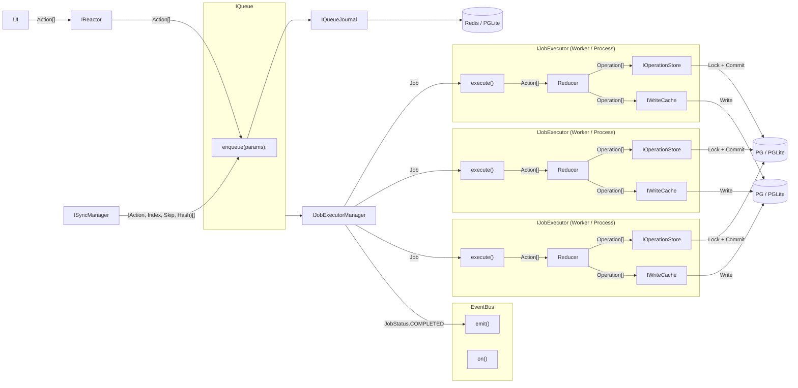
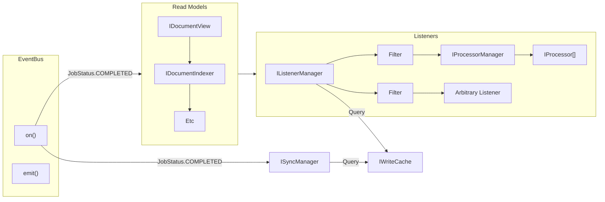

# IWriteCache

The goal of the `IWriteCache` is to reduce operations across many related documents into a single stream of operations. This allows a `Listener`, for example, to have a simple, optimized cursor to iterate over operations that affect it.

### Ideal Command-Sourcing v Reactor Command-Sourcing

In Command-Sourcing, the typical approach is to store the stream of commands before they hit the "Aggregate", which is the entity that processes the commands. A "Write Model" calls aggregates with the commands and generates events.

In our case, the only Aggregate is the document model reducer. Our "command stream" is the `IOperationStore`, and it contains both the commands and the _aggregate results_.

This means that Reactor diverges from typical approaches in that there is no stream of commands that have not yet been processed (we have something _similar_, where the `IQueueJournal` stores "pre-executed" commands (i.e. Actions), but this is not append-only, and its concern is the durability of actions, not the stream of commands).

The "Write Model" is essentially the `IJobExecutor`, which calls the reducer, generates events, then stores things.

### Is the `IWriteCache` a "Read Model"?

There are two main approaches to implementing the `IWriteCache`:

1. Write to both `IOperationStore` and `IWriteCache` in `IJobExecutor` (inside the "Write Model"). The reason we do not want to combine these two interfaces into a single entity is because they have different requirements: `IOperationStore` will have implementations for IPFS and Swarm, while `IWriteCache` will always only have an implementation on top of a relational database (Kysely with PG or PGLite).

2. Write to `IOperationStore` in `IJobExecutor`, and `IWriteCache` "eventually", in response to Event Bus job completion events. This effectively makes the `IWriteCache` a read model. This, however, would mean the `IWriteCache` can be stale. In addition, we would need an additional catchup mechanism to ensure that the `IWriteCache` is up to date. But the catchup mechanism is essentially what the write cache is designed to make simpler.

Thus, `IWriteCache` is a write model and approach (1) is the more viable option.

### Requirements

- `IWriteCache` must have a rollback mechanism.

- Ideally, collections are not created lazily, they are created when new operations are made available.

- The `IWriteCache` must be able to be sharded. In reality, this likely means that Switchboard (for example) would have multiple `IWriteCache` instances, and we shard deterministically based on document properties.

### Data Structure

Operations are kept in the `IOperationStore` as a table of `Operation`s. The full schema is defined in the [`IOperationStore`](../Storage/IOperationStore.md) documentation, but below is a non-authoritative example of what the table might look like:

| id | jobId | opId | prevOpId | writeTimestampUtcMs | documentId | scope | branch | timestampUtcMs | index | action | skip |
| --- | --- | --- | --- | --- | --- | --- | --- | --- | --- | --- | --- |
| 1 | 1 | 1 | null | 2021-01-01 00:00:00 | doc1 | scope1 | branch1 | 2021-01-01 00:00:00 | 1 | { "type": "create", "data": { "id": "1" } } | 0 |
| 2 | 1 | 2 | 1 | 2021-01-01 00:00:00 | doc1 | scope1 | branch1 | 2021-01-01 00:00:00 | 2 | { "type": "update", "data": { "id": "1", "name": "New Name" } } | 0 |
| 3 | 1 | 3 | 2 | 2021-01-01 00:00:00 | doc1 | scope1 | branch1 | 2021-01-01 00:00:00 | 3 | { "type": "delete", "data": { "id": "1" } } | 0 |

The `IWriteCache` defines a new table that relates documents to each other, in a flat structure we call a **Collection**. While documents are free to exist in a graph structure (with some restrictions), the `IWriteCache` only stores flat collections of documents.

| documentId | collectionId |
| --- | --- |
| doc1 | collection1 |
| doc2 | collection1 |
| doc3 | collection2 |

Additionally, the `IWriteCache` stores a table very similar to the `IOperationStore` table, so that a join can be performed on `documentId`.

| ordinal | opId | documentId | documentType | scope | branch | timestampUtcMs | index | action |
| --- | --- | --- | --- | --- | --- | --- | --- | --- |
| 1 | 1 | doc1 | documentType1 | scope1 | branch1 | 2021-01-01 00:00:00 | 1 | { "type": "create", "data": { "id": "1" } } |
| 2 | 1 | doc1 | documentType1 | scope1 | branch1 | 2021-01-01 00:00:00 | 2 | { "type": "update", "data": { "id": "1", "name": "New Name" } } |
| 3 | 1 | doc1 | documentType1 | scope1 | branch1 | 2021-01-01 00:00:00 | 3 | { "type": "delete", "data": { "id": "1" } } |

The main difference is that the `IWriteCache` table is not append-only. It is garbage collected and thus has no skip, only ordered streams.

A query to get all operations for a collection and branch would look like something like this:

```sql
SELECT
    wc.ordinal,
    wc.opId,
    wc.documentId,
    wc.documentType,
    wc.scope,
    wc.branch,
    wc.timestampUtcMs,
    wc.index,
    wc.action
FROM write_cache_operations wc
JOIN document_collections dc ON wc.documentId = dc.documentId
WHERE 1=1
    AND dc.collectionId in ('collection1', 'collection2')
    AND wc.documentType in ('documentType1', 'documentType2')
    AND wc.branch in ('branch1', 'branch2')
    AND wc.scope in ('scope1', 'scope2')
ORDER BY wc.ordinal;
```

### `OperationFilter` --> Collection Id

Collection ids are able to be explicitly created from an `OperationFilter`. This ensures that the `IWriteCache` can forward-create collections for Listeners that may not exist yet.

Here is the definition of the `OperationFilter` type:

```ts
type OperationFilter = {
  driveId: string[];
  documentId: string[];
  branch: string[];
  documentType: string[];
  scope: string[];
};
```

From this, we derive a _set_ of collection ids.

```ts
const constructCollectionIds = (filter: OperationFilter): string[] => {
  const collectionIds = new Set<string>();

  for (const driveId of filter.driveId) {
    collectionIds.add(`drive.${driveId}`);
  }

  return Array.from(collectionIds);
};
```

We do not need to keep branch, type, or scope in the collection id as these will be present in the join query. It is tempting to use some sort of composite or delimited string to represent the filter and use a `LIKE` query-- however, this would be a significant performance overhead as a `LIKE '%foo%'` query cannot use B-tree indexes and requires a full table scan.

Instead, we opt to multi-insert into the `document_collections` table.

```sql
INSERT INTO document_collections (documentId, collectionId) VALUES ('doc1', 'drive.drive1');
INSERT INTO document_collections (documentId, collectionId) VALUES ('doc1', 'drive.drive2');
```

For building the query, branch and scope may be left out if a wildcard is used (`branch: ['*']`).

If `driveId` is not provided, we need no join at all and can directly query the `write_cache_operations` table.

#### Hashing Document Ids

Additionally, we may experiment with using hashed document ids to reduce the DB performance impact of string matching, as this grows linearly with string length. Recall that `documentId` is a signature, so it will be of considerable length (88 characters for Ed25519). For example, here is a Base64-encoded Ed25519 signature:

`iPejYCq5-74u_Wx221SpApZxPiiOGcNuJoN9LBwcYWGYZSd-o5trViqqoC8OJmc5xMhTlJrL3hXOsPbxFbzLCg==`

We can use SHA256 (for example, but there are cheaper variants) to reduce the length to 44 characters with negligible collision risk:

`7x0QaStA6zgPGAuRYfuaJDMiOnsQ1p3Rf/sQXFBgS9c=`

Obviously, this creates a CPU-side performance impact from running SHA256. This could be mitigated by creating the hash only on document creation. Additionally, putting the performance impact in CPU worker threads may still be preferable in real-world testing.

### Cursors

There are two types of cursors: one cursor into the `IOperationStore` that allows the `IWriteCache` to understand which operations have been processed, and a set of cursors that listeners have into the `IWriteCache` that allow them to iterate over operations that affect them.

#### Cursor into `IOperationStore`

The cursor into the `IOperationStore` is a simple integer that represents the ordinal of the last operation that was processed. This is used to determine which operations have been processed and which have not. It can easily be generated on startup and updated on commit.

#### Cursors into `IWriteCache`

The `IListenerManager` and `ISyncManager` both have cursors into the `IWriteCache`. The `IListenerManager` has a cursor for each listener, and the `ISyncManager` has a cursor for each registered synchronization channel (currently, pull responders).

These cursors are kept in storage mechanisms specific to the `IListenerManager` and `ISyncManager`.

### Sharding

TODO

### Summary



Notes:


