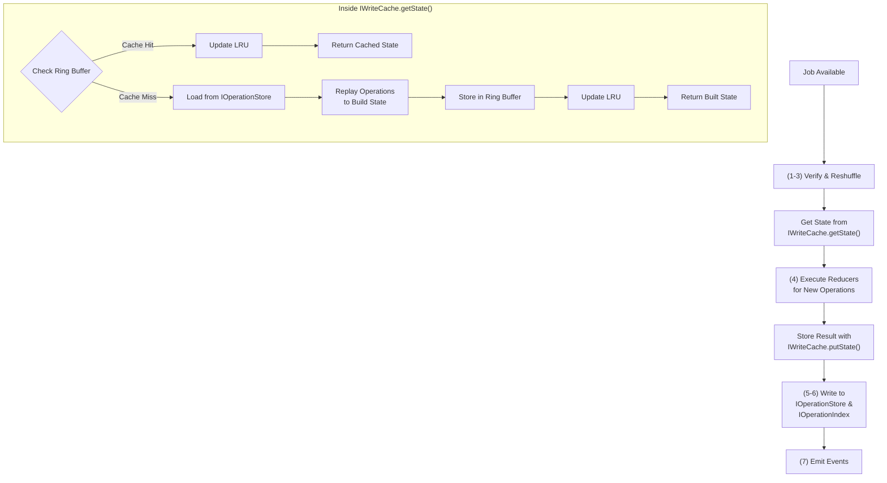

# IWriteCache

### Summary

The `IWriteCache` is an in-memory LRU cache that stores ring buffers of document snapshots for fast state retrieval by the job executor. The cache provides two primary methods: `getState()` for retrieving document state at a specific revision (with automatic rebuilding on cache miss), and `putState()` for storing the resulting state after job execution. By caching recent document states at various revisions, the job executor can avoid replaying all operations from the beginning, significantly improving performance for documents with long operation histories.

### Purpose and Use Case

When a job executor needs to apply operations to a document, it must first obtain the current state of the document. Without caching, this requires:

1. Loading all operations for the document from `IOperationStore`
2. Replaying all operations through the reducer to build up state
3. Starting from the resulting state to apply new operations

For documents with hundreds or thousands of operations, this becomes prohibitively expensive. The `IWriteCache` solves this by caching recent snapshots:

**Before execution:**
1. Call `getState()` to retrieve document state at target revision
2. Cache handles retrieval (returning cached snapshot or rebuilding on miss)
3. Executor receives state ready to use

**After execution:**
1. Call `putState()` to store the resulting state
2. Cache stores snapshot in ring buffer for future use
3. Next execution can start from this cached state

### Architecture

#### Ring Buffer per Document Stream

Each document stream (identified by `documentId`, `scope`, `branch`) maintains its own **ring buffer** of snapshots. A ring buffer is a fixed-size circular buffer that automatically overwrites the oldest entry when full.

```
Document Stream: (doc-1, global, main)
┌─────────────────────────────────────────────┐
│ Ring Buffer (size = 5)                      │
│                                             │
│  [0] Revision 10  ← oldest                  │
│  [1] Revision 15                            │
│  [2] Revision 23                            │
│  [3] Revision 31                            │
│  [4] Revision 42  ← newest                  │
│                                             │
│  Next write position: 0 (wraps around)      │
└─────────────────────────────────────────────┘
```

#### LRU Eviction at Document Level

The cache maintains a maximum number of document streams (`maxDocuments`). When this limit is reached and a new document needs to be cached, the least recently used document's **entire ring buffer** is evicted.

```
Cache: maxDocuments = 3, ringBufferSize = 5

┌─────────────────────────────────────────────┐
│ LRU List (most recent first)                │
│                                             │
│  1. (doc-A, global, main) ← most recent     │
│     Ring buffer: [rev 5, 10, 15, 20, 25]    │
│                                             │
│  2. (doc-B, local, main)                    │
│     Ring buffer: [rev 3, 7, 11, 14, 18]     │
│                                             │
│  3. (doc-C, global, dev) ← least recent     │
│     Ring buffer: [rev 1, 2, 4, 8, 12]       │
│                                             │
└─────────────────────────────────────────────┘

New access to (doc-D, global, main):
- doc-C's entire ring buffer is evicted
- doc-D is added at position 1
- doc-A moves to position 2
- doc-B moves to position 3
```

### Integration with Job Executor

The write cache integrates into the job executor flow at step (4) - reducer execution:



#### Detailed Flow

1. **Job starts**: Executor receives job with actions to apply

2. **Request state from cache**:
   ```tsx
   const currentState = await writeCache.getState(
     documentId,
     scope,
     branch,
     targetRevision
   );
   ```

3. **Cache handles retrieval internally**:
   - Checks ring buffer for cached snapshot at or before targetRevision
   - **On cache hit**: Returns cached state, updates LRU tracking
   - **On cache miss**:
     - Loads operations from `IOperationStore`
     - Replays operations through reducer to build state at target revision
     - Stores resulting state in ring buffer automatically
     - Updates LRU tracking
     - Returns the built state
   - Executor always receives the exact state it requested

4. **Execute reducers**:
   - Apply new actions to current state
   - Generate new operations

5. **Store resulting state**:
   ```tsx
   writeCache.putState(
     documentId,
     scope,
     branch,
     finalRevision,
     newState
   );
   ```
   - Adds snapshot to ring buffer
   - Updates LRU tracking
   - Evicts oldest snapshot in ring buffer if full
   - Evicts least recently used document stream if at capacity

6. **Cache automatically manages**:
   - Ring buffer storage and eviction
   - LRU tracking for document streams
   - Document-level eviction when at capacity

### Implementation Notes

#### Snapshot Deep Copying

To prevent mutations:

```tsx
put(snapshot: DocumentSnapshot): void {
  // Deep copy to prevent external mutations
  const safeCopy = structuredClone(snapshot);
  this.addToRingBuffer(safeCopy);
}

get(key: CacheKey, targetRevision?: number): DocumentSnapshot | undefined {
  const snapshot = this.findInRingBuffer(key, targetRevision);
  // Return deep copy to prevent external mutations
  return snapshot ? structuredClone(snapshot) : undefined;
}
```

#### Ring Buffer Implementation

```tsx
class RingBuffer<T> {
  private buffer: T[];
  private head: number = 0;
  private size: number = 0;

  constructor(private capacity: number) {
    this.buffer = new Array(capacity);
  }

  push(item: T): void {
    this.buffer[this.head] = item;
    this.head = (this.head + 1) % this.capacity;
    if (this.size < this.capacity) this.size++;
  }

  getAll(): T[] {
    // Return items in chronological order
    if (this.size < this.capacity) {
      return this.buffer.slice(0, this.size);
    }
    return [
      ...this.buffer.slice(this.head),
      ...this.buffer.slice(0, this.head)
    ];
  }
}
```

### Links

* [Interface](./write-cache-interface.md) - TypeScript interface definitions
* [Job Executor](../Jobs/index.md) - Primary consumer of the write cache
* [IOperationStore](../Storage/IOperationStore.md) - Fallback when cache misses
* [IDocumentView](../Storage/IDocumentView.md) - Complementary read-path cache
