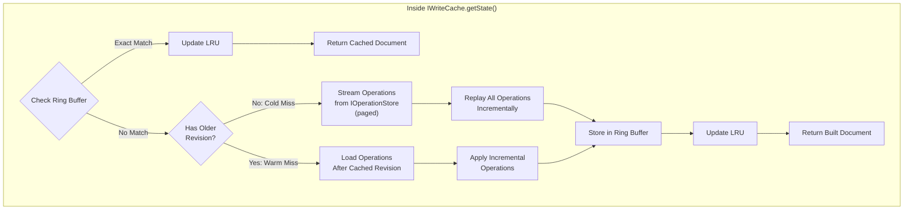

# IWriteCache

### Summary

The `IWriteCache` is an in-memory LRU cache that stores ring buffers of `PHDocument` snapshots for fast retrieval by the job executor. The cache provides two primary methods: `getState()` for retrieving a complete document at a specific revision (with automatic rebuilding on cache miss using `IDocumentModelRegistry` reducers), and `putState()` for storing the resulting document after job execution. By caching recent document snapshots at various revisions, the job executor can avoid replaying all operations from the beginning, significantly improving performance for documents with long operation histories.

### Purpose and Use Case

When a job executor needs to apply operations to a document, it must first obtain the current state of the document. Without caching, this requires:

1. Loading all operations for the document from `IOperationStore`
2. Replaying all operations through the reducer to build up state
3. Starting from the resulting state to apply new operations

For documents with hundreds or thousands of operations, this becomes prohibitively expensive. The `IWriteCache` solves this by caching recent snapshots:

**Before execution:**
1. Call `getState()` with documentId, documentType, scope, branch, and target revision
2. Cache handles retrieval (returning cached document or rebuilding on miss using registry's reducer)
3. Executor receives complete PHDocument ready to use

**After execution:**
1. Call `putState()` to store the resulting PHDocument
2. Cache stores document snapshot in ring buffer for future use
3. Next execution can start from this cached document

### Architecture

#### Ring Buffer per Document Stream

Each document stream (identified by `documentId`, `scope`, `branch`) maintains its own **ring buffer** of snapshots. A ring buffer is a fixed-size circular buffer that automatically overwrites the oldest entry when full.

```
Document Stream: (doc-1, global, main)
┌─────────────────────────────────────────────┐
│ Ring Buffer (size = 5)                      │
│                                             │
│  [0] Revision 10  ← oldest                  │
│  [1] Revision 15                            │
│  [2] Revision 23                            │
│  [3] Revision 31                            │
│  [4] Revision 42  ← newest                  │
│                                             │
│  Next write position: 0 (wraps around)      │
└─────────────────────────────────────────────┘
```

#### LRU Eviction at Document Level

The cache maintains a maximum number of document streams (`maxDocuments`). When this limit is reached and a new document needs to be cached, the least recently used document's **entire ring buffer** is evicted.

```
Cache: maxDocuments = 3, ringBufferSize = 5

┌─────────────────────────────────────────────┐
│ LRU List (most recent first)                │
│                                             │
│  1. (doc-A, global, main) ← most recent     │
│     Ring buffer: [rev 5, 10, 15, 20, 25]    │
│                                             │
│  2. (doc-B, local, main)                    │
│     Ring buffer: [rev 3, 7, 11, 14, 18]     │
│                                             │
│  3. (doc-C, global, dev) ← least recent     │
│     Ring buffer: [rev 1, 2, 4, 8, 12]       │
│                                             │
└─────────────────────────────────────────────┘

New access to (doc-D, global, main):
- doc-C's entire ring buffer is evicted
- doc-D is added at position 1
- doc-A moves to position 2
- doc-B moves to position 3
```

### Integration with Job Executor

The write cache integrates into the job executor flow at step (4) - reducer execution:




#### Detailed Flow

1. **Job starts**: Executor receives job with actions to apply

2. **Request document from cache**:
   ```tsx
   const document = await writeCache.getState(
     documentId,
     documentType,
     scope,
     branch,
     targetRevision  // Optional - omit for latest
   );
   ```

3. **Cache handles retrieval internally**:
   - Checks ring buffer for cached document at or before targetRevision
   - **On cache hit**: Returns cached PHDocument, updates LRU tracking
   - **On cache miss** (two types):

     **Cold miss** (no document in ring buffer for this stream):
     - Gets reducer from `IDocumentModelRegistry` using documentType
     - Streams operations from `IOperationStore` in pages (e.g., 100 operations at a time)
     - For each page of operations:
       - Applies operations through reducer incrementally
       - Builds up document state progressively
     - Continues until targetRevision is reached (or latest if not specified)
     - Stores resulting PHDocument in ring buffer automatically
     - Updates LRU tracking
     - Returns the built document

     **Warm miss** (have older revision in ring buffer, need newer revision):
     - Finds the newest cached document at revision < targetRevision
     - Gets reducer from `IDocumentModelRegistry` using documentType
     - Loads operations from `IOperationStore` starting after cached revision
     - Applies only the incremental operations through reducer
     - Stores resulting PHDocument in ring buffer automatically
     - Updates LRU tracking
     - Returns the built document

   - Executor always receives the exact document it requested

4. **Execute reducers**:
   - Apply new actions to document using model's reducer
   - Generate new operations
   - Produce updated PHDocument

5. **Store resulting document**:
   ```tsx
   writeCache.putState(
     documentId,
     documentType,
     scope,
     branch,
     finalRevision,
     updatedDocument
   );
   ```
   - Adds snapshot to ring buffer
   - Updates LRU tracking
   - Evicts oldest snapshot in ring buffer if full
   - Evicts least recently used document stream if at capacity

6. **Cache automatically manages**:
   - Ring buffer storage and eviction
   - LRU tracking for document streams
   - Document-level eviction when at capacity

### Implementation Notes

#### Document Deep Copying

To prevent mutations, PHDocument objects must be deep copied when stored and retrieved:

```tsx
putState(
  documentId: string,
  documentType: string,
  scope: string,
  branch: string,
  revision: number,
  document: PHDocument
): void {
  // Deep copy to prevent external mutations
  const safeCopy = structuredClone(document);
  this.addToRingBuffer(key, safeCopy);
}

async getState(
  documentId: string,
  documentType: string,
  scope: string,
  branch: string,
  targetRevision?: number,
  signal?: AbortSignal
): Promise<PHDocument> {
  const key = { documentId, scope, branch };

  // Try to find exact match or nearest older revision
  const cachedDoc = this.findInRingBuffer(key, targetRevision);

  if (cachedDoc && (!targetRevision || cachedDoc.revision === targetRevision)) {
    // Cache hit: return deep copy to prevent external mutations
    this.updateLRU(key);
    return structuredClone(cachedDoc.document);
  }

  // Cache miss - determine if cold or warm
  let rebuiltDocument: PHDocument;

  if (!cachedDoc) {
    // Cold miss: no document in cache, rebuild from scratch
    rebuiltDocument = await this.coldMissRebuild(
      documentId,
      documentType,
      scope,
      branch,
      targetRevision,
      signal
    );
  } else {
    // Warm miss: have older revision, apply incremental operations
    rebuiltDocument = await this.warmMissRebuild(
      cachedDoc.document,
      cachedDoc.revision,
      documentId,
      documentType,
      scope,
      branch,
      targetRevision,
      signal
    );
  }

  // Store in cache for future use
  this.addToRingBuffer(key, {
    revision: targetRevision ?? rebuiltDocument.revision,
    document: structuredClone(rebuiltDocument)
  });
  this.updateLRU(key);

  return rebuiltDocument;
}

private async coldMissRebuild(
  documentId: string,
  documentType: string,
  scope: string,
  branch: string,
  targetRevision?: number,
  signal?: AbortSignal
): Promise<PHDocument> {
  const reducer = this.registry.getModule(documentType).reducer;
  let document: PHDocument | null = null;
  const pageSize = 100;
  let currentIndex = 0;

  // Stream operations in pages
  while (true) {
    const operations = await this.operationStore.getOperations(
      documentId,
      scope,
      branch,
      currentIndex,
      pageSize,
      signal
    );

    if (operations.length === 0) break;

    // Apply operations incrementally
    for (const operation of operations) {
      if (targetRevision && operation.index > targetRevision) {
        return document!;
      }

      if (!document) {
        // Initialize document from first operation
        document = this.createInitialDocument(documentId, documentType, operation);
      } else {
        document = reducer(document, operation.action);
      }
    }

    if (targetRevision && operations[operations.length - 1].index >= targetRevision) {
      break;
    }

    currentIndex += operations.length;
  }

  return document!;
}

private async warmMissRebuild(
  baseDocument: PHDocument,
  baseRevision: number,
  documentId: string,
  documentType: string,
  scope: string,
  branch: string,
  targetRevision?: number,
  signal?: AbortSignal
): Promise<PHDocument> {
  const reducer = this.registry.getModule(documentType).reducer;
  let document = structuredClone(baseDocument);

  // Load operations after base revision
  const operations = await this.operationStore.getOperations(
    documentId,
    scope,
    branch,
    baseRevision + 1,
    targetRevision ? targetRevision - baseRevision : undefined,
    signal
  );

  // Apply incremental operations
  for (const operation of operations) {
    if (targetRevision && operation.index > targetRevision) {
      break;
    }
    document = reducer(document, operation.action);
  }

  return document;
}
```

#### Ring Buffer Implementation

```tsx
class RingBuffer<T> {
  private buffer: T[];
  private head: number = 0;
  private size: number = 0;

  constructor(private capacity: number) {
    this.buffer = new Array(capacity);
  }

  push(item: T): void {
    this.buffer[this.head] = item;
    this.head = (this.head + 1) % this.capacity;
    if (this.size < this.capacity) this.size++;
  }

  getAll(): T[] {
    // Return items in chronological order
    if (this.size < this.capacity) {
      return this.buffer.slice(0, this.size);
    }
    return [
      ...this.buffer.slice(this.head),
      ...this.buffer.slice(0, this.head)
    ];
  }
}
```

### Links

* [Interface](./write-cache-interface.md) - TypeScript interface definitions
* [Job Executor](../Jobs/index.md) - Primary consumer of the write cache
* [IOperationStore](../Storage/IOperationStore.md) - Fallback when cache misses
* [IDocumentView](../Storage/IDocumentView.md) - Complementary read-path cache
