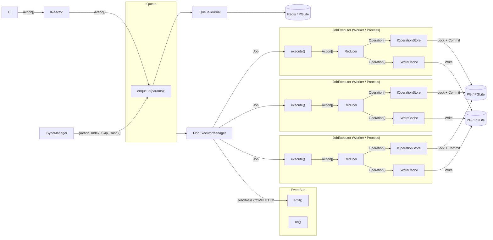
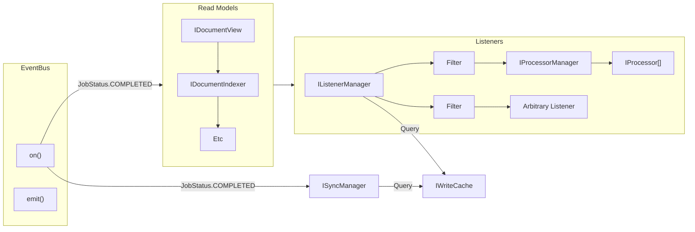

# IWriteCache

The goal of the `IWriteCache` is to reduce operations across many related documents into a single stream of operations. This allows a `Listener`, for example, to have a simple, optimized cursor to iterate over operations that affect it.

### Ideal Command-Sourcing v Reactor Command-Sourcing

In Command-Sourcing, the typical approach is to store the stream of commands before they hit the "Aggregate", which is the entity that processes the commands. A "Write Model" calls aggregates with the commands and generates events.

In our case, the only Aggregate is the document model reducer. Our "command stream" is the `IOperationStore`, and it contains both the commands and the _aggregate results_.

This means that Reactor diverges from typical approaches in that there is no stream of commands that have not yet been processed (we have something _similar_, where the `IQueueJournal` stores "pre-executed" commands (i.e. Actions), but this is not append-only, and its concern is the durability of actions, not the stream of commands).

The "Write Model" is essentially the `IJobExecutor`, which calls the reducer, generates events, then stores things.

### Is the `IWriteCache` a "Read Model"?

There are two main approaches to implementing the `IWriteCache`:

1. Write to both `IOperationStore` and `IWriteCache` in `IJobExecutor` (inside the "Write Model"). The reason we do not want to combine these two interfaces into a single entity is because they have different requirements: `IOperationStore` will have implementations for IPFS and Swarm, while `IWriteCache` will always only have an implementation on top of a relational database.

2. Write to `IOperationStore` in `IJobExecutor`, and `IWriteCache` "eventually" in response to Event Bus job completion events. This effectively makes the `IWriteCache` a read model. This, however, would mean the `IWriteCache` can be stale. In addition, we would need an additional catchup mechanism to ensure that the `IWriteCache` is up to date.

Thus, `IWriteCache` is a write model and approach (1) is the only viable option.

### Requirements

- `IWriteCache` must have a rollback mechanism.

- Ideally, collections are not created lazily, they are created when new operations are made available.

- The `IWriteCache` must be able to be sharded. In reality, this likely means that Switchboard (for example) would have multiple `IWriteCache` instances, and we shard deterministically based on document properties.

### Data Structure

Operations are kept in the `IOperationStore` as a table of `Operation`s. The full schema is defined in the [`IOperationStore`](../Storage/IOperationStore.md) documentation, but below is a non-authoritative example of what the table might look like:

| id | jobId | opId | prevOpId | writeTimestampUtcMs | documentId | scope | branch | timestampUtcMs | index | action | skip |
| --- | --- | --- | --- | --- | --- | --- | --- | --- | --- | --- | --- |
| 1 | 1 | 1 | null | 2021-01-01 00:00:00 | doc1 | scope1 | branch1 | 2021-01-01 00:00:00 | 1 | { "type": "create", "data": { "id": "1" } } | 0 |
| 2 | 1 | 2 | 1 | 2021-01-01 00:00:00 | doc1 | scope1 | branch1 | 2021-01-01 00:00:00 | 2 | { "type": "update", "data": { "id": "1", "name": "New Name" } } | 0 |
| 3 | 1 | 3 | 2 | 2021-01-01 00:00:00 | doc1 | scope1 | branch1 | 2021-01-01 00:00:00 | 3 | { "type": "delete", "data": { "id": "1" } } | 0 |

The `IWriteCache` defines a new table that relates documents to each other, in a flat structure we call a **Collection**. While documents are free to exist in a graph structure, with arbitrary parent-child relationships (with some restrictions), the `IWriteCache` only stores flat collections of documents.

| documentId | collectionId |
| --- | --- |
| doc1 | collection1 |
| doc2 | collection1 |
| doc3 | collection2 |

The `IWriteCache` also stores a table very similar to the `IOperationStore` table, so that a join can be performed.

### Collection Id

Collection ids are able to be explicitly created from an `OperationFilter`. This ensures that the `IWriteCache` can forward-create collections for Listeners that may not exist yet.

```ts
type OperationFilter = {
  driveId: string;
  branch: string[];
  documentId: string[];
  documentType: string[];
  scope: string[];
};
```

`iPejYCq5-74u_Wx221SpApZxPiiOGcNuJoN9LBwcYWGYZSd-o5trViqqoC8OJmc5xMhTlJrL3hXOsPbxFbzLCg==`

`7x0QaStA6zgPGAuRYfuaJDMiOnsQ1p3Rf/sQXFBgS9c=`

### Summary



Notes:




```ts
// filters with AND
type ListenerFilter = {
  branch: string[];
  documentId: string[];
  documentType: string[];
  scope: string[];
};

// processors
(driveId: string) => {
  processor: IProcessor;
  filter: ListenerFilter;
}[];


```

Filter `->` Deterministic Function `->` CollectionId
