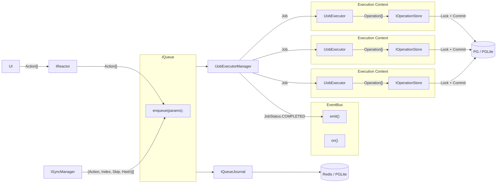
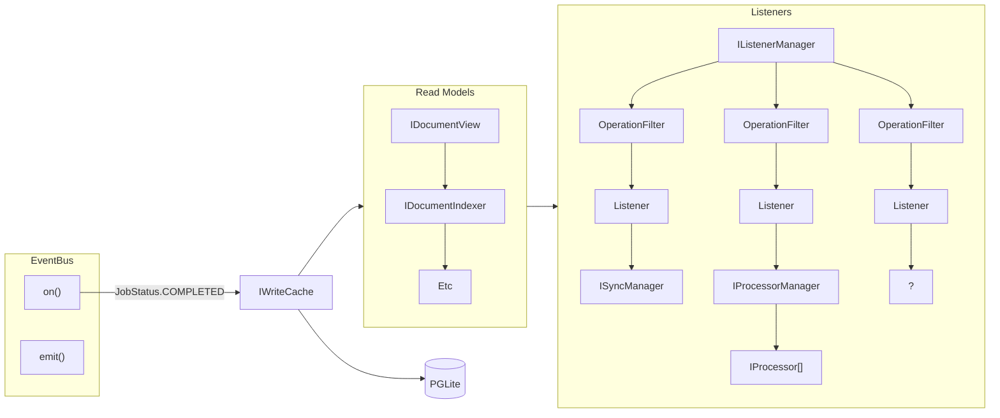

# IWriteCache

### Summary

```mermaid
flowchart LR
  UI -->|"Action[]"| IReactor -->|"Action[]"| Queue
  IQueue --> IJobExecutorManager -->|"Job"| JAJ

  IJobExecutorManager -->|"Job"| JBJ
  IJobExecutorManager -->|"Job"| JCJ

  ISyncManager -->|"(Action, Index, Skip, Hash)[]"| Queue
  IQueue --> IQueueJournal --> QDB[(Redis / PGLite)]

  IJobExecutorManager -->|"JobStatus.COMPLETED"| Emit

  subgraph JA["Execution Context"]
    JAJ["IJobExecutor"]
    JAJ -->|"Operation[]"| JAO["IOperationStore"]
  end

  subgraph JB["Execution Context"]
    JBJ["IJobExecutor"]
    JBJ -->|"Operation[]"| JBO["IOperationStore"]
  end

  subgraph JC["Execution Context"]
    JCJ["IJobExecutor"]
    JCJ -->|"Operation[]"| JCO["IOperationStore"]
  end

  JAO -->|"Lock + Commit"| DB[(PG / PGLite)]
  JBO -->|"Lock + Commit"| DB
  JCO -->|"Lock + Commit"| DB

  subgraph IQueue
    Queue["enqueue(params);"]
  end

  subgraph EventBus
    On["on()"]
    Emit["emit()"]
  end
```

```mermaid
flowchart LR
  subgraph EventBus
    On["on()"]
    Emit["emit()"]
  end

  On -->|"JobStatus.COMPLETED"| IWriteCache --> ReadModels --> Listeners

  IWriteCache --> DB[(PGLite)]

  subgraph ReadModels["Read Models"]
    IDocumentView --> IDocumentIndexer --> Etc
  end

  subgraph Listeners
    IListenerManager --> FA
    IListenerManager --> FB
    IListenerManager --> FC

    FA["OperationFilter"] --> LA["Listener"] --> ISyncManager
    FB["OperationFilter"] --> LB["Listener"] --> IProcessorManager --> Processors["IProcessor[]"]
    FC["OperationFilter"] --> LC["Listener"] --> ?
  end
```
