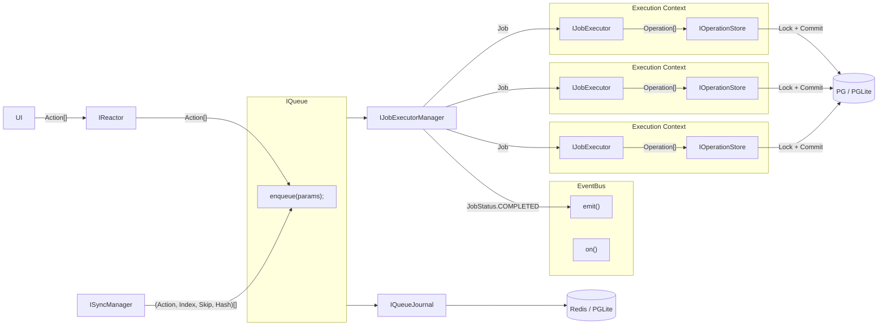
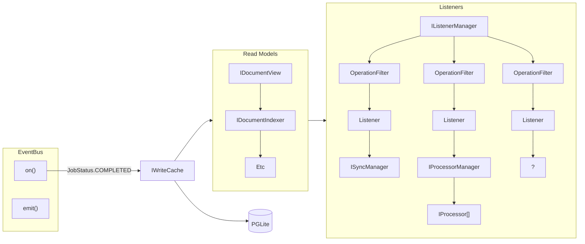

# IWriteCache

The goal of the `IWriteCache` is to reduce operations across many related documents into a single stream of operations. This allows a `Listener`, for example, to have a simple, optimized cursor to iterate over operations that affect it.

### Ideal Command-Sourcing v Reactor Command-Sourcing

In Command-Sourcing, the typical approach is to store the stream of commands before they hit the "Aggregate", which is the entity that processes the commands. A "Write Model" calls aggregates and generates events.

In our case, the only Aggregate is the document model reducer. Our "command stream" is the `IOperationStore`, and it contains both the commands and the aggregate (i.e. reducer) _output_.

This means that Reactor diverges from typical approaches in that there is no stream of commands that have not yet been processed (we have something _similar_, where the `IQueueJournal` stores "pre-executed" commands (i.e. Actions), but this is not append-only, and its main concern is the durability of actions).

The "Write Model" is essentially the `IJobExecutor`, which calls the reducer, generates events, then stores things.

### Is the `IWriteCache` a Read Model?

There are two main approaches:

1. Write to both IOperationStore and IWriteCache in IJobExecutor.

- This would require the `IWriteCache` to know how to relate documents to each other for later consumption by Listeners. Thus, either the `ListenerFilter` construct would need to be greatly simplified so that we can always have a write cache stream for Listeners created at any time, or we'd need the IWriteCache to know about new listeners.

2. Write to IOperationStore in IJobExecutor, and IWriteCache later in response to Event Bus job completion. This effectively makes the `IWriteCache` more like a read model.

- This would mean the `IWriteCache` can be stale.

### Summary






```ts
// filters with AND
type ListenerFilter = {
  branch: string[];
  documentId: string[];
  documentType: string[];
  scope: string[];
};

// processors
(driveId: string) => {
  processor: IProcessor;
  filter: ListenerFilter;
}[];


```

Filter `->` Deterministic Function `->` CollectionId
