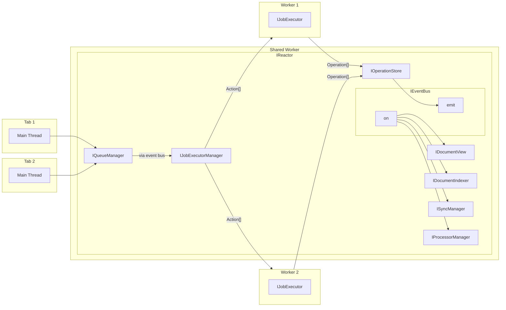
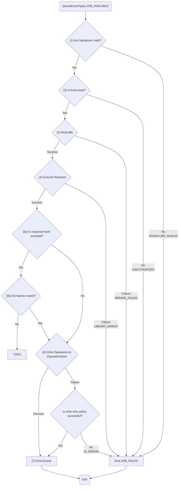
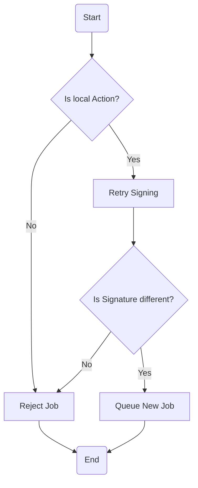
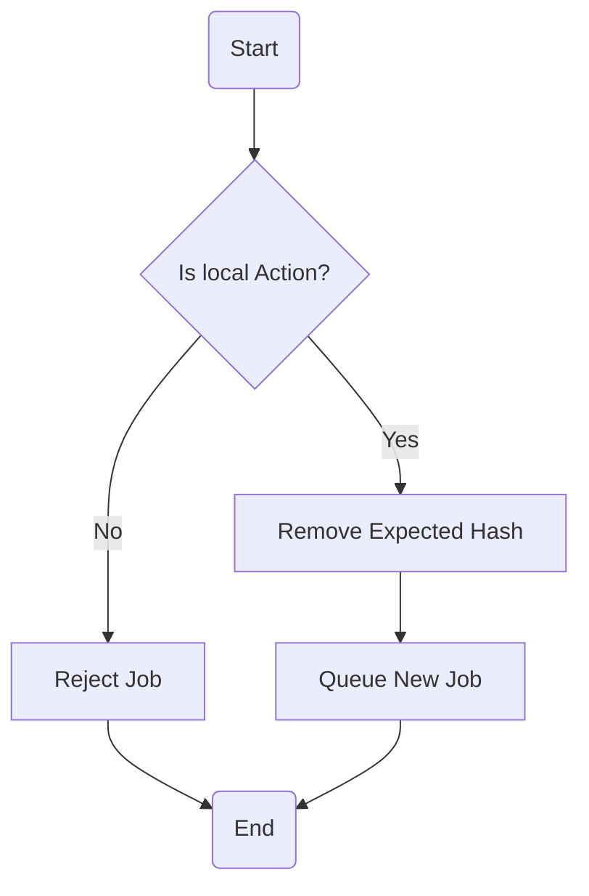
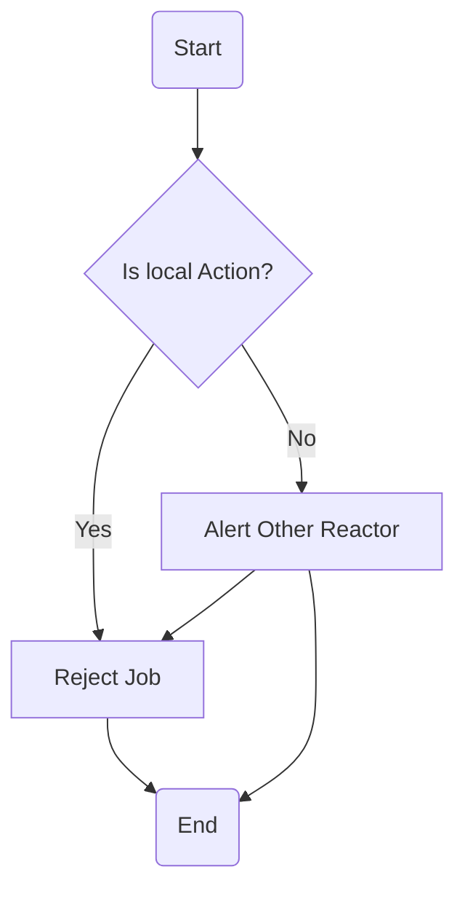
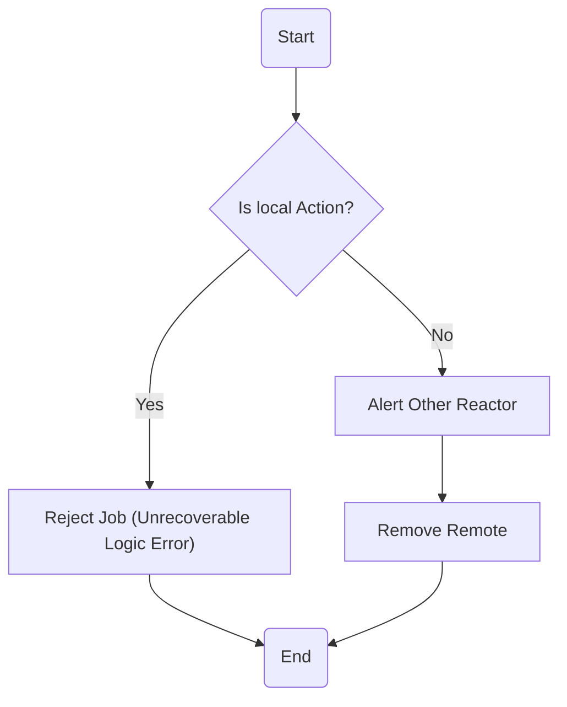
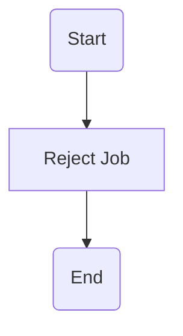

# IJobExecutor

### Summary

- The `IJobExecutorManager` listens for `QueueEventTypes.JOB_AVAILABLE` events from the event bus and pulls jobs from the queue when capacity allows.
- It creates and manages `IJobExecutor`s, which are objects that process jobs.
- It provides configurable concurrency, retry logic with exponential backoff, and monitoring capabilities.
- Jobs are made up of a set of `Action`s. Job execution creates one or more `Operation` objects (note that `Action` and `Operation` do not necessarily have a 1:1 relationship).
- The `IQueue` is responsible for persisting jobs for later execution, but the `IJobExecutor` is not. It simply pulls jobs from the queue and executes them.

### Workers

The `IJobExecutorManager` sits on the main `IReactor` thread, but is free to create and manage `IJobExecutor`s on other threads. Below is a high-level diagram of the main components, but a few things to note:

- "Workers" describe a threading primitive, but for server applications this may be across process boundaries as well.
- Performance characteristics across in-process workers are largely unknown. `postMessage` will be used to communicate between workers, but it has two main APIs for data transfer:
  - [`structuredClone()`](https://developer.mozilla.org/en-US/docs/Web/API/Web_Workers_API/Structured_clone_algorithm) - The default method that copies data across workers.
  - [Transferable Objects](https://developer.chrome.com/blog/transferable-objects-lightning-fast) - Used to transfer large objects by reference, which may be applicable for some operations.
- Depending on performance information and implementation details of the `IOperationStore`, we might have each executor insert via its own `IOperationStore`, then propagate smaller events back through `postMessage` to the queue.

### Flow

An `IJobExecutor` follows the following flow:

1. Verify signatures on `Action` objects before executing them.
2. Verify authorization on `Action` objects before executing them.
3. Reshuffle to get list of actions to process.
4. Execute reducers to get list of operations.
5. Verify resulting `Operation` hashes match expected hashes.
6. Write `Operation`s to the `IOperationStore`.
7. Propagate events to the `IEventBus`.

The following flowchart demonstrates:

#### (1) Signature Verification

First, the `IJobExecutor` will verify that the `Action` signatures are valid.

If the `Action` signature is not valid, the `IJobExecutor` will emit a `JobExecutorEventTypes.JOB_FAILED` event with an error code of `JobErrorCodes.SIGNATURE_INVALID`.

The job will not be retried.

#### (2) Authorization Verification

The job executor will verify that the user is authorized to apply the `Action` to the document. This is heavily dependent on the current state of the document and the specific `Action`s to be applied.

See the [Auth](../Auth/index.md) documentation for more information.

#### (3) Reshuffle Logic

See the [Reshuffle](./reshuffle.md) documentation for more information.

#### (4) Reducer Execution

For each `Action`, the `IJobExecutor` will execute the relevant reducer to construct the resulting state of the document. The job executor will generate corresponding `Operation` objects.

##### System Stream

The [`Operations` documentation](../Operations/index.md#system-stream) describes a special set of actions handled by the Reactor itself. These actions are not passed to document-model reducers, but instead are handled by a Reactor-specific reducer.

The `IJobExecutor` will use a `IReducer` to apply the system actions to the document state. The `IReducer` is passed into the `IJobExecutor` constructor, so that the `IJobExecutor` does not need to know about the custom logic for handling these actions.

#### (5) Operation Verification

Optionally, a user may specify additional consistency checks by using the `prevOpHash` or `prevOpIndex` in the `ActionContext` of the `Action`s in the `Job`. These are detailed in the [Operations](../Operations/index.md#expected-operation-state) documentation.

#### (6) Writing Operations to the `IOperationStore`

The `IJobExecutor` will write `Operation`s to the `IOperationStore` after they have been successfully applied.

On failure, the write will be retried according to a configurable retry policy using exponential backoff and jitter.

#### (7) Propagating Operation Events to the `IEventBus`

The executor emits a set of structured events so that clients can react to job progress and failures:

- **`JobExecutorEventTypes.JOB_STARTED`** - issued when execution of a job begins.
- **`JobExecutorEventTypes.JOB_COMPLETED`** - issued after a job finishes successfully.
- **`JobExecutorEventTypes.JOB_RETRY`** - issued when execution throws a retryable error and the executor is retrying the job.
- **`JobExecutorEventTypes.JOB_FAILED`** - issued when execution throws an unrecoverable error and will not be retried.

### Error Propagation

The `IJobExecutor` does not handle errors, it propagates them outward for other systems to handle. Only unrecoverable errors are propagated. These are for jobs that either cannot be retried or are not recoverable even after retry / reshuffle.

Job errors are defined by the `error: JobError` property on the `JobResult` object. The error message of the error object may be used to provide more context about the error, and is not guaranteed to be consistent for all errors of a specific code.

This is the exhaustive list of possible unrecoverable job error codes, each defined on the [JobErrorCodes](interface.md) object:

##### `SIGNATURE_INVALID`

One or more `Action` signatures was invalid.

While the [Synchronization](../Synchronization/index.md#signature_invalid) documentation describes its specific handling of this error, the general recovery flow is as follows:

##### `HASH_MISMATCH`

One or more `Operation` hashes did not match the expected hash.

While the [Synchronization](../Synchronization/index.md#hash_mismatch) documentation describes its specific handling of this error, the general recovery flow is as follows:

##### `LIBRARY_ERROR`

An exception was thrown in the related document model library, even after retry logic was applied. High level recovery flow:

##### `UNAUTHORIZED`

The user is not authorized to apply the `Action` to the document. High level recovery flow:

##### `REBASE_FAILED`

A rebase was attempted but failed. High level recovery flow:

##### `GRACEFUL_ABORT`

This is used when a shutdown of the job executor is requested. This error code will be attached to all incomplete `JobResult` objects in all queues.

High level recovery flow:

### Dependencies

- [IQueue](../Queue/index.md)
- [IEventBus](../Events/index.md)
- [IOperationStore](../Storage/IOperationStore.md)

### Links

- [Interface](interface.md)
- [Usage](usage.md)
