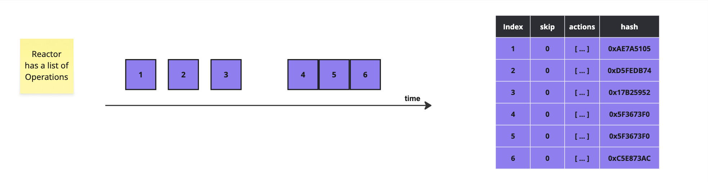
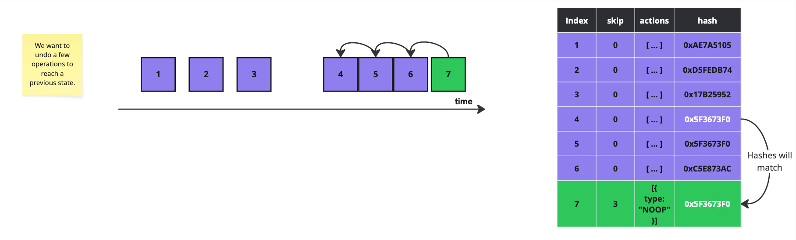
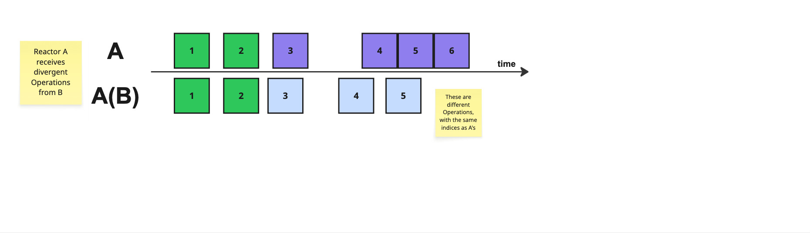
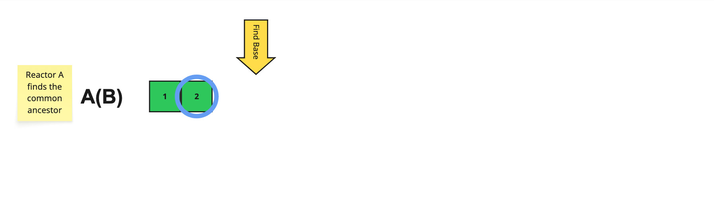
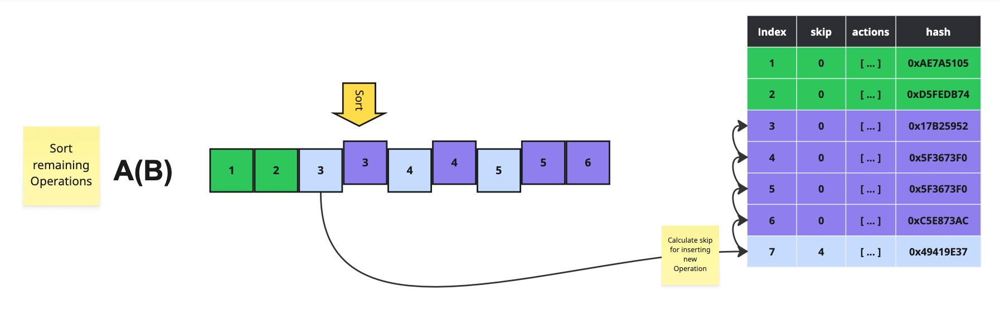
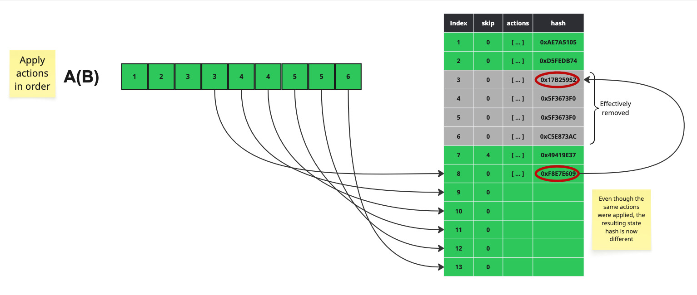

# Reshuffle

The term "reshuffle" is used throughout to describe the special, append-only method in which we may reorder operations. We reshuffle for two main reasons: `rebase` and `undo`.

## Undo

It's easiest to understand the `undo` case first. Since we are append-only, we can't remove operations from the log.

Instead, we submit an undo operation (called `NOOP`) that specifies how many previous operations to skip, when rebuilding the document state.

When rebuilding document state, we must skip the number of operations specified in the `NOOP` operation.

## Rebase

Rebases happen transparently when multiple users are editing the same document.

Say Reactor A has a log of operations on a document.

It receives a message from Reactor B, containing operations that are concurrent with its own. This is determined by operation index (if the index of the received operations are less than or equal to the latest index in the log) and/or timestamp (if the timestamp of the received operations are less than or equal to the latest timestamp in the log).

First, Reactor A must find the common ancestor, or "base", which is the last operation in the log that does not conflict with the operations from Reactor B.

Then we sort all the conflicting operations by timestamp. We then calculate a `skip` value for the first operation in that sorted list, specifying how far back to "rewind" or undo the log. In this case, Reactor A needs to skip the 4 operations it has applied since the base operation.

Then it will apply all actions in order, generating new operations which are appended to the log with new indexes and hashes.

Finally, Reactor A sends all new operations to Reactor B.

