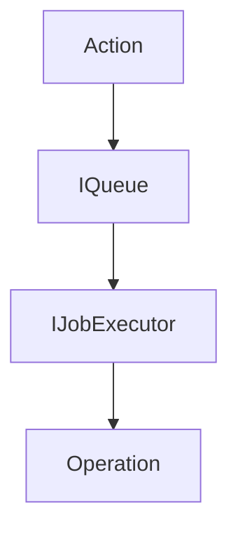

# Operations

### Summary

An `Operation` is the fundamental unit of change in the Reactor system. These represent atomic facts about document state. That is, Operations are mutations that have already been applied.

In a typical Event Sourcing architecture, Operations are the "Events".

An `Operation` is immutable, ordered (though sometimes reshuffled), and provides complete auditability of all document changes.

An `Operation` always applies to a specific scope. See [PHDocument](../PHDocument/index.md) for more information on scopes.

### Actions

Before an `Operation` exists, an `Action` must be created. An `Action` is a plain object that represents the intent of the Operation. It can be mutated before it is submitted to the Reactor.

In a typical Event Sourcing architecture, Actions are the "Commands".

The data structure for an `Action` is as follows:

```tsx
/**
 * Base structure for all actions
 */
type BaseAction<
  TType extends string,
  TInput,
  TScope extends OperationScope = OperationScope,
> = {
  /** The unique id of the action */
  id: string;

  /** The name of the action */
  type: TType;

  /** The version of the document model */
  version: string;

  /** The scope of the action, like 'global' or 'local' */
  scope: TScope;

  /** The payload of the action */
  input: TInput;

  /** The context of the action */
  context: ActionContext;

  /** The attachments used in the action */
  attachments: AttachmentRef[];
};
```

#### Action Signing

Actions include cryptographic signatures on the `ActionContext` to verify that they originated from a specific user.

- Cryptographic signatures are verified using the Web Crypto API.
- Signatures need: a public key, a payload, and a signature.
- The signature payload is generated from the `SignedPayloadParameters` and the `Action` using a stable, JSON-encoding.
  - This allows us to dedupe information.
  - Allows for wrapping signatures in other signatures.
  - Allows for different payloads, depending on the use case. [Upgrade Actions](./upgrades.md), for instance, may have a different payload than a regular Action.
- In general, when submitting a new action, the signature payload will include:
  - The action itself
  - The application information
  - The hash of the latest operation for the `(documentId, scope, branch)`
- In the case or reshuffling, the `ISigner` will wrap the signature of an action in a new signature. This is because the previously signed state hash may not be valid so a new one must be generated.

```tsx

type PublicKey {
  /**
   * The name of the algorithm used to sign the action.
   * 
   * See: https://developer.mozilla.org/en-US/docs/Web/API/SubtleCrypto/verify#algorithm
   */
  algorithm: string;

  /**
   * The format of the public key.
   * 
   * https://developer.mozilla.org/en-US/docs/Web/API/SubtleCrypto/exportKey#format
   */
  format: string;

  /**
   * The exported public key used to sign the action, in Base64 format.
   */
  data: string;
}

type Signer = {
  /**
   * The public key used to sign the action.
   */
  publicKey: PublicKey;

  /**
   * The name of the signer, used to identify a signing application.
   * 
   * Eg: "Connect", "Powerhouse", etc
   */
  app?: string;
  
  /**
   * EVM address of the signer, used to identify a user.
   */
  address?: string;

  /**
   * The CAIP-2 network id of the signer, used to identify a user.
   */
  networkId?: string;

  /**
   * The CAIP-10 chain id of the signer, used to identify a user.
   */
  chainId?: number;

  // todo: other claims?
};

type SignedPayloadParameters = {
  /**
   * Additional signatures to append to the payload.
   */
  signatures: Signature[];
};

type Signature = {
  /**
   * The signer of the action.
   */
  signer: Signer;

  /**
   * Parameters for the signed payload.
   */
  payload: SignedPayloadParameters;

  /**
   * Base64 encoded signature of the payload.
   */
  signature: string;
};

type ActionContext = {
  /**
   * The signature of the action.
   */
  signature: Signature;
};
```

### Operations

An `Operation` represents the result of an `Action` being executed. It is a "fact", not an "intent".

Unlike a typical ES approach, where Actions are generally discarded or stored in an outbox pattern, each `Action` is stored with the `Operation` that is produced from it. This allows every client to re-execute each `Action` and verify the resulting `Operation`.

The lack of `previousState` is simply an optimization. As the previous state is always known, it is not necessary to store it (but perhaps could be necessary for debugging).

```tsx
/**
 * Core Operation type that combines action data with execution metadata
 */
type Operation<T extends Action = Action> = {
  /** Unique operation id */
  id: string;
  
  /** Position of the operation in the history */
  index: number;
  
  /** The number of operations skipped with this Operation */
  skip: number;

  /** Timestamp of when the operation was added */
  timestampUtcMs: number;

  /** The action that was executed to produce this operation */
  action: T;

  /** The resulting state after the operation is executed */
  resultingState: string;

  /** Hash of the resulting state */
  hash: string;
};
```

### Schema

See the `[IOperationStore](../Storage/IOperationStore.md)` doc for explicit db schema.

### Operation Lifecycle



1. Action creation - An `Action` is created by the user using the document model API.

2. Queueing - Actions are queued by `(documentId, scope, branch)` to ensure proper ordering.

3. Execution - Actions are passed through reducers to mutate state. Operations are created from the resulting state.

4. Storage - Once applied, operations are persisted in the `IOperationStore` with atomic transactions.

### Idempotency

Reducers are not guaranteed to be idempotent. That is, if a reducer is called with the same input twice, it may produce different results. This is intended behavior.

However, we do guarantee idempotency at the `Operation` level, with deterministic identifiers. Each operation has an `opId` derived from stable properties such as: document id, scope, branch, type, action id.

Submitting the same action twice results in the same `opId`, so the store can safely ignore duplicates.

The `hash` field stores the expected document state after applying the operation; reducers compute the state hash during execution and compare it to this value to detect divergence. Along with the unique `(documentId, scope, branch, index)` constraint in the storage schema, these identifiers ensure that replaying operations cannot introduce inconsistent state.

### Attachments

See the [Attachments doc](../Attachments/index.md) for more information on attachments. These are not stored with `Operation`s directly, but with the `Action` that consumes them.

### Action Error Handling

Operations cannot be in a failure state, as they represent facts about the document state. Instead, the `Action` that produced the `Operation` may fail.

Failed `Action`s are not retained in the `IOperationStore` in any way, but are bubbled up in named Error objects.
