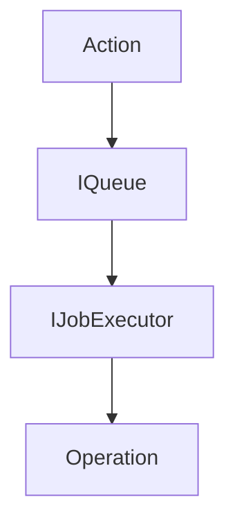

# Operations

### Summary

An `Operation` is the fundamental unit of change in the Reactor system. These represent atomic facts about document state. That is, Operations are mutations that have already been applied.

- In a typical Event Sourcing architecture, Operations correspond to "Events".
- An `Operation` is immutable, ordered (though sometimes reshuffled), and provides complete auditability of all document changes.
- An `Operation` always applies to a specific document, scope, and branch. See [PHDocument](../PHDocument/index.md) for more information on scopes.

### Actions

- Before an `Operation` exists, an `Action` must be created. An `Action` is a plain object that represents the intent of the Operation. It can be mutated before it is submitted to the Reactor.
- In a typical Event Sourcing architecture, Actions correspond to "Commands".

The data structure for an `Action` is as follows:

```tsx
/**
 * Base structure for all actions
 */
type BaseAction<
  TType extends string,
  TInput,
  TScope extends OperationScope = OperationScope,
> = {
  /** The unique id of the action */
  id: string;

  /** The name of the action */
  type: TType;

  /** The version of the document model */
  version: string;

  /** The scope of the action, like 'global' or 'local' */
  scope: TScope;

  /** The payload of the action */
  input: TInput;

  /** The context of the action */
  context: ActionContext;

  /** The attachments used in the action */
  attachments: AttachmentRef[];
};
```

#### Action Signing

Actions include cryptographic signatures on the `ActionContext` to verify that they originated from a specific user.

- Cryptographic signatures are verified using the Web Crypto API.
- Signatures need: a public key, a payload, and a signature.
- The signature payload is generated from the `SignedPayloadParameters` and the `Action` using a stable, JSON-encoding.
  - This allows us to dedupe information.
  - Allows for wrapping signatures in other signatures.
  - Allows for different payloads, depending on the use case. [Upgrade Actions](./upgrades.md), for instance, may have a different payload than a regular Action.
- In general, when submitting a new action, the signature payload will include:
  - The action itself
  - The application information
  - The hash of the latest operation for the `(documentId, scope, branch)`
- In the case or reshuffling, the `ISigner` will wrap the signature of an action in a new signature. This is because the previously signed state hash may not be valid so a new one must be generated.

```tsx

type PublicKey {
  /**
   * The name of the algorithm used to sign the action.
   * 
   * See: https://developer.mozilla.org/en-US/docs/Web/API/SubtleCrypto/verify#algorithm
   */
  algorithm: string;

  /**
   * The format of the public key.
   * 
   * https://developer.mozilla.org/en-US/docs/Web/API/SubtleCrypto/exportKey#format
   */
  format: string;

  /**
   * The exported public key used to sign the action, in Base64 format.
   */
  data: string;
}

type Signer = {
  /**
   * The public key used to sign the action.
   */
  publicKey: PublicKey;

  /**
   * The name of the signer, used to identify a signing application.
   * 
   * Eg: "Connect", "Powerhouse", etc
   */
  app?: string;
  
  /**
   * EVM address of the signer, used to identify a user.
   */
  address?: string;

  /**
   * The CAIP-2 network id of the signer, used to identify a user.
   */
  networkId?: string;

  /**
   * The CAIP-10 chain id of the signer, used to identify a user.
   */
  chainId?: number;

  // todo: other claims?
};

type SignedPayloadParameters = {
  /**
   * Additional signatures to append to the payload.
   */
  signatures: Signature[];
};

type Signature = {
  /**
   * The signer of the action.
   */
  signer: Signer;

  /**
   * Parameters for the signed payload.
   */
  payload: SignedPayloadParameters;

  /**
   * Base64 encoded signature of the payload.
   */
  signature: string;
};

type ActionContext = {
  /**
   * The signature of the action.
   */
  signature: Signature;
};
```

### Operations

An `Operation` represents a result of an `Action` being executed. It is a "fact", not an "intent".

Unlike a typical ES approach, where Actions are generally discarded or stored in an outbox pattern, each `Operation` is stored with the `Action` that produced it. This allows every client to re-execute each `Action` and verify the resulting `Operation`.

```tsx
/**
 * Core Operation type that combines action data with execution metadata
 */
type Operation<T extends Action = Action> = {
  /** Unique operation id */
  id: string;
  
  /** Position of the operation in the history */
  index: number;
  
  /** The number of operations skipped with this Operation */
  skip: number;

  /** Timestamp of when the operation was added */
  timestampUtcMs: number;

  /** The action that was executed to produce this operation */
  action: T;

  /** The resulting state after the operation is executed */
  resultingState: string;

  /** Hash of the resulting state */
  hash: string;
};
```

### Schema

See the `[IOperationStore](../Storage/IOperationStore.md)` doc for explicit db schema.

### Operation Lifecycle



1. Action creation - An `Action` is created by the user using the document model API.

2. Queueing - Actions are queued by `(documentId, scope, branch)` to ensure proper ordering.

3. Execution - Actions are passed through reducers to mutate state. Operations are created from the resulting state.

4. Storage - Once applied, operations are persisted in the `IOperationStore` with atomic transactions.

### Idempotency

Reducers are not guaranteed to be idempotent. If a reducer is called with the same input twice, it may produce different results. This is intended behavior.

However, we do guarantee idempotency at the `Operation` level, with deterministic identifiers.

Each operation has an `opId` derived from stable properties such as: document id, scope, branch, type, job id, and action id.

Submitting the same action twice results in the same `opId`, which will be rejected by the `IOperationStore`.

The `hash` field stores the expected document state after applying the operation; reducers compute the state hash during execution and compare it to this value to detect divergence.

Along with the unique `(documentId, scope, branch, index)` constraint in the storage schema, these identifiers ensure that replaying operations cannot introduce inconsistent state.

### Attachments

See the [Attachments doc](../Attachments/index.md) for more information on attachments. These are not stored with `Operation`s directly, but with the `Action` that consumes them.

### "System Stream"

In Event Sourcing terminology, the `IOperationStore` is the event log, holding many streams of events: and one stream per `(documentId, scope, branch)` tuple. However, there are some events ("facts") that occur outside of this tuple-defined stream. We are left with two options: either create a wrapper around `Operation` that functions more like a typical event log (`{ type, data: operations }`), or create a special stream events on top of the existing `Operation` scheme. We have opted for the latter.

The "System Stream" is a special stream of Operations that represent state changes not from a reducer, but from the Reactor itself. This stream is determined by the tuple,  `(00000000-0000-0000-0000-000000000000, "system", "*")` (we leave open the possibility of other system streams in the future).

The actions that are handled by the Reactor include:

- `CREATE_DOCUMENT`
- `DELETE_DOCUMENT`
- `ADD_RELATIONSHIP`
- `REMOVE_RELATIONSHIP`
- `UPDATE_RELATIONSHIP`

Just like any other `Action`, these are:

- Queued in the `IQueue`
- Executed by the `IJobExecutor`
- Persisted in the `IOperationStore`
- Passed to projections over the `IEventBus`

### Action Dispatches

When a reducer is processing an `Action`, it may use the provided `dispatch` function to dispatch other `Action`s. This is in contrast to the current structure, where a reducer may dispatch a "Signal" (kept in quotes as this is not a data type). Signal handlers then perform side effects outside of the typical `Action` --> `Operation` flow.

A full example is provided below.

#### Example: CREATE_CHILD_DOCUMENT Signal

The clearest example of this is the `CREATE_CHILD_DOCUMENT` action inside of the `drive-document` model.

First, a user creates an "ADD_FILE" action:

```tsx
export const addFile = (input: AddFileInput) =>
  createAction<AddFileAction>(
    "ADD_FILE",
    { ...input },
    undefined,
    z.AddFileInputSchema,
    "global",
  );

// elided

const action = addFile({ ... });
```

Inside of this action, synchronization units are generated and attached to the action. The action is queued as a special case drive operation with `queueDriveOperation`.

In the reducer for `ADD_FILE`, the reducer dispatches a `CREATE_CHILD_DOCUMENT` signal:

```tsx
dispatch?.({
  type: "CREATE_CHILD_DOCUMENT",
  input: {
    id: action.input.id,
    documentType: action.input.documentType,
    synchronizationUnits,
    document: action.input.document as PHDocument,
  },
});
```

The `Reactor` contains specific logic for handling this signal and performing a side effect outside of the typical `Action` --> `Operation` flow:

```tsx
(signal) => {
  let handler: (() => Promise<unknown>) | undefined = undefined;
  switch (signal.type) {
    case "CREATE_CHILD_DOCUMENT":
      handler = () => this.createDocument(driveId, signal.input);
      break;
  // elided
}
```

This flow has some big implications:

- Custom sync logic for action creation and signal side effects.
- Custom storage logic for side effects caused by signals.
- Custom logic in the base-server for handling the signal, queuing and executing drive actions.
- A projection is simply not possible, as it would need to re-execute the `Action` that produced the `Operation`, watch for the signals produced, and then use the base-server to apply additional side effects.
- Custom recovery logic for signal handling failure (currently not implemented).

#### Example: CREATE_CHILD_DOCUMENT Action

Instead, we propose a flow in which the provided reducer `dispatch` function takes an `Action` as input, which is then queued for execution. The `Action` that is currently being processed finalizes execution and produces an `Operation`, like normal. Then the next `Action` is dequeued and processed, and so on. This creates a "flat" event store with a linear history of state changes.

Client code would then look like this (using the [`IReactorClient`](../ReactorClient/index.md) interface):

```tsx
const client = useReactorClient();

// there is nothing special about drives
const documentId = drive.id;

const newDoc = await client.create(
  myNewDocument, // a PHDocument
  documentId,
);
```

Internally, the `IReactorClient` implementation would look like this:

```tsx
// first, we create a new document (which now does not need to belong to a drive) and wait on it
const jobId = await this.reactor.mutate(
  SYSTEM_DOCUMENT_ID,
  [
    createDocument({
      content: myNewDocument, // a PHDocument
    }),
  ],
)
const { operations } = await waitOnJob(jobId);

// pull off the new document id
const newDocId = operations[0].resultingState.id;

// next, we create a relationship
await this.reactor.mutate(SYSTEM_DOCUMENT_ID, [
  addRelationship({
    sourceId: documentId,
    targetId: newDocId,
    relationshipType: "child",
  }),
]);
```

This could also be implemented as a single `Action`, the reducer of which simply queues both the `CREATE_DOCUMENT` and `ADD_RELATIONSHIP` actions (with the small caveat that the document id would be passed in the input).

Benefits to this approach:

- No special logic to sync or store new documents.
- There is no issue with ordering of operations (like a child being created before its parent).
- The `IDocumentIndexer` will pick up the new relationship and index it with no special logic outside of processing `Operation`s.
- Same built-in guarantees of eventual consistency, graceful recovery, and projection.

### Action Error Handling

Operations cannot be in a failure state, as they represent facts about the document state. Instead, the `Action` that produced the `Operation` may fail.

Failed `Action`s are not retained in the `IOperationStore` in any way, but are bubbled up in named Error objects.
