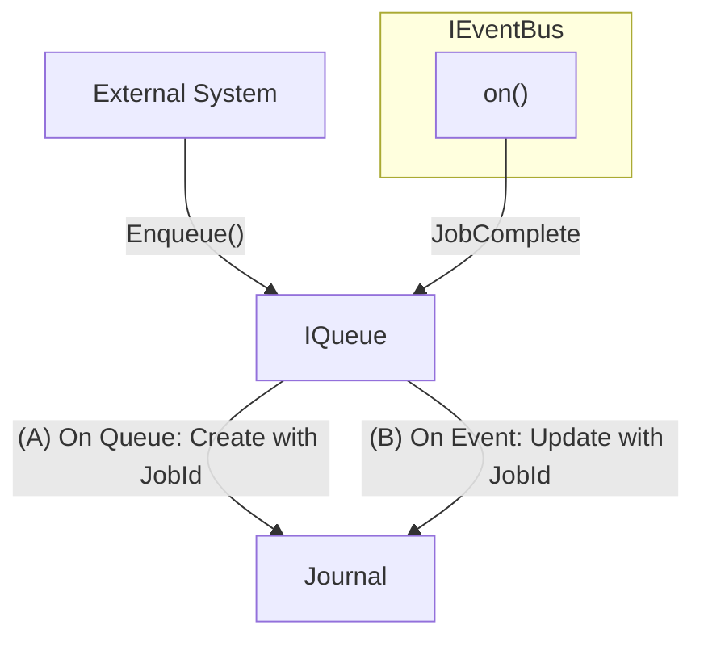

# IQueue

### Summary

The `IQueue` provides a durable API to queue new write jobs.

- Queues are keyed by `(documentId, scope, branch)` to ensure proper ordering of jobs within each document context.
- Jobs in each queue are processed in FIFO order to maintain consistency.
- When a job is enqueued, the queue emits a `JOB_AVAILABLE` event through the `IEventBus` to notify job executors.
- When there is heavy contention (say many jobs enqueued on the same `(documentId, scope, branch)` queue), reshuffle logic is applied by the job executor to proactively prevent as many retries and requeues as possible.
- Retry and requeue logic is handled by the `IJobExecutor`.

### Relationships

`IQueue` supports parent/child relationships between jobs. The basic idea is that a parent job will not be moved to the available status (i.e. where it could be picked up by the `IJobExecutor`) until all its children jobs have been processed successfully.

This functionality enables the creation of flows where jobs are the node of trees of arbitrary depth.

### Signing

- All jobs submitted to the queue should already have a valid signature on each `Action` object.
- The `IQueue` itself does not verify signatures on queued jobs, nor does it do any signing.
- Signature validation and authorization is left to the `IJobExecutor`, as it may be considered a high-CPU operation.

### Durability

- The queue keeps a journal of all jobs that have been enqueued.
- Each job is assigned a unique job id, which gives us a unique record of the job.
- When a job is enqueued, the queue creates a new record in the journal. When a job is completed, the queue updates the record in the journal.
- While the `IQueue` implementation holds reactor-specific business logic and state, an `IQueueDriver` provides a durable queue implementation.

#### IQueueDriver

The `IQueueDriver` is responsible for implementing the durable journal. Additionally, it is responsible for requeueing jobs on startup.

In the edge case that a job did finish successfully but didn't have time to write to the journal, the resulting `Operation`s will be rejected from the `IOperationStore` because of the `opId` uniqueness constraint (see the [Idempotency](../Operations/index.md#idempotency) section of the Operations doc).

### Blocking

- The queue may be blocked or unblocked. See the [Graceful Shutdown](../GracefulShutdown/index.md) documentation for more details on why this is needed.
- Because of this, consumers must be able to handle the `QueueBlockedError` when attempting to enqueue a job while the queue is blocked.

### Dependencies

- [IEventBus](../Events/index.md)
- [IQueueDriver](queue-driver.md)

### Links

* [Interface](interface.md)
* [IQueueDriver](queue-driver.md)
* [Usage](usage.md)
