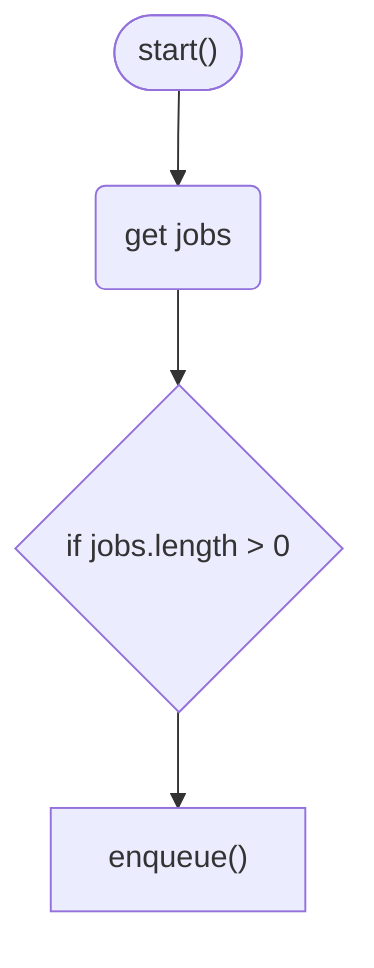

# IQueue

### Summary

The `IQueue` provides a durable API to queue new write jobs and to pull jobs from the queue to write them.

- The queue keeps and updates a journal for recovery and graceful shutdown purposes.
- All jobs are enqueued with `(documentId, scope, branch)` information.
- Jobs can also include dependency relationships, through the `dependsOn` property.
- Dependency information cannot be changed after a job is enqueued.
- Internally, a list of directed graphs is maintained in memory to track the dependency relationships between jobs.
- If a cycle is detected when enqueuing a job, the job will be rejected with a `QueueCycleError`.
- On enqueue and on job completion, the queue scans the dependency graph to determine if any jobs are now ready to be executed.
- If there is are jobs ready to be executed, the queue emits a `JOB_AVAILABLE` event through the `IEventBus`.

- When there is heavy contention, reshuffle logic will be applied by the `IJobExecutor`, not the queue.
- Retry and requeue logic is handled by the `IJobExecutor`, not the queue.

### Job Queue Status

- `JobStatus` and `JobQueueState` are separate concepts. See the [Jobs](../Jobs/index.md) doc for information on `JobStatus`.
- `JobQueueState` is an enum that moves between the following states:
  - `PREPROCESSING` - The job has not been added to a dependency graph.
  - `PENDING` - The job has been added to a dependency graph, but is not ready to be executed.
  - `READY` - The job is ready to be executed.
  - `RUNNING` - The job is currently being executed.
  - `RESOLVED` - The job has been resolved (either successfully or unsuccessfully).

### `IJobExecutionHandle`

The API will synchronously return a `IJobExecutionHandle` object. This object is used to track the status of the job execution.

```tsx
const handle = queue.getNext();
handle.start();
{
  const job = handle.job;

  // perform job logic
}
handle.complete();
```

Or in case of job failure, the handle can be used to mark the job as failed:

```tsx
handle.fail("reason");
```

The `getNext` method will continue to return the same handle until the handle returned is started. Therefore, it is best practice to synchronously call `start()` on the returned handle.

### Signing

- All jobs submitted to the queue should already have a valid signature on each `Action` object.
- The `IQueue` itself does not verify signatures on queued jobs, nor does it do any signing.
- Signature validation and authorization is left to the `IJobExecutor`, as it may be considered a high-CPU operation.

### Durability

- The queue keeps a journal of all jobs that have been enqueued.
- Each job is assigned a unique job id, which gives us a unique record of the job.
- The journal holds enough information to be able to recreate all dependency graphs of all unresolved jobs.
- The journal is updated only when a job is moved to `PENDING` or `RESOLVED` states.
- While the `IQueue` implementation holds reactor-specific business logic and the in-memory dependency graphs, the `IQueueJournal` provides the storage implementation.


### Edge Cases

In the case that a job did resolve but the journal could not be updated, the Job is safe to execute again. The resulting `Operation`s will be rejected from the `IOperationStore` because of the `opId` uniqueness constraint (see the [Idempotency](../Operations/index.md#idempotency) section of the Operations doc).



### Blocking

- The queue may be blocked or unblocked. See the [Graceful Shutdown](../GracefulShutdown/index.md) documentation for more details on why this is needed.
- Because of this, consumers must be able to handle the `QueueBlockedError` when attempting to enqueue a job while the queue is blocked.

### Dependencies

- [IEventBus](../Events/index.md)
- [IQueueJournal](journal.md)

### Links

* [Interface](interface.md)
* [IQueueJournal](journal.md)
* [Usage](usage.md)
