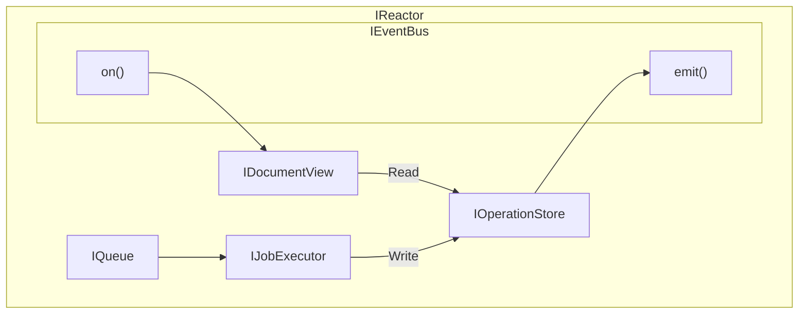

# Interfaces

## Supporting Types

[Interface: Supporting Types](Interfaces%201f31f4740a7f8040a49bc416e7e0766e/Interface%20Supporting%20Types%201fc1f4740a7f804abc67d8a75bc9dabf.md)

**Summary:**

Various types used throughout.

**Dependencies:**

- None

## IEventBus

[Interface: IEventBus](Interfaces%201f31f4740a7f8040a49bc416e7e0766e/Interface%20IEventBus%201fa1f4740a7f804bb539f17a277a46da.md)

**Summary:**

The `EventBus` is an async pub/sub mechanism. We can use an event bus to de-duplicate logic. It allows for both async and sync subscriptions to keep operations consistent. This is an in-memory implementation that does not persist events. Each emit() call guarantees each corresponding handler is called, serially.

**Dependencies:**

- None.

## IReactorSubscriptionManager

[Interface: IReactorSubscriptionManager](Interfaces%201f31f4740a7f8040a49bc416e7e0766e/Interface%20IReactorSubscriptionManager%201fc1f4740a7f8076b4cdec7ce2ff3019.md)

[Usage: IReactorSubscriptionManager](Interfaces%201f31f4740a7f8040a49bc416e7e0766e/Usage%20IReactorSubscriptionManager%201f81f4740a7f80f396b7f2988a4f7629.md)

**Summary:**

- Manage relationships between `SearchFilter` and subscriber.
- Provides an explicitly named interface rather than a general one for clarity.
- Consumes the `IEventBus` interface, providing a higher-level abstraction for application developers.

**Dependencies:**

- IEventBus

## IReactor

[Interface: IReactor](Interfaces%201f31f4740a7f8040a49bc416e7e0766e/Interface%20IReactor%201fc1f4740a7f8016840aea3c91d3b00a.md)

[Usage: IReactor](Interfaces%201f31f4740a7f8040a49bc416e7e0766e/Usage%20IReactor%201f81f4740a7f8016ab7ef6ff5e9669d6.md)

**Summary:**

- Manages DocumentModels and Documents with an asynchronous interface.

**Dependencies:**

- IQueue
- IJobExecutor
- IEventBus
- IDocumentView
- IOperationStore

**Diagram:**

## IReactorClient

[Interface: IReactorClient](Interfaces%201f31f4740a7f8040a49bc416e7e0766e/Interface%20IReactorClient%201fc1f4740a7f8099a3cdecbf339be595.md)

[Usage: IReactorClient](Interfaces%201f31f4740a7f8040a49bc416e7e0766e/Usage%20IReactorClient%201f81f4740a7f8012bab7c7a4a70f4054.md)

**Summary:**

- Wraps several lower-level APIs to provide a simpler interface to users.
- Provides quality-of-life functions for common tasks.
- Wraps Jobs with Promises.
- Wraps subscription interface with `ViewFilter`s. This means that, for example, while the `ISubscriptionManager` only returns ids for create events, the client allows you to specify a view to auto-populate.

**Dependencies:**

- IReactorSubscriptionManager
- IReactor

## Utils

[Interface: Utils](Interfaces%201f31f4740a7f8040a49bc416e7e0766e/Interface%20Utils%201fc1f4740a7f80c188dcdb3d7cdf32fd.md)

[Usage: Utils](Interfaces%201f31f4740a7f8040a49bc416e7e0766e/Usage%20Utils%201f81f4740a7f8042b972c520a8d6df6f.md)

**Summary:**

- Utility functions used throughout.

## IOperationStore

[Interface: IOperationStore](Interfaces%201f31f4740a7f8040a49bc416e7e0766e/Interface%20IOperationStore%201fc1f4740a7f80a9bd57ca809ee55bda.md)

[Usage: IOperationStore](Interfaces%201f31f4740a7f8040a49bc416e7e0766e/Usage%20IOperationStore%201fc1f4740a7f800a8fb8d5e0ed575e2d.md)

**Summary:**

- Read/write access to raw operations.
- Very important that it has no dependencies on `PHDocument`.
- Very important that all writes are atomic.

**Dependencies:**

- None

## IDocumentView

[Interface: IDocumentView](Interfaces%201f31f4740a7f8040a49bc416e7e0766e/Interface%20IDocumentView%201fc1f4740a7f8033a40ce160fe362209.md)

**Summary:**

- Listens to `IEventBus` for operation store updates, which trigger it to rebuild / update pre-joined, denormalized views for application reads.
- Reads from `IOperationStore` as needed.
- Provides an API for `IReactor` or external systems to read document data from.

**Dependencies:**

- IOperationStore

## ISyncStore

[Interface: ISyncStore](Interfaces%201f31f4740a7f8040a49bc416e7e0766e/Interface%20ISyncStore%201fc1f4740a7f80e09ecdd805df1d614c.md)

**Summary:**

- Read/write storage for synchronization primitives.